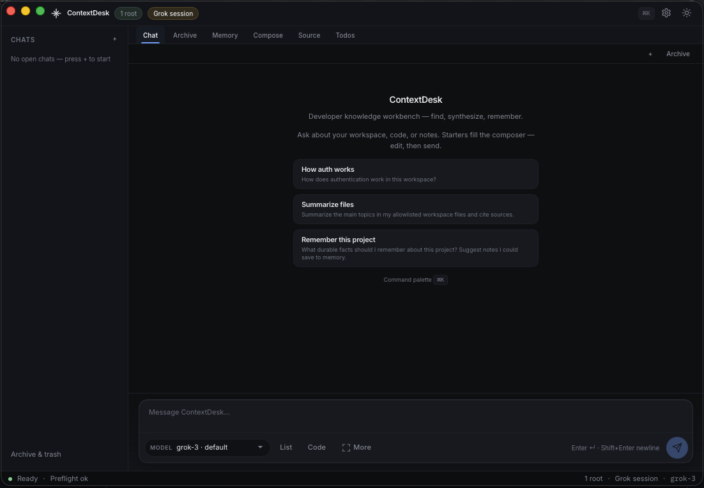

# ContextDesk

[](https://github.com/chriscase/ContextDesk/actions/workflows/ci.yml?query=branch%3Amain)

**ContextDesk is a local-first knowledge workbench that answers questions about your own files, memory, and connected sources — with citations — and confirms every write before it happens.**

Point it at folders you allowlist and at markdown project memory, ask how a subsystem works, and get streaming answers with file citations and a visible search trail. Run it **fully local** with [Ollama](https://ollama.com) (no product account, no API key), **or** connect an optional **Grok Build** session you already use on this machine (Settings → AI, explicit opt-in — credentials stay in the OS host, never the webview). It is a *research & synthesis* tool, not a code-editing agent — pair it with your coding agent when you need edits. The name is a working title; the whole product is rename-friendly via [`branding.toml`](branding.toml).

| | |
|--|--|
| **Stack** | Rust core (`cd-core`) · Tauri 2 + React desktop · optional headless server (`cd-server`) |
| **License** | [Apache-2.0](LICENSE) |
| **Status** | Early development — desktop works today; team server is partial. See [Issues](https://github.com/chriscase/ContextDesk/issues) and the live CI badge above. |
| **Identity** | Rename via [`branding.toml`](branding.toml) (full runtime slug paths tracked in [#179](https://github.com/chriscase/ContextDesk/issues/179)) |
| **Phase 1 DoD** | [Issue #65](https://github.com/chriscase/ContextDesk/issues/65) · [Roadmap](docs/ROADMAP.md) · [Backlog audit](docs/BACKLOG_AUDIT.md) |



<p align="center"><sub>Desktop host (macOS): allowlisted workspace chip, local/remote egress chip, pane tabs, empty-chat starters that fill the composer, model picker. Capture notes in <a href="docs/media/README.md"><code>docs/media/README.md</code></a>.</sub></p>

---

## How it's different

Open WebUI, LibreChat, AnythingLLM, and Jan are all capable general chat UIs. ContextDesk optimizes for a narrower thing: **local-first research over sources you control, with an explicit write gate on every action** — not multiplayer chat or an open plugin marketplace. Each row below maps to a real mechanism in this repository; planned work is called out separately.

| Edge | ContextDesk | Open WebUI | LibreChat | AnythingLLM | Jan |
|------|-------------|-----------|-----------|-------------|-----|
| **Per-tool write gate** — reads run free; every write is classified `read` / `soft-write` / `hard-write` and a hard-write blocks on a UI-originated confirm | Yes — `crates/cd-core/src/permissions.rs` (`PermissionDecision`, `ToolSideEffect`) | — | — | — | — |
| **SSRF-hardened outbound + FS allowlist** — DNS resolve-and-pin, block private / link-local / CGNAT / cloud-metadata IPs, redirects off; tool file access limited to allowlisted roots | Yes — `crates/cd-core/src/ssrf.rs` (`resolve_and_validate`, `build_pinned_client`) + `crates/cd-core/src/paths.rs` | — | — | — | — |
| **Secret storage** — API keys live in the OS keychain and never cross IPC to the webview (commands return bools/refs only) | OS keychain; never sent to UI — `crates/cd-core/src/keychain_store.rs`, [AGENTS.md](AGENTS.md) #4 | Server env / DB | Server env / DB | Local app storage | Local app data |
| **Embeddable core** — the logic is a reusable Rust library other hosts can build on; the desktop and server are thin | Yes — `cd-core` crate | App | App | App (+ chat-embed widget) | App |
| **Local-first, no account** — default path is a local model on loopback with no product login | Yes — Ollama on `127.0.0.1:11434`, single-user desktop | Self-hosted; user accounts | Self-hosted; user accounts | Yes — local option | Yes — local-first |

<sub>Comparison reflects each project's default/primary design as of mid-2026; all four alternatives are actively developed and cover broader chat/RAG use cases. `—` means "not a first-class feature of that tool," not "impossible." Corrections welcome via an [issue](https://github.com/chriscase/ContextDesk/issues).</sub>

**External tools use MCP, under the same gate.** Third-party tools run as governed **MCP stdio subprocesses** (`crates/cd-core/src/module_registry.rs`, `modules.rs`; substrate spec in [ADR 0001](docs/adr/0001-external-module-substrate.md)). MCP tool calls are subject to the same read/soft/hard-write permission tiers, the registry is **browse-only** (metadata discovery — no marketplace auto-install, per [NON_GOALS.md](docs/NON_GOALS.md) #7), and subprocesses are capped and allowlisted.

---

## What it does (honest)

Status mirrors [`docs/CLAIMS.md`](docs/CLAIMS.md), which is machine-checked so shipped rows name a real symbol on `main`. Nothing below is described as done unless it is.

**Shipped on `main` (desktop-focused):**

- Allowlisted workspace files + markdown memory search, with **citations** and a **search trail** (`index.rs:KeywordIndex`, incremental SQLite)
- Streaming agent turns with cancel and live event sink (`agent.rs:run_agent_turn_with_sink`)
- Permission-gated soft/hard writes to memory and skills (`tool_host.rs:ToolHost`)
- Providers: **Ollama** (local), **Grok Build session** (opt-in reuse of `~/.grok/auth.json`), OpenAI-compatible, Anthropic Messages; multi-model selection in the composer
- **Durable typed memory** with **hybrid semantic recall** (embed-on-write, cosine-on-read, ambient injection) — `memory/sqlite_store.rs`, `memory/recall.rs`, #346
- **Log analysis** (post-mortem): point the **Logs** pane or `ingest_logs` at a dump → Drain templates → **DuckDB** event store → clusters / timeline / hybrid search → **why** tools (`correlate_logs`, `anomalies_logs`, `trace_logs`) — `log_analysis/*`, #358–#363
- Opt-in web research (`web_search` / `web_fetch`) behind SSRF gates
- Read-only connectors: SQLite, Postgres, Confluence, X search
- MCP stdio tools and HTTP/OpenAPI presets wired as agent tools (`tool_host.rs:attach_mcp_connector`, `http_preset.rs`)
- Durable chat sessions + keyword archive search; hybrid embed scoring available as a core/opt-in retrieval path (`index.rs:search_hybrid`, #119)
- Optional headless server: incremental **SSE research endpoint** on `main` (`crates/cd-server/src/main.rs:research_sse`)
- Opt-in signed desktop updater (config + Settings UI)

**Roadmap / partial (do not treat as done):**

- Headless **team** server: workspaces, roles, shared memory (#167) — server binary + SSE exist; roles/sharing are not built
- Stable third-party **embed / host-adapter protocol** (#94) — `cd-core` is embeddable today, but the public adapter contract is early (see [`docs/examples/host-adapter.md`](docs/examples/host-adapter.md))
- **External module sandbox** hardening (#94)
- **Semantic** chat-archive search (#79) — archive search today is keyword-based
- Log **live streaming** / multi-source connectors (Phase 3–4; tracker #363) — batch post-mortem is shipped
- Proven multi-OS release installers (#172)
- Optional **fastembed** ONNX binary (`--features log-fastembed`) for bulk local log embedding without Ollama — default tests use a hermetic deterministic embedder

---

## Quickstart

Prerequisites: **Rust (stable)**, **Node 20+**, and [Tauri 2 platform deps](https://v2.tauri.app/start/prerequisites/).

### Option A — Ollama only (no account, no API key)

1. **Install [Ollama](https://ollama.com), then pull a small chat model** and health-check the local daemon:
   ```sh
   ollama pull mistral
   curl -s http://127.0.0.1:11434/api/tags | head   # should list your models
   ```
2. **Clone and launch the desktop host:**
   ```sh
   git clone https://github.com/chriscase/ContextDesk.git
   cd ContextDesk
   cargo test -p cd-core          # offline library gate — no network, no keys
   cd desktop && npm install && npm run tauri:dev   # free-port aware launcher
   ```
3. **Configure in the app (Settings-first, no config files):**
   - Preflight / Settings → pick a **workspace folder** to allowlist. Try the bundled [`fixtures/kb/`](fixtures/kb) folder (`auth.md`, `billing.md`, `deploy_runbook.md`, …).
   - Provider **Ollama (local)**, base `http://127.0.0.1:11434`, model `mistral` → Save.
4. **Ask a question** grounded in that folder, e.g. *"How does authentication work in this codebase?"* Expect streaming markdown, a **search trail** showing where it looked, and **citations** back to `fixtures/kb/auth.md` / `auth_gateway.md` when retrieval hits.

### Option B — Grok Build session (opt-in)

If you already use **Grok Build** / the Grok CLI on this machine, ContextDesk can talk to xAI models using that session — **without pasting an API key into the UI**.

1. Sign in on the machine: run `grok login` (or use Grok Build) so `~/.grok/auth.json` exists.
2. Launch ContextDesk (`cd desktop && npm run tauri:dev` as above).
3. **Settings → AI** → provider **Grok Build session** → confirm the opt-in dialog → pick a chat model (e.g. `grok-3`) → **Save**.
4. Allowlist a workspace folder and ask a grounded question the same way as Option A.

**How it stays safe:** the host loads `~/.grok/auth.json` **in Rust only** after explicit opt-in; the webview never sees tokens; outbound chat is pinned to `api.x.ai`. Details and ToS note: [`docs/DEV.md`](docs/DEV.md#grok-build-session-opt-in).

You can also add **OpenAI-compatible** or **Anthropic** providers in Settings → AI. API keys go to the OS keychain — never into the repo or the webview.

---

## Repository layout

```text
branding.toml          # display name, slug, default theme (rename here)
crates/
  cd-core/             # library: providers, tools, workspace, agent loop, permissions, ssrf, keychain
  cd-server/           # optional headless server (early; SSE research shipped)
desktop/               # Tauri 2 + React host (thin)
docs/                  # product, architecture, claims, ADRs (agent-friendly)
fixtures/              # offline sample knowledge base for demos/tests
```

Core logic lives in **`cd-core`** so the desktop app, server, and future host adapters stay thin.

---

## Development

Prerequisites: Rust (stable), Node 20+, platform deps for Tauri 2.

```sh
# Full offline gate (matches CI intent)
cargo fmt --all -- --check
cargo clippy --workspace --all-targets -- -D warnings
cargo test --workspace
( cd desktop && npm install && npm run build )

# Doc honesty gate (claim ↔ code)
sh scripts/check_claims.sh

# Desktop interactive (free-port aware)
cd desktop && npm install && npm run tauri:dev
```

See [`docs/DEV.md`](docs/DEV.md) (including **Dev ports**), [`docs/ARCHITECTURE.md`](docs/ARCHITECTURE.md), and [`AGENTS.md`](AGENTS.md).

---

## Configuration & secrets

- Use [`.env.example`](.env.example) as a template; real `.env` files are gitignored.
- API keys belong in the OS keychain (or environment variables) — not in the repo, and never passed to the webview.
- Do not commit `~/.grok/auth.json`, employer configs, or private documentation dumps.

---

## Security

See [`SECURITY.md`](SECURITY.md) for private vulnerability reporting. The design deliberately keeps secrets out of the webview, pins outbound DNS against SSRF, and gates every write behind a UI confirmation — details in [`docs/ARCHITECTURE.md`](docs/ARCHITECTURE.md) (Security boundaries).

---

## Community & contributing

Issues and PRs are welcome. Please read:

- [`CODE_OF_CONDUCT.md`](CODE_OF_CONDUCT.md) — how we work together
- [`AGENTS.md`](AGENTS.md) — conventions for humans and agents (non-negotiables live here)
- [`docs/ISSUE_HONESTY.md`](docs/ISSUE_HONESTY.md) — no false "shipped" closes
- Templates: [bug report](.github/ISSUE_TEMPLATE/bug_report.yml) · [feature request](.github/ISSUE_TEMPLATE/feature_request.yml) · [pull request](.github/PULL_REQUEST_TEMPLATE.md)

## License

Apache License 2.0 — see [LICENSE](LICENSE).
