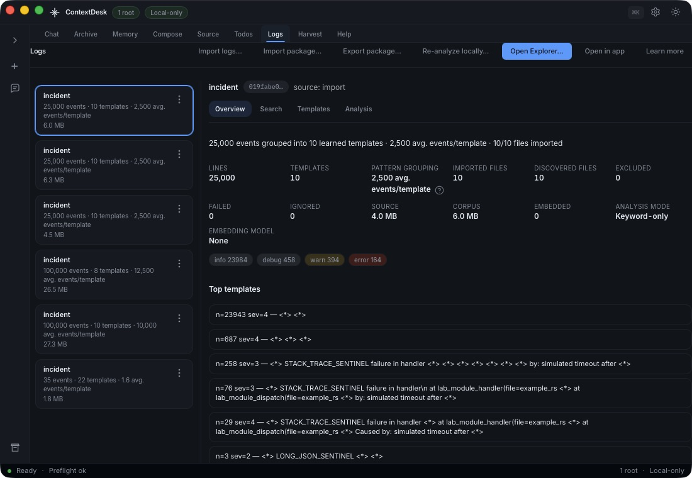
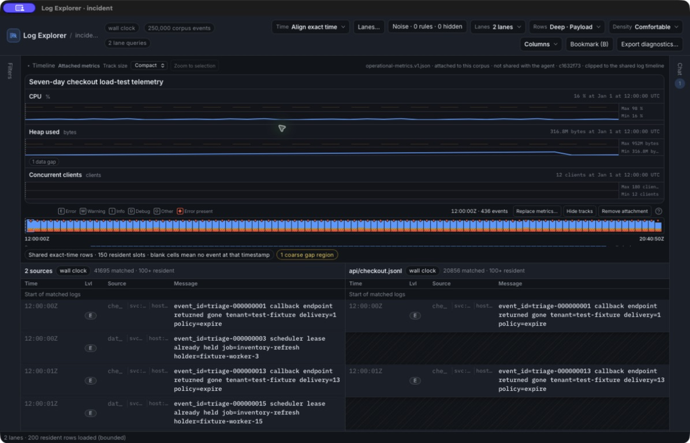
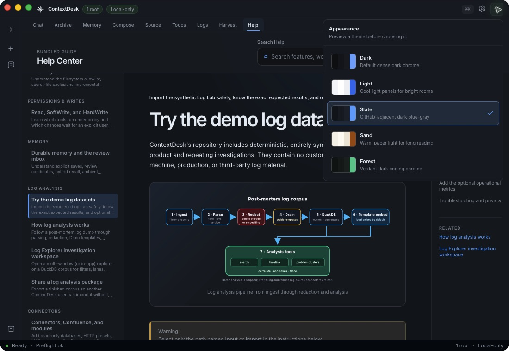

# ContextDesk

[](https://github.com/chriscase/ContextDesk/actions/workflows/ci.yml?query=branch%3Amain)

**ContextDesk is a local-first evidence workbench for understanding files,
memory, databases, connected sources, and incident logs. It assembles concise
context deterministically, lets an AI connect the evidence, and keeps the
sources and investigation trail visible.**

Allowlist a workspace, import a post-mortem log corpus, or connect a governed
read source. ContextDesk searches, filters, ranks, and caps that material on
the host before a model sees it. The model synthesizes bounded evidence rather
than receiving an indiscriminate corpus dump. Ordinary chats stay separate
from log investigations; broad corpus-linked questions begin with a
deterministic host-built triage brief, while focused questions use governed
bounded tools. Both paths require trusted event identities before an answer is
presented as log-grounded. If the selected profile cannot use tools, the
application says so instead of treating model prose as retrieved evidence.
Every write still requires the appropriate confirmation.

Run it **fully local** with [Ollama](https://ollama.com), connect a
self-hosted/company or hosted **OpenAI-compatible gateway**, use the
**Anthropic Messages API**, or explicitly opt in to reuse a **Grok Build**
session already authorized on the machine. Remote credentials remain in the
trusted OS host and keychain, never the webview. ContextDesk is a research,
synthesis, and investigation tool—not a code-editing agent—so pair it with
your coding agent when you need source changes. The name is a working title;
the product remains rename-friendly through [`branding.toml`](branding.toml).

|                 |                                                                                                                                                             |
| --------------- | ----------------------------------------------------------------------------------------------------------------------------------------------------------- |
| **Stack**       | Rust core (`cd-core`) · Tauri 2 + React desktop · optional headless server (`cd-server`)                                                                    |
| **License**     | [Apache-2.0](LICENSE)                                                                                                                                       |
| **Status**      | Early development — desktop works today; team server is partial. See [Issues](https://github.com/chriscase/ContextDesk/issues) and the live CI badge above. |
| **Identity**    | Rename via [`branding.toml`](branding.toml) (full runtime slug paths tracked in [#179](https://github.com/chriscase/ContextDesk/issues/179))                |
| **Phase 1 DoD** | [Issue #65](https://github.com/chriscase/ContextDesk/issues/65) · [Roadmap](docs/ROADMAP.md) · [Backlog audit](docs/BACKLOG_AUDIT.md)                       |

## Documentation map

| Need | Start here |
| ---- | ---------- |
| **Install / build** | [Install](#install) · [Development](#development) · [DEV.md](docs/DEV.md) · [Packaging](docs/PACKAGING.md) |
| **GUI use** | [Configure a provider](#configure-a-provider) · Help [first run](docs/help/getting-started/first-run.md) · [Log Explorer](docs/help/log-analysis/log-explorer.md) · [demo datasets](docs/help/log-analysis/demo-datasets.md) |
| **CLI** | [CLI and log normalization](#cli-and-log-normalization) · [CLI guide](docs/CLI.md) |
| **Normalization** | [NORMALIZATION.md](docs/NORMALIZATION.md) · [spec](docs/specs/NORMALIZED_LOG_EVENTS_V1.md) |
| **Logging quality assessment (LQA)** | **Not on `main` yet** — residual until merge; see [Demo runbook §4](docs/DEMO_RUNBOOK.md#4-residual-logging-quality-assessment-not-on-this-tip) |
| **Architecture** | [ARCHITECTURE.md](docs/ARCHITECTURE.md) · [PRODUCT.md](docs/PRODUCT.md) · [AGENTS.md](AGENTS.md) |
| **Repeatable demo (GUI + CLI)** | **[Demo runbook](docs/DEMO_RUNBOOK.md)** · [Demo acceptance](docs/DEMO_ACCEPTANCE.md) |

## CLI and log normalization

**One-click path to normalize:** [Normalization guide](docs/NORMALIZATION.md) ·
normative contract: [`docs/specs/NORMALIZED_LOG_EVENTS_V1.md`](docs/specs/NORMALIZED_LOG_EVENTS_V1.md)

The **ContextDesk CLI** (`contextdesk`) is the headless adapter over the same
production engine the desktop uses: import logs, explore a corpus, assemble
context, chat with grounding, and **normalize**
raw files/folders/ZIPs into portable `contextdesk.normalized_log_events.v1`
JSONL — offline, with no provider or keychain reads.

| Guide | What it covers |
| ----- | -------------- |
| **[Demo runbook](docs/DEMO_RUNBOOK.md)** | 10–15 min GUI (manual) + CLI (copy/paste) paths; public fixtures; troubleshooting |
| **[CLI guide](docs/CLI.md)** | Grammar (verified against `--help`), config, `--data-dir`, JSON/JSONL envelopes, exit codes, examples |
| **[Normalization guide](docs/NORMALIZATION.md)** | Raw → normalized walkthrough, time resolutions, output layout, privacy, demos |
| **[Normalized events specification](docs/specs/NORMALIZED_LOG_EVENTS_V1.md)** | Normative contract (not the human guide) |
| **[JSON Schema](docs/specs/normalized-log-events/schemas/normalized-log-events.v1.json)** | Machine schema for the JSONL events |
| **[Language integration](docs/LANGUAGE_INTEGRATION.md)** | Subprocess protocol; thin clients for Python, Node, Java, C#, Go, C, C++, Rust |
| **[CLI packaging / releases](docs/CLI_PACKAGING.md)** | Multi-platform archives, draft GitHub Releases, unsigned RC notes |
| **[CLI client protocol](docs/CLI_CLIENT_PROTOCOL.md)** | Compact protocol reference (same contracts as language integration) |

### Status labels (honest)

| Capability | Status on this product line |
| ---------- | --------------------------- |
| Two-command happy path: `import` → `chat` | **Shipped** |
| `corpus`, `timezone`, `explore`, `context`, `session`, `config`, `capabilities`, `doctor` | **Shipped** |
| `contextdesk.normalized_log_events.v1` contract + JSON Schema + producer examples | **Shipped** (portable handoff; ordinary raw import still applies) |
| Offline `contextdesk normalize` (raw file/folder/ZIP → JSONL + manifest + report) | **Shipped** — grammar and output layout documented in [NORMALIZATION.md](docs/NORMALIZATION.md) |
| Multi-platform CLI release workflow (draft archives) | **Shipped in repo** (`.github/workflows/cli-release.yml`); published signed downloads are **not** claimed until a real draft/publish run exists |
| Language SDKs that re-parse logs / Parquet export | **Not shipped** — adapters spawn the binary only; Parquet is not claimed |
| macOS notarization / Windows Authenticode for CLI | **Not shipped** (unsigned RC only — see [CLI_PACKAGING.md](docs/CLI_PACKAGING.md)) |

### Two-command happy path (executable)

```bash
# Build once (from a checkout):
cargo build -p cd-cli --release
export PATH="$(pwd)/target/release:$PATH"   # or use target/release/contextdesk

# Isolated profile — never touches ~/.contextdesk
contextdesk --data-dir ./cd-demo-data import ./fixtures/cli-release-demo
contextdesk --data-dir ./cd-demo-data chat "what timed out?"
```

Requires a configured provider for `chat` (see `contextdesk config init` or
`contextdesk doctor`). For a **network-free** five-minute path, use import →
explore instead (below).

### Five-minute offline demo (no provider)

```bash
cargo build -p cd-cli --release
BIN=./target/release/contextdesk
DATA=$(mktemp -d)
$BIN --data-dir "$DATA" --json import ./fixtures/cli-release-demo
$BIN --data-dir "$DATA" --json corpus list
$BIN --data-dir "$DATA" --json explore "timeout"
```

### Raw-log normalization example

```bash
contextdesk normalize ./fixtures/cli-release-demo --output ./out-normalize --json
# Writes exactly:
#   out-normalize/manifest.json
#   out-normalize/normalization-report.json
#   out-normalize/sources/<source-id>.jsonl
```

Applications that already understand their logs can instead use the **producer
contract** path and emit conforming JSONL themselves. See the
[SDK guide](docs/specs/normalized-log-events/SDK.md) and the representative
valid samples under
[`fixtures/cli-docs/normalize-examples/`](fixtures/cli-docs/normalize-examples/).

### Install summary (macOS / Linux / Windows)

| Platform | How to get `contextdesk` today |
| -------- | ------------------------------ |
| **macOS / Linux** | Run `./scripts/cli-release/build_cli_release.sh` for a tested binary and local archive. See [CLI_PACKAGING.md](docs/CLI_PACKAGING.md). |
| **Windows** | Run `.\scripts\cli-release\build_cli_release.ps1` for a tested `contextdesk.exe` and ZIP. Draft GitHub ZIPs are also produced by CI. |
| **All** | Prefer absolute path or `CONTEXTDESK_BIN`; isolate automation with `--data-dir`. |

Release downloads: draft GitHub Releases from workflow **`cli-release`** (never
auto-published). Do not assume notarized or Authenticode-signed CLI builds.

### Automation / CI path

```bash
export CONTEXTDESK_BIN=./target/release/contextdesk
export CONTEXTDESK_DATA_DIR="$RUNNER_TEMP/cd-ci"
"$CONTEXTDESK_BIN" --json capabilities
"$CONTEXTDESK_BIN" --json import ./fixtures/cli-release-demo
# Language clients: packages/cli-clients/ — argv only, never shell strings.
# Protocol: docs/LANGUAGE_INTEGRATION.md
```

### Product gallery (packaged app)



## Integrate your application data

**Hand off incident evidence with a versioned contract.** Producers can build an
**Incident Evidence Bundle** (`contextdesk.incident_evidence.v1`) as a directory
or deterministic ZIP with hashed logs, optional operational-metrics v1
documents, and privacy declarations. Validate offline before transfer:

```bash
cargo run -p cd-core --bin cd-validate-incident-evidence -- validate ./my-bundle
cargo run -p cd-core --bin cd-validate-incident-evidence -- pack ./my-bundle --output ./my-bundle.zip
cargo run -p cd-core --bin cd-validate-incident-evidence -- validate ./my-bundle.zip
```

**Start here:** [Incident Evidence Bundle integration guide](docs/help/log-analysis/incident-evidence-bundle.md) ·
normative spec: [`docs/specs/INCIDENT_EVIDENCE_BUNDLE_V1.md`](docs/specs/INCIDENT_EVIDENCE_BUNDLE_V1.md) ·
JSON Schemas: [`docs/specs/incident-evidence/schemas/`](docs/specs/incident-evidence/schemas/) ·
templates: [`examples/incident-evidence-producers/`](examples/incident-evidence-producers/) ·
fixtures: [`fixtures/incident-evidence/`](fixtures/incident-evidence/) ·
[Engineering Handbook method](docs/design/proven-methods/INCIDENT_EVIDENCE_BUNDLE.md).
Directory
conformance is [#764](https://github.com/chriscase/ContextDesk/issues/764);
deterministic ZIP pack/validate is [#765](https://github.com/chriscase/ContextDesk/issues/765).
Product import/attachment UX remains residual on
[#763](https://github.com/chriscase/ContextDesk/issues/763).

To delegate an exporter to a coding agent, give it this repository and prompt:

> Implement a ContextDesk Incident Evidence Bundle v1 exporter for this
> application using the normative specification and JSON Schemas linked above.
> Emit authorized logs under stable relative paths and, when available,
> operational-metrics v1 documents with source provenance. Compute exact byte
> counts and lowercase SHA-256 hashes, declare time and privacy honestly, then
> run the documented directory validation, deterministic ZIP packing, and ZIP
> validation commands. Do not inspect ContextDesk implementation code or invent
> fields outside the published contract.

### Normalize producer logs without guessing

Applications that already understand their own log structure can optionally
emit the versioned `contextdesk.normalized_log_events.v1` JSONL contract. It
preserves source ordering, timestamp provenance, raw and canonical severity,
typed correlation identifiers, bounded attributes, and the original logical
record while making guessed instants unrepresentable. Rust, Node, and Python
producer examples share one conformance fixture corpus.

Start with the [normalized-log producer SDK guide](docs/specs/normalized-log-events/SDK.md),
then use the [normative specification](docs/specs/NORMALIZED_LOG_EVENTS_V1.md),
[JSON Schema](docs/specs/normalized-log-events/schemas/normalized-log-events.v1.json),
and [reference producers](examples/normalized-log-producers/).

This contract is optional and raw logs remain first-class. ContextDesk does
not yet have a normalized-log fast import path; conforming files currently use
the ordinary raw JSON-lines path. The SDK is useful today for portable,
deterministically validated handoff—not as a performance claim.

**Start with repeatable evidence.** Install the bundled synthetic corpus during
first-run setup, inspect its import summary, and open it directly in Log
Explorer.



**Investigate without losing provenance.** Navigate time, compose source lanes,
inspect payloads, filter events, and retain evidence. When a compatible
operational-metrics bundle is supplied, optional CPU, heap, client, or other
time-series tracks share the same UTC cursor; the linked-chat area remains
optional.



**Guidance is built in.** Search the offline Help Center for workflows, demo
datasets, context boundaries, and trust behavior, with accessible appearance
choices.

### From raw logs to a durable investigation

1. **Bring authorized evidence.** Import a deterministic post-mortem corpus or
   connect an allowlisted read source. ContextDesk preserves provenance,
   redacts secrets, and labels time quality rather than inventing certainty for
   malformed, local-only, or order-only timestamps.
2. **Explore at human scale.** Log Explorer keeps the event table primary while
   a bounded severity timeline, one to four source-composed lanes, Find,
   Filter, bookmarks, and exact-time alignment help an engineer move between
   overview and source records. Gaps remain gaps. A separately stored
   **Original (redacted)** record is available on explicit request when
   formatting would otherwise hide useful structure.
3. **Ask with governed context.** A linked chat receives a small viewport
   snapshot and uses bounded evidence tools against the linked corpus. It may
   also consult already-authorized workspace, memory, Help, or connector
   sources when the question calls for them. Results retain evidence identities
   and disclose caps, failures, and unavailable tool capability.
4. **Keep what matters.** Stable bookmarks make events easy to revisit. Durable
   investigations organize exact evidence, human-authored findings and notes,
   and reversible saved views without silently changing the active log view.

The bundled **Help Center** explains product workflows, context boundaries, and
result limits with accessible diagrams. A separate **Engineering handbook**
window renders the bundled, read-only design and proven-methods documentation
for teams that want to understand or adapt the architecture; it does not widen
Help retrieval or chat context. For a cautious first trial on organizational
data, follow the
[company log-data trial runbook](docs/COMPANY_LOG_DATA_TRIAL.md) and keep
evaluation truth outside the imported directory.

---

## How it's different

Open WebUI, LibreChat, AnythingLLM, and Jan are all capable general chat UIs. ContextDesk optimizes for a narrower thing: **local-first research over sources you control, with an explicit write gate on every action** — not multiplayer chat or an open plugin marketplace. Each row below maps to a real mechanism in this repository; planned work is called out separately.

| Edge                                                                                                                                                                                   | ContextDesk                                                                                                        | Open WebUI                 | LibreChat                  | AnythingLLM               | Jan               |
| -------------------------------------------------------------------------------------------------------------------------------------------------------------------------------------- | ------------------------------------------------------------------------------------------------------------------ | -------------------------- | -------------------------- | ------------------------- | ----------------- |
| **Per-tool write gate** — reads run free; every write is classified `read` / `soft-write` / `hard-write` and a hard-write blocks on a UI-originated confirm                            | Yes — `crates/cd-core/src/permissions.rs` (`PermissionDecision`, `ToolSideEffect`)                                 | —                          | —                          | —                         | —                 |
| **SSRF-hardened outbound + FS allowlist** — DNS resolve-and-pin, block private / link-local / CGNAT / cloud-metadata IPs, redirects off; tool file access limited to allowlisted roots | Yes — `crates/cd-core/src/ssrf.rs` (`resolve_and_validate`, `build_pinned_client`) + `crates/cd-core/src/paths.rs` | —                          | —                          | —                         | —                 |
| **Secret storage** — API keys live in the OS keychain and never cross IPC to the webview (commands return bools/refs only)                                                             | OS keychain; never sent to UI — `crates/cd-core/src/keychain_store.rs`, [AGENTS.md](AGENTS.md) #4                  | Server env / DB            | Server env / DB            | Local app storage         | Local app data    |
| **Embeddable core** — the logic is a reusable Rust library other hosts can build on; the desktop and server are thin                                                                   | Yes — `cd-core` crate                                                                                              | App                        | App                        | App (+ chat-embed widget) | App               |
| **Local-first, no account** — default path is a local model on loopback with no product login                                                                                          | Yes — Ollama on `127.0.0.1:11434`, single-user desktop                                                             | Self-hosted; user accounts | Self-hosted; user accounts | Yes — local option        | Yes — local-first |

<sub>Comparison reflects each project's default/primary design as of mid-2026; all four alternatives are actively developed and cover broader chat/RAG use cases. `—` means "not a first-class feature of that tool," not "impossible." Corrections welcome via an [issue](https://github.com/chriscase/ContextDesk/issues).</sub>

**External tools use MCP, under the same gate.** Third-party tools run as governed **MCP stdio subprocesses** (`crates/cd-core/src/module_registry.rs`, `modules.rs`; substrate spec in [ADR 0001](docs/adr/0001-external-module-substrate.md)). MCP tool calls are subject to the same read/soft/hard-write permission tiers, the registry is **browse-only** (metadata discovery — no marketplace auto-install, per [NON_GOALS.md](docs/NON_GOALS.md) #7), and subprocesses are capped and allowlisted.

---

## What it does (honest)

Status mirrors [`docs/CLAIMS.md`](docs/CLAIMS.md), whose shipped rows are
machine-checked against production symbols. Partial work is listed separately.

**Desktop capabilities represented by this release:**

- **Launch surface:** animated ContextDesk splash → local identity stub → **pre-launch** (workspace → AI wizard → Ready with **work-context** health pills for files/memory/DBs/Confluence/MCP — not news/X) before main chrome; Settings demoted from first-run onboarding (`docs/design/LAUNCH.md`, #391–#397)
- Allowlisted workspace files + markdown memory search, with **citations** and a **search trail** (`index.rs:KeywordIndex`, incremental SQLite)
- Streaming agent turns with cancel and live event sink (`agent.rs:run_agent_turn_with_sink`)
- Permission-gated soft/hard writes to memory and skills (`tool_host.rs:ToolHost`)
- Providers: **Ollama** (local), **Grok Build session** (opt-in reuse of `~/.grok/auth.json`), OpenAI-compatible, Anthropic Messages; multi-model selection in the composer
- **Durable typed memory** with **hybrid semantic recall** (embed-on-write, cosine-on-read, ambient injection) — `memory/sqlite_store.rs`, `memory/recall.rs`, #346
- **Effortless capture (honest):** after a chat turn, rule-based **CueExtractor** proposes facts/decisions/preferences into a **Review inbox** — never silent durable writes. You **Approve** (SoftWrite → store.put with redaction + embed) or **Discard**; batch approve above confidence needs type-to-confirm `APPROVE`. Salience vs confidence scores gate spam; near-dupes propose supersede (commit only on approve). **Edges** (`link_memories`) expand recall one hop; per-kind half-lives tune recency (tasks age faster than facts). **Bulk markdown import** is idempotent (`import_fp`); **GDPR purge** is type-to-confirm `PURGE` (content gone, tombstone kept — not retract). Memory pane → Store | Review inbox — `memory/cue.rs`, `candidates.rs`, `edges.rs`, #381–#385
- **Log analysis** (post-mortem): point the **Logs** pane or `ingest_logs` at a dump → Drain templates → **DuckDB** event store → clusters / timeline / hybrid search → **why** tools (`correlate_logs`, `anomalies_logs`, `trace_logs`) — `log_analysis/*`, #358–#363
- **Log Explorer investigation workspace:** keyset-paged and virtualized rows;
  useful UTC timestamps; compact or full metadata; Find and Filter; resizable
  columns; a bounded severity timeline; 1–4 source-composed lanes; explicit
  Independent, Follow, and exact-time Align modes; honest blank gaps; stable
  bookmarks; and redacted original-record inspection —
  `desktop/src/components/logExplorer/LogExplorer.tsx`
- **Durable log investigations:** selected rows become exact evidence;
  human-authored findings and notes cite that evidence; saved view recipes can
  be previewed, explicitly applied, and restored without hidden mutations —
  `desktop/src/components/logExplorer/EvidencePanel.tsx`
- **Governed linked chat:** a corpus link persists with the chat, each turn gets
  a bounded privacy-safe view snapshot, and broad triage starts from a
  deterministic 32 KiB host brief with separately trusted identities rather
  than raw corpus rows. A tools-capable model may answer directly or deepen one
  candidate with one bounded read-only search before tool-closed synthesis.
  Focused follow-ups use bounded read-only log tools.
  Tools-disabled profiles and provider failures remain visible; ordinary chats
  do not inherit a log corpus —
  `crates/cd-core/src/agent.rs:run_agent_turn_with_sink`
- **Log template embedding default (product):** local in-process ONNX via **fastembed** on the desktop host (`log-fastembed` feature on; `embed.rs:default_log_embed_backend`); cloud embed is per-corpus opt-in with a “log content leaves this machine” confirm. Offline `cargo test` stays hermetic (deterministic `ConceptEmbedBackend`, no model download)
- Opt-in web research (`web_search` / `web_fetch`) behind SSRF gates
- Read-only connectors: SQLite, Postgres, Confluence, X search
- **Confluence harvest & re-sync:** SoftWrite `harvest_from_source` (memory or workspace file) with provenance; `check_source_sync` / `apply_source_sync`; Harvest pane with **Publish** (HardWrite, type `WRITE`, `raw_storage` preferred / K16 paste otherwise) when `write_enabled` — `docs/design/CONFLUENCE_GAP.md`, #326
- MCP stdio tools and HTTP/OpenAPI presets wired as agent tools (`tool_host.rs:attach_mcp_connector`, `http_preset.rs`)
- Durable chat sessions + keyword archive search; hybrid embed scoring available as a core/opt-in retrieval path (`index.rs:search_hybrid`, #119)
- Optional headless server: incremental **SSE research endpoint** on `main` (`crates/cd-server/src/main.rs:research_sse`)
- Opt-in signed desktop updater (config + Settings UI); **source-run git fetch/status** guide in Settings (never hard-reset) — #340
- **Optional S3-compatible backup/export:** Settings → Backup performs a dry run
  or an explicitly confirmed upload from allowlisted workspace roots. The Rust
  host owns traversal, endpoint policy, keychain credential retrieval,
  cancellation, and audit; secret/internal/build files are excluded and
  reported. Content-addressed objects plus a completed-manifest pointer make
  unchanged retries idempotent. Local roots remain authoritative (#292 Phase A).
- **Skills:** pin a playbook on a chat (`examples/skills/log-triage`) or `/skill id` — never elevates SoftWrite/HardWrite — `docs/SKILLS.md`, #343
- Chat UI **folds older turns** (full history retained); agent uses recompacted context (#33)
- **In-app guidance:** the searchable offline Help Center documents product
  workflows and trust boundaries. Its Engineering handbook action opens a
  separately bundled, read-only technical reader; those design documents are
  not added to user Help search or model context —
  `desktop/src/components/panes/HelpPane.tsx`

### Log Explorer at scale

Deterministic Log Lab corpora exercise 100,000-event multi-lane investigation
and a separate 25,000-event seven-day time span. A generated 250,000-event
triage-stress corpus exercises progressive Logs-library selection and bounded
Explorer startup without checking a quarter-million source lines into Git.
These fixture counts support repeatable acceptance checks; they are not
production ceilings or universal performance claims. Public screenshots are
governed by the exact-build publication gate tracked by
[#653](https://github.com/chriscase/ContextDesk/issues/653).

**Roadmap / partial (do not treat as done):**

- Headless **team** server: workspaces, roles, shared memory (#167) — server binary + SSE exist; roles/sharing are not built
- Stable third-party **embed / host-adapter protocol** (#94) — `cd-core` is embeddable today, but the public adapter contract is early (see [`docs/examples/host-adapter.md`](docs/examples/host-adapter.md))
- **External module sandbox** hardening (#94)
- **Semantic** chat-archive search (#79) — archive search today is keyword-based
- Log **live streaming** / multi-source connectors (Phase 3–4; tracker #363) — batch post-mortem is shipped
- Proven multi-OS release installers (#172)
- S3 restore, remote deletion, bidirectional sync, lifecycle management, and
  the Phase B S3 index source (#420)

---

## Install

ContextDesk is early software. The repository currently has **no published
general-availability installer assets**, so the dependable installation path
today is a source checkout. The
[GitHub Releases page](https://github.com/chriscase/ContextDesk/releases) is
the authority for future reviewed binary releases; an empty page means there
is no binary release to install yet.

### Run from source

1. Install **Rust (stable)**, **Node 20+**, Git, and the
   [Tauri 2 platform prerequisites](https://v2.tauri.app/start/prerequisites/)
   for your operating system.
2. Clone, install the locked frontend dependencies, and launch the desktop
   application:

   ```sh
   git clone https://github.com/chriscase/ContextDesk.git
   cd ContextDesk
   cargo test -p cd-core
   cd desktop
   npm ci
   npm run tauri:dev
   ```

   The core test is offline and needs no provider credentials. `tauri:dev`
   starts a source-run development build and selects a free local frontend
   port.
3. Complete preflight in the application. You can install the entirely
   synthetic 25,000-event demo corpus there, then choose **Enter app · Open
   Logs** to verify Logs and Log Explorer without private data.

### Build a local packaged desktop app

From a clean checkout with the same prerequisites:

```sh
cd desktop
npm ci
npm run tauri:build
```

Platform bundles are written below
`desktop/src-tauri/target/release/bundle/` (`.app`/`.dmg` on macOS,
`.msi` or NSIS `.exe` on Windows, and `.AppImage`/`.deb` on Linux, depending
on the host). Updater artifacts require the project release-signing private
key. Without it, the command may report a signing-key error **after** a usable
unsigned local application or installer has already been written; inspect the
bundle directory before treating that local build as failed. Never create,
request, or commit a release key merely to run a local package.

See [Packaging & release](docs/PACKAGING.md) for exact bundle behavior,
operator-owned signing/notarization, and the draft release workflow.

### Install a published binary

When the [Releases page](https://github.com/chriscase/ContextDesk/releases)
contains a published release, use the asset for your operating system and
follow that release's notes. Draft releases and CI artifacts are not supported
end-user installers. Until reviewed assets are present, build from source
instead. ContextDesk never requires an application account; provider
credentials are configured after launch and stored by the trusted host in the
OS keychain.

---

## Configure a provider

ContextDesk supports local models, company/self-hosted or hosted gateways, and
direct provider APIs. Tool capability is detected per profile; a compatible
chat endpoint is not automatically assumed to support native tool calls.

### Option A — Ollama only (no account, no API key)

1. **Install [Ollama](https://ollama.com), then pull a small chat model** and health-check the local daemon:
   ```sh
   ollama pull mistral
   curl -s http://127.0.0.1:11434/api/tags | head   # should list your models
   ```
2. Launch ContextDesk using a source or published-binary path above.
3. **Configure in the app (Settings-first, no config files):**
   - Preflight / Settings → pick a **workspace folder** to allowlist. Try the bundled [`fixtures/kb/`](fixtures/kb) folder (`auth.md`, `billing.md`, `deploy_runbook.md`, …).
   - Provider **Ollama (local)**, base `http://127.0.0.1:11434`, model `mistral` → Save.
4. **Ask a question** grounded in that folder, e.g. _"How does authentication work in this codebase?"_ Expect streaming markdown, a **search trail** showing where it looked, and **citations** back to `fixtures/kb/auth.md` / `auth_gateway.md` when retrieval hits.

### Option B — internal or hosted OpenAI-compatible gateway

Use this route for a company AI gateway, a self-hosted compatible server, or a
hosted provider that exposes OpenAI-compatible chat endpoints.

1. Launch ContextDesk using a source or published-binary path above.
2. **Settings → AI** → provider **OpenAI-compatible**.
3. Enter the gateway's HTTPS base URL, API key, and model id, then **Save**.
   The key is stored by the Rust host in the OS keychain and is never returned
   to the webview.
4. Use model discovery when the gateway supports it. If it does not expose a
   compatible model-list endpoint, use Advanced setup with a model id supplied
   by the gateway administrator.
5. Review preflight before sending organizational data. ContextDesk records
   detected tool capability; it does not assume that every compatible gateway
   or model supports native tool calls.

A loopback-only profile refuses remote bases. Remote endpoints remain subject
to ContextDesk's outbound URL and SSRF policy. Keychain storage protects the
credential, but prompts and bounded context sent to a remote endpoint still
leave the machine. See
[AI providers and model selection](docs/help/providers/provider-setup.md).

### Option C — Anthropic Messages API

Choose **Anthropic** in Settings → AI, use the default Anthropic API base (or
an approved compatible base), store the key when prompted, select a model, and
run preflight. This route uses Anthropic's message and tool-call shapes rather
than treating them as OpenAI-compatible responses.

### Option D — Grok Build session reuse (opt-in)

If you already use **Grok Build** / the Grok CLI on this machine, ContextDesk can talk to xAI models using that session — **without pasting an API key into the UI**.

1. Sign in on the machine: run `grok login` (or use Grok Build) so `~/.grok/auth.json` exists.
2. Launch ContextDesk using a source or published-binary path above.
3. **Settings → AI** → provider **Grok Build session** → confirm the opt-in dialog → pick a chat model (e.g. `grok-3`) → **Save**.
4. Allowlist a workspace folder and ask a grounded question the same way as Option A.

**How it stays safe:** the host loads `~/.grok/auth.json` **in Rust only** after explicit opt-in; the webview never sees tokens; outbound chat is pinned to `api.x.ai`. Details and ToS note: [`docs/DEV.md`](docs/DEV.md#grok-build-session-opt-in).

---

## Repository layout

```text
branding.toml          # display name, slug, default theme (rename here)
crates/
  cd-core/             # library: providers, tools, workspace, agent loop, permissions, ssrf, keychain
  cd-server/           # optional headless server (early; SSE research shipped)
desktop/               # Tauri 2 + React host (thin)
docs/                  # product, architecture, claims, ADRs (agent-friendly)
fixtures/              # offline knowledge, Log Lab corpora, archives, and optional metrics
```

Core logic lives in **`cd-core`** so the desktop app, server, and future host adapters stay thin.

---

## Development

Prerequisites: Rust (stable), Node 20+, platform deps for Tauri 2.

```sh
# Full offline gate (matches CI intent)
cargo fmt --all -- --check
cargo clippy --workspace --all-targets -- -D warnings
cargo test --workspace
( cd desktop && npm ci && npm run build )

# Doc honesty gate (claim ↔ code)
sh scripts/check_claims.sh

# Desktop interactive (free-port aware)
cd desktop && npm ci && npm run tauri:dev
```

See [`docs/DEV.md`](docs/DEV.md) (including **Dev ports**), [`docs/ARCHITECTURE.md`](docs/ARCHITECTURE.md), and [`AGENTS.md`](AGENTS.md).

---

## Configuration & secrets

- Use [`.env.example`](.env.example) as a template; real `.env` files are gitignored.
- API keys belong in the OS keychain (or environment variables) — not in the repo, and never passed to the webview.
- Do not commit `~/.grok/auth.json`, employer configs, or private documentation dumps.

---

## Security

See [`SECURITY.md`](SECURITY.md) for private vulnerability reporting. The design deliberately keeps secrets out of the webview, pins outbound DNS against SSRF, and gates every write behind a UI confirmation — details in [`docs/ARCHITECTURE.md`](docs/ARCHITECTURE.md) (Security boundaries).

---

## Community & contributing

Issues and PRs are welcome. Please read:

- [`CODE_OF_CONDUCT.md`](CODE_OF_CONDUCT.md) — how we work together
- [`AGENTS.md`](AGENTS.md) — conventions for humans and agents (non-negotiables live here)
- [`docs/ISSUE_HONESTY.md`](docs/ISSUE_HONESTY.md) — no false "shipped" closes
- Templates: [bug report](.github/ISSUE_TEMPLATE/bug_report.yml) · [feature request](.github/ISSUE_TEMPLATE/feature_request.yml) · [pull request](.github/PULL_REQUEST_TEMPLATE.md)

## License

Apache License 2.0 — see [LICENSE](LICENSE).
