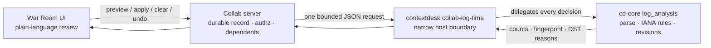

# War Room case-bound log corpus and time review v1

**Status: Local integration.** Implemented on
`claude/contextdesk-war-room-logging-2923u4` only. Nothing in this document is
available on `main`.

## The question

A War Room investigation frequently receives log files whose timestamps carry a
clock but no timezone: `2024-03-10 02:30:00` and nothing more. The investigation
genuinely does not know when that line happened. Two failure modes follow, and
both are common:

1. **Silent guessing.** A tool picks the server's zone, the browser's zone, or a
   configured default, and every downstream conclusion inherits an unmarked
   assumption. This is the more dangerous failure, because the output looks
   exactly like a resolved timeline.
2. **Discarding the evidence.** A tool refuses the line entirely, and the
   investigation loses a record it could still have used in ingest order.

This slice takes a third path: the ambiguity is surfaced as a decision a person
makes explicitly, order-only evidence is retained either way, and every
declaration carries the corpus revision and preview fingerprint it was decided
against.

## What ships in this slice

- A durable **case-bound log corpus**: one corpus per investigation, built from
  the log files already committed through corpus intake.
- **Per-source timezone review** with preview → apply → clear → undo, each
  bound to an exact corpus revision.
- **DST gap and fold reporting** as first-class output, not an error.
- **Honest dependent accounting**: what a time change did to snapshots and runs
  that already existed.
- A **plain-language War Room review surface** beside log intake in the Capture
  stage, showing raw and normalized timestamps side by side against the log
  lines they came from.

## Reuse, not reimplementation

Every timestamp decision is made by the shipped desktop log-analysis pipeline.
The Cloud adds no timestamp logic of its own.

The server owns the case, the declaration record, authorization, and the
dependent accounting. It never parses a timestamp, never compiles a zone rule,
and never decides whether a local time exists. `cd-core` owns all of that
through `timezone_resolution`, `timezone_application`, and `event_revision`; the
CLI command is a marshalling layer over them.

The one configuration decision the boundary makes is to force
`default_timezone: None` on the import it runs, so a saved desktop default can
never silently resolve a Cloud corpus.

## No zone is guessed

This is structural rather than a matter of wording:

- Import runs with no default timezone, so ambiguity survives into the corpus.
- The review surface pre-selects nothing; the zone field starts empty.
- Bare abbreviations are refused at the contract edge even where a legacy IANA
  link exists for them. `CST` is US Central *and* China Standard; `IST` is
  India, Ireland, and Israel. Accepting one would mean picking for the reviewer.
  `UTC` is the single unambiguous exception.
- An unrecognized zone id is refused, never repaired into a nearby match.

## Order-only evidence is preserved

A line that cannot be placed is retained, not dropped. After applying a zone,
the source still reports its unresolved count, and the review surface still
shows it. The pipeline distinguishes five reasons a line stays in ingest order,
and each is surfaced in plain language:

| Reason                              | What the reviewer is told                                     |
| ----------------------------------- | ------------------------------------------------------------- |
| `nonexistent_dst_gap`               | The clocks jumped forward past this local time                |
| `ambiguous_dst_fold`                | The clocks went back, so this local time happened twice        |
| `zone_abbreviation_mismatch`        | The line's own abbreviation contradicts the declared zone      |
| `unsupported_local_timestamp_shape` | The timestamp is too incomplete to place on a calendar         |
| `resolved_instant_out_of_range`     | The resulting date is outside the stored range                 |

## Revision and fingerprint provenance

Every durable change is bound to an exact corpus revision, and apply
additionally recomputes the preview fingerprint the reviewer saw:

- A stale `expectedRevision` is refused as a conflict, not applied.
- A fingerprint that no longer recomputes is refused as a conflict. This is what
  makes "you approved *this* preview" checkable rather than assumed.
- The durable record keeps who declared each zone, on what basis, at which
  revision, and against which fingerprint.

**Undo advances the revision.** The pipeline publishes a new revision carrying
the earlier content rather than deleting history, so an outcome names both the
revision it published and the earlier `restoredRevision` whose reading is back
in force. A surface that described undo as "going back to revision N" would be
misdescribing what the store did.

## Honest dependent accounting

A time change does not alter evidence bytes, so a frozen snapshot is never
called invalid. It is called **revised**: the same files now read under a
different clock. A run is different — it already produced conclusions under the
superseded basis — so it is **invalidated**.

| Dependent                          | Disposition     | Why                                                     |
| ---------------------------------- | --------------- | ------------------------------------------------------- |
| Snapshot frozen after corpus build | `revised`       | Bytes unchanged; time basis moved                       |
| Run bound to a revised snapshot    | `invalidated`   | Its conclusions used the superseded basis               |
| Snapshot or run predating the corpus | `unknown_basis` | No recorded time basis; not assumed current             |
| Change that rewrote no timestamps  | *(none marked)* | Nothing downstream moved                                |

`unknown_basis` is deliberate. Work frozen before the case had a corpus has no
recorded basis, and the review surface says so rather than implying it is still
current. Dispositions are written once, at the moment of the change, into an
append-only table, so the record reflects what was true then.

## Deployment

The review routes register only when a deployment names both a host binary
(`COLLAB_BRIDGE_BIN`, shared with the triage bridge) and a durable corpus root
(`COLLAB_LOG_CORPUS_ROOT`). With no pipeline there is nothing honest to show, so
the surface is absent rather than degraded.

## Proof

| Claim                                              | Evidence                                                                  |
| -------------------------------------------------- | ------------------------------------------------------------------------- |
| Import does not guess a zone                       | `crates/cd-cli/tests/collab_log_time_cli.rs` — `build_leaves_zone_less_sources_unresolved_instead_of_guessing` |
| DST gap reported, raw kept beside normalized        | same file — `preview_reports_the_dst_gap_and_keeps_raw_beside_normalized`  |
| Preview never mutates                              | same file — `preview_never_mutates_the_corpus`                             |
| Unrecognized zones refused                         | same file — `an_unrecognized_zone_is_refused_never_repaired_into_a_guess`  |
| Fingerprint and revision enforced                  | same file — `apply_requires_the_exact_preview_fingerprint_and_revision`    |
| Order-only evidence survives apply                 | same file — `applying_preserves_the_unresolvable_line_as_order_only_evidence` |
| Undo advances and names what it restored           | same file — `clear_restores_order_only_and_undo_publishes_a_forward_revision` |
| Durable record, replay, dependents                 | `collab/server/src/modules/log-time/log-time.test.ts` (22 tests)           |
| Contract shape and adversarial refusal             | `collab/contracts/src/investigation-log-time*.test.ts` (92 tests)          |
| Review surface behavior                            | `collab/web/src/LogTimeReviewPanel.test.tsx` (12 tests)                    |
| Whole journey in a browser against the real pipeline | `collab/e2e/specs/19-log-time-review.spec.ts`                            |

## Residuals

- One corpus per case: rebuilding after new intake is refused rather than
  merging, because a rebuild would discard existing declarations.
- Preview samples are the first N lines of a source, not a sampled cross-section
  of the whole file. The surface says so.
- Dependent accounting covers snapshots and triage runs. Other derived artifacts
  are not yet enumerated.
- A restored declaration whose durable row was already deleted carries a zeroed
  fingerprint to mark provenance that cannot be vouched for, rather than
  inventing one.
- Postgres store paths are exercised by the memory store in tests; the
  PostgreSQL-backed suite requires a live database and is not run here.
