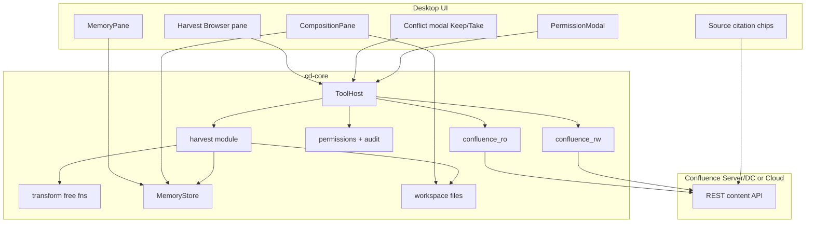
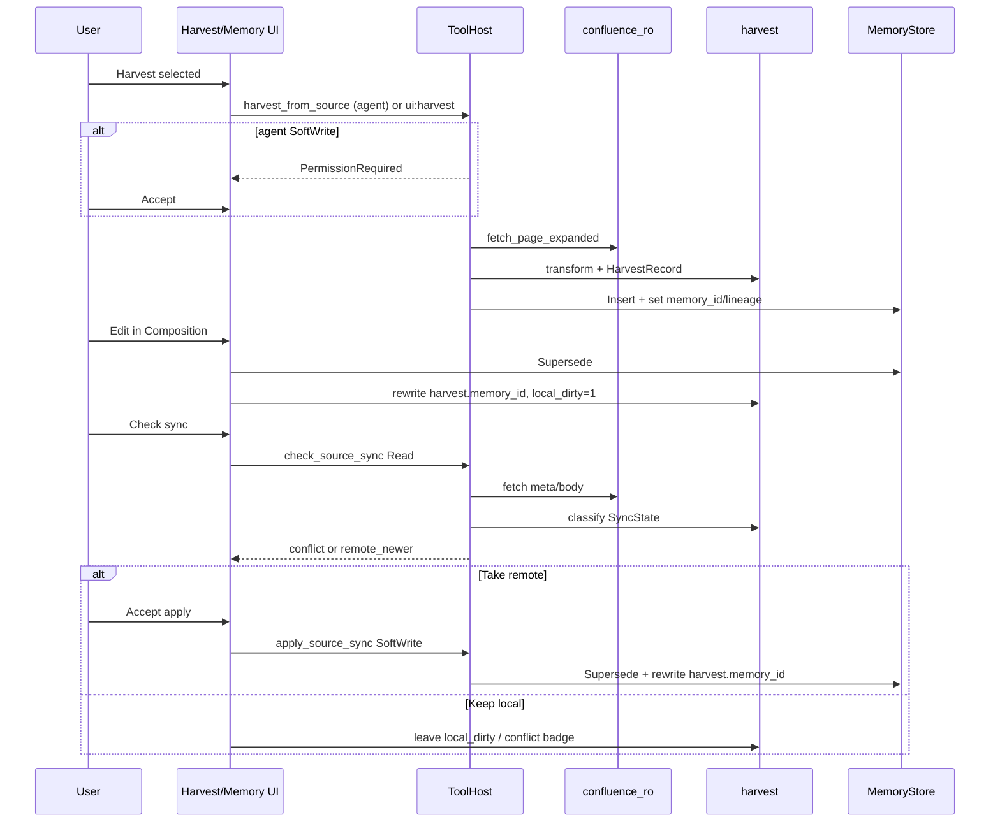
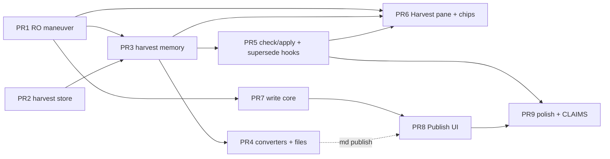

# ContextDesk: Confluence Maneuverability, Provenance-Linked Harvest, Multi-Memory Transform, and Confirmed Write

| Field | Value |
|-------|-------|
| **Status** | Draft (rev 3 — residual review issues addressed) |
| **Author** | Design agent (for owner review) |
| **Date** | 2026-07-22 |
| **Scope** | `cd-core` Confluence client + harvest/provenance + transform pipeline; desktop UI panes; SoftWrite/HardWrite policy |
| **Related** | [`docs/design/MEMORY.md`](MEMORY.md), [`docs/CLAIMS.md`](../CLAIMS.md), [`docs/THREAT_MODEL.md`](../THREAT_MODEL.md), ADR 0007 (Composition), ADR 0005 (Jira pattern) |
| **Supersedes** | None (extends Confluence RO + durable memory) |
| **Review** | Rev 2 closed issues 1–18; rev 3 residual fixes; rev 3.1 OQ#3 decided — personal-scope harvest allowed |

---

## Overview

ContextDesk today can **search and fetch** Confluence pages (read-only, space-allowlisted, ~25 hits) and store durable local memory with SoftWrite confirmation. It cannot browse space trees, bulk-harvest with user-chosen transforms, retain stable provenance for re-sync, or write back to Confluence under explicit confirmation.

This design makes Confluence a first-class **remote memory form** while keeping the product local-first: the user owns a harvested local copy (durable memory and/or workspace markdown), always with a **SourceRef** link-back to the Confluence page (id, base, space, version, URL). Harvest starts as Confluence→local pure transforms; a form-agnostic `MemoryForm` abstraction is phased in when a second form needs it. Confluence mutations (create/update page) are **always HardWrite** with `risk=remote` and type-to-confirm `"WRITE"` — never SoftWrite-only, never automatic, never session-auto.

**v1 platform focus:** Server/Data Center is the primary happy path (Bearer PAT + `{base}/rest/api/content/...`). Cloud is supported when the user sets a correct base path (`…/wiki`) and optional Basic auth; write tools stay disabled until preflight proves the base/auth matrix for that instance.

---

## Background & Motivation

### Current state (shipped anchors)

| Capability | Status | Code anchor |
|------------|--------|-------------|
| Confluence CQL search + page fetch | Shipped | `crates/cd-core/src/confluence_ro.rs` — `cql_search`, `fetch_page`, `ConfluenceRoConfig`, space allowlist, `limit.min(25)`, body `strip_tags` |
| Tool surface | Shipped | `tools.rs` — `confluence_search`, `confluence_get_page` (Read); dispatch in `tool_host.rs` (`tool_confluence_search` / `tool_confluence_get_page`, 400ms throttle) |
| PAT + settings | Shipped | `config.rs` — `CONFLUENCE_PAT_REF`, `ConfluenceSettings`; keychain only; Settings Connectors UI |
| SSRF for corp wiki | Shipped | Confluence uses `SsrfPolicy::allow_private_networks()` (user-configured base; still DNS-pin + block metadata) |
| Durable memory | Shipped / partial | `docs/design/MEMORY.md`; `memory/types.rs` (`MemoryRecord`, `MemorySource::Connector`, `url`, `content_hash`); SoftWrite tools; **Supersede allocates a new UUIDv7** |
| SoftWrite / HardWrite | Shipped | `permissions.rs` + `tool_host.rs::execute`; UI `PermissionModal`; `risk_for` today maps **all HardWrite → `"destructive"`** (must extend for Confluence → `"remote"`) |
| Composition | Shipped | ADR 0007; `CompositionPane.tsx`; `save_composition_draft` (UI-originated, redacts; content change via `MemoryWriteOp::Supersede`) |
| SQL connectors | Shipped RO | `sql_ro.rs` — no write path |
| Claims | Shipped row | `docs/CLAIMS.md` — Confluence RO only |
| Citations UI | Shipped | `SourceCitations.tsx` — opens only `https?://` ids or workspace paths; **`confluence:{id}` does not open a browser today** |

### Pain points

1. **Maneuverability is search-only.** No space tree, parent/children, ancestors, labels, or attachments.
2. **Fetch is ephemeral.** `confluence_get_page` returns stripped text into agent context with no durable provenance.
3. **No harvest format choice.** Body is always `strip_tags` plain text.
4. **No re-sync.** No version/etag, remote content hash, or conflict detection.
5. **No Confluence write.** Silent remote write is a non-goal (`docs/NON_GOALS.md` §2); confirmed write is desired but not designed.
6. **Supersede id churn.** Any durable memory content edit creates a new row id — harvest linkage must follow the active id (Issue 1).

### Product vision (user words, distilled)

- Maximal ability to **maneuver** Confluence.
- **Harvest** with flexible format into local ownership.
- Keep **reference back** to origin for re-sync, origin understanding, and UI link-backs.
- Local copy is canonical for offline/search/speed; Confluence remains remote source of truth for refresh.
- **Transform** between memory forms generally (not Confluence-only) — phased.
- **Write** to Confluence only with explicit user confirmation (HardWrite).

---

## Goals & Non-Goals

### Goals

1. **Maneuver Confluence** — space-scoped browse: list spaces (from allowlist), page tree (children of space root or page), ancestors, page metadata (title, labels, version, parent), optional attachment listing; CQL search remains primary for free-text.
2. **Flexible harvest** — user (or agent-proposed + Accept) copies a page (or small selected set) into local forms with a chosen **transform profile** and **memory scope** (`workspace` default, or `personal` for a private local copy — see Open Questions #3 decided).
3. **Provenance & link-backs** — every harvested unit stores a stable `SourceRef`; UI shows chips that open the remote **absolute URL**; re-sync on demand via split check/apply tools.
4. **Local-first** — harvested content is queryable via existing memory recall / workspace index without hitting Confluence each turn.
5. **Multi-memory transform (phased)** — pure Confluence→local transforms in v1; introduce a form-agnostic `MemoryForm` abstraction when a **second** form needs the same pipeline.
6. **Confirmed Confluence write** — **remote mutation is always HardWrite** with `risk=remote` and type-to-confirm phrase `"WRITE"`. Optional local draft (Composition / SoftWrite memory) is never itself a Confluence mutation. Never auto; never session-auto for `confluence://` targets.

### Non-Goals

- Full Confluence admin UI (permissions, space create, macros editor, blueprint wizard, full attachment binary management).
- Team multi-user harvest sync / shared harvest catalog (personal/workspace local only; future server sync is out of band — see ADR 0002).
- Becoming a full PKM or Obsidian clone (`docs/NON_GOALS.md` §5).
- Silent bulk scrape of entire spaces without explicit user intent and Accept.
- Replacing MCP/Jira patterns for other vendors with one mega-connector.
- **Cloud-perfect parity in v1.** Primary target is **Server/Data Center** (Bearer PAT). Cloud works when base path + auth mode are configured correctly; OAuth / ADF-first are deferred (see Alternatives).
- Continuous bidirectional sync daemon.
- Full three-way merge editor in Composition (v1 conflict UX is keep-local / take-remote only).

---

## Key Decisions

| # | Decision | Rationale |
|---|----------|-----------|
| K1 | **Native Confluence client in `cd-core`**, not MCP-first (unlike ADR 0005 Jira) | Confluence RO already ships native; harvest/provenance must integrate with memory store and audit targets. |
| K2 | **Split modules:** RO expand in `confluence_ro.rs`; mutations in `confluence_rw.rs`; provenance/transform in `harvest/` | Avoids a god-file; write code isolated from pure RO tests. |
| K3 | **`SourceRef` + harvest SQLite table** as SyncState SoT; memory gets `structured.provenance` + `url` as a **derived mirror** rewritten on each successful harvest/sync | Dual-write order is harvest-first then memory; never query only `structured` for `sync_status`. |
| K4 | **Local is canonical for day-to-day; remote is SoT for refresh** | Offline-first; conflicts surface on re-sync, not continuous push. |
| K5 | **Harvest = SoftWrite (local)**; **Confluence mutation = HardWrite with `risk=remote` always** | Aligns Goal 6; no SoftWrite-only remote path. Optional local draft is unrelated to remote side-effect class. |
| K6 | **No automatic bulk space harvest**; batch cap default 25 (max 50); **non-empty space allowlist required for harvest and write** | Empty allowlist remains OK for RO search (existing behavior) but not for harvest/write tools or tree roots. |
| K7 | **Transforms are pure free functions** over storage/plain in early PRs; **`MemoryForm` trait deferred** until a second form lands | Avoids unstable abstraction before need. |
| K8 | **Agent tools for maneuver + propose-harvest; Harvest browser pane for tree UX** | Same split as Memory vs `recall_memory`. |
| K9 | **Conflict policy v1: detect + modal Keep local / Take remote**; never auto-overwrite; three-way merge deferred | Composition is a single-target editor today (ADR 0007); full merge UI is out of v1. |
| K10 | **PAT stays keychain-only; write uses same credential** | Settings already store one secret; document write scopes. Auth **mode** may be Bearer or Basic (email+token), both keychain-backed. |
| K11 | **Session path grants never auto-approve Confluence write** (`confluence://…`) | Mirror `mem://` HardWrite (#270). |
| K12 | **On supersede of a harvested memory, update `harvest.memory_id` to the new active id in the same logical op** | Supersede always creates a new UUID; stale harvest.memory_id would break resync/chips/dirty. Optional `memory_lineage_root` retained for history. |
| K13 | **Split sync tools:** `check_source_sync` (Read) vs `apply_source_sync` (SoftWrite) | One `ToolSideEffect` per tool; pure classify must auto-run as Read. |
| K14 | **v1 Confluence platform: Server/DC first**; Cloud base path + Basic auth optional with explicit preflight | Honest about shipped Bearer + `/rest/api` path; Cloud needs config. |
| K15 | **Harvest SoftWrite: v1 never offers `AllowSessionPath`** for `harvest_from_source` / `apply_source_sync` (always AllowOnce). Additionally, `may_execute_without_prompt` treats `harvest://…` targets as **exact-match only** (no `path_under_grant` prefix) so a leaked broad grant cannot auto-batch | `path_under_grant` would treat `harvest://confluence` as a prefix of every page target; mirror #270 hardening style. |
| K16 | **Publish v1 from markdown requires converters; until converters ship, Publish restricted to `raw_storage` harvest or storage paste** | Prevents silent macro/lossy round-trips. |

---

## Proposed Design

### Architecture



### Layering

1. **Maneuver (Read)** — expand `confluence_ro`; tools `ToolSideEffect::Read`.
2. **Harvest (SoftWrite local)** — `harvest_from_source` + UI harvest; destinations with `SourceRef`.
3. **Transform** — pure free functions (`plain_strip`, `raw_storage`, `cleaned_markdown`, …).
4. **Re-sync** — `check_source_sync` (Read) then optional `apply_source_sync` (SoftWrite).
5. **Write-back (HardWrite remote)** — create/update with type-to-confirm; `risk_for` → `"remote"`.

---

### 1. Confluence maneuverability

#### 1.1 REST surface and platform matrix (v1 frozen)

Prefer **Content REST API** (already used by `confluence_ro.rs`):

| Operation | Endpoint | Notes |
|-----------|----------|-------|
| CQL search | `GET {api_root}/content/search?cql=&limit=` | Existing; limit ≤ 25 per call |
| Get page | `GET {api_root}/content/{id}?expand=…` | Expand: `body.storage`, `space`, `version`, `ancestors`, `children.page`, `metadata.labels` |
| Children | `GET {api_root}/content/{id}/child/page?limit=&start=` | Paginate; space-gate each result |
| Space roots | CQL (see §1.3 algorithm) | When browsing a space without parent id |
| Labels | expand `metadata.labels` | Read-only list v1 |
| Attachments | `GET {api_root}/content/{id}/child/attachment` | Metadata only; no bulk binary download |
| Create page | `POST {api_root}/content` | Write path |
| Update page | `PUT {api_root}/content/{id}` | Requires current `version.number` |

**`api_root` normalization (v1):**

```text
base_url (user setting, trimmed, no trailing slash)
  + if rest_path_mode == WikiPrefix OR (Auto and probe says need /wiki):
       append "/wiki" once if not already present
  + "/rest/api"
```

| Setting | Values | Default |
|---------|--------|---------|
| `rest_path_mode` | `Standard` (`{base}/rest/api`) · `WikiPrefix` (`{base}/wiki/rest/api`) · `Auto` (probe both on Test Connection) | `Standard` (Server/DC) |
| `auth_mode` | `Bearer` · `Basic` | `Bearer` |

**Auth matrix:**

| Mode | Header | Keychain | Typical product |
|------|--------|----------|-----------------|
| `Bearer` | `Authorization: Bearer {pat}` | `confluence/default/pat` (existing) | Server/DC PAT |
| `Basic` | `Authorization: Basic base64(email:token)` | `confluence/default/pat` = API token; `confluence/default/email` = email string (or non-secret email in config) | Atlassian Cloud |

**Preflight / Test Connection (Settings):**

1. Normalize base → try `GET {api_root}/space?limit=1` (or content search with allowlisted space).
2. On 401: surface “check auth mode (Bearer vs Basic) and credentials.”
3. On 404 for Standard: if `Auto`, retry WikiPrefix and suggest saving `WikiPrefix`.
4. **Write tools stay unregistered** until: connector enabled, PAT present, **spaces non-empty**, `write_enabled`, and last preflight status is `ok` for the active base/auth.

**`confluence_preflight_ok` (host flag):** process-local only (in-memory on `ToolHost` / desktop `AppState`). Set `true` on successful Test Connection for the current `(base_url, rest_path_mode, auth_mode)` snapshot; cleared on settings change that touches those fields or on host rebuild. **Not** persisted to disk. Write-tool registration and each write execute path re-check the flag (stale host without re-test → tools hidden / Policy error). Optional UX: StatusBar “Confluence untested since restart.”

**Honest scope:** Server/DC Bearer + Standard path is the tested primary path (matches shipped client). Cloud is supported with correct `WikiPrefix` + often `Basic`; wiremock fixtures cover Cloud-shaped JSON. OAuth 2.0 deferred (Alternatives).

#### 1.2 Config (extend, non-breaking)

```rust
// config.rs — ConfluenceSettings extensions (defaults preserve current behavior for RO)
pub struct ConfluenceSettings {
    pub enabled: bool,
    pub base_url: String,
    pub spaces: Vec<String>,
    pub pat_ref: Option<String>,
    /// When true, register write tools (still HardWrite-gated). Default false.
    #[serde(default)]
    pub write_enabled: bool,
    /// Max pages per harvest Accept batch. Default 25, max 50.
    #[serde(default = "default_harvest_batch")]
    pub harvest_batch_max: u32,
    /// REST path layout (see §1.1). Default Standard.
    #[serde(default)]
    pub rest_path_mode: ConfluenceRestPathMode, // Standard | WikiPrefix | Auto
    /// Auth header mode. Default Bearer.
    #[serde(default)]
    pub auth_mode: ConfluenceAuthMode, // Bearer | Basic
    /// Email for Basic auth (not secret); token still in keychain.
    #[serde(default)]
    pub basic_email: Option<String>,
    /// Web UI URL style for link construction when `_links.webui` missing.
    #[serde(default)]
    pub url_style: ConfluenceUrlStyle, // ServerViewPage | CloudWiki | Auto
}

/// Harvest + write require non-empty spaces (policy). RO search may still use empty = all PAT-visible.
pub fn spaces_required_for_mutate(cfg: &ConfluenceSettings) -> bool {
    !cfg.spaces.is_empty()
}
```

`ConfluenceRoConfig` gains: `base_url`, `spaces`, resolved `api_root` helper, auth mode plumbing for the HTTP layer (still no raw secrets in config structs used for pure parsers).

#### 1.3 New RO types & functions (`confluence_ro.rs`)

```rust
/// Auth material resolved in the host from keychain — never logged, never webview.
/// Passed only into HTTP call sites; pure parsers take no secrets.
#[derive(Clone)]
pub enum ConfluenceAuth {
    /// Server/DC PAT (shipped path).
    Bearer { token: String },
    /// Cloud email + API token → `Authorization: Basic base64(email:token)`.
    Basic { email: String, token: String },
}

impl ConfluenceAuth {
    /// Build Authorization header value (scheme + credentials). Do not Debug-print.
    pub fn authorization_header(&self) -> String { /* ... */ }
}

#[derive(Debug, Clone, Serialize, Deserialize)]
pub struct ConfluencePageMeta {
    pub id: String,
    pub title: String,
    pub space: String,
    pub version: Option<i64>,
    pub parent_id: Option<String>,
    pub url: Option<String>,
    pub labels: Vec<String>,
    pub excerpt: Option<String>,
}

#[derive(Debug, Clone, Serialize, Deserialize)]
pub struct ConfluencePageBody {
    pub meta: ConfluencePageMeta,
    /// Confluence storage format (XHTML-ish).
    pub storage: String,
    /// Existing strip_tags output (compat).
    pub plain: String,
}

#[derive(Debug, Clone, Serialize, Deserialize)]
pub struct AttachmentMeta {
    pub id: String,
    pub title: String,
    pub media_type: Option<String>,
    pub file_size: Option<u64>,
    /// Download or webui link if API provides; open externally only.
    pub download_url: Option<String>,
}

/// Space permit helper — **do not call bare `space_allowed` for empty-list semantics.**
///
/// Existing RO: empty `cfg.spaces` means **no filter** (`parse_search_hits` only
/// filters when `!cfg.spaces.is_empty()`). Bare `space_allowed` returns **false for
/// every key** when the list is empty — using it alone regresses RO browse.
///
/// - `require_allowlist = false` (RO tools / list_children / space roots for agent):
///   empty list → permit all; non-empty → `space_allowed`.
/// - `require_allowlist = true` (harvest, write, Harvest Browser tree roots):
///   empty list → **deny** (caller surfaces Policy / CTA); non-empty → `space_allowed`.
pub fn space_permitted(cfg: &ConfluenceRoConfig, space: &str, require_allowlist: bool) -> bool {
    if cfg.spaces.is_empty() {
        return !require_allowlist;
    }
    space_allowed(cfg, space)
}

/// Fetch page with expands; pure parse helpers offline-testable.
pub async fn fetch_page_expanded(
    cfg: &ConfluenceRoConfig,
    page_id: &str,
    auth: &ConfluenceAuth,
    policy: &SsrfPolicy,
) -> CoreResult<ConfluencePageBody>;

pub async fn list_child_pages(
    cfg: &ConfluenceRoConfig,
    parent_id: &str,
    start: usize,
    limit: usize,
    auth: &ConfluenceAuth,
    policy: &SsrfPolicy,
) -> CoreResult<Vec<ConfluencePageMeta>>;

pub async fn list_ancestors(
    cfg: &ConfluenceRoConfig,
    page_id: &str,
    auth: &ConfluenceAuth,
    policy: &SsrfPolicy,
) -> CoreResult<Vec<ConfluencePageMeta>>;

pub async fn list_attachments_meta(
    cfg: &ConfluenceRoConfig,
    page_id: &str,
    auth: &ConfluenceAuth,
    policy: &SsrfPolicy,
) -> CoreResult<Vec<AttachmentMeta>>;

/// Space root pages (no parent) for tree browse.
pub async fn list_space_root_pages(
    cfg: &ConfluenceRoConfig,
    space_key: &str,
    start: usize,
    limit: usize,
    auth: &ConfluenceAuth,
    policy: &SsrfPolicy,
    /// true for harvest UI / write-scoped hosts; false for agent RO tools.
    require_allowlist: bool,
) -> CoreResult<Vec<ConfluencePageMeta>>;
```

**Space-root algorithm (`list_space_root_pages`):**

1. Policy: if `!space_permitted(cfg, space_key, require_allowlist)` → `CoreError::Policy` (empty allowlist + `require_allowlist` → `"spaces allowlist required"`; non-empty + wrong key → not allowlisted). Agent RO passes `require_allowlist=false` so empty allowlist still works like search. Harvest Browser always uses `require_allowlist=true` and shows CTA when empty (no tree roots requested).
2. CQL: `space = "{key}" AND type = page AND parent is null ORDER BY title` via existing search endpoint, `limit`/`start` pagination.
3. Fallback if instance returns empty but space has pages: expand space `GET {api_root}/space/{key}?expand=homepage` then `list_child_pages(homepage.id)` as “space home children” and label UI “Under homepage” (not true orphans). Document which path was used in meta.
4. Space-gate every hit with the **same** `space_permitted(cfg, hit.space, require_allowlist)`; drop failures. Never call bare `space_allowed` alone for this gate.

**Webui URL construction** when `_links.webui` absent:

- `ServerViewPage`: `{base}/pages/viewpage.action?pageId={id}`
- `CloudWiki`: `{base}/spaces/{space}/pages/{id}` (base already includes `/wiki` if WikiPrefix)
- `Auto`: prefer `_links.webui` absolute or relative-to-base; else ServerViewPage unless `rest_path_mode` is WikiPrefix → CloudWiki

#### 1.4 Agent tools (Read)

| Tool | Tier | Purpose |
|------|------|---------|
| `confluence_search` | Read | Existing; enrich hits with version/url when cheap |
| `confluence_get_page` | Read | Existing; optional `format` = `plain` \| `meta` \| `storage` \| `all` |
| `confluence_list_children` | Read | `{page_id}` **or** `{space}` (space roots); `limit`, `start` |
| `confluence_get_ancestors` | Read | Breadcrumb for current page |
| `confluence_list_attachments` | Read | Metadata only |

All gated on connector configured + PAT present. Shared `throttle_confluence` (400ms).

#### 1.5 Harvest Browser pane (UI)

New pane tab **Harvest**:

- Left: **allowlisted spaces only** (if allowlist empty → empty tree + CTA “Add space keys in Settings”).
- Center: lazy children / multi-select up to `harvest_batch_max`.
- Right: preview + transform profile + destination + **scope** control (`workspace` default, optional `personal` for private memory/files under personal store).
- Actions: **Harvest selected**, **Open in browser** (absolute URL), **Check sync** / **Apply sync** for already-harvested.

---

### 2. Data model: SourceRef, HarvestRecord, SyncState

#### 2.1 SourceRef

```rust
#[derive(Debug, Clone, Serialize, Deserialize, PartialEq, Eq)]
pub struct SourceRef {
    /// "confluence" | "workspace_file" | "memory" | …
    pub system: String,
    /// Normalized instance base (no trailing slash; host lowercased).
    pub instance: String,
    /// Stable remote id (Confluence page id).
    pub remote_id: String,
    /// Space key / collection.
    pub collection: Option<String>,
    pub remote_version: Option<i64>,
    pub etag: Option<String>,
    pub url: Option<String>,
    /// Hash of canonical remote storage body at last observation.
    pub remote_content_hash: Option<String>,
}

impl SourceRef {
    pub fn confluence(...) -> Self { /* ... */ }
    /// Permission / audit target: confluence://{host}/page/{id}@v{n}
    pub fn permission_target(&self) -> String { /* ... */ }
}
```

#### 2.2 HarvestRecord + SyncState (DDL)

Harvest tables co-locate with the **destination memory scope**: workspace-scoped harvests in the workspace memory DB; personal-scoped harvests in the personal memory DB (same file as that scope’s `MemoryStore`). The same Confluence page may be harvested once per scope/profile/destination kind. Prefer shared tables over a separate `harvest.sqlite` connection.

```sql
CREATE TABLE IF NOT EXISTS harvest (
  id                  TEXT PRIMARY KEY,   -- UUIDv7
  source_system       TEXT NOT NULL,
  source_instance     TEXT NOT NULL,
  source_remote_id    TEXT NOT NULL,
  source_collection   TEXT,
  source_url          TEXT,
  remote_version      INTEGER,
  remote_etag         TEXT,
  remote_content_hash TEXT,
  -- destinations: exactly one of memory_id / workspace_path for a given row
  -- (destination=both creates two rows sharing remote keys + transform)
  memory_id           TEXT,               -- always the **active** memory UUID
  memory_lineage_root TEXT,               -- first memory id from original harvest; never rewritten
  workspace_path      TEXT,
  transform_profile   TEXT NOT NULL,
  last_synced_at      INTEGER NOT NULL,
  local_content_hash  TEXT NOT NULL,
  local_dirty         INTEGER NOT NULL DEFAULT 0,
  sync_status         TEXT NOT NULL DEFAULT 'in_sync',
    -- in_sync | remote_newer | local_dirty | conflict
    -- | missing_remote | missing_local
  created_at          INTEGER NOT NULL,
  updated_at          INTEGER NOT NULL,
  CHECK (
    (memory_id IS NOT NULL AND workspace_path IS NULL)
    OR (memory_id IS NULL AND workspace_path IS NOT NULL)
  )
);
-- Note: CHECK forbids both destinations NULL. Never NULL out memory_id to
-- "unlink" without also setting workspace_path or deleting the row.

-- SQLite: NULL-safe uniqueness via partial indexes (NULL ≠ NULL in UNIQUE otherwise)
CREATE UNIQUE INDEX IF NOT EXISTS idx_harvest_mem_dest
  ON harvest(source_system, source_instance, source_remote_id, transform_profile)
  WHERE memory_id IS NOT NULL;

CREATE UNIQUE INDEX IF NOT EXISTS idx_harvest_file_dest
  ON harvest(source_system, source_instance, source_remote_id, transform_profile)
  WHERE workspace_path IS NOT NULL;

CREATE INDEX IF NOT EXISTS idx_harvest_remote
  ON harvest(source_system, source_instance, source_remote_id);
CREATE INDEX IF NOT EXISTS idx_harvest_memory ON harvest(memory_id);
CREATE INDEX IF NOT EXISTS idx_harvest_lineage ON harvest(memory_lineage_root);
```

**Upsert semantics (re-harvest same remote + profile + destination kind):**

- Memory destination: update existing row (reset `local_dirty=0`, refresh hashes/versions, **keep** `memory_lineage_root`; if body changes via supersede, see §2.3).
- File destination: overwrite file + update row.
- Different `transform_profile` → separate row (allowed by unique key).
- `destination=both` → two rows (memory partial index + file partial index).

**SyncState** = live fields on `harvest` (`sync_status`, versions, hashes, `local_dirty`).

#### 2.3 Memory integration + supersede invariant (Issue 1)

On first harvest → durable memory:

```rust
MemoryDraft {
    kind: Kind::ProjectNote, // or user choice
    title: page.title,
    content: transformed,
    scope: chosen_scope, // Scope::Workspace (default) | Scope::Personal — user/agent choice
    workspace_id: /* set when scope=workspace; None when personal */,
    source: MemorySource::Connector,
    origin_tool: Some("harvest_from_source".into()), // or "ui:harvest"
    url: source_ref.url.clone(),
    structured: json!({
        "provenance": source_ref,
        "harvest_id": harvest_id,
        "transform_profile": profile_id,
        "confluence": { "space": space, "page_id": page_id, "version": version }
    }),
    tags: labels + ["source:confluence", format!("space:{space}")],
    …
}
// After put: harvest.memory_id = new_id; harvest.memory_lineage_root = new_id
// Harvest row co-located with destination scope (personal store vs workspace store).
```

**Invariant — active memory id always tracked:**

| Event | Required harvest update |
|-------|-------------------------|
| First harvest insert | `memory_id = new`; `memory_lineage_root = new` |
| `MemoryWriteOp::Supersede { old, new }` where `old` is `harvest.memory_id` **or** any id in lineage for that harvest | **Same transaction / logical op:** `harvest.memory_id = new.id`; set `local_dirty = 1` (unless supersede is from `apply_source_sync`); rewrite `structured.provenance` on the new memory from harvest; update `local_content_hash` |
| `UpdateMeta` only | no memory_id change; dirty only if content-affecting (v1 UpdateMeta does not change content) |
| Retract / purge of harvested memory | **v1:** set `sync_status = 'missing_local'`; **keep** last `memory_id` (tombstone pointer to retracted row — CHECK still satisfied). Do **not** NULL `memory_id`. Optional later: explicit unlink = `DELETE FROM harvest WHERE id = ?` (drops provenance) or re-point destination. File-only rows unchanged. |

**Hook points (must implement together):**

1. `SqliteMemoryStore::put` / facade — optional callback or harvest store method `on_memory_superseded(old, new)`.
2. `tool_host` paths for `save_memory` / `supersede_memory` after successful put.
3. Desktop `save_composition_draft` after successful supersede/insert — **must** call the same harvest rewrite helper (PR5 includes desktop files).
4. UI-originated harvest insert — sets lineage as above.

**Tests (acceptance):** harvest page → open Composition → save (supersede) → `harvest.memory_id` equals new active id → `check_source_sync` reads active body → link-back chip still resolves.

#### 2.4 Provenance dual-write order (Issue 15)

On every successful harvest or `apply_source_sync`:

1. Write/update **harvest row** (SyncState SoT: versions, hashes, `sync_status`, `memory_id`).
2. Insert or supersede **memory** with `structured.provenance` copied **from** the harvest/SourceRef snapshot; set `url` column from `source_url`.
3. Never reverse-query only `structured.provenance` for `sync_status` — always join harvest by `harvest_id` or `memory_id`.

If step 2 fails after step 1: leave harvest with `sync_status` reflecting incomplete apply; UI can retry apply. Prefer single host-level transaction-like sequence with compensating mark.

#### 2.5 Workspace file harvest

Optional destination under allowlisted roots, default template:

`{workspace_data}/harvest/confluence/{space}/{page_id}-{slug}.md`

Frontmatter includes SourceRef fields + `harvest_id`. Path templates constrained under `harvest/` prefix by default.

---

### 3. Flexible harvest & transform pipeline

#### 3.1 Transforms (phased abstraction — Issue 12)

**PR2–PR4:** pure free functions, no `MemoryForm` trait required:

```rust
pub fn plain_strip(storage: &str) -> String;           // existing strip_tags
pub fn identity_storage(storage: &str) -> String;    // raw_storage profile
pub fn structured_fields_md(meta: &ConfluencePageMeta) -> String;
pub fn storage_to_markdown(storage: &str) -> MarkdownConvertResult;
pub fn markdown_to_storage(md: &str) -> MarkdownConvertResult;

pub struct MarkdownConvertResult {
    pub text: String,
    pub warnings: Vec<String>,  // e.g. "stripped unknown macro ac:structured-macro"
    pub lossy: bool,
}
```

**Later (second form):** introduce `MemoryForm` / `FormKind` / `TransformProfile` trait without breaking free functions (wrappers).

Built-in profile ids:

| Profile id | Notes |
|------------|-------|
| `raw_storage` | Faithful re-upload; Publish v1 preferred path |
| `plain_strip` | Default; matches today |
| `cleaned_markdown` | storage→md via supported subset |
| `summary` | Heuristic extract (headings + first N chars); LLM optional later |
| `structured_fields` | Title/space/labels/version/url table |

#### 3.1.1 Converter supported subset (Issue 8)

| Element | storage→md | md→storage |
|---------|------------|------------|
| h1–h3 | yes | yes |
| p, br | yes | yes |
| ul/ol/li | yes | yes |
| a href | yes | yes |
| code / pre | yes | yes |
| tables (simple) | best-effort | best-effort |
| images | link/alt only | optional |
| `ac:structured-macro` and unknown tags | strip or HTML comment; set `lossy` + warning | n/a |

Golden fixtures: wiremock-derived storage samples for Server and Cloud in `crates/cd-core/tests/fixtures/confluence/`.

**Publish gate:** if body is markdown and converters report `lossy` or converters not yet shipped, Composition Publish either (a) only enabled for harvests with `transform_profile=raw_storage` and unedited storage, or (b) requires user to paste storage. Full md Publish lands with converter PR.

#### 3.2 Harvest tool (SoftWrite)

```text
harvest_from_source
  side_effect: SoftWrite
  risk: local
  args: {
    system: "confluence",
    page_ids: ["…"],          // 1..=harvest_batch_max
    transform: "cleaned_markdown",
    destination: "memory" | "file" | "both",
    memory_kind?: "project_note",
    file_path_template?: "harvest/confluence/{space}/{id}.md",
    scope?: "workspace" | "personal"   // default "workspace"; sets MemoryDraft.scope
  }
```

When `destination` includes memory, `scope` is written to `MemoryDraft.scope` (`Scope::Workspace` | `Scope::Personal`) and routes the put to the matching store. File destination under personal scope uses the personal app-data harvest root (not workspace roots); workspace scope uses workspace-allowlisted paths as today.

**Policy:**

- Non-empty space allowlist required (`space_permitted(..., require_allowlist=true)`); each page space-gated after fetch.
- Permission target: `harvest://confluence/{space}/{id}` (single) or `harvest://confluence/batch/{n}`.
- **Session grants (K15):** v1 PermissionModal **never offers `AllowSessionPath`** for `harvest_from_source` or `apply_source_sync` — only Deny / AllowOnce. Defense in depth in `may_execute_without_prompt`:

```rust
// permissions.rs — harvest targets never use path_under_grant prefix matching
if target.trim().starts_with("harvest://") {
    // SoftWrite harvest / apply: require exact session grant equality only,
    // and v1 UI never records session grants for these tools anyway.
    return self.session_paths.iter().any(|g| g.trim() == target.trim());
}
```

Unit tests: grant `harvest://confluence` must **not** auto-run `harvest://confluence/ENG/123`; grant exact page target still false in v1 if UI never records session grants (AllowOnce only). Prefer always Accept for agent proposals.

**Batch semantics (Issue 18):** best-effort sequential with throttle; return per-page results array `{page_id, ok, harvest_id?, error?}`. Partial success keeps successful HarvestRecords; no global rollback; UI lists failures. No remote side effects in harvest.

#### 3.3 Re-sync: split tools (Issue 2)

```text
check_source_sync          # Read — auto-run
  args: { harvest_id } | { memory_id } | { source_ref }
  returns: {
    sync_status, remote_version, local_dirty,
    remote_preview_plain?,    # capped
    active_memory_id?,        # resolved via harvest.memory_id after supersede rewrites
  }

apply_source_sync          # SoftWrite — Accept required
  args: {
    harvest_id,
    mode: "take_remote"       # v1 only take-remote from remote snapshot taken at check time
    expected_remote_version,  # optimistic concurrency
  }
  effect: re-fetch (or use cached snapshot if version matches), transform, supersede local memory
           or overwrite file; update harvest; clear local_dirty; rewrite provenance
```

**Never** auto-apply on Read. UI: Check → show status → user Accept on Apply when `remote_newer` or user chooses Take remote on conflict.



---

### 4. Confirmed Confluence write

#### 4.1 Module `confluence_rw.rs`

```rust
#[derive(Debug, thiserror::Error)]
pub enum ConfluenceWriteError {
    #[error("version conflict: expected {expected}, server has {current}")]
    VersionConflict { expected: i64, current: i64 },
    #[error("space `{0}` not allowlisted")]
    SpaceNotAllowlisted(String),
    #[error("spaces allowlist required for write")]
    AllowlistRequired,
    #[error("HTTP {status}: {body}")]
    Http { status: u16, body: String },
    #[error(transparent)]
    Core(#[from] CoreError),
}

pub async fn create_page(
    cfg: &ConfluenceRoConfig,
    auth: &ConfluenceAuth, // see §1.3 — Bearer | Basic; never logged
    space: &str,
    title: &str,
    storage_body: &str,
    parent_id: Option<&str>,
    policy: &SsrfPolicy,
) -> Result<ConfluencePageMeta, ConfluenceWriteError>;

pub async fn update_page(
    cfg: &ConfluenceRoConfig,
    auth: &ConfluenceAuth,
    page_id: &str,
    title: &str,
    storage_body: &str,
    current_version: i64,
    policy: &SsrfPolicy,
) -> Result<ConfluencePageMeta, ConfluenceWriteError>;
```

- Non-empty allowlist + `space_permitted(..., require_allowlist=true)` before request.
- Body size cap (e.g. 1 MiB storage).
- On 409 / version mismatch → `VersionConflict` (re-fetch; do not force).
- Audit target: `confluence://{host}/page/{id}@v{n}` in existing `AuditEntry.target` only.

#### 4.2 Tools

| Tool | Tier | `risk_for` | Confirm |
|------|------|------------|---------|
| `confluence_create_page` | HardWrite | **`remote`** | Type `"WRITE"` |
| `confluence_update_page` | HardWrite | **`remote`** | Type `"WRITE"` |

**`risk_for` change (Issue 7)** in `tool_host.rs`:

```rust
fn risk_for(side: ToolSideEffect, name: &str) -> &'static str {
    match side {
        ToolSideEffect::Read => "local",
        ToolSideEffect::SoftWrite => "local",
        ToolSideEffect::HardWrite
            if name == names::CONFLUENCE_CREATE_PAGE
                || name == names::CONFLUENCE_UPDATE_PAGE =>
        {
            "remote"
        }
        ToolSideEffect::HardWrite => "destructive",
    }
}
```

Tests: `PermissionRequired.risk == "remote"`; `may_execute_without_prompt(HardWrite, "confluence://…") == false` even with session path grant.

**Settings:** `write_enabled` default **false**. Tools unregistered unless preflight ok + non-empty spaces + PAT.

Local draft in Composition is **not** a Confluence write. **Publish** button issues HardWrite with frozen args (Issue 6 / OQ6 decided: single HardWrite with rich preview for v1).

#### 4.3 Permission hardening

```rust
pub fn is_remote_confluence_target(target: &str) -> bool {
    target.trim().starts_with("confluence://")
}
// In may_execute_without_prompt:
// HardWrite + confluence:// → never session-auto (mirror mem:// HardWrite)
```

#### 4.4 Body format for write

- API native: **storage format**.
- md→storage only after converter PR; until then Publish from `raw_storage` harvest or storage paste (K16).
- Preview must show warnings when `lossy`.

---

### 5. Agent tools vs UI panes

| Concern | Agent tools | Dedicated UI |
|---------|-------------|--------------|
| Search / get page | Yes | Harvest search |
| Tree browse | list_children / ancestors | **Primary:** Harvest Browser |
| Harvest | `harvest_from_source` SoftWrite | Harvest Browser (UI-originated) |
| Check sync | `check_source_sync` Read | Link-back / harvest badge |
| Apply sync | `apply_source_sync` SoftWrite | Accept modal |
| Conflict | — | **Conflict modal** Keep local / Take remote |
| Confluence write | create/update HardWrite | Composition **Publish** + PermissionModal |
| Attachments | list meta | External open only |

---

### 6. Permission model (summary)

| Action | Side effect | Risk | Auto? |
|--------|-------------|------|-------|
| Search / get / children / ancestors / attachments / check_source_sync | Read | — | Yes (policy); RO uses `space_permitted(..., false)` |
| Harvest to memory/file | SoftWrite | local | **AllowOnce only** (no session path UI); exact-match defense in core |
| apply_source_sync | SoftWrite | local | **AllowOnce only** (same as harvest) |
| Create/update Confluence page | HardWrite | **remote** | Never; type-to-confirm `WRITE`; no session auto for `confluence://` |

---

### 7. Conflict policy (v1 shippable UX — Issue 9)

| Local dirty | Remote changed | Status | v1 UX |
|-------------|----------------|--------|-------|
| No | No | `in_sync` | — |
| No | Yes | `remote_newer` | Offer Apply sync SoftWrite (take remote) |
| Yes | No | `local_dirty` | Offer Publish (HardWrite) or keep local |
| Yes | Yes | `conflict` | **Conflict modal:** remote plain preview (capped) + **Keep local** (dismiss; leave badge) / **Take remote** (queues `apply_source_sync` SoftWrite). No three-way merge editor. |
| — | 404 / forbidden | `missing_remote` | Badge; keep local |
| Retracted local memory | — | `missing_local` | Badge; keep last `memory_id` pointer; re-harvest may upsert |

**Data shape for conflict modal (no Composition merge):**

```typescript
type ConflictPrompt = {
  harvestId: string;
  title: string;
  localSnippet: string;
  remoteSnippet: string;
  remoteVersion: number | null;
  localDirty: true;
};
```

Deferred (post-v1): three-way CompositionTarget with `base`/`local`/`remote` blobs.

---

### 8. Citations / link-backs (Issue 10)

**Problem:** agent `source_id` is often `confluence:{page_id}`; `SourceCitations` only opens http(s) or file paths. Core wire today (`events.rs`):

```rust
StreamEvent::Citation {
    source_id: String,
    label: String,
    locator: Option<String>,  // used as title in desktop turn.ts today
    // no url field
}
```

Desktop `turn.ts` maps → `{ id: source_id, label, title: locator }`. Web tools put absolute URL **in** `source_id`. Keeping stable `confluence:{id}` **and** an openable URL requires a wire change (do not overload `locator` as URL — that breaks title display).

**Core wire (additive, PR6 or thin core slice before UI):**

```rust
StreamEvent::Citation {
    source_id: String,
    label: String,
    locator: Option<String>,
    /// Absolute http(s) URL for browser open; serde default None for back-compat.
    #[serde(default, skip_serializing_if = "Option::is_none")]
    url: Option<String>,
}
```

**Desktop citation DTO:**

```typescript
export type SourceCitation = {
  id: string;           // confluence:{id}, memory:{uuid}, path, or https URL
  label: string;
  title?: string;       // from locator
  /** Absolute URL for browser open when id is not http(s). */
  url?: string;         // from StreamEvent::Citation.url
};
```

**Resolution order when activating a chip:**

1. If `citation.url` is http(s) → open external.
2. Else if `citation.id` is http(s) → open external (today).
3. Else if `citation.id` matches `confluence:{page_id}` → resolve via host `resolve_source_ref({ system: "confluence", remote_id })`:
   - harvest table `source_url` if present;
   - else construct webui URL from settings base + url_style + space if known;
   - else live `fetch_page_expanded` meta.url (Read; optional).
4. Else treat as workspace path (today).

**Agent/tool results:** confluence tools emit `source_id = "confluence:{id}"`, `locator` = title/excerpt, and **`url` = absolute webui** when constructible. Fallback `resolve_source_ref` covers legacy messages without `url`.

**PR6 acceptance:** click on a confluence search hit citation opens webui URL without requiring a prior harvest; wire includes optional `Citation.url`.

---

### 9. UI-originated harvest audit (Issue 11)

Mirroring `save_composition_draft` is **accepted** for harvest (user already clicked Harvest). Convention:

| Field | Value |
|-------|--------|
| Audit `tool` | `ui:harvest` (UI) or `harvest_from_source` (agent tool) |
| Audit `side_effect` | SoftWrite (even UI path logs as soft_write class if enum allows, or Read+detail — prefer log SoftWrite for consistency) |
| Audit `target` | `harvest://confluence/{space}/{id}` or batch |
| Audit `outcome` | `allowed` |
| Audit `detail` | JSON string: `{"origin":"ui","page_ids":[...],"transform":"...","destination":"memory"}` — **do not add AuditEntry fields** |

**Never** use UI bypass for Confluence **write** — Publish always goes through `ToolHost::execute` HardWrite + PermissionModal.

Core harvest function shared: redaction + space gate + harvest row write + memory put (same as SoftWrite tool after grant).

---

## API / Interface Changes

### Tool names

```rust
pub const CONFLUENCE_LIST_CHILDREN: &str = "confluence_list_children";
pub const CONFLUENCE_GET_ANCESTORS: &str = "confluence_get_ancestors";
pub const CONFLUENCE_LIST_ATTACHMENTS: &str = "confluence_list_attachments";
pub const HARVEST_FROM_SOURCE: &str = "harvest_from_source";
pub const CHECK_SOURCE_SYNC: &str = "check_source_sync";     // Read
pub const APPLY_SOURCE_SYNC: &str = "apply_source_sync";     // SoftWrite
pub const CONFLUENCE_CREATE_PAGE: &str = "confluence_create_page"; // HardWrite
pub const CONFLUENCE_UPDATE_PAGE: &str = "confluence_update_page"; // HardWrite
// removed single dual-effect resync_from_source
```

### Tauri / host commands

| Command | Purpose |
|---------|---------|
| `confluence_browse_children` | UI tree |
| `confluence_preview_page` | Preview |
| `harvest_pages` | UI-originated harvest (`ui:harvest` audit) |
| `check_harvest_sync` | UI wrap of check_source_sync |
| `apply_harvest_sync` | UI SoftWrite apply (or tool host) |
| `list_harvest_records` | UI list |
| `resolve_source_ref` | Citation / chip URL resolution |
| `confluence_publish` | HardWrite via tool host only |

---

## Data Model Changes

1. `crates/cd-core/src/harvest/{mod,types,store,transform,sync,convert}.rs`
2. DDL with partial unique indexes + CHECK one destination
3. Settings: `write_enabled`, `harvest_batch_max`, `rest_path_mode`, `auth_mode`, `basic_email`, `url_style`
4. No breaking memory columns; provenance in `structured` + `url`
5. Supersede hooks update `harvest.memory_id`

### Storage estimates

- ~1k pages × 20 KB ≈ 20 MB SQLite — fine.
- Rate: 400ms throttle; batch 25 ≤ ~45s sequential.

---

## Alternatives Considered

### A. MCP Confluence server instead of native expand

| Pros | Cons |
|------|------|
| Isolates vendor API | Native RO already ships; harvest needs memory integration |

**Rejected for core path.**

### B. Only MemoryRecord provenance; no harvest table

| Pros | Cons |
|------|------|
| Simpler | Multi-destination + SyncState awkward |

**Rejected as sole store.**

### C. Continuous bidirectional sync

| Pros | Cons |
|------|------|
| Always fresh | Silent write risk, conflicts, API abuse |

**Rejected.**

### D. SoftWrite-only for Confluence mutations

| Pros | Cons |
|------|------|
| Faster | Violates remote risk theater |

**Rejected.** Always HardWrite + type-to-confirm.

### E. ADF-first (Atlassian Document Format) instead of storage XHTML

| Pros | Cons |
|------|------|
| Cloud-native editor model | Server/DC storage still primary; ADF converters are heavier; shipped client already uses `body.storage` |

**Rejected for v1.** Stay on storage format; revisit if Cloud editor APIs require ADF.

### F. OAuth 2 / scoped Cloud tokens in v1

| Pros | Cons |
|------|------|
| Better Cloud enterprise fit | Desktop OAuth UX + token refresh; Server/DC PAT works today |

**Deferred.** Bearer PAT + optional Basic email+token covers v1; OAuth as follow-up.

### G. Memory-only provenance without SyncState machine

| Pros | Cons |
|------|------|
| Fewer tables | No dirty/conflict/version without re-deriving ad hoc |

**Rejected** — harvest table SyncState is the point of re-sync UX.

---

## Security & Privacy Considerations

| Threat | Mitigation |
|--------|------------|
| PAT theft via webview | Keychain only; never IPC raw secret |
| SSRF via base URL | Pinned client + allow_private_networks; block metadata |
| Over-broad scrape/write | **Non-empty spaces required for harvest/write**; batch cap; tree roots allowlisted only |
| Silent remote write | `write_enabled` default off; HardWrite + `risk=remote` + type-to-confirm; no session auto for `confluence://` |
| Session harvest spam | No broad `harvest://` session auto; batch always Accept |
| Prompt injection | wrap_untrusted / injection nonces |
| Secrets in pages | redact before memory persist |
| Attachment malware | Metadata only; external open |
| Audit integrity | Encode in `target` + `detail` JSON; no AuditEntry schema change |
| Cloud misconfig write | Preflight ok required to register write tools |

---

## Observability

- Spans: `confluence.maneuver`, `harvest.apply`, `harvest.check_sync`, `harvest.apply_sync`, `confluence.write` (no PAT, no full body).
- Audit: SoftWrite harvest Accept; UI `ui:harvest`; HardWrite publish; denials.
- Batch: per-page result counters; partial failure rate.
- Latency targets unchanged (search <2s; single harvest <3s; batch 25 <45s; check <2s).

---

## Rollout Plan

1. Maneuver Read tools when Confluence enabled (DEV.md notes; CLAIMS stays RO until harvest ships).
2. Harvest SoftWrite when memory store attached + non-empty spaces.
3. Write tools only when `write_enabled` + preflight ok + non-empty spaces.
4. Rollback: disable `write_enabled`; harvest tables additive.

---

## Risks

| Risk | Severity | Mitigation |
|------|----------|------------|
| XHTML→md lossy | Medium | raw_storage + warnings; Publish gate |
| Cloud 401/404 | Medium | path/auth matrix + preflight; Server/DC first |
| Supersede id drift | Critical | K12 + tests |
| Dual-write drift | Medium | harvest SoT + rewrite provenance on sync |
| Agent harvest spam | Medium | batch Accept; no broad session grant |
| Partial batch | Low | best-effort results array |

---

## Open Questions

1. ~~Cloud auth~~ **Decided for v1:** Bearer default; Basic optional; OAuth deferred. Base path modes Standard/WikiPrefix/Auto.
2. ~~URL style~~ **Decided:** ServerViewPage / CloudWiki / Auto; prefer `_links.webui`.
3. ~~Personal vs workspace harvest~~ **Decided:** personal-scope harvest is **allowed**. Default remains `workspace` (team/project copy); user or agent may choose `personal` for a private local copy (UI: scope control on Harvest Browser / SoftWrite args `scope`). Harvest rows co-locate with the destination store.
4. **Summary profile LLM:** Heuristic only in v1 unless owner wants SoftWrite LLM cost.
5. **Attachments binary store:** External only in v1 (decided).
6. ~~Write dual SoftWrite draft~~ **Decided:** single HardWrite + rich preview for v1.

---

## References

- `crates/cd-core/src/confluence_ro.rs`
- `crates/cd-core/src/tool_host.rs` — `risk_for`, throttle, execute grants
- `crates/cd-core/src/tools.rs`, `permissions.rs`, `audit.rs`
- `crates/cd-core/src/memory/types.rs` — Supersede new UUID
- `docs/design/MEMORY.md`, `docs/NON_GOALS.md`, `docs/THREAT_MODEL.md`
- ADR 0007 Composition; ADR 0005 Jira MCP contrast
- `desktop/src/components/SourceCitations.tsx`

---

## PR Plan

Each PR independently reviewable. Acceptance tests listed. CLAIMS updates when capability truly ships.

### PR1 — Confluence RO maneuver expansion

- **Title:** `feat(confluence): page meta, children, ancestors, expanded fetch`
- **Files:** `confluence_ro.rs`, tools, tool_host, config `rest_path_mode`/`url_style` (read-only use), `docs/DEV.md` (new Read tools; CLAIMS still RO)
- **Dependencies:** none
- **Changes:** types in §1.3 including `ConfluenceAuth` + **`space_permitted`**; space-root algorithm with `require_allowlist` flag; path normalization; wiremock Server + Cloud JSON shapes; preflight suggestions for 401/404; process-local preflight flag sketch
- **Acceptance:** `cargo test -p cd-core --lib confluence`; offline parse tests; `space_permitted(empty, false)` allows any space; `space_permitted(empty, true)` denies; children/ancestors use helper (not bare `space_allowed` alone); empty allowlist still allows RO search/list_space_root with `require_allowlist=false`

### PR2 — SourceRef + harvest store schema

- **Title:** `feat(harvest): SourceRef types and harvest SQLite tables`
- **Files:** `harvest/*`, migrate, unit tests
- **Dependencies:** none (∥ PR1)
- **Changes:** DDL with partial unique indexes + CHECK; upsert semantics; pure SyncState classify fns
- **Acceptance:** cannot insert two memory-dest rows for same remote+profile; supersede rewrite unit test on store API mock

### PR3 — Transform free fns + harvest SoftWrite → memory

- **Title:** `feat(harvest): transforms and SoftWrite harvest to durable memory`
- **Files:** `harvest/transform.rs`, tool_host, tools, permissions targets, redaction, memory put + harvest row
- **Dependencies:** PR2; PR1 recommended (else plain fetch + strip)
- **Changes:** profiles plain_strip, raw_storage, structured_fields; `harvest_from_source`; non-empty spaces policy; batch best-effort results; **no MemoryForm trait yet**
- **Acceptance:** SoftWrite required; provenance + harvest row; space empty → policy error; batch partial failure keeps successes

### PR4 — Converters + file destination + cleaned_markdown

- **Title:** `feat(harvest): storage↔markdown converters, file destination`
- **Files:** `harvest/convert.rs`, transform, workspace paths, golden fixtures, tool_host
- **Dependencies:** PR3
- **Changes:** `storage_to_markdown` / `markdown_to_storage` supported subset + warnings; file destination; path under `harvest/`
- **Acceptance:** golden fixtures; lossy macro warning; file unique partial index

### PR5 — check/apply sync + supersede harvest.memory_id hooks

- **Title:** `feat(harvest): check_source_sync, apply_source_sync, supersede id rewrite`
- **Files:** `harvest/sync.rs`, tools, tool_host, **memory put hooks**, **desktop `save_composition_draft` + composition dirty**, MemoryPane badges, permissions exact-match for `harvest://`
- **Dependencies:** PR3 (PR4 optional)
- **Changes:** split Read/SoftWrite tools; on supersede update `harvest.memory_id` + `local_dirty`; retract → `missing_local` keep memory_id; conflict classify; **no three-way merge** — status only; harvest SoftWrite AllowOnce-only + exact session grant defense
- **Acceptance:** harvest → composition save → memory_id updated; check Read auto; apply needs Accept; dual-write order tests; broad `harvest://confluence` session grant does not auto-run child targets; retract leaves harvest with `missing_local` and non-NULL memory_id

### PR6 — Desktop Harvest Browser + link-back chips

- **Title:** `feat(desktop): Harvest pane, conflict modal, citation URLs`
- **Files:** `events.rs` (`Citation.url`), tool_host confluence citation emit, `turn.ts` mapping, `HarvestPane.tsx`, PaneTabs, Conflict modal, `SourceCitations.tsx` (+ `url` field), host commands (`resolve_source_ref`, harvest_pages, check/apply), CSS; PermissionModal: hide AllowSessionPath for harvest/apply tools
- **Dependencies:** PR1 + PR3 + PR5 (chips can land with PR1 URL construct alone)
- **Changes:** additive `StreamEvent::Citation.url`; tree allowlisted spaces only (`require_allowlist=true`); multi-select harvest UI; Keep local / Take remote modal; citations open absolute URL for `confluence:{id}`
- **Acceptance:** empty spaces → CTA; chip opens browser without prior harvest when `url` present; legacy messages still resolve via `resolve_source_ref`; conflict modal only two actions; harvest permission UI has no session-path option
- **Note:** merges former PR7 into this PR for bandwidth

### PR7 — Confluence write path (core) — parallelizable after PR1

- **Title:** `feat(confluence): confirmed create/update HardWrite risk=remote`
- **Files:** `confluence_rw.rs`, tools, tool_host `risk_for`, permissions confluence:// never session-auto, config write_enabled, preflight gate, wiremock, THREAT_MODEL/DEV
- **Dependencies:** **PR1 only** (∥ harvest PRs); converters for md publish optional
- **Changes:** create/update; VersionConflict; non-empty spaces; risk remote; write tools hidden without preflight
- **Acceptance:** risk==remote; session grant cannot auto HardWrite; 409 → VersionConflict; empty spaces → no write tools

### PR8 — Desktop Publish + converter-gated md

- **Title:** `feat(desktop): Publish to Confluence from Composition`
- **Files:** CompositionPane Publish, PermissionModal, Settings write toggle, host publish via tool host
- **Dependencies:** PR7; **PR4 for markdown publish** — without PR4, Publish only for raw_storage / storage paste
- **Changes:** HardWrite grant flow; success updates harvest version if linked
- **Acceptance:** type WRITE required; no UI bypass of tool host for write

### PR9 — Polish: summary profile, batch progress UX, CLAIMS

- **Title:** `chore(harvest): summary profile, progress events, CLAIMS`
- **Files:** summary transform, events, `docs/CLAIMS.md` anchors for harvest + write when shipped, PRODUCT notes
- **Dependencies:** PR3–PR8 as applicable
- **Changes:** heuristic summary; ship claims with real path:symbol; residual docs
- **Note:** lighter than original PR10; maneuver tools documented in DEV from PR1



---

## Implementation notes for engineers

- Pure parsers + wiremock (pattern in `confluence_ro.rs`).
- Reuse throttle, pinned client, `allow_private_networks()`.
- **Always use `space_permitted`, never bare `space_allowed` alone** for empty-list RO semantics.
- Do not add `AuditEntry` fields — `target` + `detail` JSON only.
- Memory: `MemorySource::Connector`, redact before put; **always rewrite harvest.memory_id on supersede**.
- Retract → `missing_local` + keep `memory_id` (CHECK).
- `risk_for` must return `"remote"` for confluence write tools.
- Desktop never receives PAT / raw `ConfluenceAuth` tokens.
- Default tests offline.
- Harvest/write require non-empty `spaces` (`require_allowlist=true`).
- One tool = one `ToolSideEffect` (check vs apply).
- `Citation.url` additive on wire; do not overload `locator`.
- Harvest SoftWrite: AllowOnce only + exact-match session defense.
