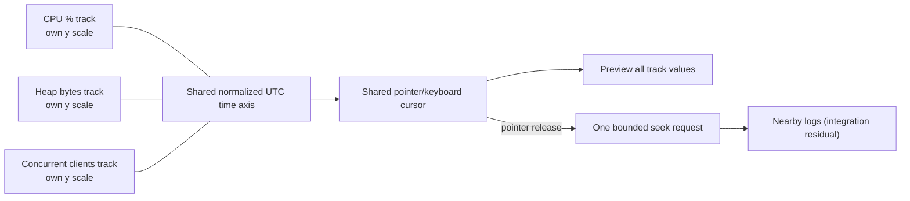

# Operational metric tracks

Status: **standalone rendering and validation slice implemented; product import,
attachment, persistence, and Log Explorer integration remain residual work.**

This design adds generic operational measurements beside logs without pretending
that unlike units are directly comparable. CPU percentage, heap bytes, concurrent
clients, queue depth, latency, or an adapter-defined measurement each get a
separate vertically stacked track with its own y scale and native unit. Every
track shares the same normalized horizontal time axis, cursor, and selected
range, allowing an investigator to seek nearby logs at an interesting moment.

## Interaction model



- Moving the pointer previews the same instant across every visible track.
- Dragging previews a bounded range across every track.
- Pointer release emits one bounded timestamp callback that an eventual Log
  Explorer integration can resolve to nearby logs. A release without a matching
  pointer start is ignored.
- Arrow keys move the shared cursor. Home and End move to the document bounds.
  Shift plus an arrow extends the selected range. Enter or Space commits the
  shared cursor as one bounded nearby-log seek.
- Missing intervals break the plotted line and include explicit text. A gap is
  never interpolated into an apparently continuous measurement, including when
  the gap lies entirely between two sampled endpoints.
- Thresholds are annotations within one metric's native unit, not conversions
  between tracks.
- Text exposes the current value, unit, y-domain, time quality, provenance, and
  gaps so meaning does not depend on color.

The first implementation is SVG and dependency-free. Deterministic min/max
bucket downsampling bounds each track to 240 rendered points by default while
retaining endpoints and local extrema. The integration can choose a different
bound, but should measure before increasing it.

The component is orientation-agnostic. Its `stacked` and `compact-side`
presentations are density hints applied to the same instance, data, cursor,
selection, and callbacks. On wide or ultrawide layouts an eventual parent may
dock it beside logs; it must not mount a second renderer, duplicate a host
query, or fork interaction state. Placement and the #707 user-facing chooser
are outside this slice.

## Two explicit ingestion paths

Folder coincidence is never an attachment. A metric document becomes relevant
to logs only through an explicit corpus or investigation attachment and
compatible normalized time.

### 1. Separately imported metric bundle

The user imports a metric bundle independently, reviews validation results, then
chooses an existing corpus or investigation to attach it to.

```text
my-performance-metrics/
├── manifest.v1.json
├── cpu.v1.json
├── heap.v1.json
└── clients.v1.json
```

The host stores the validated metric bundle under its own identity. A separate
attachment record should contain:

```json
{
  "schemaVersion": 1,
  "metricBundleId": "perf-run-2025-01-05",
  "targetKind": "corpus",
  "targetId": "corpus-host-issued-id",
  "attachedAt": "2025-01-05T19:00:00Z"
}
```

Attaching does not copy evaluator truth and does not mutate the log corpus.
Detach removes the relationship, not the source metric bundle.

### 2. Declared metrics inside a richer incident bundle

An incident bundle may place logs and metrics beside one another, but its
manifest must declare both roles and request an explicit attachment during
import.

```text
incident-bundle/
├── incident-manifest.v1.json
├── logs/
│   ├── api.jsonl
│   └── worker.log
├── metrics/
│   ├── manifest.v1.json
│   └── operational-metrics.v1.json
└── notes/
    └── operator-summary.md
```

Example declaration:

```json
{
  "schemaVersion": 1,
  "bundleId": "checkout-incident-42",
  "resources": [
    { "role": "logs", "path": "logs/" },
    {
      "role": "operational_metrics",
      "path": "metrics/manifest.v1.json",
      "attachTo": "imported_log_corpus"
    }
  ]
}
```

The importer must still show the proposed relationship and obtain the user's
confirmation. A sibling `metrics/` directory without this declaration has no
semantic relationship to `logs/`.

## Version 1 metric document

The runtime types and validator live in
`desktop/src/lib/logExplorer/operationalMetrics.ts`.

```json
{
  "schemaVersion": 1,
  "id": "performance-run",
  "name": "Checkout performance run",
  "series": [
    {
      "id": "cpu-percent",
      "name": "CPU",
      "unit": "%",
      "labels": { "service": "checkout-api" },
      "timeQuality": "wall",
      "provenance": {
        "source": "prometheus/export",
        "collector": "customer adapter",
        "query": "rate(process_cpu_seconds_total[1m])"
      },
      "thresholds": [
        {
          "id": "cpu-warning",
          "label": "CPU warning",
          "value": 80,
          "severity": "warning"
        }
      ],
      "gaps": [
        {
          "from": 1736082900,
          "to": 1736083800,
          "reason": "collector restart"
        }
      ],
      "points": [
        { "timestamp": 1736082000, "value": 42.5 },
        { "timestamp": 1736082900, "value": 51.2 }
      ]
    }
  ]
}
```

### Timestamp and timezone rules

- `timestamp` is a finite Unix timestamp in seconds representing an instant.
- Adapters must normalize timestamps with an explicit `Z` or numeric UTC offset.
- Offsetless local timestamps are rejected unless the adapter is given an
  explicit source timezone and records that transformation in provenance.
- Points in one series must be strictly increasing. Duplicate timestamps must be
  resolved deterministically by the adapter; the v1 renderer does not guess
  whether to average, sum, or keep one.
- `timeQuality` uses `wall`, `mixed`, or `order_only`. Wall-clock alignment with
  logs is permitted only when the attached data has suitable wall time.
- Fractional input timestamps may be retained by adapters as numeric seconds,
  but an integration must not claim precision beyond storage and source quality.
- Display is UTC. Locale-friendly labels may be added, but canonical UTC detail
  must remain available.

### Units, labels, thresholds, and gaps

- `unit` is required per series. Values are never normalized across unlike units
  for visual comparison.
- Unit conversion, when desired, happens in a named adapter before validation
  and must be recorded in provenance.
- `labels` are bounded string dimensions such as service, host, pool, or
  workload. Import should enforce count and length caps before persistence.
- A threshold belongs to one series and uses that series' native unit.
- `gaps` are explicit closed intervals. They preserve missingness even when
  samples exist at the boundary, and they render as broken lines plus text.
- Absence of a point alone is not automatically a gap because sampling cadence
  may be irregular. An adapter may declare gaps using its source semantics.

### Provenance and product context

Every series requires a source. Collector and query are optional. Point-level
labels, provenance, and time quality may refine the series defaults.

Validated measurements and provenance may enter governed product context after
explicit attachment. Evaluator answers, expected correlations, test oracle
labels, and hidden truth files must not.

Repository fixtures demonstrate that boundary:

```text
fixtures/log-lab/acceptance/seven-day-25k/scenarios/behavior-scale/
├── import/                         # only log files selected for log import
├── metrics/                        # metric documents and declared manifest
└── truth/                          # evaluator-only expected correlations
```

The first metric fixture is a coherent rising-load incident: clients rise, CPU
and heap pressure follow, and the peak overlaps checked-in warning/error log
events. The second fixture is a pattern gallery with isolated CPU, heap, and
client spikes, one overlapping spike, quiet periods, and explicit missing
samples.

## Validation and failure behavior

Validation fails closed for:

- unknown schema versions;
- missing or duplicate metric IDs;
- empty names or units;
- nonfinite timestamps or values;
- timestamps that are not strictly increasing;
- unsupported time quality or threshold severity;
- gaps whose end is not later than their start;
- missing provenance source;
- non-string labels.

An import UI should report each issue with its JSON path, keep the invalid bundle
detached, and never silently drop malformed series or coerce strings into
numbers. A valid subset must not masquerade as a successful whole-bundle import.

## Adapter example

Adapters are deterministic transformations into the versioned document, not
provider-specific logic inside the renderer.

```ts
type PrometheusSample = { epochMs: number; value: string };

function adaptCpu(samples: PrometheusSample[]) {
  return {
    id: "cpu-percent",
    name: "CPU",
    unit: "%",
    timeQuality: "wall" as const,
    provenance: {
      source: "prometheus/http-api",
      collector: "prometheus-v1 adapter",
      query: "100 * rate(process_cpu_seconds_total[1m])",
    },
    points: samples.map((sample) => ({
      timestamp: sample.epochMs / 1000,
      value: Number(sample.value),
    })),
  };
}
```

The adapter must reject nonfinite values, sort or reject out-of-order samples
according to a documented policy, resolve duplicates explicitly, declare known
gaps, cap input size, and pass the final document through the shared validator.

## Integration contract and residuals

`OperationalMetricTracks` accepts:

- a validated v1 document;
- a `stacked` or `compact-side` presentation hint for the same renderer;
- optional controlled cursor and selected range;
- a deterministic per-track render bound;
- cursor preview, range selection, and pointer-release seek callbacks.

It deliberately does not query logs or own attachment state. The eventual
integration resolves the release timestamp to nearby events, allows a user to
approve view changes, and keeps metric rendering inactive while its panel is
closed.

The following are **not shipped by this standalone slice**:

- file picker, archive, or incident-bundle metric import;
- host-side validation, persistence, attachment, or detachment;
- Log Explorer panel wiring and nearby-event seek resolution;
- metric context packaging for chat;
- arbitrary customer adapter execution or adapter sandboxing;
- persisted track visibility, ordering, or user-authored thresholds.

Those residuals require separate acceptance criteria, threat modeling, and
packaged-app proof. The checked-in fixtures and component callbacks make that
work testable without claiming it is already complete.
