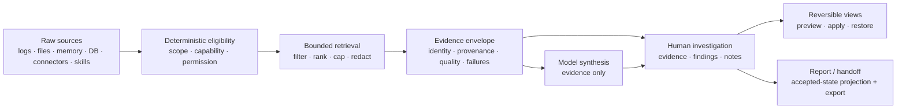

# Proven methods handbook

**Status:** first substantive handbook for issue #682. Markdown is the source of
truth. Status statements distinguish production behavior on `main` from local
integration work and future design.

## Audience and purpose

This handbook is for engineering teams that want to adapt or reimplement the
useful methods proven in ContextDesk without copying its product shape, desktop
stack, or storage layout. It focuses on the decisions that made evidence-heavy
AI workflows safer, more bounded, more inspectable, and more useful:

- retrieve and shape evidence deterministically before model synthesis;
- preserve log truth while reducing repetitive data into searchable structure;
- turn transient investigation state into durable, reversible, human-controlled
  work; and
- verify claims at the contract, core, host, UI, and packaged-product layers.

It is not an API specification, a promise that every designed feature ships, or
a replacement for the canonical architecture and feature designs. Each chapter
separates the reusable method from ContextDesk-specific production anchors and
uses the status legend below.

## Presentation and source-of-truth policy

The handbook remains reviewable Markdown in the repository. GitHub renders its
tables, links, and Mermaid diagrams as a rich HTML presentation. ContextDesk
also bundles these exact Markdown files in a separate read-only engineering
handbook window; the application does not maintain a second prose copy. A
generated static documentation site may be added later, but it must be produced
from these Markdown files and must not become an independent source of claims.

Do not add manually synchronized HTML chapters. If a future renderer cannot
represent a diagram or table, improve the generation pipeline or the Markdown
source.

## Handbook maintenance contract

The handbook is an engineering claim surface, not promotional copy. Maintain it
under these rules:

1. **Canonical source:** edit only this Markdown family for handbook content.
   Generated HTML, SVG, screenshots, and packaged views are presentations, not
   independent sources.
2. **Diagram identity:** every Mermaid block has a specific `%% title:` that
   states the relationship being shown. Adjacent prose must explain its scope
   and any shipped, partial, local, accepted, or planned boundary.
3. **Renderer fidelity:** authored diagrams use only syntax faithfully supported
   by the bundled renderer. Unsupported semantics must fail visibly; do not let
   a decorative approximation imply relationships the source does not express.
4. **Theme and nonvisual access:** generated diagrams use application theme
   tokens and retain a semantic text equivalent plus inspectable Mermaid source.
   Required operating information cannot depend on color, animation, or hover.
5. **Claim synchronization:** when a production contract, trust boundary,
   status, or residual changes, update the affected prose, status table,
   diagram, production anchor, and issue reference in the same change.
6. **Review and proof:** reviewers compare every diagram node and edge with its
   adjacent prose and cited production anchors. Run the handbook structural
   check, claims check, Markdown formatter, and link/diff checks before
   promotion.

If a useful relationship exceeds the current safe Mermaid subset, simplify the
diagram without losing the contract or improve the renderer in a separately
reviewed production change. Never encode additional behavior in a diagram that
the canonical prose does not claim.

## Status legend

| Status                | Meaning                                                                              | Evidence required                                              |
| --------------------- | ------------------------------------------------------------------------------------ | -------------------------------------------------------------- |
| **Shipped**           | Present on current `main` through a real production path                             | Production anchor plus automated or packaged-path proof        |
| **Partial**           | A useful slice ships, but named acceptance criteria or lifecycle work remains        | Shipped anchors plus explicit residual issue                   |
| **Local integration** | Implemented or verified on an unmerged integration branch only                       | Branch/commit evidence; never described as available on `main` |
| **Accepted design**   | A reviewed contract constrains implementation, but it is not itself shipped behavior | Canonical design or ADR link                                   |
| **Planned**           | Intended behavior with no complete production path                                   | Open issue/design; no shipped claim                            |

Status is scoped to the exact row. A chapter can contain shipped, partial, and
planned elements at the same time. “Tests exist” does not upgrade a local or
planned method to shipped.

## Method map

| Method                         | Primary question                                                                       | Current status                                                                                                                      | Chapter                                                                            |
| ------------------------------ | -------------------------------------------------------------------------------------- | ----------------------------------------------------------------------------------------------------------------------------------- | ---------------------------------------------------------------------------------- |
| Deterministic context assembly | What evidence is eligible, bounded, and safe to give a model?                          | **Partial**: linked-log isolation, one explicit main-chat corpus attachment, bounded reversible model-picker curation, phase-aware deadlines (friendly product controls for the whole-turn ceiling; adaptive latency learning remains future work), and evidence-preserving synthesis retry ship, and ambient-memory / plan-inventory injections are nonce-fenced untrusted blocks; **local integration** aligns provider transport with the sanitized host deadline and removes error-triggered protocol replay; multi-corpus remains #693 and native slow-provider acceptance remains #649 | [Deterministic context assembly](proven-methods/DETERMINISTIC_CONTEXT_ASSEMBLY.md) |
| Bounded multi-stage broad-log triage | How can candidate interpretations stay citation-confined while a final answer remains typed and host-authoritative? | **Live refinement accepted**: four bounded candidate ledgers, vocabulary-neutral structural-support admission, a strict typed final proposal, content-free manifest/scaffold/correction, shared live progress, a half-turn synthesis reserve, redacted candidate citation excerpts, invalid-candidate isolation, and literal-signal slot protection are on the integration path; the final 33,723-event Vercel/DeepSeek run completed grounded comparison in 115.9 seconds under the 180-second adaptive default; **local integration** adds a host-grounded fast-triage route (complete evidence packet, bounded neighborhood classification with a fail-closed clock gate, typed-only parsing, local validation, one host-authored correction, one visible escalation with a byte-identical packet), selected only by exact persisted profile/model/workflow evidence and disabled by default — hermetic only, so live fast-model usefulness remains unproven | [Bounded multi-stage broad-log triage](proven-methods/BOUNDED_MULTI_STAGE_BROAD_TRIAGE.md) |
| Log evidence pipeline          | How do raw records become honest, searchable, scalable evidence?                       | **Partial**: inventory-bound reviewed import, bounded logical-record framing, deterministic grammar fingerprints, explainable noise review, and a host-authoritative exact-template lens ship; custom format profiles, full timestamp policy, broader suppression lifecycle, and cross-corpus baselines remain #751/#670/#671/#690 | [Log evidence pipeline](proven-methods/LOG_EVIDENCE_PIPELINE.md)                   |
| Operational metric alignment   | How can unlike time-series signals share log time without implying comparable values?  | **Partial**: schema, shared host validation, bounded renderer, fixtures, durable one-per-corpus attachment, restore/replace/remove, and seek ship; incident-bundle/multiple attachment import and responsive docking remain #763/#667/#707 | [Operational metric tracks](OPERATIONAL_METRIC_TRACKS.md)                         |
| Investigation loop             | How does an engineer preserve, revisit, and act on discoveries without losing control? | **Partial**: manual evidence/findings/notes, view recipes, the SoftWrite proposal review queue (findings + report sections), and the versioned accepted-state report projection with deterministic Markdown export have production anchors; **local integration** adds investigation-scoped War Room file/ZIP/directory intake that lands ordinary freeze/triage evidence; proposal ranking/walkthroughs and the fuller #532 report workflow (richer sections, patches/undo, claim detection, HTML/PDF, evidence appendix) remain #646/#532 | [Investigation loop](proven-methods/INVESTIGATION_LOOP.md)                         |
| Deterministic demo and model evaluation | How can product behavior and provider/model grounding be compared without leaking the answer key? | **Partial**: deterministic fixtures, production evaluation paths, and the bundled/exportable lab chapter ship; **local integration** adds the hermetic #867 quality-evaluation harness with gateway-scoped quality units that never write readiness evidence; live provider quality remains environment-dependent | [Demo and model evaluation lab](proven-methods/DEMO_EVALUATION_LAB.md) and [Quality-evaluation harness](../benchmarks/QUALITY_EVAL_HARNESS.md) |
| Provider/model compatibility qualification | Which exact gateway model has demonstrated the contracts required for one role without confusing compatibility with answer quality? | **Local integration**: shared GUI/CLI `Discover → Verify → Choose`, secret-free exact-identity evidence, subset-first large-catalog selection, explicit synthetic probes, production auto-tool continuation (not an unprompted marker), and drift-aware re-verification are implemented; native `json_object` / forced `tool_choice` remain exact-contract measurements that must not false-limit a passing auto-tool path; ordinary-chat, attachment, multimodal, and answer-quality evidence remain separate residuals. Mixed live comparisons refuse a process-wide provider API key override so employer and Vercel profiles cannot cross-use credentials. | [Demo and model evaluation lab](proven-methods/DEMO_EVALUATION_LAB.md#64-run-ordinary-chat-and-capability-controls) |
| Gateway-scoped model routing | How can several gateways and models coexist without sharing evidence or silently changing privacy, egress, and cost? | **Partial**: exact gateway-scoped `ModelRef` plus the provider-free Triage Policy V2 compiler distinguish Standard/Enhanced/Advanced, required/optional roles, contributors/finalizer/conditional reviewer, independent budgets, and same-model independence inputs. The CLI now validates/compiles explicit policy and preflight files and can execute the admitted contributor subset through the trusted host resolver; GUI policy management and broader role support remain open | [Multi-gateway and multi-model routing](MULTI_GATEWAY_MODEL_ROUTING.md) · [Triage Policy V2 core proof](../testing/TRIAGE_POLICY_CORE_V2.md) · [Provider-free CLI proof](../testing/TRIAGE_POLICY_CLI_V2.md) |
| Triage Policy V2 and SDK parity | How can one or several qualified models contribute without making multi-model setup mandatory or creating separate CLI, GUI, and SDK truth? | **Partial**: the additive request/event/result/replay contracts live in the leaf `cd-triage-sdk` crate (re-exported in `cd-core`); the pure compiler and trusted host resolver remain in `cd-core` / `cd-workflow`. Standard remains the default. **Local integration** connects Standard/Saved/Inline execution to one `WorkflowTriageEngineV1` behind the provider-free `cd-triage-runtime` façade, and the live bench bridge can run bounded concurrent candidate lists against one prepared snapshot with proof-bound immutable results. Broader role support, provider-quality evidence, incremental Collab per-lane progress, and richer operator surfaces remain open | [Triage Policy V2](TRIAGE_POLICY_V2.md) · [runtime/bench bridge](TRIAGE_RUNTIME_BENCH_BRIDGE_V1.md) · [core proof](../testing/TRIAGE_POLICY_CORE_V2.md) · [production subset proof](../testing/TRIAGE_POLICY_V2_PRODUCTION_ADAPTER_V1.md) · [#872](https://github.com/chriscase/ContextDesk/issues/872) |
| Gateway/model differential diagnostic | For one selected model, does a gap sit at the gateway/model layer, ContextDesk's own product-path integration, or answer usefulness? | **Local integration**: bounded direct-vs-product two-lane differential (`gateway diagnose`) reusing capability qualification, the real chat workflow, and triage rubric scoring; consent-gated request bounds, guaranteed cleanup, and a share-safe checksummed artifact ship; the OpenAI-compatible embedding product-lane adapter and offline capture replay remain open residuals | [Gateway/model differential diagnostic](proven-methods/GATEWAY_MODEL_DIFFERENTIAL_DIAGNOSTIC.md) |
| Gateway cost/reliability ledger | How can share-safe diagnostic runs be compared over time without inventing live observations or readiness badges? | **Local integration**: versioned ledger schema, ingest of diagnostic report/manifest JSON plus documented historical rows, redaction/rejection of secrets, unknown-preserving cost/token aggregates, and a deterministic CLI comparison report (`gateway ledger`); independent of the Luna tool-continuation hardening lane; owner-local Luna raw import remains an offline documented path only | [Gateway cost/reliability ledger](../benchmarks/GATEWAY_COST_RELIABILITY_LEDGER_V1.md) |
| Retrieval-quality diagnostic | Which retrieval lane actually finds the decisive rows, and is the corpus's vector space even comparable to the configured one? | **Local integration**: typed embedding-space identity that fails closed on legacy and drift, a rerank candidate pool wider than the final K with pinned exact/structured/chronology anchors, mandatory explicit rerank dialects, an explicit re-analysis plan with locality and egress consent (CLI parity via `retrieval-reanalyze`), and six executable lanes driven through the real `search_logs` tool surface and the production RRF path; live retrieval quality on a real corpus is deliberately **not claimed** | [Retrieval-quality diagnostic](proven-methods/RETRIEVAL_QUALITY_DIAGNOSTIC.md) |
| Incident evidence interchange | How can authorized logs and metrics move from a producer into a validated, versioned hand-off? | **Partial**: v1 normative schema, fixtures, offline directory/ZIP validation, deterministic ZIP packing, producer templates, and Help ship (#764/#765); product import/attachment remains #763 | [Incident Evidence Bundle](proven-methods/INCIDENT_EVIDENCE_BUNDLE.md) |
| Incident-triage evaluation bench | How can whole-strategy triage attempts on frozen historical incidents be recorded, adjudicated, and compared without a GUI and without inventing readiness? | **Local integration**: versioned case/snapshot/task/run/adjudication/score records, file-backed store, manual import for human/web/other-product runs with byte-exact raw capture, immutable fairness, unknown-preserving provenance, rubric v1 plus packet-bound blinded adjudication, and deterministic JSON/JSONL/Markdown reports over same-task/same-snapshot groups. Replay ingestion, the deterministic mock, and bounded live candidate orchestration now share proof-bound recording; live runs persist into the same comparison groups. **Local integration** also adds a hermetic share-safe → `interaction_trace` / `strategy_package` converter so bench-compare or recorded-replay lanes can land on Experiment Lab without inventing gold/cost/usage, without inventing `providerCalls` / `evidenceAcquisitionSteps` from role-slot or accepted-evidence counts, and without fabricating null-excerpt question paths or cause hypotheses from `root_cause_established`; composite leaderboards, object storage, richer web collaboration, and synthesis remain future scope | [Triage bench v1](../benchmarks/TRIAGE_BENCH_V1.md) · [runtime/bench bridge](TRIAGE_RUNTIME_BENCH_BRIDGE_V1.md) · [trace/strategy comparison](../benchmarks/INTERACTION_TRACE_STRATEGY_COMPARISON_V1.md) · [Rubric v1](../../crates/cd-triage-bench/docs/RUBRIC_V1.md) |
| Bundled Help truth and delivery | How does shipped in-app documentation stay checkably true instead of silently rotting? | **Partial**: structural validation, bidirectional link/anchor resolution, whole-asset-set safety and theme-independent legibility, packaging assertion, and offline delivery ship; corpus prose accuracy, contextual-Help coverage, and rendered diagram quality remain human review | [Bundled Help truth and delivery](proven-methods/HELP_TRUTH_AND_DELIVERY.md) |
| Activity transparency | How can a person inspect model, host, connector, permission, and governed-write work without turning activity into evidence? | **Partial**: one causal provider/host timeline, metadata-only default retention (including live multi-model role stages), opaque evidence ids, actual permission decisions, an explicit redacted/bounded process-local developer stream, shared elapsed phase/tool/reviewer progress across CLI text/JSONL and desktop timelines, a nested human CLI Activity/trace hierarchy (ASCII-safe, TTY-aware), and host-neutral OpenAI-compatible provider telemetry (`ProviderTurnTelemetry`) ship; import/reanalysis detail, connector-internal retries, live-provider qualification, and durable chat hydration remain residual | [Activity Inspector](ACTIVITY_INSPECTOR.md) |
| Future method documentation    | How should another process be documented and challenged?                               | **Shipped**: maintenance contract, chapter template, structural checks, and export path                                             | [Method chapter template](proven-methods/METHOD_TEMPLATE.md)                       |

## From-scratch staged implementation path

The stages are deliberately ordered by trust dependency. A team can stop after
any stage and still have a coherent product; it should not add model autonomy
before the underlying evidence and permission contracts are testable.

### Stage 0 — freeze truth and authority

1. Define stable source, record, event, and citation identities.
2. Classify time, provenance, and authorship explicitly.
3. Decide which component is trusted to enforce paths, credentials, caps, and
   write permissions.
4. Separate user content, retrieved content, policy, and evaluator-only test
   truth.
5. Write hard bounds and fail-closed behavior before storage or UI code.

Exit test: malformed identities, untrusted instructions, unsupported
capabilities, and over-limit requests fail without broadening access or
fabricating evidence.

### Stage 1 — build deterministic retrieval without an LLM

1. Index allowlisted files and Markdown with bounded chunks.
2. Add durable memory with explicit provenance and redaction.
3. Add read-only database and connector adapters behind host-owned policy.
4. Return structured hits with stable identity, source, quality, and truncation
   state.
5. Make keyword retrieval always usable; treat embeddings as optional ranking.

Exit test: representative questions return inspectable evidence offline, and
every result can be reopened from its identity.

### Stage 2 — add the log evidence plane

1. Stream and redact records before persistence.
2. Parse only time evidence that can be defended; retain order-only fallbacks.
3. Store events in a scan-efficient analytical store.
4. Template repeated messages and embed templates rather than every event.
5. Add bounded filters, facets, search, timeline summaries, and keyset paging.
6. Preserve a bounded redacted original representation for fidelity checks.

Exit test: deterministic fixtures prove counts, shared instants, ambiguity,
gaps, redaction, original representation, and bidirectional navigation.

### Stage 3 — add durable investigation state

1. Save exact payload-free evidence identities.
2. Re-resolve payloads from the authoritative source for preview.
3. Add human-authored observations, inferences, hypotheses, and cited notes.
4. Persist logical view recipes separately from data payloads.
5. Preview without mutation; apply explicitly; restore the prior logical view.
6. Publish revisions atomically with optimistic concurrency.

Exit test: restart, stale evidence, duplicate actions, competing windows, and a
failed publication cannot silently corrupt or widen evidence.

### Stage 4 — add governed model synthesis

1. Classify the turn as ordinary or source-linked.
2. Compute eligible tools from scope, capability, and permission state.
3. Require deterministic grounding for source-linked answers.
4. Package bounded host-returned evidence for a tool-closed synthesis round.
5. Validate cited identities and withhold ungrounded model prose.
6. Make unavailable tools, partial retrieval, timeouts, and cancellation visible.

Exit test: a model cannot turn prose into a tool result, cannot make an
ordinary chat inherit a corpus, and cannot present an answer as grounded before
required evidence succeeds.

### Stage 5 — improve operator leverage

Add ranked finding proposals, approval history, noise policies, time-rule
previews, clock-skew diagnostics, report assembly, and richer visualizations
only after they preserve the prior stages' identity, provenance, bounds, and
human-control invariants.

## Canonical ContextDesk references

These documents remain authoritative for ContextDesk-specific architecture and
feature decisions:

- [Architecture](../ARCHITECTURE.md)
- [Capability claims](../CLAIMS.md)
- [Threat model](../THREAT_MODEL.md)
- [`cd.v1` protocol](../PROTOCOL.md)
- [Log and large-corpus analysis](LOG_ANALYSIS.md)
- [Log Investigation Workspace](LOG_EXPLORER.md)
- [Operational metric tracks](OPERATIONAL_METRIC_TRACKS.md)
- [Memory infrastructure](MEMORY.md)
- [In-app Help Center](HELP_CENTER.md)
- [External module substrate ADR](../adr/0001-external-module-substrate.md)
- [Server-authoritative sync ADR](../adr/0002-server-authoritative-sync.md)
- [Chat permission authority ADR](../adr/0003-chat-bridge-permission-authority.md)
- [Composition preview ADR](../adr/0007-composition-preview-pane.md)

Repository contribution and claim discipline are defined by
[AGENTS.md](../../AGENTS.md), [agent workflow](../AGENT_WORKFLOW.md),
[issue honesty](../ISSUE_HONESTY.md), and
[close proof](../CLOSE_PROOF.md).

## How to add a method

Start from [the method template](proven-methods/METHOD_TEMPLATE.md). A useful
chapter must:

1. name the problem and the trust boundary;
2. show inputs, outputs, stable identities, and bounds;
3. distinguish reusable algorithm from product-specific anchors;
4. enumerate recovery behavior, not only the happy path;
5. include testable invariants and a reimplementation recipe;
6. mark each meaningful capability shipped, partial, local, accepted, or
   planned; and
7. link evidence rather than copying large sections of another design.

## Known handbook residuals

This first version intentionally leaves several chapters for follow-up:

- permission mediation and UI-originated write grants;
- durable memory capture, recall, supersession, and privacy;
- bounded workspace/file indexing and hybrid retrieval;
- connector and database read isolation;
- package/import safety and compatibility evolution;
- provider-specific native acceptance for the phase-aware lifecycle on #649;
- timestamp policy after the remaining #670 work ships;
- the remaining report/proposal workflow after #646/#532 (ranking,
  walkthroughs, report patches, richer section vocabulary, HTML/PDF export);
  the accepted-state report projection, Markdown export, and the
  propose/accept/dismiss queue themselves ship; and
- future chapters and diagrams for the remaining methods as their contracts and
  production evidence become stable enough to document without speculation.

Those gaps do not change the status of the methods documented here. They
are the next candidates for the template, not behavior to imply in advance.
