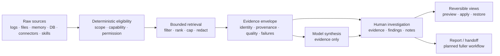

# Proven methods handbook

**Status:** first substantive handbook for issue #682. Markdown is the source of
truth. Status statements distinguish production behavior on `main` from local
integration work and future design.

## Audience and purpose

This handbook is for engineering teams that want to adapt or reimplement the
useful methods proven in ContextDesk without copying its product shape, desktop
stack, or storage layout. It focuses on the decisions that made evidence-heavy
AI workflows safer, more bounded, more inspectable, and more useful:

- retrieve and shape evidence deterministically before model synthesis;
- preserve log truth while reducing repetitive data into searchable structure;
- turn transient investigation state into durable, reversible, human-controlled
  work; and
- verify claims at the contract, core, host, UI, and packaged-product layers.

It is not an API specification, a promise that every designed feature ships, or
a replacement for the canonical architecture and feature designs. Each chapter
separates the reusable method from ContextDesk-specific production anchors and
uses the status legend below.

## Presentation and source-of-truth policy

The handbook remains reviewable Markdown in the repository. GitHub renders its
tables, links, and Mermaid diagrams as a rich HTML presentation. ContextDesk
also bundles these exact Markdown files in a separate read-only engineering
handbook window; the application does not maintain a second prose copy. A
generated static documentation site may be added later, but it must be produced
from these Markdown files and must not become an independent source of claims.

Do not add manually synchronized HTML chapters. If a future renderer cannot
represent a diagram or table, improve the generation pipeline or the Markdown
source.

## Handbook maintenance contract

The handbook is an engineering claim surface, not promotional copy. Maintain it
under these rules:

1. **Canonical source:** edit only this Markdown family for handbook content.
   Generated HTML, SVG, screenshots, and packaged views are presentations, not
   independent sources.
2. **Diagram identity:** every Mermaid block has a specific `%% title:` that
   states the relationship being shown. Adjacent prose must explain its scope
   and any shipped, partial, local, accepted, or planned boundary.
3. **Renderer fidelity:** authored diagrams use only syntax faithfully supported
   by the bundled renderer. Unsupported semantics must fail visibly; do not let
   a decorative approximation imply relationships the source does not express.
4. **Theme and nonvisual access:** generated diagrams use application theme
   tokens and retain a semantic text equivalent plus inspectable Mermaid source.
   Required operating information cannot depend on color, animation, or hover.
5. **Claim synchronization:** when a production contract, trust boundary,
   status, or residual changes, update the affected prose, status table,
   diagram, production anchor, and issue reference in the same change.
6. **Review and proof:** reviewers compare every diagram node and edge with its
   adjacent prose and cited production anchors. Run the handbook structural
   check, claims check, Markdown formatter, and link/diff checks before
   promotion.

If a useful relationship exceeds the current safe Mermaid subset, simplify the
diagram without losing the contract or improve the renderer in a separately
reviewed production change. Never encode additional behavior in a diagram that
the canonical prose does not claim.

## Status legend

| Status                | Meaning                                                                              | Evidence required                                              |
| --------------------- | ------------------------------------------------------------------------------------ | -------------------------------------------------------------- |
| **Shipped**           | Present on current `main` through a real production path                             | Production anchor plus automated or packaged-path proof        |
| **Partial**           | A useful slice ships, but named acceptance criteria or lifecycle work remains        | Shipped anchors plus explicit residual issue                   |
| **Local integration** | Implemented or verified on an unmerged integration branch only                       | Branch/commit evidence; never described as available on `main` |
| **Accepted design**   | A reviewed contract constrains implementation, but it is not itself shipped behavior | Canonical design or ADR link                                   |
| **Planned**           | Intended behavior with no complete production path                                   | Open issue/design; no shipped claim                            |

Status is scoped to the exact row. A chapter can contain shipped, partial, and
planned elements at the same time. “Tests exist” does not upgrade a local or
planned method to shipped.

## Method map

| Method                         | Primary question                                                                       | Current status                                                                                                                      | Chapter                                                                            |
| ------------------------------ | -------------------------------------------------------------------------------------- | ----------------------------------------------------------------------------------------------------------------------------------- | ---------------------------------------------------------------------------------- |
| Deterministic context assembly | What evidence is eligible, bounded, and safe to give a model?                          | **Partial**: strong linked-log and ordinary-chat isolation ship; one explicit main-chat corpus attachment is in local integration; multi-corpus and phase-aware retry work remain #693/#649 | [Deterministic context assembly](proven-methods/DETERMINISTIC_CONTEXT_ASSEMBLY.md) |
| Log evidence pipeline          | How do raw records become honest, searchable, scalable evidence?                       | **Partial**: batch single-corpus analysis ships; full timestamp policy, durable noise rules, and versioned cross-corpus application baselines remain #670/#671/#690 | [Log evidence pipeline](proven-methods/LOG_EVIDENCE_PIPELINE.md)                   |
| Operational metric alignment   | How can unlike time-series signals share log time without implying comparable values?  | **Session slice**: schema, validation, bounded renderer, fixtures, and Explorer session import/seek ship locally; durable attachment, persistence, incident bundles, and responsive docking remain #706/#707 | [Operational metric tracks](OPERATIONAL_METRIC_TRACKS.md)                         |
| Investigation loop             | How does an engineer preserve, revisit, and act on discoveries without losing control? | **Partial**: manual evidence/findings/notes and view recipes have production anchors; proposal history and reports remain #646/#532 | [Investigation loop](proven-methods/INVESTIGATION_LOOP.md)                         |
| Future method documentation    | How should another process be documented and challenged?                               | **Local integration** until this handbook is merged                                                                                 | [Method chapter template](proven-methods/METHOD_TEMPLATE.md)                       |

## From-scratch staged implementation path

The stages are deliberately ordered by trust dependency. A team can stop after
any stage and still have a coherent product; it should not add model autonomy
before the underlying evidence and permission contracts are testable.

### Stage 0 — freeze truth and authority

1. Define stable source, record, event, and citation identities.
2. Classify time, provenance, and authorship explicitly.
3. Decide which component is trusted to enforce paths, credentials, caps, and
   write permissions.
4. Separate user content, retrieved content, policy, and evaluator-only test
   truth.
5. Write hard bounds and fail-closed behavior before storage or UI code.

Exit test: malformed identities, untrusted instructions, unsupported
capabilities, and over-limit requests fail without broadening access or
fabricating evidence.

### Stage 1 — build deterministic retrieval without an LLM

1. Index allowlisted files and Markdown with bounded chunks.
2. Add durable memory with explicit provenance and redaction.
3. Add read-only database and connector adapters behind host-owned policy.
4. Return structured hits with stable identity, source, quality, and truncation
   state.
5. Make keyword retrieval always usable; treat embeddings as optional ranking.

Exit test: representative questions return inspectable evidence offline, and
every result can be reopened from its identity.

### Stage 2 — add the log evidence plane

1. Stream and redact records before persistence.
2. Parse only time evidence that can be defended; retain order-only fallbacks.
3. Store events in a scan-efficient analytical store.
4. Template repeated messages and embed templates rather than every event.
5. Add bounded filters, facets, search, timeline summaries, and keyset paging.
6. Preserve a bounded redacted original representation for fidelity checks.

Exit test: deterministic fixtures prove counts, shared instants, ambiguity,
gaps, redaction, original representation, and bidirectional navigation.

### Stage 3 — add durable investigation state

1. Save exact payload-free evidence identities.
2. Re-resolve payloads from the authoritative source for preview.
3. Add human-authored observations, inferences, hypotheses, and cited notes.
4. Persist logical view recipes separately from data payloads.
5. Preview without mutation; apply explicitly; restore the prior logical view.
6. Publish revisions atomically with optimistic concurrency.

Exit test: restart, stale evidence, duplicate actions, competing windows, and a
failed publication cannot silently corrupt or widen evidence.

### Stage 4 — add governed model synthesis

1. Classify the turn as ordinary or source-linked.
2. Compute eligible tools from scope, capability, and permission state.
3. Require deterministic grounding for source-linked answers.
4. Package bounded host-returned evidence for a tool-closed synthesis round.
5. Validate cited identities and withhold ungrounded model prose.
6. Make unavailable tools, partial retrieval, timeouts, and cancellation visible.

Exit test: a model cannot turn prose into a tool result, cannot make an
ordinary chat inherit a corpus, and cannot present an answer as grounded before
required evidence succeeds.

### Stage 5 — improve operator leverage

Add ranked finding proposals, approval history, noise policies, time-rule
previews, clock-skew diagnostics, report assembly, and richer visualizations
only after they preserve the prior stages' identity, provenance, bounds, and
human-control invariants.

## Canonical ContextDesk references

These documents remain authoritative for ContextDesk-specific architecture and
feature decisions:

- [Architecture](../ARCHITECTURE.md)
- [Capability claims](../CLAIMS.md)
- [Threat model](../THREAT_MODEL.md)
- [`cd.v1` protocol](../PROTOCOL.md)
- [Log and large-corpus analysis](LOG_ANALYSIS.md)
- [Log Investigation Workspace](LOG_EXPLORER.md)
- [Operational metric tracks](OPERATIONAL_METRIC_TRACKS.md)
- [Memory infrastructure](MEMORY.md)
- [In-app Help Center](HELP_CENTER.md)
- [External module substrate ADR](../adr/0001-external-module-substrate.md)
- [Server-authoritative sync ADR](../adr/0002-server-authoritative-sync.md)
- [Chat permission authority ADR](../adr/0003-chat-bridge-permission-authority.md)
- [Composition preview ADR](../adr/0007-composition-preview-pane.md)

Repository contribution and claim discipline are defined by
[AGENTS.md](../../AGENTS.md), [agent workflow](../AGENT_WORKFLOW.md),
[issue honesty](../ISSUE_HONESTY.md), and
[close proof](../CLOSE_PROOF.md).

## How to add a method

Start from [the method template](proven-methods/METHOD_TEMPLATE.md). A useful
chapter must:

1. name the problem and the trust boundary;
2. show inputs, outputs, stable identities, and bounds;
3. distinguish reusable algorithm from product-specific anchors;
4. enumerate recovery behavior, not only the happy path;
5. include testable invariants and a reimplementation recipe;
6. mark each meaningful capability shipped, partial, local, accepted, or
   planned; and
7. link evidence rather than copying large sections of another design.

## Known handbook residuals

This first version intentionally leaves several chapters for follow-up:

- permission mediation and UI-originated write grants;
- durable memory capture, recall, supersession, and privacy;
- bounded workspace/file indexing and hybrid retrieval;
- connector and database read isolation;
- Help corpus authoring, validation, and offline delivery;
- package/import safety and compatibility evolution;
- provider lifecycle, cancellation, and evidence-preserving retry after #649;
- timestamp policy after the remaining #670 work ships;
- report/export and proposal lifecycle after #646/#532; and
- future chapters and diagrams for the remaining methods as their contracts and
  production evidence become stable enough to document without speculation.

Those gaps do not change the status of the three methods documented here. They
are the next candidates for the template, not behavior to imply in advance.
