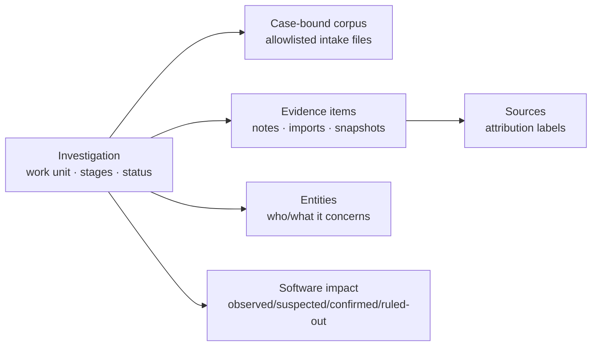

# War Room next-release review

Evidence-based architecture and usability review of the ContextDesk War Room
for real triage engineers, pinned to `origin/main`
`2abf5ef602376c97a9390866f35147ea78829711` (the qualified log-workbench
baseline). This lane does not merge or edit protected PRs, does not call
providers, LDAP, or company gateways, and uses only in-tree synthetic fixtures.

**Implemented here:** investigation-scoped software-impact records (many named
identities, four epistemic statuses, no build ordering) with Memory, SQLite,
and PostgreSQL persistence. Everything else in this document is a review of
what already ships on that pin, what other open lanes already own, and what
remains residual.

## 1. Information architecture

The War Room on this pin is the collab web workspace, not the desktop Log
Explorer. An investigation is the unit of work. It moves through Situation →
Capture → Analyze → Compare → Decide. Overview is a command center over the
same durable timeline; it is not a second store.

| Concept | Job | What it is not |
| ------- | --- | -------------- |
| Investigation | The case: title, situation prose, status (`open\|monitoring\|resolved\|archived`), participants, timeline | A log file, a source, or a model run |
| Source | Attribution: where a piece of information came from | The evidence store; not “who the case is about” |
| Entity | Reusable label for organization / customer / person / service / system / other, plus per-case involvement | An account, a directory identity, or a place to paste logs |
| Corpus | One case-bound log corpus built from committed intake files | Desktop import defaults; not a silent timezone guess |
| Evidence | Captured files, notes, imported model output, snapshots | Software-impact labels or entity profiles |
| Situation context (open PR #1093) | One descriptive product/version/build/environment/organization blob for finding the case | Many concurrent impact judgments |
| Software impact (this lane) | Many epistemic rows: this named identity is observed, suspected, confirmed, or ruled out | A build timeline or version comparator |

Stages already match mixed triage:

- **Situation** — shared picture, occurred-at vs recorded-at, entities,
  software impact (this lane).
- **Capture** — human notes, corpus intake (files/ZIP/directory), imported
  external runs, log-time review when a host pipeline is configured.
- **Analyze** — evidence board, freeze, synthetic or configured-gateway lanes.
- **Compare** — lane agreement/difference/unknown; usage and cost stay
  `unknown`.
- **Decide** — human decision, export, archive/restore of the case status.

## 2. Coverage of the eight release themes

### 1. Varied triage modes

**On this pin.** Corpus intake allowlists `.log .txt .json .csv .xml .eml .md`
and rotated `.log.N` / `.log-date` names
(`CORPUS_ALLOWED_EXTENSIONS` in `collab/contracts/src/investigation-corpus-intake.ts`).
Rejected ZIP members get an explicit reason rather than a silent drop. Human
notes and imported model output are first-class Capture records. Scenario
matrix journeys 1–4 cover ZIP, offsetless logs, `.eml`, and pasted chat
(`docs/WAR_ROOM_SCENARIO_MATRIX.md`).

**Not on this pin.** `.jsonl` / NDJSON is open PR #1091. This lane does not
touch intake classification.

### 2. Persistent corpus lifecycle vs investigation

**On this pin.** Intake commits content-addressed evidence into the case.
Log-time builds one corpus per investigation from those files. Rebuilding after
new intake is refused rather than merging, because a rebuild would discard
declarations (`docs/benchmarks/WAR_ROOM_LOG_TIME_REVIEW_V1.md`). Portable
archive export/dry-run/restore is a separate investigation-lifecycle path
(status `archived` is not the same as a portable ZIP).

**Mental model to keep teaching.** Corpus is evidence inside an investigation.
Sources are attribution. Restoring a portable archive remaps identities; it
does not become LDAP or a provider session.

### 3. Timezone review

**On this pin (Partial).** Preview → apply → clear → undo, revision + preview
fingerprint, DST gap/fold, order-only retention, no zone guess, bare
abbreviations refused except unambiguous `UTC`. UI: `LogTimeReviewPanel`.
Routes register only when `COLLAB_BRIDGE_BIN` and `COLLAB_LOG_CORPUS_ROOT` are
set; otherwise the surface is absent.

**On this pin.** The qualified baseline includes the log-time chronology
projection, named-timezone evidence preservation, and the workbench’s explicit
review state. This lane does not duplicate or alter those files.

### 4. Power-user log exploration

**On this pin.** Desktop Log Explorer remains the high-scale side-by-side
filter/correlation surface. War Room shows per-source raw vs normalized samples
in timezone review and ordinary evidence viewers, with intake caps (archive
bytes, file count, path depth, processing time).

**On this pin.** Investigation log workbench provides side-by-side views,
bounded whole-corpus search, bookmarks, saved views, timezone review, and
normalized chronology. This lane does not duplicate or alter that surface.

### 5. Structured investigation context

**On this pin.** Entities + involvement, occurred-at with honest unspecified
zones, situation prose fields.

**Open elsewhere.** PR #1093 adds one situation-context blob
(product/version/build/component/environment/organization) on the case, with
migration `020_investigation_context`.

**This lane.** Software-impact rows are the many-valued epistemic complement of
that blob. Combo-boxes suggest values from investigations the reader can
already open; any field still accepts a free-form label.

### 6. Archive/restore, tags, search/facets, affected-build impact

**On this pin.** Case status includes `archived`. Portable archive
export/apply exists as its own benchmark family. Investigation list search is
title/id/creator/participants plus status and entity filters. Experiment Lab
has its own facets; those are not investigation search.

**Not on this pin.** Investigation tags and server-side search facets are
explicitly deferred by #1093. This lane records affected-build **impact
judgments** without inventing build order, and does not add a case-list facet
over those judgments.

### 7. Provenance, cost/usage, privacy, authorization

**On this pin.** Imported runs stay unverified until a human records a
judgment. Triage usage and cost are locked to `"unknown"` in the collab
contract and UI (`TriageRunPanel`: “usage unknown · cost unknown”). Share-safe
export is deny-by-default for owner-only content. LDAP lives in admin
directory routes; the webview never receives directory passwords or raw
secrets. This lane adds no provider, LDAP, or gateway calls. Impact writes
require `investigation:write`; reads require `investigation:read` and a
visible case. Other-case identifiers 404 rather than leaking.

### 8. Deterministic synthetic scenario library

**On this pin.** Ten journeys in `collab/e2e/src/war-room/scenarios.ts`,
matrix at `docs/WAR_ROOM_SCENARIO_MATRIX.md`. None assert model quality or
provider cost. This lane does not edit the catalog (that file is in #1088).

## 3. Prioritized backlog

### P0 — keep honest on `main`

- Mixed ZIP / email / notes / imported-output intake with explicit rejects.
- Timezone preview/apply/clear/undo with no silent zone or locale guess.
- Usage/cost remain `unknown` unless a later measured contract exists.
- HardWrite/SoftWrite confirmation boundaries stay UI-originated.

### P1 — other lanes already own these; do not duplicate here

| Item | Owner | Why not this lane |
| ---- | ----- | ----------------- |
| JSONL/NDJSON corpus logs | PR #1091 | `investigation-corpus-intake.ts`, `classify.ts`, `HelpCenter.tsx` |
| Log chronology | PR #1092 | log-time routes/service, `LogChronologyPanel`, Rust CLI |
| Situation context blob | PR #1093 | `case.ts`, `Cases.tsx`, migration **020**, `HelpCenter.tsx` |
| Timezone preview copy / snapshot labels | PR #1089 | `LogTimeReviewPanel`, `TriageRunPanel` |
| Investigation tags + server facets | deferred by #1093 | would collide with case list/search |
| PostgreSQL software-impact table | this integration | migration `022_software_impact`, hosted store, and parity tests |

### P2 — later, after the P1 races clear

- War Room log workbench (#1088, draft — do not merge).
- Include software-impact rows in portable archives and activity kinds.
- Help article for software impact (`HelpCenter.tsx` is contended).
- Case-list filter over impact identities without inventing build order.
- Rebuild-or-merge policy when new logs arrive after a corpus exists.

## 4. Contract, API, and UI seams (this slice)

| Seam | Path | Notes |
| ---- | ---- | ----- |
| Contract | `collab/contracts/src/investigation-software-impact.ts` | deny-unknown; `ordering` const `"recorded_at"` |
| Schema/fixtures | `collab/contracts/schemas/investigation-software-impact.v1.json`, `fixtures/investigation-software-impact*.json` | `laterThan` fixture must fail |
| Service | `collab/server/src/modules/software-impact/` | identity key is case-insensitive join of labels, not a comparator |
| HTTP | `GET/POST /api/cases/:caseId/software-impact`, `POST .../:impactId/status`, `POST .../:impactId/release`, `GET /api/software-impact/suggestions?field=` | Caps: `investigation:read` / `investigation:write` |
| UI | `collab/web/src/SoftwareImpact.tsx` mounted from `InvestigationRecord.tsx` | Served on both SQLite and PostgreSQL; still gated by investigation visibility/capability |
| SQLite | persist key `investigation_software_impact` | Capture/restore through `persistentMemoryStore` |
| PostgreSQL | `PgSoftwareImpactStore` in `collab/server/src/index.ts` | Routes use migration `022_software_impact`; authorization still applies |

## 5. Competing open PRs — do not touch

| PR | Topic | Overlap avoided |
| -- | ----- | --------------- |
| #1093 | Structured investigation context | `case.ts`, `Cases.tsx`, `HelpCenter.tsx`, `cases.css`, migration 020, `migrate.test.ts` |
| #1092 | Log chronology | log-time, chronology panel, Rust CLI |
| #1091 | JSONL intake | corpus-intake classify, HelpCenter |
| #1089 | Snapshot labels / timezone preview copy | `LogTimeReviewPanel`, `TriageRunPanel` |
| #1088 | Log workbench (draft — do not merge) | `app.ts`/`demo.ts`/`index.ts` (additive only here), `Cases.tsx`, migration 020_workbench, `scenarios.ts` |
| #1084 | Older reconcile train | not merged; this lane branches from current `main` |

Shared barrels (`collab/contracts/src/index.ts`, `app.ts`, `demo.ts`,
`index.ts`, `sqlite.ts`) receive **additive** registration only. Unique files
in this lane are new modules, the Situation mount, tests, and these docs.

## 6. Migration and reliability risks

- **Migration ordering.** The current main already uses the 020/021 history;
  this integration adds the next migration, `022_software_impact`, without
  rewriting earlier applied versions.
- **PostgreSQL boundary.** Hosted servers use the database-backed store and
  its partial active-identity uniqueness index. Timeline/audit writes remain
  separate service operations and must stay covered by hosted qualification
  and failure-recovery tests.
- **Activity kinds.** New timeline kinds are ignored by today’s activity
  allowlist, so Overview will not show them. That is a residual, not a leak.
- **Archive gap.** Restoring a portable investigation will not restore impact
  rows until a later archive schema addition.
- **Barrel merge risk.** Additive exports next to entity/log-time registrations
  may need a one-line rebase against #1088/#1092/#1093.

## 7. Accessibility criteria (this slice)

- Status is a visible word (`Observed`, `Suspected`, `Confirmed`, `Ruled out`),
  not a color-only encoding.
- Combo-boxes use `role="combobox"`, `aria-autocomplete="list"`, a named
  `<label>` / `aria-label`, and a `<datalist>`; values remain free-form.
- Empty states use `role="status"`; save failures use `role="alert"`.
- Viewers do not see write controls.
- `prefers-reduced-motion: reduce` disables animation/transition on the panel.
- Grid collapses to one column at 680px.

## 8. Deterministic fixture plan

| Fixture | Purpose |
| ------- | ------- |
| `investigation-software-impact.valid.json` | Happy-path parser + JSON Schema |
| `investigation-software-impact.unknown-field.json` | `laterThan` must fail closed |
| Service tests | recording order, duplicate identity, release-then-re-record, suggestion isolation |
| HTTP tests | viewer 403 write, other-case 404, suggestion field isolation |
| SQLite reopen | durability of recording order across process restart |
| Component tests | combo-box typing, read-only viewer, 404 hide |

No private/customer data. Product name `Fixture Desk`, environment
`QA / us-central`, build `build-007` are synthetic.

## 9. Concise acceptance walkthrough

1. Open Situation on a synthetic investigation the operator can write.
2. Under **Affected software**, type a new product name that is not in the
   suggestion list, optional version/build, status **Confirmed**, save.
3. Record a second identity with a different version as **Ruled out**. The
   list stays in recording order; the UI states that builds are not ordered.
4. Attempt the same identity again (case-insensitive). The server answers 409
   and the UI says to change status instead of adding a duplicate.
5. Sign in as a viewer who is a participant: the rows are visible, the form is
   not.
6. Sign in as another lead: their suggestions do not include this
   investigation’s values, and fetching this case’s impact URL returns 404.
7. SQLite demo restart: both rows return in the same order.

This walkthrough does not launch a model lane and does not claim provider
success.

## 10. Why this slice is the bounded implementable cut

The eight themes are not one PR. JSONL, chronology, situation context, and the
log workbench already have open write sets. Software impact is the only
P0-adjacent gap whose unique files do not overlap those lanes, and whose
shared-file edits are additive registration. Implementing more than that here
would race protected PRs.
