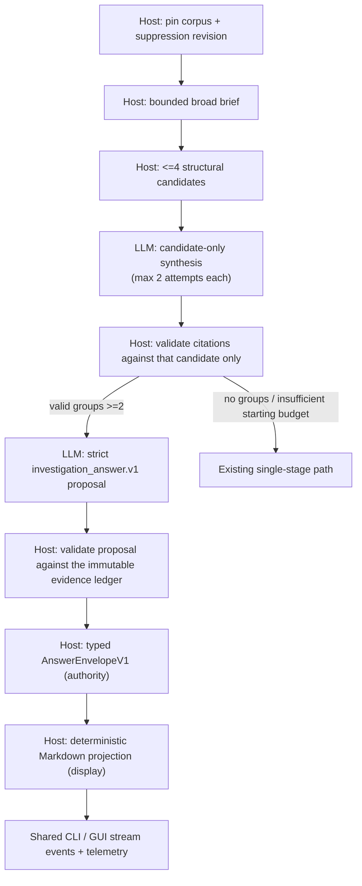

# Bounded multi-stage broad-log triage (experimental)

This is an experimental shared-core extension of deterministic broad-log
triage. It is used only when the host has produced at least two candidate
groups and the ordinary turn's provider-round and context budgets can reserve a
final comparison. Otherwise the established single-stage broad-log synthesis
continues unchanged.

## Responsibility boundary

The host alone opens the corpus, pins revisions and suppression, constructs the
bounded broad brief, and selects no more than four groups. Parser-true
cross-source trace groups rank first; ungrouped ERROR/FATAL template groups
fill remaining slots. Warning and non-error noise candidates never become
incident groups. The LLM interprets a supplied group but cannot retrieve,
create groups, or move citations between groups.

Each candidate has a stable `group_id`, a small structural brief, and its own
trusted identity ledger (`seq`, `source`, `template_id`). A candidate response
must cite an identity from its own ledger. Invalid responses receive at most
one correction attempt and are then withheld. This avoids a global evidence
set incorrectly validating a decoy's citation from another incident.

## Two contracts: authority and display

The final comparison is a **strict `contextdesk.investigation_answer.v1`
proposal**, not prose. The model supplies only `candidate_id`, `claim_id`,
`text`, and `evidence_ids`; every host-owned field — citations, claim status,
corpus, revision, session, turn — is refused on input and derived by
`validate_model_answer` against the immutable ledger for that exact turn. The
result is an `AnswerEnvelopeV1`, emitted as `StreamEvent::InvestigationAnswer`.
That envelope is the sole authority and the only persistence path.

What a person reads is a **separate, deterministic host projection**:
`render_answer_markdown` renders the validated envelope as Markdown and that
text is what the visible `TextDelta` and transcript history carry. The
projection derives citations only from `canonical_citations`, keeps candidates
and claim kinds separate, marks any claim the host did not accept, states
root-cause establishment from `root_cause_established` alone, and invents no
confidence — V1 validates none, so the output says so. It is ordered by
host-owned identifiers, so a permuted envelope renders byte-identically.
Nothing parses that Markdown back: a later turn builds a fresh ledger.

### Presentation is a trust boundary too

A validated envelope is safe as *data* and still unsafe as *markup*: the
projection interpolates dynamic strings into a document a renderer reparses.
Claim text is model-controlled, and the corpus-derived fields — identifiers,
source labels, locators, excerpts — are only ever whatever an imported log
called itself, so host-owned does not mean safe to reparse. Without a boundary
a claim can open a new line and write a second "root cause established" line, a
heading, an evidence section, or a clickable link that looks host-issued.

Every dynamic value therefore passes through
`cd_core::investigation_answer::literal_display_text` and is emitted inside a
code span. Three normalizations, all deliberate and all documented here:

1. **Line, paragraph, and column boundaries become a single space.** This is
   the load-bearing rule. Every block construct — heading, list item, table
   row, fence, block quote — and every host status line is line-anchored, so a
   value that cannot contain a line break cannot author any of them. One rule
   covers the whole class without naming a single construct.
2. **C0, C1, and DEL are removed**, which takes ESC with them, so no ANSI or
   OSC sequence (including OSC 8 hyperlinks) can reach a terminal.
3. **Bidi formatting controls are removed**, so displayed order matches byte
   order. `TerminalTextSanitizer` applies the same set to all CLI output.

A backtick becomes a straight apostrophe — the one character that could close
the surrounding span early. Everything else is preserved, including non-ASCII
letters, emoji, and combining marks: this is a control-character and
line-structure boundary, not a character allowlist. A value that normalizes to
nothing renders as the host's `(empty)` placeholder rather than an empty span.

The code span is what survives into the renderer: its content is literal by
definition, so no emphasis, link, autolink, citation chip, or HTML can form
from a dynamic value. `MarkdownBody` was extracting code spans *after* running
its emphasis, link, chip, and ` ` passes over the whole string, which meant
a code span protected nothing; it now extracts them first. The visible
backticks are part of the point: a reader can see exactly where host-owned
structure stops and quoted, untrusted content starts.

The legacy structured-triage answer contract (`observations`,
`causal_candidates`, `competing_explanations`, `confidence`,
`missing_or_next_evidence`) and its hermetic rubric still govern the
**single-stage** synthesis path, and only that path. The two contracts are kept
mechanically separate — the projection deliberately avoids the headings the
legacy parser keys on — so neither can be mistaken for the other.

## Bounds and failures

`AgentOptions.max_rounds` is the hard provider-call cap for this path. It
includes candidate attempts and the final comparison; the experimental path
never starts without room for a comparison. Candidate and final contexts use
the same headroom-aware context budget as ordinary linked synthesis. The current
implementation has an in-flight concurrency cap of one (conservative while
preserving one ordered provider trace); it is designed so a future bounded
parallel executor can raise that cap without changing the evidence contract.

Cancellation and the whole-turn deadline use the existing shared agent clock.
Every provider request still passes through the normal backend/trace observer,
so CLI and Tauri project the same events and provider telemetry. No provider is
called in tests: scripted hermetic cases cover three independent groups, a
cross-group decoy, bounded invalid retry, and total-round caps.

If groups are absent, the initial round budget is too small, or a candidate
context cannot fit, the workflow falls back before any multi-stage provider
request. Once an invalid candidate/comparison request has started, it fails
closed rather than silently mixing it into a global single-stage answer.

## Limitations

Candidate grouping is intentionally structural, not a root-cause verdict.
Cross-source trace identity is only parser-populated `trace_id`; no request,
span, or message token is promoted to a trace key. A no-trace corpus uses the
ERROR/FATAL template fallback and may not capture multi-template incidents.
The bounded sequential executor favors predictable cancellation, cost, and
telemetry over latency; live-provider quality and safe parallelism remain
separate acceptance work.
