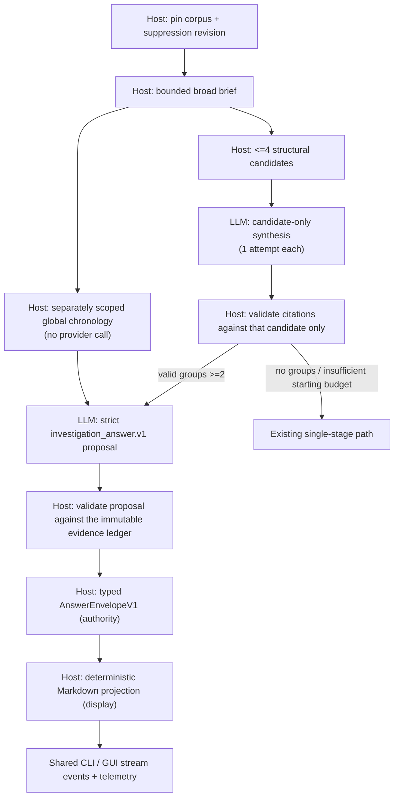

# Bounded multi-stage broad-log triage (experimental)

This is an experimental shared-core extension of deterministic broad-log
triage. It is used only when the host has produced at least two candidate
groups and the ordinary turn's provider-round and context budgets can reserve a
final comparison. Otherwise the established single-stage broad-log synthesis
continues unchanged.

### Multi-stage budget policy (`contextdesk.multi_stage_budget.v2`)

Issue **#869**. The host admits each candidate investigation only when the
**monotonic whole-turn deadline** and **provider-round ceiling** still leave a
protected final-comparison reserve. Admission is provider-agnostic (no model
names). Policy identity:
`cd_core::multi_stage_budget::MULTI_STAGE_BUDGET_POLICY_V2`.

- **Time reserve:** half the whole turn (see `synthesis_reserve`). Under the
  default 180-second managed-provider ceiling this protects 90 seconds for
  final comparison.
  This v2 floor follows live evidence that a compatibility-qualified model
  needed 63 seconds for final comparison on a real 33,723-event corpus, making
  v1's 30-second reserve and the former 120-second adaptive ceiling too small
  for ordinary latency variance. Explicit user ceilings remain authoritative.
- **Round reserve:** one provider round held for final comparison.
- **Candidate operation cap:** `min(phase_cap, remaining_total − time_reserve)`
  so a slow or verbose candidate cannot spend the protected budget.
- **Early stop:** when another candidate would violate the reserve, completed
  drafts are kept; comparison runs if at least two drafts remain, else the
  path emits a typed budget stop with an honest reason (not a validation error
  or silent success). A true whole-turn expiry remains a deadline and preserves
  the established synthesis-retry affordance.
- **Candidate isolation:** a candidate response that fails its scoped contract
  never enters the final ledger. The host records its group and a content-free
  validation category, then compares the remaining validated drafts when at
  least two remain. With fewer than two, synthesis fails closed. This preserves
  useful partial results without widening citation authority.
- **Compatibility:** an orchestration timeout or reserve stop does **not**
  clear measured model readiness. Compatibility probes and quality/orchestration
  evidence remain separate classes.
- **Progress:** candidate index/count, comparison start/finish, and admission
  skips emit `StreamEvent::MultiModelStage` from the same core loop; CLI text,
  JSONL, Desktop, linked chat, and activity tracing all project that event
  through `progress_for_stream_event`.

## Responsibility boundary

The host alone opens the corpus, pins revisions and suppression, constructs the
bounded broad brief, and selects no more than four groups. Parser-true
cross-source trace groups rank first; ungrouped ERROR/FATAL template groups
fill remaining slots. Warning and non-error noise candidates never become
incident groups. A template made entirely of generalized placeholders stays in
deterministic evidence instead of consuming a staged call, even when retained
correlation labels it as a rendering lead; under the global candidate cap it
cannot crowd out an explicit failure pattern. The LLM interprets a supplied
group but cannot retrieve, create groups, or move citations between groups.

Each candidate has a stable `group_id`, a small structural brief, and its own
trusted identity ledger (`seq`, `source`, `template_id`). A candidate response
must cite an identity from its own ledger. Each candidate receives one attempt;
an invalid response is withheld. This avoids a global evidence set incorrectly
validating a decoy's citation from another incident. Each identity also carries
the same redacted, single-line bounded template pattern the candidate model
evaluated. That excerpt is bound into the immutable ledger and canonical
display, so a valid answer never renders candidate citations as content-free
IDs. It does not grant causal authority and does not expand the content-free
final-answer manifest.

The host also prepares a separately scoped `global_timeline_context` for the
final comparison. It is explicitly a corpus chronology, not an incident or a
correlation verdict, and consumes no candidate/provider round. When the pinned
unsuppressed corpus has at most 32 events, it retains every non-candidate row.
For larger corpora it discloses partial selection and retains stable sequence
endpoints plus fairly interleaved sequence neighbors around admitted candidate
anchors. Candidate-owned identities are excluded, the active suppression lens
is applied, rows remain bound to the same corpus revisions, and the true tail
uses the signed database sequence ceiling. The model-facing block says that
overlapping unrelated processes may be present and that order or adjacency is
not causal evidence.

Persisted structural support (`Caused by:`, `Suppressed:`, stack frames, and
wrappers) stays in the deterministic brief and trusted global evidence channel
but does not consume a separate candidate round. The classifier recognizes
those markers after bounded level, stream, thread, logger, wildcard, or single
service-token envelopes. A typed exception header that merely mentions a cause
marker later remains a lead. This rule is structural and vocabulary-neutral;
raw ERROR volume cannot promote support into an incident candidate.

## Two contracts: authority and display

The final comparison is a **strict `contextdesk.investigation_answer.v1`
proposal**, not prose. The model supplies only `candidate_id`, `claim_id`,
`text`, and `evidence_ids`; every host-owned field — citations, claim status,
corpus, revision, session, turn — is refused on input and derived by
`validate_model_answer` against the immutable ledger for that exact turn. The
result is an `AnswerEnvelopeV1`, emitted as `StreamEvent::InvestigationAnswer`.
That envelope is the sole authority and the only persistence path.

Before the initial final-comparison request, the host derives a **content-free
final-answer manifest** from that same immutable ledger. It lists every
required `candidate_id` exactly once and, beneath it, the exact `evidence_ids`
the validator permits for that candidate. It contains no source label,
locator, excerpt, corpus/revision, role, canonical citation, binding, or
digest. The initial prompt requires every manifest candidate exactly once and
candidate-scoped citations only. If the strict validator rejects that proposal,
the one semantic correction repeats the same bounded contract, user question,
candidate drafts, and unchanged manifest, plus only the stable validation
category (for example `wrong_scope`) and a fixed, content-free host-authored
repair instruction for that category. It never replays the rejected proposal
or adds raw log/source/locator data, binding/digest, provider errors, or any
other host-owned envelope data. The initial and correction prompts also carry
an exact content-free output scaffold derived from the manifest. The contract
requires globally unique claim ids, candidate-scoped evidence ids, and a single
bare JSON object; parsing remains strict. In other words, correction repeats
the same bounded initial-comparison context rather than adding or subtracting
evidence. The manifest remains the only permitted final `evidence_id` boundary,
and the validator remains the authority. The manifest and scaffold are included
in the same context estimate and hard packing gate as every other
final-comparison message. This improves provider interoperability without
weakening parsing, schema, unknown-id, cross-candidate, or host-authority checks.
The comparison contract explicitly says the identifier-only manifest is not
evidence absence: candidate drafts summarize evidence already evaluated, and a
model must not invent a "content unavailable" limitation merely because raw
candidate briefs are intentionally not replayed across scopes.

If global chronology exists, its stable candidate id and permitted evidence ids
enter that same immutable ledger and manifest under their own scope. Redacted,
single-line bounded excerpts enter the ledger's canonical citation content and
the final prompt inside the nonce-bound untrusted-data wrapper. They can never
be cited by an ERROR/template candidate, and candidate evidence can never be
cited by the global context. The wrapper is minted once before the initial
comparison and the exact bytes are replayed on semantic correction; a retry
adds no evidence or newly shaped data boundary. Every global row has
`EvidenceRole::Neutral`: configuration, repair, recovery, or explicit mechanism
wording is model-interpreted content, never host causal authority.

What a person reads is a **separate, deterministic host projection**:
`render_answer_markdown` renders the validated envelope as Markdown and that
text is what the visible `TextDelta` and transcript history carry. The
projection derives citations only from `canonical_citations`, keeps candidates
and claim kinds separate, marks any claim the host did not accept, states
root-cause establishment from `root_cause_established` alone, and invents no
confidence — V1 validates none, so the output says so. It is ordered by
host-owned identifiers, so a permuted envelope renders byte-identically.
Nothing parses that Markdown back: a later turn builds a fresh ledger.

### Presentation is a trust boundary too

A validated envelope is safe as *data* and still unsafe as *markup*: the
projection interpolates dynamic strings into a document a renderer reparses.
Claim text is model-controlled, and the corpus-derived fields — identifiers,
source labels, locators, excerpts — are only ever whatever an imported log
called itself, so host-owned does not mean safe to reparse. Without a boundary
a claim can open a new line and write a second "root cause established" line, a
heading, an evidence section, or a clickable link that looks host-issued.

Every dynamic value therefore passes through
`cd_core::investigation_answer::literal_display_text` and is emitted inside a
code span. Three normalizations, all deliberate and all documented here:

1. **Line, paragraph, and column boundaries become a single space.** This is
   the load-bearing rule. Every block construct — heading, list item, table
   row, fence, block quote — and every host status line is line-anchored, so a
   value that cannot contain a line break cannot author any of them. One rule
   covers the whole class without naming a single construct.
2. **C0, C1, and DEL are removed**, which takes ESC with them, so no ANSI or
   OSC sequence (including OSC 8 hyperlinks) can reach a terminal.
3. **Bidi formatting controls are removed**, so displayed order matches byte
   order. `TerminalTextSanitizer` applies the same set to all CLI output.

A backtick becomes a straight apostrophe — the one character that could close
the surrounding span early. Everything else is preserved, including non-ASCII
letters, emoji, and combining marks: this is a control-character and
line-structure boundary, not a character allowlist. A value that normalizes to
nothing renders as the host's `(empty)` placeholder rather than an empty span.

The code span is what survives into the renderer: its content is literal by
definition, so no emphasis, link, autolink, citation chip, or HTML can form
from a dynamic value. `MarkdownBody` was extracting code spans *after* running
its emphasis, link, chip, and ` ` passes over the whole string, which meant
a code span protected nothing; it now extracts them first. The visible
backticks are part of the point: a reader can see exactly where host-owned
structure stops and quoted, untrusted content starts.

The legacy structured-triage answer contract (`observations`,
`causal_candidates`, `competing_explanations`, `confidence`,
`missing_or_next_evidence`) and its hermetic rubric still govern the
**single-stage** synthesis path, and only that path. The two contracts are kept
mechanically separate — the projection deliberately avoids the headings the
legacy parser keys on — so neither can be mistaken for the other.

## Causal vocabulary is never host authority

The host verifies identities, scopes, and typed roles — it never infers causal
semantics from corpus wording. An earlier single-model guard that recognized
literal coverage-gap/symptom phrases in bounded evidence (and rewrote
overclaiming answers into a host-authored `Cause not established:`) was
removed as fixture-vocabulary coupling: it only fired on the frozen lab's
phrasing, and untrusted log text could steer it. Whether evidence establishes
a mechanism is model judgment under the synthesis contract; typed
establishment remains host-only via `EvidenceRole::Cause` provenance and
role-withhold, which no production path assigns from text. The
vocabulary-generalization gates (`vocab_generalization_gates.rs`) hold this
boundary: shipped outcomes must be invariant under unseen corpus renames, and
production prompt/ranking sources must not contain fixture lexicon or alias
tables. See [`docs/design/VOCAB_AGNOSTIC_KNOWN_ROOT.md`](../VOCAB_AGNOSTIC_KNOWN_ROOT.md).

## Bounds and failures

`AgentOptions.max_rounds` is the hard provider-call cap for this path. It
includes candidate attempts and the final comparison; the experimental path
never starts without room for a comparison. A round is counted immediately
before `complete_streaming` is issued, so failed, timed-out, and cancelled calls
consume the same logical round as successful calls. Transport-library retries
remain below that boundary. Candidate and final contexts use the same
headroom-aware context budget as ordinary linked synthesis. Candidate responses
are capped at 4,000 characters before validation and accepted drafts at 2,000;
final comparison proposals are capped at 32,000 characters before strict JSON
parsing. The caps apply to both individual streaming chunks and buffered
completion content. An over-cap response is rejected rather than validated as
a truncated prefix, so discarded trailing text cannot turn a nonconforming
response into an accepted one. The current implementation has an in-flight
concurrency cap of one (conservative while preserving one ordered provider
trace); it is designed so a future bounded parallel executor can raise that cap
without changing the evidence contract.

The global chronology consumes context budget but no provider round. Its
manifest, excerpts, untrusted-data wrapper, and output scaffold are included in
the same preflight packing check as candidate drafts; an oversized comparison
emits a typed budget stop before the final provider request if candidate calls
were already issued. Preflight failures discovered before any multi-stage
provider call may still use the established single-stage path.

Cancellation and the whole-turn deadline use the existing shared agent clock.
Every provider request still passes through the normal backend/trace observer,
so CLI and Tauri project the same events and provider telemetry. No provider is
called in tests: scripted hermetic cases cover three independent groups, a
cross-group decoy, bounded invalid retry, and total-round caps.

Stage callbacks enter the shared event collector immediately. Investigator,
reviewer, and synthesizer `MultiModelStage` events are therefore live while a
provider stage is pending, rather than buffered until the whole pipeline
returns. Core's shared `TurnProgress` projection gives normal CLI text, JSONL,
and desktop IPC the same concise labels and host-measured elapsed clock; opaque
candidate ids and scrubbed bounded detail stay behind expandable diagnostics.

If groups are absent, the initial round budget is too small, or a candidate
context cannot fit, the workflow falls back before any multi-stage provider
request. An invalid candidate is excluded from the immutable evidence ledger;
comparison may continue only with at least two independently validated drafts,
and typed diagnostics report the rejected group. Fewer than two validated
drafts, or an invalid final comparison after its bounded semantic correction,
fails closed rather than silently mixing unvalidated content into a global
single-stage answer.

## Host-grounded fast triage (`cd_core::fast_triage`)

The preserved Vercel research recorded something narrower than "fast models are
bad at this". The exact configured model qualified for ordinary generation,
prompted JSON, native tool calls, tool-result continuation, streaming, and
cancellation — so its product failures were **not** transport failures. What it
did instead was withhold the true initiating cause, promote a downstream failure
into a cause, or promote an independent telemetry finding into the main chain.
The same model answered a direct, **complete-timeline** request correctly.

The difference was evidence handoff, not intelligence. Candidate-local final
synthesis never received enough of the picture; a complete host-prepared
timeline did. So this route changes the handoff and then checks the result. It
reuses the same deterministic retrieval, evidence ledger, deduplication,
chronology, candidate grouping, and separately scoped linked timeline described
above — it adds no second assembler, no second HTTP client, and no second
truth or scoring engine.

### Selected by evidence, never by a name

The route runs only when a persisted record matches this turn's exact
`(profile_id, model_id, workflow_contract, contract_fingerprint)` and records a
measured pass. A model *name* never selects it, a gateway URL never selects it,
and evidence measured for a different workflow contract never transfers into it.
The record type has no field able to express a base URL, endpoint, credential,
or provider kind, so no code path can consult one.

The contract fingerprint hashes the system contract, the answer schema, the
packet schema, and the complete ordered validator vocabulary. Change any of
them and previously measured evidence no longer describes what the build would
run, so the record is reported stale rather than honoured. Every non-selection
names its own reason (`route_disabled`, `turn_identity_unknown`,
`no_record_for_profile_model`, `workflow_contract_mismatch`,
`verdict_not_qualified`, `contract_fingerprint_stale`) and the established path
runs unchanged.

### The complete packet, and the bounded neighborhood inside it

The packet is the whole permitted evidence set in one bounded request: every
candidate group plus the host-owned chronology, each row printed with its
literal host evidence id, its host role from a fixed vocabulary
(`initiating_cause`, `downstream_symptom`, `supporting_evidence`,
`unclassified`), its host scope, and its host chronology ordinal. Every dynamic
value passes the shared `literal_span` presentation boundary, and the body is
fenced once in a nonce-bound untrusted-data envelope.

Rows also carry a **context category** describing the host-assembled
neighborhood. This is a classification of what
`broad_triage_comparison_context` already selected and already bounded (±2
sequence neighbors around each candidate's first and last row, endpoint rows,
32-row cap) — not a parallel assembler and not new retrieval:

| Context category | What the host proves | Where it comes from |
| --- | --- | --- |
| `focus` | the host's own candidate selection | candidate groups |
| `preceding_same_source` | same source, earlier, inside the bounded window | existing neighbor window |
| `following_same_source` | same source, later, inside the bounded window | existing neighbor window |
| `cross_source_temporal` | a different source, admitted **only** under resolved comparable clocks | existing neighbor window + time-quality verdict |
| `trace_linked` | a host-computed trace/request correlation | trace-correlation grouping |
| `propagation` | trace-linked, different source, strictly later | trace grouping + ordinals |
| `independent_noise` | separately scoped chronology, or a row a bound or the clock gate withheld | `global_timeline_context` |

A preceding configuration or deployment change lands in
`preceding_same_source`, and a rollback or recovery lands in
`following_same_source` — as *positions*. The host marks where a row sits; it
never asserts that a row **is** a configuration change or a repair, because it
cannot prove that from position.

Three rules are enforced rather than requested. Adjacency and co-occurrence
never establish correlation or causality — no category can express "because".
Records the host did not resolve to comparable clocks are never compared as
wall-clock events: `TimeQuality::Mixed` is deliberately *not* comparable, the
default is fail-closed, and a withheld cross-source reading is counted in
telemetry rather than silently applied. And expansion is never unbounded: radius
and row caps are the host's own, truncation is deterministic by
`(distance, ordinal, evidence_id)`, and what falls outside a cap is reported.

The packet carries its own identity, a digest over the binding, ledger digest,
every row's id/candidate/role/scope/category/ordinal, the clock verdict, and the
neighborhood budget. That is what makes "the *unchanged* host packet was
escalated" a checkable fact instead of a claim.

### Typed-only parsing, then local validation

Only explicitly typed output is parsed, through the same shared normalizer the
multi-stage path uses. Visible answer, reasoning, tool calls, terminal state,
and errors stay separate channels; reasoning has no accessor and no `Debug`
projection, so it is structurally unable to reach a renderer or a log line.
Malformed prose is never guessed into a pass, and a reasoning-only terminal is
an empty terminal, not an answer.

Validation is `validate_model_answer` — unchanged authority — plus the stricter
requirements that belong to this contract: an unsupported root, a host-labelled
symptom promoted into either causal section, chronology evidence pulled into a
causal chain, an inverted cause/symptom order, missing host role coverage, one
id held in two conflicting roles, a candidate left with no grounded claim, and a
packet identity that no longer holds.

Where the host holds **no** role evidence, role checks abstain and telemetry
reports `role_evidence: host_neutral` rather than implying a pass. That is the
honest state for the current production seam: multi-stage roles come from the
candidate-stage model's classification, and this route has no candidate stage.
Inventing a role from structure — earliest-is-cause, loudest-is-cause — is
exactly what `triage_quality`'s mutations treat as a failure. The structural
checks (scope isolation, chronology, contradictions, citation completeness, and
the unsupported-root gate) still apply in full.

### One correction, one escalation, then honesty

A rejected proposal earns exactly one bounded correction, written by the host
for one stable validator category. The rejected proposal is never replayed as
truth, and every other authorized input is repeated byte-for-byte — same
contract, same question, same packet, same envelope nonce. The cap is clamped in
code, not read from config.

The outcome is typed: a verified fast answer, an honest partial/inconclusive
result, or an escalation request carrying the **unchanged** packet and the
failure categories. When an explicitly configured *and* explicitly authorized
fallback exists, the route performs exactly one visible escalation with the
byte-identical packet and the host's category instruction; a failed escalation
ends the run rather than looping or correcting again. A configured-but-
unauthorized fallback is reported and never called, and a fallback backend
without configuration can never be reached — a spare handle is not
authorization, and a profile or gateway change requires host config.

Telemetry is share-safe by shape: no field can hold a prompt, an evidence
excerpt, a rejected proposal, reasoning text, an endpoint, a credential, a
username, or a path. Reasoning appears only as presence and length. The same
value drives the activity stream, so an operator reads what telemetry recorded.

## Limitations

Candidate grouping is intentionally structural, not a root-cause verdict.
Cross-source trace identity is only parser-populated `trace_id`; no request,
span, or message token is promoted to a trace key. A no-trace corpus uses the
ERROR/FATAL template fallback and may not capture multi-template incidents.
The final typed ledger now preserves a bounded separately scoped global
chronology, so small-corpus WARN/INFO state transitions such as deployment,
rollback, restoration, and recovery can reach final comparison with canonical
citations. It does not certify that global rows belong to any candidate
incident. V1 still has no host-validated cross-candidate causal-chain section,
and every production row on this path remains `Neutral`, so an initiating-cause
proposal is withheld and `root_cause_established` remains false. Live raw-prompt
experiments showed why prompt pressure is not a substitute: a model can transfer
a fact into claim text while citing an in-scope row that does not entail it, and
the V1 validator checks identity/scope rather than semantic entailment.
Cross-candidate causal synthesis therefore needs a later typed comparison
contract or semantic claim-evidence validator, not citation transfer between
existing candidates. Embedding or reranking can improve which evidence reaches
a bounded context, but cannot itself grant causal authority.
The bounded sequential executor favors predictable cancellation, cost, and
telemetry over latency; live-provider quality and safe parallelism remain
separate acceptance work.

The fast-triage route's usefulness is **not** demonstrated by this work. Every
test in `crates/cd-core/tests/fast_triage_production_path.rs` is hermetic and
scripted: they prove the host catches the recorded failure shapes, bounds the
correction and the escalation, preserves packet identity, and keeps telemetry
share-safe. They say nothing about whether any live model produces a good
answer. Recording a `qualified` route record for a real `(profile, model)` pair
requires the live measurement described above, repeated, against the exact
gateway — and "inconclusive" is not "pass". In the current production seam the
packet is `host_neutral`, so role-coverage and symptom-promotion checks have
nothing to assert there; they become load-bearing for a host that supplies role
labels.

The response caps above bound what the multi-stage executor accumulates from
callbacks and retains or validates from a returned completion. Some provider
clients still assemble their own complete response before returning it; a
transport-wide response ceiling is shared client hardening outside issue #869,
not an end-to-end memory-bound claim made by this policy.
