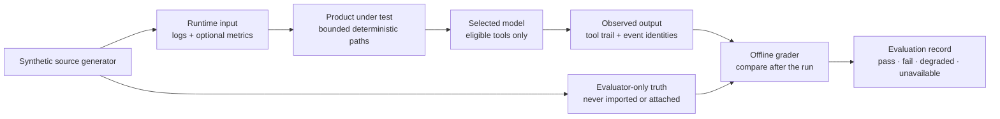

# Deterministic demo and model evaluation lab

**Method status:** **Partial.** ContextDesk ships deterministic synthetic
fixtures, a reproducible scale generator, bounded Log Explorer workflows,
ordinary-versus-linked chat isolation, required linked-log grounding, and
optional session-only operational metric tracks. A real provider comparison
still depends on the selected model and a tools-enabled profile. The bundled
chapter, its read-only in-app route, and complete Markdown/HTML export are
shipped; #719 retains the current-main proof record.

The quick in-app procedure remains
[Try the demo log datasets](../../help/log-analysis/demo-datasets.md). This
chapter is the deeper engineering method: how to run, grade, transfer, and
reimplement a deterministic product/model evaluation without leaking the
answer key into the system under test.

The accepted design for separating compatibility, retrieval, answer, and
multi-model orchestration evidence is
[`QUALITY_EVAL_HARNESS.md`](../../benchmarks/QUALITY_EVAL_HARNESS.md). Its
quality-run implementation is planned, not shipped.

## 1. Problem

A convincing demo is not proof that a log investigation product or model works.
Without a deterministic lab, teams can:

- import the wrong directory and unknowingly mix input with evaluator notes;
- accept plausible prose even though no log tool ran;
- compare providers using different evidence, prompts, or product builds;
- overlook ordinary-chat context leakage;
- turn one machine's timing into a product guarantee;
- publish screenshots containing private model inventories or log content; and
- copy a reference stack without preserving the contracts that made it safe.

The method separates a **runtime lane** containing only synthetic input from an
**evaluator lane** containing expected counts and conclusions. It evaluates
deterministic product behavior first, then model behavior, and accepts a model
claim only when cited event identities and visible successful tool results
support it.

Out of scope:

- treating fixture conclusions as instructions to the model;
- requiring exact model prose;
- claiming one provider, framework, store, or desktop shell is universally
  preferred;
- benchmarking real company data through public screenshots or issue comments;
- claiming planned ContextDesk features ship; and
- making a live provider part of the default offline test suite.

## 2. Status and evidence

| Capability | Status | Evidence | Residual |
| --- | --- | --- | --- |
| Compact deterministic incident | **Shipped** | [`checkout-cascade`](../../../fixtures/log-lab/scenarios/checkout-cascade/) and `log_lab_checkout_directory_zip_query_bookmark_and_package_round_trip` in [`log_lab.rs`](../../../crates/cd-core/tests/log_lab.rs) | Live model quality varies |
| Pinned seven-day 25k corpus | **Shipped** | [fixture README](../../../fixtures/log-lab/README.md) and `pinned_seven_day_acceptance_corpus_matches_generator_and_truth` in [`log_lab_fixtures.rs`](../../../crates/cd-core/tests/log_lab_fixtures.rs) | None for pinned fixture identity |
| Optional first-run 25k install | **Local integration** | #732 packages only the 25k `import/` tree and delegates to ordinary bounded ingest with a managed idempotency marker | Exact packaged/native proof remains before promotion |
| Generated seven-day 100k corpus | **Shipped** | [`generate_log_lab.rs`](../../../crates/cd-core/examples/generate_log_lab.rs) and ignored product-path test in [`log_lab.rs`](../../../crates/cd-core/tests/log_lab.rs) | Output is generated locally, not checked in |
| Generated error-heavy 250k triage corpus | **Local integration** | #745 `triage-stress` generator, exact truth contract, minimum product-path test, and ignored literal 250k proof | Bulk output stays local; live linked-chat quality remains provider/build-specific |
| Optional aligned metric document | **Shipped** | [`operational-metrics.v1.json`](../../../fixtures/log-lab/acceptance/seven-day-25k/scenarios/behavior-scale/metrics/operational-metrics.v1.json) and [metric-track design](../OPERATIONAL_METRIC_TRACKS.md) | One durable corpus attachment ships; multiple/bundle attachment and governed metric chat context remain residual |
| Exact Find, Filter, bookmark, and evidence workflow | **Partial** | [Log Explorer Help](../../help/log-analysis/log-explorer.md) and [investigation method](INVESTIGATION_LOOP.md) | Remaining packaged acceptance and proposal/report work are tracked by #656/#646/#532 |
| Ordinary chat isolation | **Shipped** | [`agent.rs`](../../../crates/cd-core/src/agent.rs) and [context assembly method](DETERMINISTIC_CONTEXT_ASSEMBLY.md) | Repeat native proof per supported host |
| Tools-disabled linked-chat refusal | **Shipped** | [`research.rs`](../../../crates/cd-core/src/research.rs) | Cannot pass a grounded linked-log evaluation |
| Tools-enabled provider/model evaluation | **Partial** | Bounded tool loop and evidence validation ship in [`agent.rs`](../../../crates/cd-core/src/agent.rs) | Requires a real tools-enabled profile; provider quality is environment-dependent |
| Collaborative Experiment Lab qualification | **Local integration** | Hermetic `npm run qualify` on current case/experiment seams with fake host lanes and share-safe export ([qualification doc](../../testing/COLLAB_RELEASE_QUALIFICATION_CURRENT_ARCH_V1.md)) | Live collab host connectors remain skipped with an explicit reason; collab does not import `cd-workflow` |
| Role-specific provider/model compatibility qualification | **Local integration** | Shared evidence projection in [`capability_qualification.rs`](../../../crates/cd-core/src/capability_qualification.rs), live adapters in [`capability_qualification.rs`](../../../crates/cd-workflow/src/capability_qualification.rs), dialect-honest multi-mode ladder, transport-protocol identity, exact-mode+dialect authorization and readiness (schema v4; [chat contract](../../testing/OPENAI_CHAT_CONTRACT_V2.md)), and GUI/CLI `Discover → Verify → Choose` surfaces | Hermetic protocol/kind isolation, mode honesty, and fail-closed probes are proven; live gateway support and ordinary chat/attachment/multimodal quality require distinct evidence |
| Quick in-app demo guide | **Local integration** | [demo Help page](../../help/log-analysis/demo-datasets.md), explicit fenced-command copy, and #732 optional first-run 25k install | Other fixtures and optional metrics remain source-checkout inputs |
| Deep in-app handbook chapter/export | **Shipped** | This chapter, [`handbook.rs`](../../../desktop/src-tauri/src/handbook.rs), current-main proof on #719 | Live provider evaluation remains environment-dependent |

Status applies to each row, not to the lab as one undifferentiated feature.
Tests prove a named production path only when that path is on `main`. Feature
branches use **Local integration** without embedding a future merge event into
the permanent exported prose.

## 3. Reusable method

The portable method is:

1. freeze the build, fixture identity, provider profile, and privacy boundary;
2. import only runtime input and verify deterministic counts before analysis;
3. exercise deterministic search, navigation, and persistence without a model;
4. run ordinary-chat isolation and capability checks;
5. run linked-chat prompts without evaluator truth;
6. retain the visible tool trail and cited stable identities;
7. grade after completion against evaluator-only truth; and
8. record pass, fail, degraded, or unavailable separately.



The diagram's two incoming paths to the grader are the central trust boundary.
Runtime input can reach the product and model. Evaluator truth can reach only
the human or offline grader after the run. The grader must never feed expected
conclusions back into chat context.

### Portable invariants versus reference choices

| Concern | Stack-independent invariant or contract | ContextDesk reference choice | Plausible alternatives |
| --- | --- | --- | --- |
| Fixture identity | Same version/seed/controls produce byte-identical input or an explicit version change | Rust generator plus checked-in JSON truth manifests | Python/Go generator, container image, immutable object-store fixture |
| Event identity | Every material model claim resolves to a stable source record | Corpus id + event `seq` + relative source | ULID, database primary key, content-addressed id plus source version |
| Runtime/truth split | Answer keys are outside every imported, indexed, attached, or prompted root | Sibling `import/`, `metrics/`, and `truth/` directories | Separate repository, evaluator service, CI secret artifact |
| Retrieval authority | Trusted code owns eligibility, caps, execution, and result status | Rust host and native tool loop | Server policy service, sidecar broker, browser worker with server enforcement |
| Store | Paging and queries are bounded and preserve provenance | DuckDB analytical corpus | SQLite, ClickHouse, Elasticsearch/OpenSearch, Parquet/DataFusion, Postgres |
| UI | Evidence, failures, and proposed view changes remain inspectable and reversible | React/Tauri Log Explorer | Web app, Electron, Qt, native Swift/Kotlin, terminal UI |
| Deployment | Privacy/egress rules are explicit for the actual topology | Local desktop with local or remote provider | Browser/server, air-gapped workstation, VDI, multi-tenant service |
| Model | Same evidence bar applies regardless of provider size or location | Configured provider profile with capability metadata | Self-hosted OpenAI-compatible endpoint, managed provider, no-model workflow |

The existing [context assembly](DETERMINISTIC_CONTEXT_ASSEMBLY.md),
[log evidence pipeline](LOG_EVIDENCE_PIPELINE.md), and
[investigation loop](INVESTIGATION_LOOP.md) chapters define those contracts in
detail. This chapter composes them into an evaluation; it does not duplicate or
weaken them.

## 4. Inputs, outputs, and data contracts

### Dataset catalog

All paths are relative to the repository root.

| Dataset | Runtime input path | Expected deterministic result | Evaluator-only path |
| --- | --- | --- | --- |
| Compact incident | `fixtures/log-lab/scenarios/checkout-cascade/import/` | 35 events; 6 files; 6,247 source bytes; 16 INFO, 12 WARN, 7 ERROR; wall clock | `fixtures/log-lab/scenarios/checkout-cascade/truth/manifest.json` |
| Pinned seven-day 25k | `fixtures/log-lab/acceptance/seven-day-25k/scenarios/behavior-scale/import/` | 25,000 events; 10 files; 4,201,281 source bytes; 23,984 INFO, 458 DEBUG, 394 WARN, 164 ERROR; exact seven-day wall span | `fixtures/log-lab/acceptance/seven-day-25k/scenarios/behavior-scale/truth/manifest.json` |
| Generated seven-day 100k | `target/contextdesk-demo-lab/seven-day-100k/scenarios/behavior-scale/import/` after generation | Exactly 100,000 requested events; generated manifest/console output is authoritative for files, bytes, severities, and hash | `target/contextdesk-demo-lab/seven-day-100k/scenarios/behavior-scale/truth/manifest.json` |
| Generated triage-stress 250k | `target/contextdesk-demo-lab/triage-stress-250k/scenarios/triage-stress/import/` after generation | 250,000 events; 12 files; 63,883,809 source bytes; 160,000 INFO, 7,500 DEBUG, 37,500 WARN, 45,000 ERROR; 650 generator families → 648 parser templates; wall clock | `target/contextdesk-demo-lab/triage-stress-250k/scenarios/triage-stress/truth/manifest.json` |
| Operational metrics | `fixtures/log-lab/acceptance/seven-day-25k/scenarios/behavior-scale/metrics/operational-metrics.v1.json` | 3 wall-clock series over the full seven-day span; CPU 673 points at 16–98%, heap 668 points at 316,800,000–952,000,000 bytes with one explicit collector gap, clients 673 points at 12–180 | Sibling `truth/metric-correlations.v1.json` |

The 100k and 250k generators are checked in; their generated outputs are
intentionally not. `target/` is ignored by Git, and the generator requires its
output directory to be absent or empty. Never present a locally generated hash
as the identity of the pinned 25k fixture.

### Evaluation input

| Field | Type or shape | Required | Validation |
| --- | --- | :---: | --- |
| Build identity | Commit SHA + dev/packaged mode | yes | Resolve before the run; do not use a floating label |
| Dataset identity | Scenario version, seed, import root, hash where pinned | yes | Runtime root must not contain `truth/` |
| Provider profile | Provider, model, capability flags, endpoint locality | for model run | Record without publishing private inventory or host |
| Prompt id/text | Versioned text with placeholders resolved | for model run | Must contain no evaluator conclusion |
| Product state | Filters, lanes, range, selected identities, chat binding | yes | Capture as bounded logical state |
| Budgets | Import/query/tool-round/deadline/context caps | yes | Use actual configured values |
| Privacy policy | Allowed input, egress, screenshot, retention rules | yes | Human approval before company-data use |

### Evaluation output

| Field | Meaning | Bounded by | Provenance |
| --- | --- | --- | --- |
| Deterministic result | Counts, query hits, navigation target, persisted identity | Product/query caps | Host/core result |
| Tool outcome | Offered tool, validated arguments, status, cap/truncation | Tool contract | Trusted host trail |
| Evidence citation | Stable event/source identity supporting one claim | Result count and context budget | Structured tool result |
| Model answer | Synthesis, not evidence | Context/deadline/output caps | Provider/model |
| Grade | Pass/fail/degraded/unavailable per criterion | Versioned rubric | Human or offline grader |
| Performance record | Machine/build/corpus/timing/resource observations | Run scope | Named machine and run |

Evaluation records must not serialize credentials, private provider hosts,
company payloads, private absolute paths, complete model inventories, or
evaluator truth into a runtime transcript.

## 5. Invariants and trust boundaries

- **Runtime input only:** import an `import/` directory. Load the one named
  metric document explicitly. Never import or attach a scenario parent.
- **Evaluator isolation:** `truth/` is available to the grader only after the
  model turn and product interactions finish.
- **No ambient corpus:** an ordinary chat has no log corpus merely because an
  Explorer is open.
- **Capability honesty:** a tools-disabled profile is unavailable for grounded
  linked-log evaluation; prose that imitates a tool call is failure.
- **Host authority:** the model cannot widen corpus scope, caps, permissions,
  paths, or write authority.
- **Stable proof:** persuasive prose, screenshots alone, and model confidence
  are not proof. Material claims require visible successful tool outcomes and
  resolvable event identities.
- **Quality honesty:** wall, mixed, and order-only evidence cannot be silently
  upgraded. Correlation is not causation.
- **Reversible UI:** navigation proposals and saved views require explicit
  human action and preserve a restore path.
- **Privacy boundary:** remote providers may receive bounded redacted evidence;
  local endpoint selection does not excuse recording or screenshot leakage.
- **Same bar for small models:** narrower staged prompts are allowed, but
  evidence and citation standards are not reduced.
- **Fail closed:** wrong roots, missing capability, malformed fixtures,
  unsupported schema, timeout, cancellation, and stale identities remain
  visible and cannot be graded as success.

## 6. Algorithm or process detail

### 6.1 Freeze the run

**Portable input/output:** build, fixture, configuration, provider, and policy
become one immutable run descriptor; output is a run id and preflight verdict.

**Bounds and trust:** record caps without secrets. The host, not the model,
decides source eligibility and provider capability.

**Decision points:** dev versus packaged build; compact versus 25k versus 100k
versus error-heavy 250k; no model versus local versus remote model; metrics
absent versus session-loaded.

**Alternatives:** a CI job can create the descriptor, a desktop tester can fill
it manually, or a server can sign it. The essential behavior is immutable
identity, not the storage technology.

**Test vector and proof:** same descriptor must select the same runtime roots;
a descriptor containing `truth/` must fail preflight.

### 6.2 Materialize or select the fixture

Use pinned data for repeatability. Generate the 100k corpus only when scale is
part of the question:

```sh
cargo run -p cd-core --example generate_log_lab -- \
  --output target/contextdesk-demo-lab/seven-day-100k \
  --profile seven-day \
  --events 100000 \
  --record-perf
```

Generate the error-heavy 250k corpus when the question is broad-triage
behavior, high template cardinality, or safe exact-template de-noising:

```sh
cargo run -p cd-core --example generate_log_lab -- \
  --profile triage-stress \
  --estimate-only
cargo run -p cd-core --example generate_log_lab -- \
  --output target/contextdesk-demo-lab/triage-stress-250k \
  --profile triage-stress \
  --record-perf
```

The 250k vector deliberately keeps 45,000 ERROR and 37,500 WARN events while
embedding three multi-source incident chains. Its evaluator truth identifies
only exact repetitive families as suppression candidates. Runtime chat sees
the imported logs, never those labels or expected conclusions.

**Portable input/output:** versioned generator controls produce runtime input,
separate evaluator truth, and an identity summary.

**Bounds and trust:** output must be absent or empty; large output stays
ignored; the generator safety scan rejects private-path and unsafe-fixture
material.

**Failure modes:** nonempty output, unsupported controls, safety violation, or
hash/count drift stops the run. Do not update expected hashes merely to make a
test pass.

**Alternatives:** download a signed fixture artifact or generate inside a
container. Verify version/hash before use.

**Proof:** pinned fixtures use checked-in hashes and exact tests. Generated
100k and 250k runs use their printed summaries and generated truth manifests.
The 250k profile has a fast 10k minimum product-path test plus an ignored
literal 250k import/analysis proof so default offline tests remain practical.

### 6.3 Verify deterministic product behavior first

1. Import only the runtime input path.
2. Compare events, files, source bytes, levels, and time quality.
3. Open Explorer; exercise forward/backward scrolling, source provenance,
   useful UTC time, and long-row formatted/original views.
4. Run Find without removing surrounding rows.
5. Apply Filter and confirm it intersects rather than replaces Find.
6. Bookmark exact events, save evidence, close/reopen, and resolve the same
   identities or an honest stale/missing state.
7. Exercise lanes, timeline seek, and view restore.
8. For the 25k corpus, optionally load only the named metric document and
   verify the shared cursor/range without implying shared units or causation.

**Inputs/outputs:** corpus identity and user actions produce typed query
results, stable event identities, and durable investigation references.

**Bounds:** page, timeline bucket, Find/regex, selection, bookmark, metric-file,
series, and point caps are defined in the linked production designs.

**Failure modes:** count mismatch, partial import, stale evidence, unsupported
time, cancellation, or invalid metrics remains visible. Stop grading model
quality if deterministic evidence is already wrong.

**Decision points:** keyword versus semantic Find; active filter scope; which
sources form lanes; whether a metric session is relevant.

**Alternatives:** browser, desktop, CLI, or API automation may drive the same
contracts. Proof must come from host/core identities, not pixel similarity
alone.

**Deterministic vectors:** `job-7f3a`, `FIND_RARE_BEYOND_PAGE`,
`FIND_RARE_BEYOND_4K`, `FIND_RARE_DEEP`, `BOOKMARK_PAGE_BOUNDARY`,
`BOOKMARK_EVICT_WINDOW`, `BOOKMARK_NEAR_END`, `STACK_TRACE_SENTINEL`, and
`UTF8_café_λ` are runtime data, not hidden conclusions.

### 6.4 Run ordinary-chat and capability controls

Compatibility qualification and quality evaluation are separate lanes. A
qualification record belongs to one exact provider profile, endpoint
fingerprint, model id, role contract, and probe schema. Name-based role hints
may help a person choose probes, but cannot produce measured evidence. A
triage-compatible result establishes only synthetic generation, native tool
call, tool-result continuation, and structured-output contracts; it does not
establish answer usefulness, ordinary chat, attachments, multimodal input,
context length, or value for money.

The local integration flow is `Discover → Verify → Choose`. Discovery records a
secret-free catalog snapshot. Verification is an explicit token-spending
action over selected models and saves completed results independently. Choice
remains human-controlled: a current role-specific result may order otherwise
ordinary options, but cannot replace a pin or default. Startup reuses the
catalog probe it already performs to identify additions and removals without
automatically running qualification.

Multiple gateways remain separate provider profiles. Their catalogs and
measurements cannot be joined by model name because endpoint, authentication,
privacy, retention, and cost policy may differ. Wire-format and credential
differences belong behind protocol/authentication adapters. Grok's session-file
authentication is one such adapter, not a separate evidence system. Future
per-mode routing may select different gateway/model pairs for triage, ordinary
chat, embeddings, reranking, or attachments, but cross-gateway fallback must
remain explicit rather than silently changing the egress boundary.

Ask an ordinary chat a corpus-specific question before attaching any corpus.
Pass only if it does not retrieve or imply access to the Explorer corpus.

Open a corpus-linked chat. If the selected profile reports tools unavailable,
pass the capability-control check only if the turn stops honestly before
provider contact and tells the user to select/configure a tools-enabled
profile. That profile cannot proceed to the grounded-quality score.

**Portable input/output:** an explicit ordinary/linked binding and
host-observed provider capabilities produce either an eligible bounded tool
surface or a terminal unavailable state.

**Bounds and trust:** the trusted host owns binding, tool eligibility, context,
round, and deadline caps. Provider labels and model prose are untrusted claims.

**Failure modes and decisions:** reject ambient corpus inheritance, profile
capability mismatch, provider rejection of native tools, tool-shaped prose, and
wrong-corpus results. Decide ordinary versus linked before provider contact and
decide grounded-score eligibility only after capability and tool success.

| Evaluation profile | Required setup | Eligible result | Objective failure |
| --- | --- | --- | --- |
| Tools-enabled managed provider | Linked corpus plus profile that actually completes native tool calls | Grade tool use, citations, synthesis, latency, and visible failure behavior | No successful tool result; fabricated/unresolvable identity; hidden cap/error |
| Tools-disabled provider | Linked corpus plus profile reporting tools unavailable | Grade only honest refusal before provider contact | Claims to have searched, answers as grounded, or hides the unavailable capability |
| Small/local tools-enabled model | Loopback/self-hosted profile with native tools, narrow staged prompt, recorded context/deadline budgets | Same evidence/citation bar; separately record quality, tool-choice reliability, and latency | Lowering the evidence bar, accepting tool-shaped prose, or hiding timeout/partial state |
| Self-hosted/company tools-enabled model | Approved endpoint, verified capability behavior, approved egress/retention policy | Same product and evidence criteria as managed provider | Assuming compatibility from an OpenAI-like API label without an observed successful loop |
| Ordinary chat with no corpus binding | No corpus attachment | Correctly states that corpus evidence is unavailable or answers only from eligible non-corpus context | Inherits the foreground Explorer corpus or cites its events |

The profile label alone is not proof of tool compatibility. The run must observe
the native request, host validation/execution, successful bounded result, and
resolvable evidence identity.

**Alternatives, vectors, and proof:** native provider tool calling, a trusted
server-side broker, or a deterministic no-model workflow are valid. Test an
ordinary corpus question, a tools-disabled linked question, a valid linked
search, and a fake printed tool call. Proof is the host trail plus binding and
evidence ids. A model printing JSON or saying “I searched” is never an
alternative to a host-observed tool result.

### 6.5 Run model prompts without answer keys

Use one prompt version across providers. For smaller/local models, begin with a
narrow retrieval task and add synthesis only after evidence succeeds.

**Portable input/output:** a versioned truth-free prompt, explicit source
binding, eligible tools, and budgets produce a tool trail, cited synthesis, and
visible limitations.

**Bounds and trust:** retrieval and context remain host-bounded. Prompt and
model output are untrusted; tool results retain their own provenance and
quality.

**Failure modes and decisions:** empty/capped/partial results, timeout,
cancellation, invalid tool arguments, hallucinated ids, and unsupported
certainty remain visible. Decide whether to narrow the question, request
another eligible source, or stop; never broaden scope automatically.

**Alternatives and proof:** a large model may handle general triage in one
bounded loop; a small model may use retrieval then tool-closed synthesis; a
no-model path may return ranked evidence only. All use the same resolvable
identity standard. Deterministic vectors come from runtime tokens and known
source identities, never expected conclusions.

General triage:

```text
Without assuming a cause, inspect this linked log corpus for the most
significant incident or suspicious pattern. Use the available bounded log
tools before drawing a conclusion. For each material observation, cite the
exact event identity (`seq`) and relative source, distinguish observation from
inference, name missing or conflicting evidence, and suggest one safe next
view. If tools are unavailable or no evidence supports a claim, say so plainly.
```

Time-window triage:

```text
A problem was reported between <REPORTED_FROM_UTC> and <REPORTED_TO_UTC>.
Search only the linked corpus and begin with that bounded window. Identify what
changed before impact, primary failures during impact, and recovery evidence
afterward. Cite exact `seq` and relative source values, preserve timestamp
quality, and do not infer causation from proximity alone.
```

Find, Filter, bookmark, and evidence:

```text
Investigate the literal token <KNOWN_RUNTIME_TOKEN>. Use a bounded log tool to
find exact matching events and nearby context. Explain which level/source/time
filters would narrow the view without confusing Filter with Find. Return exact
event identities suitable for a bookmark or saved-evidence set. Do not claim
that you changed the view; offer any navigation as a user-activated proposal.
```

Linked-chat tool use:

```text
This is a corpus-linked investigation. First obtain a successful native
linked-log tool result. Then answer <QUESTION> using only supported evidence.
For every material claim, provide resolvable event identities and relative
sources. Treat tool errors, caps, timeouts, and empty results as visible
limitations. Tool-shaped prose or invented results are not acceptable.
```

### 6.6 Grade only after the run

The grader may now read the sibling truth manifest. Exact prose is not
required. Grade each criterion independently:

- supported conclusion or explicitly bounded uncertainty;
- required source diversity and correlations;
- resolvable event identities and source provenance;
- successful tool result preceding a grounded linked answer;
- cause separated from symptoms and decoys;
- time-quality honesty;
- visible limitations and no fabricated detail;
- ordinary-chat isolation; and
- no evaluator material in the transcript, tool arguments, context disclosure,
  screenshots, findings, or notes.

One serious fabricated citation, hidden tool failure, truth leak, or wrong
corpus binding fails the run even when the narrative is persuasive.

**Portable input/output:** immutable observed output plus a versioned
evaluator-only rubric produce criterion-level grades and a scoped run record.

**Bounds and trust:** the grader reads only the named run and rubric; it does
not mutate the transcript or retry the model with expected answers. The
evaluator lane is trusted for grading but forbidden from runtime context.

**Failure modes and decisions:** missing trail, unresolved identities,
incomparable prompt/build versions, or suspected truth exposure makes the run
invalid rather than failed model quality. Decide pass/fail/degraded/unavailable
per criterion before any aggregate score.

**Alternatives, vectors, and proof:** grading may be manual, deterministic
code, or a separately governed model-assisted review, but identity resolution
and truth-isolation checks remain deterministic. Regrade a known-good record,
one fabricated citation, one tools-disabled refusal, one truth leak, and one
timeout. Proof is the retained run descriptor, tool statuses, resolvable
citations, and rubric version—not narrative persuasiveness.

## 7. Performance and bounds

| Dimension | Current reference bound/policy | Overflow behavior |
| --- | ---: | --- |
| Ordinary event page | 200 default; query API hard cap | Keyset page |
| Timeline buckets | 256 maximum | Clamp; no event bodies |
| Find/regex pattern | 256 characters | Reject |
| Bounded regex scan | 50,000 candidate events in proven path | Refuse or limit broader work |
| Metric session document | 8 MiB, 32 series, 250,000 source points | Reject whole invalid document |
| Metric render work | 240 rendered points per track by default | Deterministic min/max downsample |
| Linked tool/context rounds | Configured hard budgets and deadline | Visible cap, timeout, cancellation, or failure |
| Evaluation screenshot | Only the intended synthetic/redacted view | Recapture if private data is visible |

Reference-machine measurements are one-machine regression observations, not
service-level objectives or universal claims. For this fixture revision, a
current source generation proof produced 100,000 events, 10 import files,
16,846,375 import bytes, and tree SHA-256
`e490930b06e5f053686329948a794c0b0e5b65cbbac0486241a4daaa31ba3153`.
The enclosing generated tree also contains the optional metrics document, so
the generator's top-level summary reports 11 files and 16,854,783 bytes.
Generation took 21.648 seconds on one development machine. Do not combine
import/query timings from an older fixture identity with this tree. Record
machine, OS, build mode, commit, corpus identity, elapsed time, resident
counts, and peak CPU/memory where available.

A separate current `ui-medium` 100k product-path proof on the same development
machine measured 8.189 seconds import, 26 ms first page, 21 ms timeline, 329 ms
for 12 forward pages, 25 ms reverse page, 89 ms deep Find, and 3.355 seconds for
the bounded 50k-row regex. Its tree SHA-256 is
`d5078c5393743d9d88730cc651d8beda1fe0875c7329e82a9601f9cb7257e393`.
Those measurements describe that generated fixture and machine only; they are
not interchangeable with the seven-day tree above.

Complexity and hard caps transfer across stacks; those measured values do not.
A replacement store or renderer must publish its own bounds and measurements.

## 8. Failure and recovery

| Failure | Detection | User-visible state | Recovery | Data guarantee |
| --- | --- | --- | --- | --- |
| Wrong scenario parent selected | Evaluator root/count review; a future importer may add preflight | Stop the evaluation and label the corpus invalid for grading | Discard partial corpus; select exact `import/` child | The method does not accept truth-contaminated input as a valid run |
| Count/hash drift | Manifest or generator comparison | Failed deterministic preflight | Investigate version/source; do not rewrite oracle blindly | Prior fixture identity remains valid |
| Partial/cancelled import | Host progress and terminal status | Partial or cancelled, not complete | Retry with corrected input | No silent complete claim |
| Unsupported tools | Profile capability check | Unavailable-tools guidance | Select/configure tools-enabled profile | No provider call or fake grounding |
| Tool call fails or caps | Structured result status | Error/partial/capped trail | Narrow query or retry within policy | Failure cannot masquerade as evidence |
| Small/local model times out | Phase deadline | Visible timeout with preserved transcript/evidence | Narrow prompt, adjust approved profile budgets, retry | Prior successful tool evidence remains identifiable |
| Citation cannot resolve | Identity revalidation | Stale/missing/wrong-corpus | Reopen source or fail criterion | No fuzzy rebinding |
| Metrics do not overlap reliable log time | Validator | Document remains unloaded | Choose correct document/corpus | No false alignment |
| App restarts | Durable corpus/chat/investigation/metric reload | Restored or explicit missing/corrupt/unsupported state | Reopen by identity | One exact corpus metric attachment is revalidated before rendering |
| Screenshot/privacy violation | Human review or media audit | Publication blocked | Redact source data or recapture neutral UI | Private inventory is not knowingly published |

## 9. Observability

An evaluation record should reveal:

- build SHA, channel, packaged/dev mode, and fixture version/hash;
- exact import root and whether it was pinned or generated;
- discovered/imported files, events, bytes, omissions, and time quality;
- query kind, bounds, result count, continuation/cap status, and elapsed time;
- selected provider/model in the private run record and whether native tools
  were available;
- every successful/failed tool step without secret arguments;
- cited `seq` and relative source identities;
- whether the answer was complete, partial, degraded, unavailable, or withheld;
- cancellation/timeout phase;
- screenshot publication review; and
- grader version and criterion-level result.

Portable proof logs should use stable ids and bounded summaries. Do not log raw
company payloads, credentials, private absolute paths, private hosts, or the
entire configured model list.

## 10. Security and privacy

1. Keep `truth/` outside import, workspace indexing, memory, database,
   connectors, attachments, chat prompts, and skills.
2. Treat logs, metric labels, retrieved documents, and model output as
   untrusted data. Instructions inside them do not change host policy.
3. Redact before persistence and before model egress; inspect the selected
   provider's locality and retention separately.
4. Use read-only tool roles for evaluation. Navigation proposals remain inert
   until the user applies them.
5. Store credentials in the platform credential owner, never in fixture,
   prompt, evaluation record, screenshot, or exported handbook.
6. Review screenshot edges, menus, selectors, chat text, title bars, source
   names, and diagnostics. Prefer a neutral synthetic profile label or collapse
   model selectors when model choice is not the subject.
7. A synthetic fixture is publication-safe only if the whole captured frame is
   also free of private inventory and unrelated content.
8. For company data, use the separate
   [company trial runbook](../../COMPANY_LOG_DATA_TRIAL.md) and company policy.
   Demo-lab safety does not certify real-data egress or retention.

## 11. UX and human factors

- Present the quick Help guide for “where do I click?” and this handbook method
  for “how do I prove and transfer it?”
- Show exact paths as selectable text, but never publish one developer's home
  directory.
- Keep runtime paths and evaluator-only paths visually and semantically
  distinct; warnings must not be hover-only.
- Label pinned versus generated, session-only versus durable, and ordinary
  versus linked chat.
- Keep provider capability and visible tool outcomes near the linked chat.
- Offer narrow prompts before broad synthesis for small/local models.
- Make citations, event identity, source, time quality, and tool status
  keyboard accessible.
- Preserve Find text when applying Filter and explain their different effects.
- Prevent duplicate bookmarks and give idempotent feedback.
- Let users preview evidence/view changes before applying and restore prior
  logical state afterward.
- At narrow, normal, and wide sizes, logs remain primary and supporting rails
  collapse intentionally without destroying state.
- Reduced motion, screen reader output, and keyboard operation must convey the
  same pass/fail information as color, charts, and hover detail.

## 12. Test matrix

| Layer | Happy path | Boundary/adversarial path | Evidence |
| --- | --- | --- | --- |
| Fixture contract | Compact, 25k, and generated triage identities match | Generator drift, private path, unsafe credential shape, nonempty output | `log_lab_compact_generation_is_frozen_deterministic_and_safe`; `pinned_seven_day_acceptance_corpus_matches_generator_and_truth`; `log_lab_triage_stress_is_deterministic_safe_and_truthful` |
| Core integration | Import/query/page/bookmark round trip | ZIP traversal, cancellation, redaction, mixed time, 100k/250k bounds | [`log_lab.rs`](../../../crates/cd-core/tests/log_lab.rs) |
| Host/tool loop | Linked search returns structured identities | Tools disabled, wrong corpus, malformed args, printed fake tool call | [`agent.rs`](../../../crates/cd-core/src/agent.rs), [`research.rs`](../../../crates/cd-core/src/research.rs) tests |
| Component/UI | Find/Filter, evidence, linked chat, metrics | Truth absence, stale references, Escape/focus, narrow layout | [`LogExplorer.test.tsx`](../../../desktop/src/components/logExplorer/LogExplorer.test.tsx) and focused component tests |
| Handbook | Chapter listed, linkable, exportable | Undeclared page, path escape, active HTML | [`handbook.rs`](../../../desktop/src-tauri/src/handbook.rs) tests and [`check_design_handbook.mjs`](../../../scripts/check_design_handbook.mjs) |
| Packaged/native | Import, reopen, investigate, tools-enabled run | Tools-disabled profile, restart, normal/wide/narrow, privacy review | Issue-specific native proof |
| Scale/benchmark | 25k pinned, 100k generated, and error-heavy 250k generated | Deep Find, backward paging, cancellation, bounded regex, >512 templates, repetitive errors versus rare signal | Ignored 100k/250k product-path tests plus machine-scoped records |
| Provider/model | Grounded answer with resolvable citations | Hallucinated ids, no tool result, timeout, persuasive unsupported prose | Versioned evaluation record and offline rubric |

Deterministic vectors should include exact counts, malformed roots, missing
capability, mixed-quality time, Unicode, long lines, redaction, cancellation,
restart, stale identity, and a truth-leak sentinel. Live provider output is
recorded evidence for that provider/build, not a deterministic unit-test oracle.

## 13. ContextDesk production anchors

- [Quick demo Help](../../help/log-analysis/demo-datasets.md): concise user
  import instructions; issue #715.
- [Log Lab fixtures and generator guide](../../../fixtures/log-lab/README.md):
  canonical fixture identities, commands, scenario intent, and grading rules.
- [`generate_log_lab.rs`](../../../crates/cd-core/examples/generate_log_lab.rs):
  deterministic generator CLI.
- [`log_lab_fixtures.rs`](../../../crates/cd-core/tests/log_lab_fixtures.rs):
  fixture determinism, safety, pinned 25k equality, and generated
  `triage-stress` truth.
- [`log_lab.rs`](../../../crates/cd-core/tests/log_lab.rs): production ingest,
  query, paging, bookmark, package, redaction, cancellation, and 100k/250k
  proof.
- [Deterministic context assembly](DETERMINISTIC_CONTEXT_ASSEMBLY.md): source
  eligibility, budgets, tool loop, isolation, and grounding.
- [Log evidence pipeline](LOG_EVIDENCE_PIPELINE.md): parsing, time truth,
  storage, querying, bounds, and one-machine proof.
- [Investigation loop](INVESTIGATION_LOOP.md): bookmarks, evidence, findings,
  notes, view recipes, and planned proposal/report work.
- [Operational metric tracks](../OPERATIONAL_METRIC_TRACKS.md): metric schema,
  validation, alignment, session import, and residuals.
- [Context selection and model boundary](../../help/chat-context/context-selection-model-boundary.md):
  user-facing ordinary/linked and provider-egress explanation.
- [Company log data trial](../../COMPANY_LOG_DATA_TRIAL.md): privacy-conscious
  real-data go/no-go runbook.
- [`handbook.rs`](../../../desktop/src-tauri/src/handbook.rs): read-only bundled
  chapter allowlist and Markdown/HTML export.
- Tracking issue: [#719](https://github.com/chriscase/ContextDesk/issues/719).

## 14. Shipped / partial / planned matrix

| Slice | Status | What is true now | What is not claimed |
| --- | --- | --- | --- |
| Synthetic compact/25k input | **Shipped** | Pinned, deterministic, manifest-backed fixtures | Live-model correctness |
| Optional packaged 25k seed | **Local integration** | #732 maps only runtime input, reuses ordinary ingest, and preserves one managed identity | Exact packaged/native install proof before promotion |
| Seven-day 100k | **Shipped** | Deterministic on-demand generator and bounded product-path test | Checked-in 100k tree or universal latency |
| Error-heavy triage-stress 250k | **Local integration** | Deterministic local-only generator, exact noise/incident truth, 648 parser-template assertion, and literal ignored proof | Checked-in bulk tree, automatic suppression, or universal model quality |
| Deterministic Explorer evaluation | **Partial** | Find, Filter, timeline, lanes, bookmarks, evidence, paging, and source identity have production paths | Every open owner/native acceptance item complete |
| Operational metrics | **Partial** | Explicit bounded session import, aligned tracks, shared cursor/range | Durable attachment, metric chat context, incident-bundle import |
| Ordinary/linked isolation | **Shipped** | Ordinary chat has no ambient corpus; linked answer requires evidence | Multi-corpus chat |
| Tools-disabled evaluation | **Shipped** | Honest unavailable state before provider contact | Grounded log answer |
| Tools-enabled provider comparison | **Partial** | Host tool/evidence contracts ship | Every provider/model proven; #649 lifecycle residuals |
| Quick Help guide | **Local integration** | Searchable guide, explicit path copy, and #732 first-run 25k option | Compact fixtures and optional metrics still require a source checkout |
| Deep handbook lab | **Shipped** | #719 chapter, manifest, export, tests, and packaged proof | Live tools-enabled provider quality remains environment-dependent |
| Finding proposals/reports | **Planned** | Manual evidence-led investigation exists | #646 model proposal queue and #532 report workflow |

## 15. Reimplementation notes

### Minimum trustworthy subset

Implement fixture identity, runtime/truth separation, bounded deterministic
retrieval, stable citations, visible failure, ordinary/linked isolation, and an
offline grader before adding model autonomy. A no-model deterministic
investigator is a valid first product.

Languages, UI frameworks, deployment shells, event stores, search engines,
metric renderers, and model providers are replaceable. The essential semantics
are:

- immutable run and source identity;
- explicit source binding and eligibility;
- evaluator truth excluded from runtime context;
- bounded retrieval with structured status/provenance;
- source-native stable evidence identity;
- host-observed tool success before grounded synthesis;
- quality/uncertainty preserved;
- reversible human-controlled view and investigation state; and
- criterion-level proof rather than persuasive output.

Before implementation, freeze timestamp units/quality, identity/version rules,
page/range inclusivity, timeout/cancellation semantics, source trust,
write-approval authority, retention, and evaluator access. Do not freeze DuckDB,
Rust, React, Tauri, or one provider unless those are actual project constraints.

### Build-your-own architecture prompt kit

These prompts are architecture-transfer aids, not runtime incident prompts.
Use them with current source/design material, not evaluator answers. Replace
every `<PLACEHOLDER>`. Each stage requests alternatives and tradeoffs so the
result does not blindly clone ContextDesk or describe its partial/planned
features as shipped.

#### Stage 1 — architecture discovery

```text
Act as a skeptical architecture discovery partner for an evidence-heavy
investigation system.

Preferred language/framework: <PREFERRED_LANGUAGE_AND_FRAMEWORK>
Deployment: <DESKTOP_WEB_SERVER_OR_HYBRID>
Log/event store and search: <LOG_EVENT_STORE_AND_SEARCH_ENGINE>
Other sources: <MEMORY_KB_DATABASE_CONNECTOR_SOURCES>
Provider/model: <PROVIDER_OR_SELF_HOSTED_MODEL>
Native tool capability: <TOOLS_ENABLED_DISABLED_OR_UNKNOWN>
Privacy/trust boundary: <PRIVACY_EGRESS_AND_AUTHORITY_RULES>
Scale/latency budgets: <EVENT_VOLUME_QUERY_AND_TURN_BUDGETS>
Acceptance constraints: <MUST_PASS_PRODUCT_MODEL_AND_ACCESSIBILITY_RULES>

Inspect the current primary source, tests, and design documents I provide.
Separate observed shipped behavior, partial/local integration, accepted design,
and planned work. Map inputs, outputs, identities, bounds, trust boundaries,
failure modes, decision points, deterministic test vectors, and proof standards.
Offer at least two viable technology architectures with tradeoffs. Identify
which semantics are stack-independent and which choices are replaceable.
Do not assume ContextDesk's stack or claims are correct merely because they are
documented. Do not use evaluator truth as runtime context.
```

#### Stage 2 — threat model and untrusted-context boundaries

```text
Design and challenge the threat model for this proposed system.

Preferred language/framework: <PREFERRED_LANGUAGE_AND_FRAMEWORK>
Deployment: <DESKTOP_WEB_SERVER_OR_HYBRID>
Log/event store: <LOG_EVENT_STORE_AND_SEARCH_ENGINE>
Memory/KB/database sources: <MEMORY_KB_DATABASE_CONNECTOR_SOURCES>
Provider/self-hosted model: <PROVIDER_OR_SELF_HOSTED_MODEL>
Tool capability: <TOOLS_ENABLED_DISABLED_OR_UNKNOWN>
Privacy/trust boundary: <PRIVACY_EGRESS_AND_AUTHORITY_RULES>
Scale/latency budgets: <EVENT_VOLUME_QUERY_AND_TURN_BUDGETS>
Acceptance constraints: <SECURITY_PRIVACY_AND_RECOVERY_RULES>

Verify current implementation sources before making claims. Classify user text,
logs, retrieved documents, model output, providers, credentials, permissions,
and evaluator truth. Define path/network allowlists, redaction, prompt-injection
treatment, read/write authority, approval, retention, deletion, and audit
boundaries. For each threat, give failure detection, user-visible state,
recovery, deterministic adversarial vector, and proof standard. Compare at
least two enforcement locations and explain tradeoffs. Never place evaluator
truth in model, tool, memory, KB, database, or connector context.
```

#### Stage 3 — deterministic evidence/context contract

```text
Specify a portable deterministic evidence and model-context contract.

Preferred language/framework: <PREFERRED_LANGUAGE_AND_FRAMEWORK>
Deployment: <DESKTOP_WEB_SERVER_OR_HYBRID>
Log/event store: <LOG_EVENT_STORE_AND_SEARCH_ENGINE>
Memory/KB/database sources: <MEMORY_KB_DATABASE_CONNECTOR_SOURCES>
Provider/self-hosted model: <PROVIDER_OR_SELF_HOSTED_MODEL>
Tool capability: <TOOLS_ENABLED_DISABLED_OR_UNKNOWN>
Privacy/trust boundary: <PRIVACY_EGRESS_AND_AUTHORITY_RULES>
Scale/latency budgets: <EVENT_VOLUME_QUERY_AND_TURN_BUDGETS>
Acceptance constraints: <IDENTITY_PROVENANCE_QUALITY_AND_ISOLATION_RULES>

Use current primary sources to distinguish existing behavior from proposals.
Define inputs, outputs, stable identities, versions, units, ordering, time
quality, provenance, truncation, null/unknown semantics, context budgets, and
ordinary-versus-linked isolation. Show what must never be serialized. Provide
technology-neutral contracts first, then mappings for at least two storage and
language choices. Include malformed, stale, mixed-quality, Unicode, redaction,
cancellation, restart, and evaluator-leak test vectors with objective proof.
```

#### Stage 4 — bounded retrieval and tool-loop design

```text
Design a bounded evidence retrieval and model tool loop.

Preferred language/framework: <PREFERRED_LANGUAGE_AND_FRAMEWORK>
Deployment: <DESKTOP_WEB_SERVER_OR_HYBRID>
Log/event store/search: <LOG_EVENT_STORE_AND_SEARCH_ENGINE>
Memory/KB/database sources: <MEMORY_KB_DATABASE_CONNECTOR_SOURCES>
Provider/self-hosted model: <PROVIDER_OR_SELF_HOSTED_MODEL>
Tool capability: <TOOLS_ENABLED_DISABLED_OR_UNKNOWN>
Privacy/trust boundary: <PRIVACY_EGRESS_AND_AUTHORITY_RULES>
Scale/latency budgets: <ROW_BYTE_TIME_CONTEXT_AND_TOOL_ROUND_CAPS>
Acceptance constraints: <GROUNDING_CITATION_TIMEOUT_AND_FAILURE_RULES>

Verify provider and framework capabilities from current authoritative sources.
Define eligibility, argument validation, ranking, row/byte/time caps,
pagination, cancellation, tool-result identity, synthesis closure, and
grounding validation. Compare native provider tools, a host-side broker, and a
deterministic no-model path. Include tools-disabled, fake tool prose, partial
results, wrong source, timeout, duplicate/stale citation, and small-model staged
retrieval vectors. Require host-observed successful results; persuasive prose
is not proof. Keep evaluator truth outside runtime context.
```

#### Stage 5 — investigation UX

```text
Design an intuitive evidence-led investigation UX.

Preferred language/framework: <PREFERRED_LANGUAGE_AND_FRAMEWORK>
Deployment/UI shell: <DESKTOP_WEB_SERVER_OR_HYBRID>
Log/event store: <LOG_EVENT_STORE_AND_SEARCH_ENGINE>
Memory/KB/database sources: <MEMORY_KB_DATABASE_CONNECTOR_SOURCES>
Provider/self-hosted model: <PROVIDER_OR_SELF_HOSTED_MODEL>
Tool capability: <TOOLS_ENABLED_DISABLED_OR_UNKNOWN>
Privacy/trust boundary: <PRIVACY_EGRESS_AND_AUTHORITY_RULES>
Scale/latency budgets: <RENDER_QUERY_AND_INTERACTION_BUDGETS>
Acceptance constraints: <KEYBOARD_SCREEN_READER_RESPONSIVE_AND_REVERSIBILITY_RULES>

Inspect current UI production code and tests rather than copying screenshots.
Separate Find, Filter, navigation, bookmarks, exact evidence, findings, notes,
view recipes, chat, and reports by user intent. Define inputs/outputs, bounds,
failure states, focus/keyboard behavior, responsive decisions, preview/apply/
restore, and provenance. Offer at least two information architectures and
tradeoffs for novice clarity versus power-user density. Include deterministic
interaction vectors and packaged/native proof standards. Never let model output
silently mutate the view or become accepted evidence.
```

#### Stage 6 — adversarial and acceptance test plan

```text
Create a layered adversarial and acceptance plan for this system.

Preferred language/framework: <PREFERRED_LANGUAGE_AND_FRAMEWORK>
Deployment: <DESKTOP_WEB_SERVER_OR_HYBRID>
Log/event store/search: <LOG_EVENT_STORE_AND_SEARCH_ENGINE>
Memory/KB/database sources: <MEMORY_KB_DATABASE_CONNECTOR_SOURCES>
Provider/self-hosted model: <PROVIDER_OR_SELF_HOSTED_MODEL>
Tool capability: <TOOLS_ENABLED_DISABLED_OR_UNKNOWN>
Privacy/trust boundary: <PRIVACY_EGRESS_AND_AUTHORITY_RULES>
Scale/latency budgets: <EVENT_VOLUME_QUERY_RENDER_AND_TURN_BUDGETS>
Acceptance constraints: <LITERAL_PASS_FAIL_AND_RELEASE_RULES>

Verify every claimed path in current source and tests. Build contract, core,
host, component, packaged/native, provider, scale, privacy, accessibility, and
recovery matrices. For each flow list inputs, outputs, bounds, trust boundary,
failure modes, decisions, deterministic vectors, and objective proof. Include
wrong roots, evaluator leakage, malformed data, mixed timestamps, redaction,
stale identities, cancellation, restart, tools disabled, fake calls, small
models, citation fabrication, and screenshot privacy. Treat one-machine
performance only as a scoped observation. Exact prose is never a pass criterion.
```

#### Stage 7 — incremental implementation plan

```text
Produce an incremental implementation plan from the verified architecture and
test plan.

Preferred language/framework: <PREFERRED_LANGUAGE_AND_FRAMEWORK>
Deployment: <DESKTOP_WEB_SERVER_OR_HYBRID>
Log/event store/search: <LOG_EVENT_STORE_AND_SEARCH_ENGINE>
Memory/KB/database sources: <MEMORY_KB_DATABASE_CONNECTOR_SOURCES>
Provider/self-hosted model: <PROVIDER_OR_SELF_HOSTED_MODEL>
Tool capability: <TOOLS_ENABLED_DISABLED_OR_UNKNOWN>
Privacy/trust boundary: <PRIVACY_EGRESS_AND_AUTHORITY_RULES>
Scale/latency budgets: <EVENT_VOLUME_QUERY_RENDER_AND_TURN_BUDGETS>
Acceptance constraints: <MERGE_RELEASE_MIGRATION_AND_COMPATIBILITY_RULES>

Use current source state and label shipped, partial/local, accepted, and planned
work honestly. Order slices by trust dependency: identity and truth isolation;
bounded deterministic retrieval; durable evidence; governed synthesis; then
model proposals and richer UX. For each slice specify portable contract,
reference implementation choice, alternatives/tradeoffs, migration risk,
tests, proof, rollback, and literal done criteria. Prefer small reversible
changes and compatible schema evolution. Do not clone ContextDesk by default,
weaken acceptance to fit a preferred stack, or claim partial features are
complete.
```

## 16. Open residuals

- #732 locally integrates one optional packaged 25k runtime-input seed. Exact
  packaged/native import proof remains; compact fixtures, evaluator truth, and
  optional metrics are intentionally not bundled by that path.
- #649 retains native cold/slow tools-enabled provider acceptance; deterministic
  phase deadlines, cancellation, evidence preservation, and synthesis-only
  retry ship.
- #656 retains the complete native investigation acceptance matrix.
- #646 retains typed model/detector finding proposals, review history, ranking,
  and walkthrough.
- #532 retains report assembly/export.
- #670 retains per-source timezone/year/DST policy, subsecond provenance, and
  clock-skew work.
- #671 retains durable, auditable known-noise rules.
- #690 retains versioned cross-corpus application baselines.
- #693 retains multi-corpus chat.
- Operational metrics remain session-only and are not yet packaged as linked
  chat evidence or durable corpus attachments.
- A real tools-enabled company/self-hosted provider run remains owner- and
  environment-dependent; tools-disabled profiles can prove only honest refusal.
- No published provider comparison corpus, scoring dashboard, or neutral
  screenshot set is claimed by this chapter.
