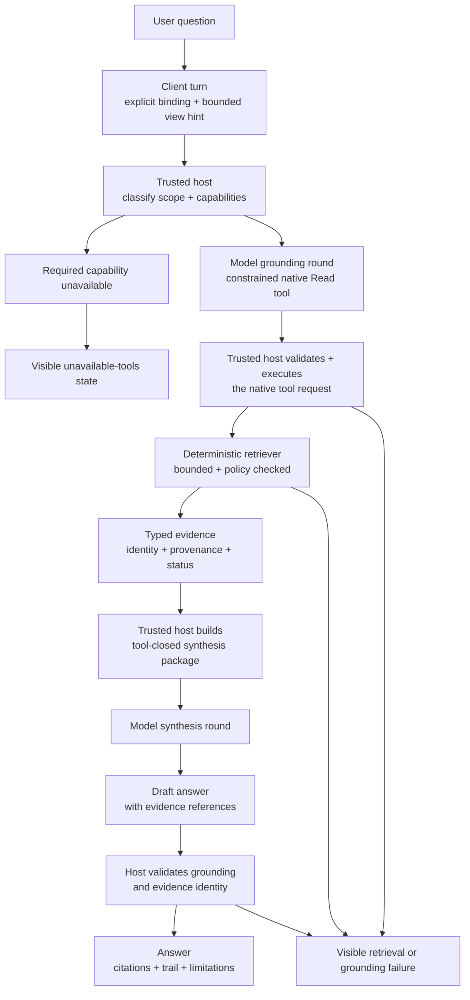
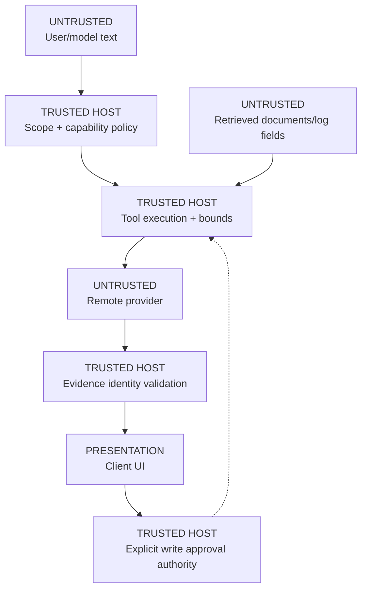

# Deterministic context assembly before model synthesis

**Method status:** **Partial.** ContextDesk ships bounded retrieval, context
budgets, ordinary-versus-linked chat isolation, native tool-capability checks,
required log grounding, structured log evidence identities, withholding of
ungrounded linked-chat prose, phase-aware provider deadlines, and
evidence-preserving synthesis retry. A genuine slow, tools-enabled provider run
remains an environment-dependent acceptance step for #649.

## 1. Problem

An AI assistant cannot reason reliably over an entire workspace, log corpus,
memory store, database, connector estate, and skill library by pasting
everything into one prompt. That approach:

- exceeds model context limits and creates unpredictable truncation;
- obscures which source supports which statement;
- exposes data the user did not ask to share;
- gives small or self-hosted models too many tools and decisions at once;
- lets untrusted retrieved text compete with system policy;
- makes an ordinary chat accidentally inherit unrelated incident context; and
- tempts the UI to display plausible model prose as if a tool actually ran.

The reusable solution is to make the application—not the model—the authority
for context eligibility, retrieval bounds, provenance, permissions, and
completion criteria. The model receives a compact evidence package and performs
synthesis only after required deterministic steps succeed.

## 2. Status and evidence

| Capability                                                     | Status      | ContextDesk evidence                                                                                             | Residual                                                                                           |
| -------------------------------------------------------------- | ----------- | ---------------------------------------------------------------------------------------------------------------- | -------------------------------------------------------------------------------------------------- |
| Hard model-context budget and deterministic compaction         | **Shipped** | [`sessions.rs`](../../../crates/cd-core/src/sessions.rs) `prepare_model_context` / `fit_model_context_to_budget` | Token estimation is character-based and provider-specific budgets still require good configuration |
| Bounded source routing defaults                                | **Shipped** | [`router.rs`](../../../crates/cd-core/src/router.rs) `RouterBudget`                                              | Ranking remains intentionally simple                                                               |
| Ordinary chats do not inherit an ambient log corpus            | **Shipped** | [`agent.rs`](../../../crates/cd-core/src/agent.rs) `run_agent_turn_with_sink`                                    | Native acceptance should be repeated for each supported host                                       |
| Linked log chats require successful bounded log evidence       | **Shipped** | [`agent.rs`](../../../crates/cd-core/src/agent.rs) `LogExplorerContext` and linked-turn loop                     | Provider must support native tools                                                                 |
| Tools-disabled profile fails honestly                          | **Shipped** | [`research.rs`](../../../crates/cd-core/src/research.rs) capability gate                                         | User must select/configure a tools-enabled profile for a real loop                                 |
| Structured evidence identity, not rendered-text reconstruction | **Shipped** | [`tool_host.rs`](../../../crates/cd-core/src/tool_host.rs) `ToolResult.log_evidence`                             | Other source types have source-specific citation contracts                                         |
| Viewport snapshot is bounded and treated as data               | **Shipped** | [`view_context.rs`](../../../crates/cd-core/src/log_analysis/view_context.rs)                                    | Snapshot is a hint, not authoritative event content                                                |
| Session file packs are scoped and bounded                      | **Shipped** | [`session_context.rs`](../../../crates/cd-core/src/session_context.rs)                                           | Not the path for multi-million-line log corpora                                                    |
| Slow-provider phase lifecycle and synthesis-only retry         | **Shipped (agent-testable)** | One monotonic turn ceiling, bounded phases, immediate cancellation, host-only evidence checkpoint, and tool-closed retry | Native cold/slow tools-enabled provider acceptance remains on #649                                 |
| Ranked multi-source context planner                            | **Partial** | Deterministic eligibility and simple ranking ship                                                                | Richer planning must not weaken host policy                                                        |

Issue status is descriptive, not proof by itself. The production paths and
named tests in those files are the proof anchors.

## 3. Reusable method

The method has six gates:

1. **Classify the turn.** Determine whether it is ordinary, linked to a
   particular evidence corpus, or explicitly scoped to another source.
2. **Compute eligibility in trusted code.** Intersect source attachment,
   allowlists, read/write classification, first-use approval, profile
   capability, and turn scope.
3. **Retrieve in constrained stages.** Use one reliable grounding operation
   first when a small model is likely to struggle with a broad tool menu.
4. **Canonicalize evidence.** Return stable identities, provenance, quality,
   bounds, and failures as typed host data.
5. **Synthesize from a closed package.** When all requested retrieval is
   complete, remove tools for the synthesis round and give the model only the
   bounded evidence needed for the answer.
6. **Validate before display.** Reject or visibly downgrade answers that lack
   required evidence identity, misuse boundary metadata, or claim unavailable
   sources.



### Why staged retrieval helps smaller models

A broad menu of logs, files, memory, SQL, connectors, and Help tools requires
the model to solve routing and syntax before it can inspect evidence. A staged
turn instead constrains the first choice to the source that defines success.
For a linked log question, a general bounded log search is the first gate.
After that succeeds, the host can expose a requested workspace/runbook search
or a broader read surface.

This is not merely prompting. The host changes the offered tool set and checks
the actual native tool result. Printed JSON, prose such as “I will search,” and
tool-shaped Markdown are not evidence.

## 4. Inputs, outputs, and portable contracts

The following are conceptual contracts for reimplementation, not invented
ContextDesk APIs.

### Turn scope

| Field                  | Meaning                                          | Rule                                         |
| ---------------------- | ------------------------------------------------ | -------------------------------------------- |
| `turn_id`              | Stable identity for cancellation/audit           | Unique within host                           |
| `conversation_id`      | Durable transcript identity                      | Does not imply source access                 |
| `binding`              | Ordinary or an explicit source/corpus identity   | Absent means no ambient corpus inheritance   |
| `user_request`         | User text                                        | Data, never a permission grant               |
| `view_hint`            | Current filters, lanes, selection, visible range | Bounded, untrusted hint                      |
| `profile_capabilities` | Native tools, context size, provider behavior    | Host-observed/configured, not model-asserted |
| `deadline` / `cancel`  | Turn lifecycle controls                          | Bounded and effective in every phase         |

### Source policy

| Field                  | Meaning                                                      |
| ---------------------- | ------------------------------------------------------------ |
| stable source identity | Corpus, workspace, memory scope, DB connection, or connector |
| availability           | Attached/configured/healthy state                            |
| side-effect class      | Read, SoftWrite, or HardWrite assigned by host               |
| permission state       | Pre-authorized, first-use approval required, or unavailable  |
| result cap             | Maximum records/chunks returned                              |
| data policy            | Redaction, egress, path/network allowlist, retention         |

### Evidence item

| Field          | Meaning                                         | Must not be inferred from |
| -------------- | ----------------------------------------------- | ------------------------- |
| `source_id`    | Stable source identity                          | Display label alone       |
| `record_id`    | Reopenable identity such as corpus+seq+source   | Message text              |
| `content`      | Bounded redacted observation                    | Model summary             |
| `provenance`   | Retriever/tool and source                       | User or model assertion   |
| `quality`      | Exact, inferred, mixed, order-only, stale, etc. | More reliable peer source |
| `truncation`   | Complete-within-contract or bounded excerpt     | UI appearance             |
| `retrieved_at` | Operational observation time                    | Source event time         |

### Synthesis package

A synthesis package contains:

- current user request;
- minimal governing policy;
- selected bounded evidence blocks;
- source identity and quality;
- explicit unavailable/failed source states;
- output requirements such as observation-versus-inference labels; and
- no tool schemas when the intended step is synthesis-only.

It excludes:

- raw whole corpora;
- evaluator answer keys or known expected conclusions;
- credentials and private connection details;
- unrelated chat attachments or ambient log corpora;
- first-use or write capabilities not approved for the turn; and
- model-generated “tool results.”

## 5. Invariants and trust boundaries

1. **Binding is explicit.** An ordinary conversation cannot inherit a
   foreground Log Explorer corpus merely because the window is open. A main
   chat receives log tools only after the user attaches one imported corpus to
   that durable session.
2. **Source eligibility is host-owned.** The model cannot enable a connector,
   widen a root, change a side-effect class, or self-grant permission.
3. **A linked log answer is provisional until a bounded log tool succeeds.**
4. **Evidence identity is structured.** Never scrape event identity back out of
   rendered prose when the retriever can return it directly.
5. **Untrusted retrieval stays untrusted.** Tool results are data and are
   boundary-wrapped; instructions inside them do not override policy.
6. **Skills provide process, not incident truth.** A skill can tell the model
   how to investigate; it is not evidence that a production event occurred.
7. **Evaluator truth is outside every attached root.** Test fixtures may know
   the expected diagnosis, but that answer key cannot enter the model context.
8. **Context limits are hard.** The transcript may remain complete on disk
   while only a compacted, bounded model-facing projection is sent.
9. **Failure stays visible.** Unavailable, partial, timed-out, cancelled, and
   ungrounded are distinct from success.
10. **Write authority is separate.** Read-only context assembly never implies
    permission to persist memory, change a view, or mutate a remote system.



## 6. Algorithm detail

### 6.1 Classify

```text
if explicit linked source exists:
    mode = linked(source_id)
else:
    mode = ordinary
```

Do not infer linkage from window focus alone. Focus may contribute a bounded
viewport hint only after the explicit conversation binding is established.

### 6.2 Build the eligible read surface

For every registered tool:

1. verify it is attached and healthy;
2. apply the host-owned side-effect class;
3. require any connector first-use approval;
4. intersect with the turn binding;
5. intersect with provider native-tool capability; and
6. omit unavailable tools rather than teaching the model to fake them.

For a linked read turn, write tools remain unavailable even if the same session
could request writes in another workflow.

### 6.3 Retrieve

- Linked log: offer bounded `search_logs` first.
- Explicit runbook/workspace request: after log grounding, offer bounded
  workspace search.
- Memory: use tightly capped ambient recall or explicit recall, with citations.
- Files/session packs: search indexed chunks; read slices only after identity
  resolution.
- Databases/connectors: use read-only roles, query limits, timeouts, and
  source-specific citation locators.
- Skills: inject selected procedural guidance under its own identity; do not
  relabel it as observed evidence.

### 6.4 Normalize and wrap

The host records success separately from the model-facing string. For logs,
ContextDesk carries structured `SearchEvidenceIdentity` values alongside the
redacted result detail. A portable implementation should do the same for every
high-value source.

Retrieved text should be enclosed in an unambiguous untrusted-data envelope.
The envelope marker itself must never be interpreted as observed content or
cited as a finding.

### 6.5 Synthesize and validate

Once required retrieval succeeds:

1. distill the current request and successful evidence;
2. include explicit retrieval failures;
3. remove tool schemas if no further tool decision is required;
4. request citations using structured identities;
5. reject a linked answer with no valid evidence identity; and
6. render observations, inferences, and limitations distinctly.

## 7. Performance and bounds

ContextDesk defaults illustrate the method; they are product settings, not
universal recommendations:

| Dimension                   |                        Current default/cap | Anchor                                                                        | Overflow behavior                                          |
| --------------------------- | -----------------------------------------: | ----------------------------------------------------------------------------- | ---------------------------------------------------------- |
| Sources considered per turn |               3 default, sanitized to 1–16 | [`router.rs`](../../../crates/cd-core/src/router.rs)                          | Rank and take bounded set                                  |
| Tool rounds                 |              12 default, sanitized to 1–32 | [`router.rs`](../../../crates/cd-core/src/router.rs)                          | Terminal bounded completion/error                          |
| Results per source          |               8 default, sanitized to 1–50 | [`router.rs`](../../../crates/cd-core/src/router.rs)                          | Retriever result cap                                       |
| Whole-turn deadline         | Adaptive: 300,000 ms local/private, 120,000 ms managed; explicit 500–600,000 ms | [`router.rs`](../../../crates/cd-core/src/router.rs) | Phase timeout or visible whole-turn timeout |
| Phase deadlines             | Choosing, retrieval, and synthesis are each capped inside the one monotonic turn ceiling | [`agent.rs`](../../../crates/cd-core/src/agent.rs) `TurnClock` | A phase cap never resets or extends the whole turn |
| Model-facing context        |                 120,000 characters default | [`sessions.rs`](../../../crates/cd-core/src/sessions.rs)                      | Pair-safe compaction then deterministic truncation or fail |
| View selection identities   |                                         64 | [`view_context.rs`](../../../crates/cd-core/src/log_analysis/view_context.rs) | Sort, deduplicate, truncate                                |
| View bookmark summaries     |                                         24 | [`view_context.rs`](../../../crates/cd-core/src/log_analysis/view_context.rs) | Truncate                                                   |
| Session context files       |                                200 default | [`session_context.rs`](../../../crates/cd-core/src/session_context.rs)        | Reject over cap                                            |
| Session context bytes       |          50 MiB total; 10 MiB/file default | [`session_context.rs`](../../../crates/cd-core/src/session_context.rs)        | Reject before publication                                  |
| Ambient memory              |      about 1,500 chars and at most 5 items | [`ambient.rs`](../../../crates/cd-core/src/memory/ambient.rs)                 | Score/echo filter and stop                                 |

Character limits are approximate model-token controls. An implementation with
provider tokenizers should still keep deterministic byte/character safety caps
at trust boundaries.

Adaptive provider classification is a pure configuration decision. An explicit
profile preference is authoritative; otherwise local-only/Ollama profiles,
loopback or private IPs, and private host suffixes such as `.internal`, `.local`,
`.lan`, `.corp`, `.intranet`, and `.private` receive the patient plan. The
classifier performs no DNS lookup or endpoint probe. A user-selected custom
whole-turn ceiling overrides either adaptive class. Existing serialized router
budgets migrate as custom so an upgrade cannot silently lengthen a prior
setting; new installs default to adaptive.

## 8. Failure and recovery

| Failure                                 | Detection                                     | Presentation                                                          | Recovery                                          | Guarantee                                |
| --------------------------------------- | --------------------------------------------- | --------------------------------------------------------------------- | ------------------------------------------------- | ---------------------------------------- |
| Profile reports native tools disabled   | Capability check before provider call         | “Tools unavailable” with selected profile context                     | Select/configure a tools-enabled profile          | No fake grounding                        |
| Model narrates a tool call              | No native call/result event                   | Withhold provisional prose; bounded retry/nudge                       | Retry native tool decision or fail visibly        | Narration never becomes evidence         |
| Required log search returns no evidence | Structured result count/identity empty        | Honest no-evidence state                                              | Refine query/filter                               | No invented event                        |
| Requested source unavailable            | Eligibility computation                       | Name unavailable source class without secrets                         | Configure/authorize source                        | Remaining answer discloses gap           |
| Context cannot fit                      | Deterministic budget helper                   | `context_too_long`                                                    | New chat/remove history/increase supported budget | Stored transcript not silently rewritten |
| Timeout before retrieval                | Deadline                                      | Visible timeout                                                       | Retry                                             | No success claim                         |
| Timeout after retrieval                 | Synthesis phase or remaining whole-turn deadline | Visible timeout; successful bounded evidence remains in the transcript and in a host-only checkpoint | Retry synthesis without running retrieval again | Checkpoint is bound to exact chat, corpus, and model |
| Cancellation                            | Per-turn cancel race around every provider/tool await | Cancelled terminal state                                           | Start another turn or retry preserved synthesis   | Cancellation is immediate and session-specific |
| Malicious retrieved instructions        | Untrusted wrapper and system policy           | Usually not surfaced as instructions                                  | Continue with data-only interpretation            | No permission elevation                  |
| Citation mismatch                       | Host validation against structured identities | Reject/downgrade answer                                               | Correct synthesis retry                           | Rendered text cannot forge identity      |

## 9. Observability

A useful trail records:

- selected turn mode and bound source identity;
- offered tool names after policy filtering;
- budget values actually enforced;
- each tool start/finish, source, result count, and success;
- unavailable source classes;
- grounding, cross-source, and synthesis phases;
- compaction/truncation notices;
- cancellation/timeout phase; and
- final evidence identity validation.

It must not log credentials, raw provider headers, absolute private paths,
private model inventory in publishable media, or evaluator truth.

## 10. Security and privacy

- Credentials remain in the trusted host or OS keychain, never the webview or
  model context.
- File roots, database connections, network bases, and connector processes are
  allowlisted and policy checked.
- Retrieved documents and tool results are prompt-injection-capable untrusted
  data.
- Cloud-model and cloud-embedding egress must be explicit; local does not mean
  inherently safe if a connector sends data remotely.
- Memory is redacted before persistence and embedding; logs are redacted before
  event persistence and model access.
- Read, SoftWrite, and HardWrite classification remains host-owned. User text
  such as “approve” is not a permission token.
- Durable source linkage must survive conversation reopen without causing
  unrelated conversations to inherit the link.

## 11. UX and human factors

The user should see:

- which corpus/source a chat is linked to;
- which model/profile is active without exposing unnecessary inventory;
- whether tools are available;
- current phase—choosing evidence, retrieving, or synthesizing;
- a Stop action that targets only the active turn;
- expandable evidence/trail detail;
- citations or navigation proposals separate from prose;
- explicit partial/unavailable/timeout states; and
- an opt-in action before a proposed navigation changes the investigation view.

Small models benefit from the same UX as users: fewer simultaneous choices,
shorter grounding instructions, typed result contracts, and an explicit final
synthesis step.

## 12. Test recipe

| Layer            | Required proof                                                                                                                                                                                   |
| ---------------- | ------------------------------------------------------------------------------------------------------------------------------------------------------------------------------------------------ |
| Contract/unit    | Source ranking and caps; context fitting; capability matrix; binding serialization; untrusted wrapper cannot forge delimiters                                                                    |
| Core integration | Linked turn requires successful log tool; ordinary turn excludes log tools; requested workspace search is staged; tools-disabled linked turn fails before provider; structured identity required |
| Adversarial      | Model prints call-shaped JSON; wrapper metadata appears in output; user asks to reveal evaluator truth; malicious tool text asks for permissions                                                 |
| Host/session     | Empty-chat link persists; stale/corrupt corpus fails before capability/provider handling; attach failure leaves durable state unchanged; ordinary session has no log scope; cancellation targets exact session |
| Component UI     | Add context attaches/detaches one corpus; availability/event count/Open Explorer remain visible; Return/Shift+Return/IME; errors remain visible; autoscroll/unread semantics |
| Packaged/native  | Tools-enabled provider performs a general zero-prep log question from main chat and Explorer; tools-disabled profile is honest; ordinary chat has no corpus; linked chat keeps corpus after switch/reopen |
| Slow provider    | Deterministic cold/slow provider defaults; retrieval success then synthesis timeout; cancellation in choosing/retrieving/synthesizing; synthesis-only recovery; explicit deadline precedence |

Evaluator fixtures must store expected findings outside every imported corpus,
workspace root, memory store, session pack, and skill directory. The test should
assert the sentinel is absent from model-facing messages.

## 13. ContextDesk anchors

- [`agent.rs`](../../../crates/cd-core/src/agent.rs): linked context, staged
  grounding, ordinary-chat isolation, evidence validation.
- [`tool_host.rs`](../../../crates/cd-core/src/tool_host.rs): tool policy,
  bounded execution, structured log identities.
- [`sessions.rs`](../../../crates/cd-core/src/sessions.rs): durable linked corpus
  metadata and hard model-context budget.
- [`SessionContextBar.tsx`](../../../desktop/src/components/SessionContextBar.tsx):
  explicit single-corpus selection, availability, detach, and Explorer entry.
- [`desktop/src-tauri/src/lib.rs`](../../../desktop/src-tauri/src/lib.rs):
  atomic validated attachment and provider-free corpus preflight.
- [`router.rs`](../../../crates/cd-core/src/router.rs): turn budgets and source
  ranking.
- [`injection.rs`](../../../crates/cd-core/src/injection.rs): untrusted result
  wrapping.
- [`index.rs`](../../../crates/cd-core/src/index.rs): bounded workspace
  indexing/search.
- [`session_context.rs`](../../../crates/cd-core/src/session_context.rs):
  chat-specific files.
- [`memory/ambient.rs`](../../../crates/cd-core/src/memory/ambient.rs): bounded
  durable-memory injection.
- [`research.rs`](../../../crates/cd-core/src/research.rs): profile capability
  honesty.
- Canonical design: [Log Explorer chat contract](../LOG_EXPLORER.md),
  [Memory](../MEMORY.md), [Architecture](../../ARCHITECTURE.md), and
  [threat model](../../THREAT_MODEL.md).

## 14. Shipped / partial / planned matrix

| Slice                       | Status      | What is true now                                                           | What is not claimed                                                       |
| --------------------------- | ----------- | -------------------------------------------------------------------------- | ------------------------------------------------------------------------- |
| Ordinary chat isolation     | **Shipped** | No ambient log-tool inheritance                                            | No claim that every future source is automatically isolated without tests |
| Main-chat log attachment    | **Shipped** | One host-validated durable corpus, bounded linked-log tools, and reversible detach | Multi-corpus context remains #693; no hidden all-corpus fallback |
| Linked log grounding        | **Shipped** | Required bounded log result and evidence identity                          | No success under tools-disabled profile                                   |
| Cross-source read           | **Partial** | Requested governed reads can be offered after log grounding                | No unrestricted autonomous source crawl                                   |
| Small-model staging         | **Shipped** | Constrained first log search and tool-closed synthesis path                | No guarantee every small model follows native tools                       |
| Slow provider lifecycle     | **Shipped (agent-testable)** | Adaptive or explicit whole-turn ceiling, bounded truthful phases, immediate Stop, evidence-preserving synthesis retry | Native cold/slow tools-enabled profile acceptance remains #649 |
| Model proposals changing UI | **Partial** | Structured `log_nav` is opt-in                                             | Rich finding proposal/approval lifecycle remains #646                     |
| Evaluator-truth exclusion   | **Shipped** | Known-truth fixture discipline keeps the answer key outside attached roots | Not a formal noninterference proof                                        |

## 15. Reimplementation notes

The minimum trustworthy subset is:

1. explicit turn/source binding;
2. host-owned eligible Read tool list;
3. one bounded deterministic retriever;
4. structured evidence identity;
5. hard context and result caps;
6. untrusted-data separation; and
7. refusal to display an evidence-backed answer before grounding succeeds.

The model vendor, vector store, SQL engine, desktop framework, and exact
streaming protocol are replaceable. Explicit binding, host authority,
structured identity, bounded retrieval, failure honesty, and write separation
are not.

Avoid these shortcuts:

- putting all sources in one prompt;
- asking the model which permissions it has;
- accepting model-emitted JSON as proof a tool ran;
- hiding timeout/partial retrieval behind a fluent answer;
- using an open Explorer window as implicit chat linkage;
- sending evaluator notes beside the test corpus; and
- letting retrieval summaries replace reopenable evidence identity.

## 16. Open residuals

- #649: native acceptance with a real cold/slow tools-enabled provider profile;
  the deterministic core/component lifecycle and synthesis-only retry ship.
- #646/#532: ranked proposals, review history, walkthroughs, and report
  assembly.
- Provider acceptance: a real tools-enabled company profile must be selected
  and exercised; credentials and capability changes cannot be fabricated by an
  agent.
- Source-specific provenance contracts for every connector deserve their own
  chapters.
- Character budgets should eventually be complemented by reliable
  provider-specific token accounting without removing deterministic hard caps.
