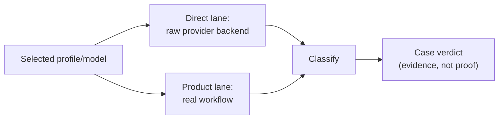

# Gateway/model differential diagnostic

**Status:** Local integration (branch `feat/gateway-diagnostic-suite-v1`).
Not yet on `main`.

## 1. Problem

An operator configures a new gateway/model pair (a hosted aggregator, a
self-hosted OpenAI-compatible endpoint, a local daemon) and asks one
question: "if this doesn't work well for me, is that the gateway/model
itself, my own product's integration of it, or just a quality gap I can
live with?" Without separating those three, every bug report collapses
into "the model is bad," which sends fixes to the wrong layer, wastes an
operator's own triage time, and hides genuine product regressions behind
"that's just how models are."

A readiness check that only reports pass/fail (`contextdesk doctor`) proves
the currently *configured* profile works end-to-end, but does not explain
*why* a specific candidate model fails, or whether the same request would
have succeeded through the raw provider API. Explicitly out of scope: this
method never establishes answer *quality* as a readiness signal, never
implicitly probes an entire model catalog, and never makes a live request
without operator confirmation of the exact bound.

## 2. Status and evidence

| Capability | Status | Evidence | Residual |
| --- | --- | --- | --- |
| Direct-lane qualification (generation/structured/tool-call/embedding/rerank) | Local integration | `crates/cd-cli/src/commands/gateway.rs::run_shared_qualification`, hermetic tests in `crates/cd-cli/tests/gateway_diagnose.rs` | Not yet merged |
| Product-lane differential (chat workflow, real tool loop, triage) | Local integration | Same file, `case_*` functions | Not yet merged |
| Two-lane classification | Local integration | `classify`/`lane_from_qualification` | Not yet merged |
| Share-safe checksummed artifact + owner-only private capture | Local integration | `write_artifact_bundle`/`write_private_capture` | Windows ACL parity for the private capture is best-effort only (Unix mode bits today) |
| Offline inspect/replay of a captured envelope into a hermetic fixture | Planned | — | No implementation yet; the private-capture schema is versioned so this is mechanical follow-up, not a redesign |
| Embedding/reranker product-lane adapter for OpenAI-compatible profiles | Planned | `case_embedding_or_rerank` reports `not_run` for non-Ollama embedding profiles | Needs a generic production `EmbedBackend` for OpenAI-compatible `/embeddings`, distinct from the qualification-only synthetic probe |

## 3. Reusable method

1. Resolve exactly one profile/model pair from the caller's explicit
   selection — never a default catalog scan.
2. State the plan up front: every case that will run, the maximum request
   count, the active deadline, and the artifact classes this run will
   produce. Require explicit confirmation before any network call.
3. For each applicable synthetic case, run two lanes where a raw-provider
   baseline exists:
   - **Direct** — the smallest possible request straight to the provider
     backend, with no product-side prompt assembly, tool loop, or
     grounding validation in between.
   - **Product** — the equivalent request through the real product
     workflow: the same prompt assembly, tool loop, validation, tracing,
     and cleanup a genuine user turn would use.
   Some cases (a multi-stage investigation, a "selected context" question)
   have no meaningful raw-provider equivalent; run the product lane alone
   and say so explicitly rather than fabricating a baseline.
4. Score any case with a typed-property scorer on typed properties, not
   exact wording — required/forbidden claims, citation identity,
   incident/role separation, abstention under insufficient evidence — using
   an evaluator-only truth key that never enters model-visible input.
5. Classify each case from the lane outcomes: both lanes failed (gateway
   or model layer), direct passed but product failed (product
   integration), both executed but the scorer failed (usefulness), a
   retry/correction was needed (compatible but fragile), or compatible.
   State this as evidence for a human to weigh, never as a proof of a
   single root cause — a flaky network blip and a genuine incompatibility
   can produce the same one-shot signature.
6. Keep at least three verdicts separate for the whole run: raw
   compatibility, product-path compatibility, and answer usefulness. A
   quality gap must never silently downgrade — or upgrade — a
   compatibility verdict, and vice versa.
7. Use only disposable, synthetic state (corpora, sessions) and remove all
   of it on every exit path, including the deadline and cancellation.
8. Emit the same typed lifecycle event stream a human and a script both
   read — a plan event, one event per completed case, exactly one terminal
   event — so structured and human output are two projections of one
   source of truth, never two independently maintained renderers.

## 4. Inputs, outputs, and data contracts

### Inputs

| Field/concept | Type or shape | Required | Validation |
| --- | --- | :---: | --- |
| Profile + model selection | Existing resolved provider profile + exact model id | yes | Exactly one model; never a catalog |
| Level | `basic` \| `extended` | no (default `basic`) | Never implicitly widens the case set, only attempt count |
| Deadline | Whole-operation seconds | no (default 180s) | Bounds every lane, not just the slowest one |
| Consent | Interactive confirm or `--yes` | yes | Fails closed non-interactively without it |

### Outputs

| Field/concept | Meaning | Bounded by | Provenance |
| --- | --- | --- | --- |
| Case report | Direct/product/scorer lane results + classification | Fixed case set per role | This run only |
| Verdicts | Three independent dimensions with `pass` / `fail` / `inconclusive` status plus conservative Boolean projections | — | Derived from case classifications and measured execution, never from raw text; no executed applicable case is inconclusive |
| Artifact bundle | Versioned, checksummed, share-safe by default | File size follows report size (no unbounded raw capture by default) | `report.json` + `manifest.json` |

Never serialized: credentials, Authorization/cookie headers, raw
environment values, absolute host paths, the raw endpoint URL, or the
exact private model/profile identity in the default (non-`--raw`) bundle —
those become stable run-local pseudonyms/fingerprints instead.

## 5. Invariants and trust boundaries

- **Invariant:** the shared qualification pass runs at most once per
  operation; no case re-probes the direct lane independently (keeps the
  stated request bound true).
- **Trust boundary:** the evaluator-only truth key for a scored case
  (e.g. the triage fixture's trigger/symptom/recovery tokens) never
  reaches model-visible input.
- **Untrusted input:** a model's free-text answer is parsed defensively
  (`parse_structured_triage_answer` degrades to empty sections rather than
  erroring on off-contract text) and never trusted to self-report its own
  correctness.
- **Authority:** only the host-side scorer decides pass/fail; a model
  asserting "root cause established" is not authoritative over
  `root_cause_establishable`.
- **Fail-closed rule:** a case that cannot execute (setup failure, deadline
  exceeded, cancellation) is reported as a typed non-pass state, never
  silently omitted from the report.

## 6. Algorithm or process detail

1. Resolve profile + model; classify the model's role hint (chat vs.
   embedding vs. reranker) to decide the applicable case set.
2. Build and print the plan; block on consent.
3. Resolve the profile's credential once for the direct lane.
4. For a chat-role model, run one shared qualification pass
   (`run_qualification`) covering generation/structured/tool-call
   contracts; for an embedding/reranker-role model, run the one
   role-appropriate contract probe instead.
5. For each case in the plan, in order, respecting the overall deadline:
   seed any disposable corpus this case needs, run the product-lane turn
   through the real workflow with a recording trace sink, score it if a
   typed scorer applies, classify, and render progressively.
6. After every case (or on early exit), remove every disposable corpus and
   session this run created; fold that outcome into the report.
7. Write the share-safe artifact; if explicitly acknowledged, also write
   the owner-only private capture as a separate file.

## 7. Performance and bounds

| Dimension | Bound | Enforcement point | Overflow behavior |
| --- | ----: | --- | --- |
| Requests (basic, chat role) | ~20 | Stated in the plan before any call | Never exceeded; qualification runs once |
| Requests (basic, embedding/reranker role) | ~4 | Stated in the plan | Same |
| Whole-operation wall time | `--timeout` (default 180s) | `tokio::time::timeout` around the qualification pass and each turn | Remaining cases marked not-run past the deadline, not silently dropped |
| Per-case wall time, default run | min(remaining deadline, 45s) | Provider-neutral case-budget policy + existing turn deadline | Case reports timeout; later cases retain the remaining whole-run budget |
| Per-case wall time, explicit `--timeout N` | remaining whole-run deadline | Same | A slow case may exceed 45s but never the operator's explicit operation deadline |

## 8. Failure and recovery

| Failure | Detection | User-visible state | Recovery | Data guarantee |
| --- | --- | --- | --- | --- |
| Provider unreachable | Transport error from the qualification/chat client | Case classified `gateway_or_model_likely` or `product_integration_likely` with the redacted reason | Operator re-runs after fixing connectivity | No partial corpus/session left behind |
| Deadline exceeded mid-run | `Instant::now() >= deadline` check between cases | Remaining cases reported `not_run` with an explicit reason | Re-run with a larger `--timeout` | Cleanup still runs for everything created so far |
| Ctrl-C | Cooperative cancel flag | `cancelled` terminal report | Operator re-runs | Cleanup still attempted before exit |
| Panic-shaped provider response | Caught at the transport/workflow layer, never propagated as a Rust panic | Case reported with a stable failure category; raw provider detail/body omitted | Same as unreachable | Same |

## 9. Observability

The plan event states what will happen before it happens. Each case event
carries per-lane executed/passed/detail/elapsed/attempts/requests-used, so
a reader can tell what was attempted, whether it passed, how long it took,
and how many requests it spent, without re-deriving any of that from raw
transcripts. The terminal event carries the three independent verdicts,
cleanup outcome, and a local artifact reference. The persisted share-safe
report omits the absolute host path; local terminal/JSONL output may include
it for operator use and is not itself a shareable artifact. Nothing persisted
here exposes a secret, private path, raw endpoint, exact selected identity, or
full model catalog.

## 10. Security and privacy

Every diagnostic string crosses the provider-neutral
`ShareSafeRedactionPolicy`: credential/header variants, HTTP(S) endpoints,
absolute host paths, and the selected profile/model literals are removed and
bounded. Failed lanes are reduced to stable categories before JSONL/report
serialization, so an arbitrary nested provider body is omitted rather than
trusted to match a sentinel list. The artifact writer reapplies the policy as a
defense-in-depth boundary before computing the manifest checksum. The default
artifact is share-safe by construction (pseudonymous identity, no raw URL); an
explicit `--raw --raw-i-understand` capture is still sanitized, is written with
owner-only permissions, and is never referenced by the share-safe bundle.
Prompt-injection risk: every synthetic corpus this method seeds is
host-authored fixture content, never live user data, so there is no
untrusted-corpus-content injection surface distinct from what `doctor`
already accepts. No write side effects outside disposable, run-scoped
state; no HardWrite/SoftWrite surface is touched.

The policy does not claim general PII/proprietary-content discovery. Relative
paths, names, emails, ticket identifiers, and unknown tenant strings in
host-authored non-failure prose are outside its pattern contract. Endpoint
fingerprints are deterministic and therefore permit comparison against a known
candidate list. These are residual review risks, not reasons to retain raw
provider bodies.

## 11. UX and human factors

Progressive disclosure: a one-line-per-case summary in the default text
view, a `--jsonl` stream for live tooling, and a `--json` envelope for a
single machine read. Uncertainty is labeled explicitly (`retry_required`,
`usefulness_gap`) rather than folded into a binary pass/fail. Colors are
additive only — the bracketed `[PASS]`/`[WARN]`/`[FAIL]`/`[SKIP]` text
label is the always-present signal; `NO_COLOR`, `--color never`, and a
non-ANSI terminal all degrade to the same plain text.

## 12. Test matrix

| Layer | Happy path | Boundary/adversarial path | Evidence |
| --- | --- | --- | --- |
| Contract/unit | Case classification, lane combination, provider-neutral share-safe policy | Nested provider errors; arbitrary HTTP(S) endpoints; `/private/tmp`, home, and Windows paths; Authorization/Bearer/API-key variants; exact profile/model ids; idempotence | `cd-core::redact` tests + inline `#[cfg(test)]` in `gateway.rs` |
| Host/CLI e2e | Full run against a hermetic mock, artifact/checksum | JSONL case/report and report/manifest defense-in-depth redaction; no-`--yes` refusal, `--raw` ack enforcement, stalled-gateway deadline bound, pre-existing corpus untouched | `crates/cd-cli/tests/gateway_diagnose.rs` + inline artifact tests |

## 13. ContextDesk production anchors

- [`crates/cd-cli/src/commands/gateway.rs`](../../../crates/cd-cli/src/commands/gateway.rs)
- [`crates/cd-cli/tests/gateway_diagnose.rs`](../../../crates/cd-cli/tests/gateway_diagnose.rs)
- [`crates/cd-core/src/capability_qualification.rs`](../../../crates/cd-core/src/capability_qualification.rs)
- [`crates/cd-core/src/triage_quality.rs`](../../../crates/cd-core/src/triage_quality.rs)
- [`docs/CLI.md`](../../CLI.md) § Gateway diagnostics

## 14. Shipped / partial / planned matrix

| Slice | Status | What is true now | What is not claimed |
| --- | --- | --- | --- |
| Chat-role two-lane differential | Local integration | Runs against a hermetic mock and real gateways alike, reusing production paths only | Not a proof of answer quality |
| Triage typed scoring | Local integration | Reuses the production rubric scorer | The fixture is synthetic; a real incident's ambiguity may differ |
| Embedding/reranker differential | Local integration (reranker), Planned (non-Ollama embedding) | Reranker case runs against any generic HTTP endpoint | OpenAI-compatible embedding product lane is explicitly `not_run` |
| Replay/inspect of a private capture | Planned | Schema is versioned for this | No implementation |

## 15. Reimplementation notes

The minimum viable trustworthy subset is the direct/product two-lane
differential plus the consent gate and cleanup guarantee — everything else
(embedding/reranker, extended-level retries, the private capture) is
additive. The scorer and its evaluator-only key are the one piece that
must never be relaxed: a reimplementation that lets truth leak into
model-visible input silently turns "typed-property evidence" into "the
model graded its own homework."

## 16. Open residuals

- Offline inspect/replay of a captured sanitized envelope into a hermetic
  regression fixture — no tracking issue filed yet from this branch.
- Generic OpenAI-compatible production embedding backend for the
  embedding-role product lane (`case_embedding_or_rerank` in
  `gateway.rs`) — no tracking issue filed yet from this branch.
- Deeper Activity Inspector tree-glyph reuse (`human_hierarchy.rs`) for the
  live view, beyond the current bracket/pipe rendering — no tracking issue
  filed yet from this branch.
