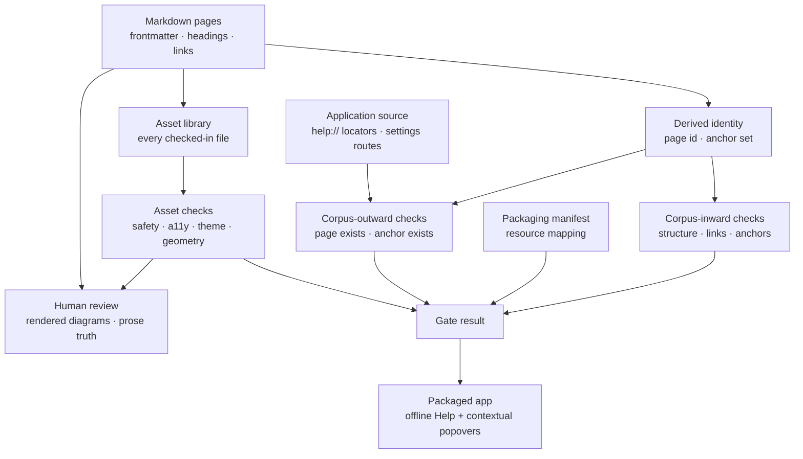

# Bundled Help truth and offline delivery

**Method status:** **Partial.** ContextDesk ships a curated Markdown Help
corpus, bundles it whole into the packaged application, serves it entirely
offline through the trusted host, grounds agent answers in it, and reaches it
from the UI through a portal-rendered contextual popover with a canonical deep
link. The machine-checked half of the truth contract — structural validity,
link and anchor resolution, asset safety, theme-independent legibility, and
packaging presence — is shipped. The judgement half — whether a diagram is
*good*, whether a control is *self-explanatory*, whether prose still describes
what the product does — remains human review, and the corpus currently carries
known drift against shipped behavior.

The reader-facing entry point is
[the Help corpus](../../help/README.md) and its
[authoring conventions](../../help/assets/README.md). This chapter is the
engineering method: how to make bundled documentation a checkable product
contract instead of prose that silently rots.

## 1. Problem

In-app Help is the only documentation most users read, and it is the one
documentation surface that ships as application bytes. That creates failure
modes ordinary docs do not have:

- a renamed heading turns every deep link to it into a silent no-op, because
  the reader scrolls by element id and a missing id simply does nothing;
- a page id referenced from the UI can be deleted, leaving a Help button that
  opens nothing;
- an asset the corpus no longer references still ships in the bundle, and — if
  validation is driven by references — ships **unvalidated**;
- a diagram rendered as an isolated image cannot inherit the reader's theme, so
  a colour choice that looks correct while authoring is unreadable for anyone
  on a different skin;
- documentation prose keeps describing a control that shipped differently, or
  denies a capability that has since shipped;
- and the packaging entry that makes the corpus available offline can be
  dropped without a single test failing.

Every one of these passes review, passes CI, and reaches users. The method's
premise is that a documentation corpus is only trustworthy to the extent that
its failure modes are *executable*.

Out of scope:

- deciding whether an explanation is well written;
- replacing rendered visual review with geometry linting;
- generating Help from code;
- shipping a second, independently editable copy of any explanation.

## 2. Status and evidence

| Capability | Status | Evidence | Residual |
| --- | --- | --- | --- |
| Curated Markdown corpus with strict frontmatter | **Shipped** | `parseHelpFrontmatter` / `validateHelpCorpus` in [`check_help_corpus.mjs`](../../../scripts/check_help_corpus.mjs); parallel Rust parser in [`help.rs`](../../../crates/cd-core/src/help.rs) | Two parsers can drift; only the JS one gates |
| Whole-corpus offline bundling | **Shipped** | `bundle.resources` maps `docs/help` in [`tauri.conf.json`](../../../desktop/src-tauri/tauri.conf.json); `validateHelpPackaging` fails if the mapping is dropped | Packaged-app proof is native-only |
| Host-served assets as `data:` URLs | **Shipped** | `get_help_asset` in [`lib.rs`](../../../desktop/src-tauri/src/lib.rs) | — |
| Agent grounding in the same corpus | **Shipped** | `help_tool_specs` in [`help.rs`](../../../crates/cd-core/src/help.rs) | — |
| Contextual popover with canonical deep link | **Shipped** | [`HelpTip.tsx`](../../../desktop/src/components/HelpTip.tsx), structured content in [`helpContent.ts`](../../../desktop/src/lib/helpContent.ts) | Coverage is concentrated in Log Explorer; several surfaces have none |
| UI-to-corpus reference resolution | **Shipped** | `validateSourceHelpReferences` in [`check_help_corpus.mjs`](../../../scripts/check_help_corpus.mjs) | — |
| Anchor resolution for every `help://` link | **Shipped** | `helpPageAnchors` mirrors `parse_toc`; enforced for corpus prose and UI references | Mirrored logic, not shared code |
| Asset safety for every checked-in file | **Shipped** | `validateAssetLibrary` validates all assets, not only referenced ones | — |
| Theme-independent label legibility | **Shipped** | `validateSvgTextLegibility` rejects bare-canvas text and sub-AA contrast | Non-text contrast (WCAG 1.4.11) for connector strokes is unchecked |
| Geometry sanity for diagrams | **Partial** | `validateSvgGeometry` catches clipping, text collisions, and border crowding | Font metrics and arrow quality need the rendered contact sheet |
| Rendered visual review | **Accepted design** | [`render_help_svg_contact_sheet.sh`](../../../scripts/render_help_svg_contact_sheet.sh) | Reviewer judgement; not automatable |
| Corpus prose matching shipped behavior | **Partial** | [`HELP_TRUTH_AUDIT.md`](../../HELP_TRUTH_AUDIT.md) | Known drift; see §16 |

## 3. Reusable method

The method is a single inversion: **treat every way Help can lie as a test
case, and make the reference direction bidirectional.**

1. Keep one canonical source. Markdown files are the corpus; the UI holds
   structured *pointers* into it, never a second copy of the prose.
2. Give every addressable thing a derived, stable identity — a page id from
   frontmatter, an anchor derived from heading text by a documented rule.
3. Validate the corpus inward: structure, metadata, link targets, **and anchor
   targets**. Page-level link checking is the common half-measure; the anchor
   is where deep links actually break.
4. Validate the corpus outward: scan the application source for canonical
   locators and prove each resolves. Without this, deleting a page is invisible
   until a user clicks.
5. Validate the *shipped set*, not the *referenced set*. Whatever the packager
   copies is what users get; validation driven by references leaves a hole
   exactly the size of the difference.
6. Encode the rendering context. If documentation art is delivered in a way
   that cannot inherit the host's theme, that constraint becomes a checkable
   rule about the art, not a note in an author guide.
7. Assert the packaging entry itself, so "documentation is available offline"
   is a test rather than an assumption.
8. Say plainly which failure modes remain human. A gate that implies more
   coverage than it has is its own kind of lie.

## 4. Inputs, outputs, and data contracts

### Inputs

- Markdown pages with required frontmatter (`id`, `title`, `summary`,
  `section`, `tags`, `order`, `related`), one H1 equal to the title, and H2/H3
  headings only.
- Static SVG assets under a single asset directory.
- Application source containing canonical `help://page#anchor` locators and a
  settings-section-to-page routing function.
- The packaging manifest that copies the corpus into the application.

### Outputs

- A validated corpus with a page-id set and, per page, the exact anchor set the
  reader can navigate to.
- A validated asset set: safe, bounded, accessible, theme-independent, and
  referenced by something.
- A pass/fail signal for every reference from application code into the corpus.
- Counts suitable for a gate line: pages, referenced assets, validated assets,
  UI locators, routed sections, packaging presence.

Contract: an anchor is `lowercase(alphanumeric runs joined by "-")` over the
heading text, with `-2`, `-3` suffixes for duplicates within a page. Any change
to that rule must change both the reader implementation and the validator in
the same commit, because a mismatch reintroduces silent dead links.

## 5. Invariants and trust boundaries

- Help content is **trusted, bundled, static**. It is never model-generated at
  render time and never fetched.
- Assets render through an image element with a `data:` URL, deliberately
  isolating them from page script and page style. The cost of that isolation is
  that they cannot inherit theme, and the method accepts the cost and checks
  the consequence.
- The host mediates asset access and confirms the asset belongs to the page
  being read; the webview never resolves paths.
- Forbidden in assets: scripts, event attributes, `foreignObject`, embedded
  raster images, animation, remote `href`, remote `url()`, external stylesheets.
- Forbidden in pages: raw executable or style HTML, absolute or traversal image
  paths, non-SVG assets.
- A validator that cannot parse its input **fails**; it never degrades to
  checking nothing.

## 6. Algorithm or process detail

Order matters in two places. Anchor resolution runs before asset-library
validation so a broken deep link reports as a broken link rather than as a
downstream asset error. Within legibility checking, a label is measured against
the **smallest** shape covering it, so a dark full-bleed canvas cannot mask a
label placed on a light panel above it.

## 7. Performance and bounds

Whole-corpus validation is single-pass file reading with regex extraction and
runs in well under a second for a corpus of this size, so it can sit in the
cheap gate job rather than a heavyweight one. Explicit caps: page size, asset
size, page count, and heading depth. Contrast and geometry evaluation are
arithmetic over parsed attributes with no rendering dependency, which is what
keeps them deterministic and offline. Rendered review is a separate opt-in
command because it needs a rasteriser.

## 8. Failure and recovery

| Failure | Detection | Recovery |
| --- | --- | --- |
| Renamed heading | Anchor resolution, both directions | Update the locator or restore the heading |
| Deleted page still referenced by UI | Source reference scan | Restore the page or repoint the control |
| Unreferenced asset | Asset-library reference check | Link it, or delete it from the bundle |
| Unsafe or malformed asset | Safety pass over every checked-in asset | Repair or remove |
| Label unreadable in some theme | Legibility check | Place the label on an opaque shape, or raise contrast |
| Non-locator inline link | Link-shape check | Convert to a canonical locator |
| Packaging entry dropped | Packaging assertion | Restore the resource mapping |
| Validator regex stops matching | Parse-count self-check | Fix the parser; the gate fails rather than passing vacuously |

The recurring anti-pattern this table exists to prevent is the *vacuous pass*: a
checker whose extraction silently returns nothing and therefore reports success.
Every extraction step asserts it found what it expected to find.

## 9. Observability

The gate emits one line carrying every count it proved — pages, referenced
assets, validated assets, UI locators, settings routes, packaging status. Counts
rather than a bare "OK" make silent scope loss visible in a log: a validator
that stops seeing the UI locators reports zero rather than success. Failures name
the exact file, the exact label or locator, and the measured value against the
threshold, so the message is actionable without opening the checker.

## 10. Security and privacy

Help is a trust boundary, not just content. Assets are static and safety-scanned
for executable and remote content before they can ship, and the scan covers the
whole shipped set precisely because an unreferenced file is still shipped bytes.
Serving assets as host-mediated `data:` URLs keeps the webview from resolving
paths and keeps the content-security policy narrow. Nothing in the corpus is
fetched at runtime, so bundled Help works — and behaves identically — with no
network. Help pages must not carry credentials, private hostnames, absolute
local paths, or customer data; that check remains human review, and this chapter
does not claim otherwise.

## 11. UX and human factors

Contextual Help is layered deliberately: a clear control first, a short inline
hint second, a rich click-open popover third, and the full page last. The
popover renders in a portal so panes and overflow containers cannot clip it,
measures placement against the viewport, and becomes a modal sheet at narrow
widths where a floating bubble would be unusable.

The focus contract follows the declared pattern rather than a blanket rule.
In modal sheet mode focus moves into the panel and is trapped; in non-modal
popover mode focus never leaves the invoker, so dismissing by clicking elsewhere
deliberately lets focus follow the pointer instead of snapping back. Every path
that unmounts the panel *while it owns focus* must restore the invoker — that
includes the deep-link button, which is easy to miss precisely because it feels
like navigation rather than dismissal.

## 12. Test matrix

| Dimension | Cases |
| --- | --- |
| Frontmatter | unknown field, duplicate field, missing field, bad section, bad id |
| Links | missing page, missing anchor, existing anchor, non-locator relative link, external link |
| UI references | resolvable locator, renamed heading, deleted page, test-file exclusion, unknown settings route |
| Assets | missing, traversal path, unreferenced, unreferenced-and-unsafe, forbidden element, remote content |
| Presentation | no `role="img"`, missing `aria-labelledby`, dangling label id, `currentColor`, named colour |
| Legibility | bare-canvas text, sub-AA text, AA text, smallest-covering-shape selection, whole shipped set |
| Geometry | clipped text, text collision, border crowding |
| Packaging | mapping present, mapping dropped |
| Popover | Escape, close button, deep link, outside click in both modes, narrow sheet focus trap |

Each negative case asserts the specific message, not merely that something
threw — a checker that fails for the wrong reason is not coverage.

## 13. ContextDesk production anchors

- [`scripts/check_help_corpus.mjs`](../../../scripts/check_help_corpus.mjs) —
  `validateHelpCorpus`, `helpPageAnchors`, `validateSourceHelpReferences`,
  `validateSvgPresentation`, `validateSvgTextLegibility`, `validateSvgGeometry`,
  `validateHelpPackaging`
- [`crates/cd-core/src/help.rs`](../../../crates/cd-core/src/help.rs) —
  `HelpIndex`, `parse_toc`, `heading_anchor`, `help_tool_specs`
- [`desktop/src-tauri/src/lib.rs`](../../../desktop/src-tauri/src/lib.rs) —
  `load_bundled_help`, `get_help_asset`
- [`desktop/src/components/HelpTip.tsx`](../../../desktop/src/components/HelpTip.tsx),
  [`desktop/src/lib/helpContent.ts`](../../../desktop/src/lib/helpContent.ts),
  [`desktop/src/lib/help.ts`](../../../desktop/src/lib/help.ts)
- [`desktop/src/components/panes/HelpPane.tsx`](../../../desktop/src/components/panes/HelpPane.tsx),
  [`HelpMarkdown.tsx`](../../../desktop/src/components/panes/HelpMarkdown.tsx)
- [`scripts/render_help_svg_contact_sheet.sh`](../../../scripts/render_help_svg_contact_sheet.sh)
- [`docs/help/assets/README.md`](../../help/assets/README.md),
  [`docs/HELP_TRUTH_AUDIT.md`](../../HELP_TRUTH_AUDIT.md),
  [`docs/design/HELP_CENTER.md`](../HELP_CENTER.md)

## 14. Shipped / partial / planned matrix

| Element | Status |
| --- | --- |
| Corpus structure, metadata, and safety validation | **Shipped** |
| Bidirectional link and anchor resolution | **Shipped** |
| Whole-asset-set validation and reference requirement | **Shipped** |
| Theme-independent legibility enforcement | **Shipped** |
| Packaging-presence assertion | **Shipped** |
| Offline delivery and host-mediated assets | **Shipped** |
| Contextual popover primitive and deep links | **Shipped** |
| Contextual Help coverage across all complex surfaces | **Partial** |
| Corpus prose matching current shipped behavior | **Partial** |
| Rendered diagram quality review | **Accepted design** |
| Non-text (stroke) contrast enforcement | **Planned** |
| Shared anchor implementation between reader and validator | **Planned** |

## 15. Reimplementation notes

A team adopting this needs four things, in order. First, derived identities — if
anchors are hand-assigned, none of the checking is worth building. Second, the
outward scan: point the validator at the application source and resolve every
documentation reference it finds, excluding test files so parser fixtures cannot
hold the gate hostage. Third, validate the shipped set rather than the referenced
set; find out exactly what the packager copies and check that. Fourth, write down
how documentation art is delivered, then derive the art rules from it — if it is
delivered theme-isolated, "must be readable on the reader's background" becomes
an arithmetic check rather than an aspiration.

Two traps are worth naming. Regex-based extraction must assert its own yield, or
a refactor turns the gate into a no-op that still prints success.

The second generalizes past documentation: **per-item honesty does not survive
aggregation.** A system can be scrupulously accurate about each fact and still
mislead by collapsing "not measured" into "fine" one layer up. ContextDesk's
preflight is the worked example. `run_preflight` in
[`preflight.rs`](../../../crates/cd-core/src/preflight.rs) is careful — an
unprobed remote provider is reported as a warning whose text says outright that
a URL shape is not a probe — but the report also exposes a single fail-only
`has_blocking` flag, and every status surface consumed that flag. The result was
a green "Ready" for a provider that had never once answered. The repair is
generic: derive the aggregate from the items rather than from a boolean, keep
"never measured" distinct from both healthy and failed, and choose the item set
deliberately, since not every warning means unmeasured. See
`preflightReadiness` in
[`preflightCategories.ts`](../../../desktop/src/lib/preflightCategories.ts).

## 16. Open residuals

- Corpus prose has known drift against shipped behavior. The Log Explorer noise
  policy page still describes a temporary include-suppressed action as required
  while suspend/resume controls have shipped, and no automated check can catch
  the class — it needs the per-change Help-impact discipline recorded in
  [`AGENTS.md`](../../../AGENTS.md).
- Contextual Help coverage is concentrated in Log Explorer. Several complex
  surfaces — noise policy lifecycle, evidence identity health, import
  confidence, analysis mode, appearance — have no popover and, in some cases, no
  corpus page.
- The declared `settings` section has no pages, so it silently disappears from
  navigation.
- Non-text contrast (WCAG 1.4.11) for connectors drawn on a transparent canvas
  is unenforced.
- Minimum effective text size at real reader width is not checked; several
  diagrams fall below a comfortable floor when scaled to the reader column.
- Anchor derivation is mirrored between the reader and the validator rather than
  shared, so the two can drift.
- Rendered visual quality and prose accuracy remain human judgement. This
  chapter claims a checkable floor, not a quality guarantee.
