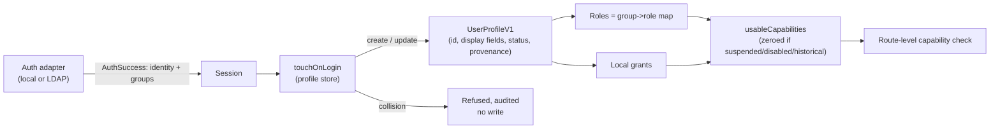

# Identity, profile, capability, and administration foundation

## 1. Problem

Before this chapter, an authenticated collab identity was a bare
`{id, username, displayName}` triple with no persisted profile, no
fine-grained permission unit finer than four ranked roles, and no
administrative surface for anything except searching a directory and
mapping a group DN to one of those four roles. Three concrete failures
followed:

- An administrator could not see *who* had ever signed in, could not
  suspend one person without editing a shared group mapping that might
  affect others, and could not grant one narrow capability (say, viewing
  the audit log) without granting the whole `admin` role.
- A person had no place to see or correct their own display name, contact
  details, or other personalization data, and no contract distinguished
  data the directory owns from data they own.
- Historical/imported actors from a portable investigation (see
  [Portable investigations](../../../collab/contracts/src/investigation-portable.ts))
  had no defined relationship to this system's live identity model, which
  left "does an imported name accidentally become a real, permission-
  bearing account" an open question instead of a closed one.

Out of scope for this chapter: password handling of any kind (the existing
`local-adapter.ts`/`ldap-adapter.ts` own that entirely and are untouched
here), contacting a live directory server for anything beyond what already
shipped, and OIDC as a live provider (the contracts model it as a
forward-compatible provenance value; no OIDC adapter exists yet).

## 2. Status and evidence

| Capability | Status | Evidence | Residual |
| --- | --- | --- | --- |
| Canonical profile contract (mutable display profile split from immutable attribution identity) | Shipped | [`user-profile.ts`](../../../collab/contracts/src/user-profile.ts), [`user-profile.test.ts`](../../../collab/contracts/src/user-profile.test.ts) | Real Unicode confusable-skeleton/homoglyph detection is not attempted — only C0/DEL/zero-width/bidi-control/BOM code points are blocked |
| Capability model (10 fine-grained capabilities, role-default matrix, additive local grants) | Shipped | [`capability.ts`](../../../collab/contracts/src/capability.ts), [`capabilities.ts`](../../../collab/server/src/modules/people/capabilities.ts) | None known |
| Memory + PostgreSQL profile/grant stores with CAS, login-time sync, fail-closed identity collision | Shipped | [`store.ts`](../../../collab/server/src/modules/people/store.ts), [`store.contract-tests.ts`](../../../collab/server/src/modules/people/store.contract-tests.ts) run against both backends by [`store.test.ts`](../../../collab/server/src/modules/people/store.test.ts) and [`pg-store.test.ts`](../../../collab/server/src/modules/people/pg-store.test.ts) | None known |
| Admin operations (search, effective roles/capabilities+source, activate/suspend, grant/revoke, directory-mapping preview) | Shipped | [`admin-routes.ts`](../../../collab/server/src/modules/people/admin-routes.ts), [`admin-routes.test.ts`](../../../collab/server/src/modules/people/admin-routes.test.ts) | CSRF header check covers only these new routes, not the pre-existing `authz`/`cases`/etc. mutation routes |
| Self-service profile API (GET/PATCH own profile, directory-owned fields read-only) | Shipped | [`self-routes.ts`](../../../collab/server/src/modules/people/self-routes.ts), [`self-routes.test.ts`](../../../collab/server/src/modules/people/self-routes.test.ts) | No dedicated self-service UI ships (see §11 and §16) |
| Admin People console (`/admin/people` tab inside Administration) | Shipped | [`AdminPeoplePanel.tsx`](../../../collab/web/src/AdminPeoplePanel.tsx), [`AdminPeoplePanel.test.tsx`](../../../collab/web/src/AdminPeoplePanel.test.tsx), [`Administration.test.tsx`](../../../collab/web/src/Administration.test.tsx) | Detail view is inline-expand, not its own URL per person |
| LDAP-ready claims-to-profile mapping (provider-neutral, pure, admin-previewable) | Shipped as a mapping engine; **not** live-wired | [`directory-mapping.ts`](../../../collab/contracts/src/directory-mapping.ts), preview route in `admin-routes.ts` | Login-time sync never calls this with real directory claims — see §16, this is a named non-claim, not an oversight |
| Portable-investigation interoperability (never grants access, never auto-maps) | Accepted design / already shipped upstream | [`investigation-portable.ts`](../../../collab/contracts/src/investigation-portable.ts) `historicalParticipantsAreAttributionOnly`, `destinationRoleGranted: false` | This chapter does not modify that subsystem; it only keeps `provenance: "imported_historical"` structurally incapable of authenticating or holding a capability (§5) |

## 3. Reusable method

1. **One immutable attribution identity, one mutable display profile.** Every
   durable record (a comment, a timeline event, a decision) stores a small,
   frozen `{id, username, displayName}` at write time and never rejoins it
   against live profile state. A separate, richer profile row is looked up
   only when someone wants to *see or change current information about a
   person* - never to reinterpret history.
2. **Provenance decides field ownership, not a flag on each field.** A
   profile's `provenance` (`local` / `ldap` / `oidc` / `imported_historical`)
   determines, for the whole set of directory-shaped fields at once, whether
   the person or the directory owns them. One pure function
   (`isProfileFieldSelfEditable`) is the only place that decision is made, so
   self-service and admin-on-behalf-of-self code paths cannot drift apart.
3. **Capabilities are resolved, never stored as a flat list.** A capability
   is always derived from `(role defaults) ∪ (local grants)`, filtered
   through one account-status gate (`usableCapabilities`) that zeroes
   everything for a non-active or historical-stub account. No route computes
   authorization any other way.
4. **Identity sync fails closed on ambiguity, never merges.** When a
   returning directory identity's username and directory-subject lookups
   disagree about which existing profile they belong to, the sync refuses
   outright rather than guessing. Nothing is written; the caller (already
   past authentication) surfaces this as an auditable anomaly instead of a
   silent takeover.
5. **Historical import stays a dead end for authority.** An
   `imported_historical` profile can exist (for consistent display of a
   person who only ever appears in someone else's imported investigation)
   but every capability-granting code path checks for that provenance and
   refuses, structurally, not by convention.

## 4. Inputs, outputs, and data contracts

### Canonical profile (`UserProfileV1`)

| Field | Type | Required | Notes |
| --- | --- | :---: | --- |
| `id` | string | yes | Installation-scoped stable id; an LDAP DN for directory provenance, `local:<username>` for local |
| `username` | string | yes | Case-insensitively unique per installation |
| `displayName`, `roleTitle`, `team`, `contactEmail` | string \| null | mixed | Directory-owned when provenance ≠ `local`; see `DIRECTORY_SYNCED_FIELDS` |
| `contactOther`, `avatar`, `customAttributes` | mixed | no | Always self-editable regardless of provenance |
| `status` | `active` \| `suspended` \| `disabled` | yes | `disabled` is reserved for a confirmed directory-removal signal; see §16 |
| `provenance` | `local` \| `ldap` \| `oidc` \| `imported_historical` | yes | Governs field ownership (§3.2) and capability eligibility (§5) |
| `directorySubject` | string \| null | conditional | Required (non-null) whenever provenance ≠ `local` |
| `directorySyncStatus`, `directorySyncedAt` | mixed | yes / no | Honest per §6.3 - never claims `synced` without mapped fields actually being applied |
| `customAttributes` | `{key, value}[]` | yes | Bounded to 16 entries, ASCII key pattern, sorted, no duplicates |
| `revision` | integer | yes | Optimistic-concurrency token for every row-level mutation |

Full shape, bounds, and normalization: [`user-profile.ts`](../../../collab/contracts/src/user-profile.ts).
Never serialized: an LDAP bind password or any credential - this subsystem
never receives one (see §10).

### Capability (`Capability`)

Ten values: `investigation:read`, `investigation:write`,
`evidence:private:read`, `run:strategies`, `decision:accept`,
`export:create`, `portable:restore`, `admin:users`, `admin:system_config`,
`audit:view`. Full default role matrix in §5 and
[`capability.ts`](../../../collab/contracts/src/capability.ts).

### Directory attribute map (`DirectoryAttributeMapV1`)

Logical field → source attribute name (`{displayName: "cn", roleTitle:
"title", team: "departmentNumber", contactEmail: "mail"}` by default).
Provider-neutral: LDAP attributes and OIDC claims look identical to the
mapping function. See [`directory-mapping.ts`](../../../collab/contracts/src/directory-mapping.ts).

## 5. Invariants and trust boundaries

- **Invariant:** `usableCapabilities` returns `[]` whenever `status !==
  "active"` or `provenance === "imported_historical"`, regardless of role
  rank or local grant. Every capability-gated route derives authorization
  through this one function.
- **Invariant:** An admin mutation route decides authorization *before*
  looking up the target id, so a forbidden caller receives an identical 403
  for a real id and a nonexistent one (no enumeration signal).
- **Trust boundary:** the auth adapter boundary is unchanged - this chapter
  never calls `authenticate()` and never sees a password. `touchOnLogin`
  only receives what `AuthSuccess`/`AuthAdapter.provenance` already expose.
- **Untrusted input:** admin-supplied sample claims in the directory-mapping
  preview endpoint are bounded (≤32 entries, bounded key/value length,
  control-character rejection) and are never persisted or used to seed a
  real profile.
- **Authority:** `assertProfileUpdateAllowed` is the single source of truth
  for which fields a person may self-edit; it throws (never silently drops
  a field) so a rejected request can never look like a partial success.
- **Fail-closed rule:** `resolveDirectoryIdentityCollision` refuses (never
  merges) whenever a username lookup and a directory-subject lookup name
  two different existing profiles. See §6.2 for the exact resolution table.

## 6. Algorithm or process detail

### 6.1 Login-time profile sync (`touchOnLogin`)

1. Provenance `local`: if the profile row does not exist, create it with
   the identity's display name; if it exists, only advance `lastSeenAt` -
   local display fields are never overwritten by a login.
2. Provenance `ldap`/`oidc`: look up an existing profile by
   case-insensitive username and by directory subject.
3. Resolve via the table below; on `collision`, write nothing and return
   that outcome so the caller can audit it (never blocks the login itself,
   which the adapter already approved).
4. On `create`/`update`, advance `lastSeenAt`, and set
   `directorySyncStatus`/`directorySyncedAt` to `synced`/now **only if**
   this call actually supplied mapped `directoryFields` - never claim a
   sync that did not happen (this was caught and fixed during review; see
   the "never claim synced" comments in `store.ts`).

| byUsername | byDirectorySubject | Same profile? | Resolution |
| --- | --- | --- | --- |
| absent | absent | — | `create` |
| present | present | yes | `update` (covers an upstream username rename) |
| present | present | **no** | `collision` |
| absent | present | — | `update` |
| present | absent | — | `collision` (username already claimed by a different or local profile) |

### 6.2 Effective vs. usable capabilities

`effectiveCapabilityRows(roles, grants)` answers "what would this
role/grant combination confer" for admin inspection - it does **not** take
account status as an input, so an admin can see what reactivating a
suspended account would restore. `usableCapabilities(profile, roles,
grants)` is the enforcement gate: it calls the same role-matrix resolution
and then zeroes the result for a non-active or historical profile. Route
code must call the enforcement function; only the People admin UI's
inspection view calls the inspection function.

### 6.3 Self-service update

1. Parse and bound the request (`parseUserProfileUpdateRequest`).
2. Load the current profile; `assertProfileUpdateAllowed` rejects the whole
   request if it touches a directory-owned field while provenance ≠
   `local`.
3. `updateFields` applies a CAS-guarded `UPDATE` (memory and Postgres both
   fail closed to `not_found` / `suspended` / `stale_revision`; Postgres
   builds the `SET` clause from only the fields actually present in the
   patch, so an omitted field is never accidentally nulled).

## 7. Performance and bounds

| Dimension | Bound | Enforcement point | Overflow behavior |
| --- | ---: | --- | --- |
| Admin people search page size | 50 | `ADMIN_PEOPLE_MAX_PAGE_SIZE`, `parseAdminPeopleListRequest`/`Response` | Request rejected (>50) or response rejected as contract drift |
| Search term length | 64 normalized chars | `ADMIN_PEOPLE_SEARCH_MAX_LENGTH` | Request rejected |
| Custom attributes | 16 entries, 64-char key, 512-char value | `PROFILE_CUSTOM_ATTR_*` | Request rejected |
| Directory-mapping preview sample claims | 32 entries, 128-char key, 512-char value | `DIRECTORY_MAPPING_PREVIEW_MAX_*` | Request rejected |
| Idempotency cache | 5,000 entries, 10-minute TTL, in-process only | `IdempotencyCache` | Oldest entries pruned; a retry past the TTL just re-executes (safe, since the underlying mutation is independently safe to retry) |

## 8. Failure and recovery

| Failure | Detection | User-visible state | Recovery | Data guarantee |
| --- | --- | --- | --- | --- |
| Directory identity collision at login | `resolveDirectoryIdentityCollision` returns `collision` | Login still succeeds; no profile-visible change | Audited as `profile_sync`/`collision`; needs manual admin investigation (no automatic resolution ships) | The two conflicting profiles are left exactly as they were |
| Stale CAS on a profile mutation | `revision` mismatch on the guarded `UPDATE` | `409` + `stale_revision` | Client re-fetches current revision and retries | No partial write occurred |
| Retried admin mutation (same idempotency key) | `IdempotencyCache` hit | Identical response to the original attempt, not a fresh `stale_revision` | N/A - already succeeded | Exactly one underlying mutation and one audit entry |
| Profile store unavailable during login | `touchOnLogin` throws, caught in `auth/routes.ts` | Login still succeeds | Profile is stale until next successful login | Session and audit outcome unaffected |
| Admin grants a capability to an `imported_historical` id | Provenance check in `admin-routes.ts` | `403 forbidden`, audited `denied` | N/A - structurally refused | No grant row is ever created for that id |

## 9. Observability

Every admin mutation and the self-service update append an
`audit_events` row (`people_search`, `people_effective_read`,
`people_status_update`, `people_grant`, `people_revoke`,
`directory_mapping_preview`, `profile_self_update`, and the login-time
`profile_sync`/`collision` marker) with actor id, target, origin, and
outcome (`success`/`denied`/`failure`) - insert-only, per the existing
`audit_events` trigger (migration `002_auth_audit`). No audit record or log
line ever carries a password, an LDAP bind credential, or a raw sample
claim beyond what the admin themselves typed into a preview request.

## 10. Security and privacy

- **No bind secret anywhere near this subsystem.** `touchOnLogin` receives
  only `{id, username, displayName, provenance, directorySubject}` -
  structurally incapable of carrying a password or bind credential.
- **Enumeration:** admin routes check capability before target existence
  (§5); a non-admin never learns whether a given id exists.
- **Unicode/control-character injection:** every free-text field (display
  name, team, custom attribute values, directory attribute names) is
  NFKC-normalized and rejected if it contains C0/DEL controls, zero-width
  characters, bidi embedding/override/isolate controls, or a BOM - see the
  numeric-range table in `user-profile.ts` (deliberately written as
  `0x...` code-point ranges, never as raw invisible characters in source).
- **Duplicate principals:** enforced at both the contract layer (username
  collisions refuse) and the database layer (`user_profiles_username_lower_idx`
  is a case-insensitive unique index; `pg-store.test.ts` proves it against
  real Postgres).
- **Cross-install id substitution:** admin mutation routes only ever act on
  a profile id that already exists in this installation's own store
  (looked up, never blindly upserted from a caller-supplied id), so a
  crafted id cannot create a phantom, pre-authorized profile.
- **Suspended-user writes:** blocked at two independent layers - the
  capability gate (§5) for anything capability-checked, and the store layer
  itself (`updateFields` refuses a non-active profile even if a caller
  bypassed the route-level check).
- **CSRF:** a custom header (`x-cd-collab-csrf`, shared as a contract
  constant so client and server never drift) is required on every mutating
  route this chapter adds, defense-in-depth on top of the existing
  `SameSite=Lax` session cookie. This does **not** retrofit the
  pre-existing `authz`/`cases`/etc. mutation routes - that is named
  residual work, not a silent gap (see §16).
- **Directory details for non-admins:** the admin-people surface itself is
  gated on `admin:users`; nothing in this chapter exposes another person's
  `directorySubject` (a full LDAP DN) to a non-admin. Self-service GET
  returns only the caller's own record.

## 11. UX and human factors

The People tab lives inside the existing `Administration` component
(`/admin/people`, reachable by a second tab alongside "Group role
mappings"), gated by the same admin-role check App.tsx already applies to
the whole Administration area. It supports search/filter, an inline
"Manage" expand showing effective roles and a full capability table with
source (role vs. local grant), a confirm-before-destructive-action dialog
for suspend/reactivate/grant/revoke, and a synthetic-sample directory-
mapping preview. Historical/imported rows show a fixed explanatory note
instead of any action button - there is no code path that could grant one
a capability, so the UI does not offer a control that would silently fail.

**Residual, by design (§16):** a dedicated self-service profile page (any
authenticated user editing their own display fields) is not part of this
UI. The API and contract fully exist and are tested (§2); wiring a
self-service surface into the shell was deliberately left for a follow-up
because doing it safely requires either a new top-level area in
`app-location.ts`'s `AREA_IDS` or a change to `App.tsx`'s render switch -
both are shell-level changes this chapter's gate asked to avoid making
unilaterally alongside concurrent War Room UX work. See §16 for the full
follow-up spec.

## 12. Test matrix

| Layer | Happy path | Boundary/adversarial path | Evidence |
| --- | --- | --- | --- |
| Contract/unit | round-trip parse, capability resolution, directory mapping | dangerous Unicode, duplicate custom-attribute keys, oversized pages, unknown capability, identity-collision table | `capability.test.ts`, `user-profile.test.ts`, `directory-mapping.test.ts`, `admin-people.test.ts` (58 tests) |
| Server/store | create/update/list, CAS success | stale revision, suspended-write refusal, collision refusal, not_found | `store.test.ts` + `store.contract-tests.ts` run against **both** Memory and Postgres (`pg-store.test.ts`), plus `grants.test.ts`/`pg-grants.test.ts`, `capabilities.test.ts` |
| Server/routes | search, effective, status, grant/revoke, preview | missing CSRF header, idempotent retry after CAS staleness, enumeration-safe 403, historical-stub grant refusal, self-suspend zeroing admin access | `admin-routes.test.ts`, `self-routes.test.ts` (13 tests, full `buildApp` + real login flow) |
| Database constraints | migration up/down in order | case-insensitive duplicate username, directory-subject-required check, JSONB custom-attribute round-trip | `pg-store.test.ts`, `migrate.test.ts` (updated for the new migration), `grants.test.ts` least-privilege pin |
| Web/UI | list/search, manage/expand, suspend/grant/revoke confirm flow, preview | imported_historical never offered an action, tab switch preserves hidden-panel state, direct-load and browser-back on `/admin/people` | `AdminPeoplePanel.test.tsx`, `Administration.test.tsx` |

All contracts, server, and web suites pass; PostgreSQL-backed tests were
run against a real, locally started PostgreSQL 16 instance for this
change (not merely skipped) - see the PR report for exact commands and
counts.

## 13. ContextDesk production anchors

- Contracts: [`capability.ts`](../../../collab/contracts/src/capability.ts),
  [`user-profile.ts`](../../../collab/contracts/src/user-profile.ts),
  [`directory-mapping.ts`](../../../collab/contracts/src/directory-mapping.ts),
  [`admin-people.ts`](../../../collab/contracts/src/admin-people.ts)
- Server: [`collab/server/src/modules/people/`](../../../collab/server/src/modules/people/)
- Migration: [`015_user_profiles.up.sql`](../../../collab/server/src/db/migrations/015_user_profiles.up.sql) / [`.down.sql`](../../../collab/server/src/db/migrations/015_user_profiles.down.sql)
- Web: [`AdminPeoplePanel.tsx`](../../../collab/web/src/AdminPeoplePanel.tsx), the People tab in [`Administration.tsx`](../../../collab/web/src/Administration.tsx)
- Deployment/config: [`collab/deploy/README.md`](../../../collab/deploy/README.md)
- No tracked issue number exists for this chapter at authoring time; residuals below are literal, not linked.

## 14. Shipped / partial / planned matrix

| Slice | Status | What is true now | What is not claimed |
| --- | --- | --- | --- |
| Profile/capability contracts, server stores, admin+self routes | Shipped | Full CRUD/CAS/audit path, tested against Memory and real Postgres | Not deployed to any environment by this chapter; that is an operator action |
| Admin People UI | Shipped | Real, tested React panel reachable at `/admin/people` | Not a full user-detail page with its own URL per person |
| LDAP claim mapping engine | Shipped | Pure, tested, admin-previewable against synthetic sample claims | **Not** wired to any live directory bind - see §16 |
| Self-service profile UI | Not shipped | API/contract fully ships | No UI component exists yet; §16 has the follow-up spec |
| Directory-removal auto-disable | Not shipped | `disabled` status and manual admin path exist | No automatic detection of a person's removal from the directory |

## 15. Reimplementation notes

- The minimum trustworthy subset is: immutable attribution identity kept
  separate from a mutable profile row; provenance-gated field ownership as
  one pure function; capability resolution as one pure function with an
  account-status gate; fail-closed identity-collision resolution as one
  pure function. Everything else (routes, UI, migration DDL) is a
  straightforward wrapper around those four decisions.
- Replaceable: the specific capability names, the specific default
  role→capability matrix, the CSRF header mechanism (custom header is one
  valid choice; a double-submit token is another). Required: that
  authorization is always derived, never stored as a flat allow-list, and
  that the derivation is the same function everywhere.
- Migration/rollback: `015_user_profiles` is additive-only (two new
  tables, no changes to existing tables) and its `.down.sql` drops both
  cleanly; rolling back loses no data outside those two tables. Grants
  cascade-delete with their owning profile row; profiles themselves are
  never hard-deleted by any code path in this chapter (status is the
  lifecycle mechanism), which is why the migration revokes `DELETE` on
  `user_profiles` for the app role but grants it on `user_capability_grants`.
- Tempting shortcut to avoid: computing "effective capabilities" once at
  login and caching it on the session. This chapter deliberately resolves
  capabilities fresh on every capability-gated request (mirroring how
  `authz`'s group→role map already gets reloaded every request) so a
  suspend or a grant/revoke takes effect immediately, not at next login.

## 16. Open residuals

- **Live LDAP attribute sync is not wired.** `directory-mapping.ts` is a
  complete, tested, pure mapping engine, and the admin preview route
  exercises it end-to-end against admin-supplied synthetic sample claims -
  but `touchOnLogin` never receives real directory claims, because
  `AuthAdapter`/`ldap-adapter.ts` do not currently fetch or expose any LDAP
  attribute beyond the DN, username, and display name already used for
  login. Wiring this live requires extending the LDAP adapter's search to
  fetch `cn`/`title`/`departmentNumber`/`mail` (or a configured
  equivalent) alongside the existing group search, and threading the
  result through `AuthSuccess` - deliberately not attempted here to avoid
  changing already-reviewed, security-sensitive bind/search code in a
  foundation PR. No issue is filed for this; it is a named non-claim.
- **Self-service profile UI does not ship.** The API is complete and
  tested (§2, §12). Follow-up spec: a `SelfProfilePanel.tsx` component,
  reachable at a top-level `/profile` route available to any authenticated
  user (not admin-gated), reading/writing `/api/profile/me` with the same
  CSRF header and CAS-retry pattern `AdminPeoplePanel.tsx` already
  demonstrates. Wiring it in requires either a new `AREA_ID` in
  `app-location.ts` plus a render branch in `App.tsx`, or folding it into
  an existing always-reachable area (e.g. a menu item off the topbar) -
  a decision left to whoever owns the shell next, since this chapter's
  gate asked to avoid unilateral `App.tsx` changes alongside concurrent
  War Room UX work.
- **Directory-removal auto-disable is not automatic.** The `disabled`
  status is a real, valid, tested state, settable by an admin through the
  same status endpoint used for suspend/reactivate, but nothing currently
  distinguishes "directory is briefly unreachable" from "this person was
  actually removed" strongly enough to auto-transition a profile - see
  `resolveActiveSession`'s existing `catch { groups = [] }` fallback, which
  already conflates those two cases for group resolution. Closing this
  gap needs a stronger not-found signal from the LDAP adapter.
- **CSRF coverage is scoped to this chapter's new routes.** The
  pre-existing `authz` group-role-map routes and other older mutation
  routes do not carry the new header check. Retrofitting them is
  straightforward (the same `hasCsrfHeader` guard) but out of scope for a
  foundation PR that was asked to avoid unrelated edits to already-shipped
  routes.

## Acceptance checklist

Mapped against the twelve foundation requirements this chapter was
commissioned to satisfy:

1. **Canonical user profile contract.** Shipped - `UserProfileV1` split
   from the pre-existing immutable `IdentityV1` attribution shape; every
   field from the requirement (role/title/team/contact, avatar, status,
   provenance, directory subject, timestamps, bounded custom attributes)
   is present and validated. §4.
2. **LDAP-ready mapping.** Shipped as a pure mapping engine and admin
   preview tool; explicitly **not** live-wired to a real directory (named
   non-claim, §16). No password handling and no directory contact anywhere
   in this chapter's code, matching the requirement's own instruction.
3. **Authorization.** Shipped - versioned 10-capability model covering
   every named area (investigation read/write, private evidence, run
   strategies, accept decisions, exports, portable restore, user
   administration, system configuration, audit viewing), enforced only on
   server routes via `usableCapabilities`. §4, §5, §6.2.
4. **Admin operations.** Shipped - list/search, effective roles/
   capabilities with source, activate/suspend, assign/revoke local grants,
   directory-mapping preview; admin-capability-gated, CSRF-guarded,
   idempotent, CAS'd, bounded errors, append-only audit. §6, §8, §9.
5. **Self-service profile.** Shipped as an API (GET/PATCH own profile,
   directory-owned fields enforced read-only, principal/provenance/role
   changes structurally impossible via contract drift rejection); UI is a
   named residual with a full follow-up spec. §6.3, §11, §16.
6. **Attribution.** Unchanged and preserved - the pre-existing
   `(actor_id, actor_username)` capture-at-write-time pattern across
   cases/timeline/experiments is the shipped mechanism for this; this
   chapter's profile store is additive and never rewrites that history. §3.1.
7. **Portable investigations.** Unchanged and preserved - the existing
   `IdentityMapEntryV1`/`historicalParticipantsAreAttributionOnly`/
   `destinationRoleGranted: false` guarantees in `investigation-portable.ts`
   already satisfy this; this chapter keeps `imported_historical` provenance
   structurally incapable of authenticating or holding a capability so the
   two systems stay consistent. §2, §5.
8. **Persistence.** Shipped - Memory and PostgreSQL parity is a *tested*
   property (the identical `store.contract-tests.ts` suite runs against
   both), migrations are transactional DDL with a clean down-migration,
   mutations are CAS-guarded and idempotency-cached for safe retry, and
   the SQLite/PostgreSQL relationship is documented honestly (§13, §15) -
   SQLite is a single-node JSON-blob wrapper over the Memory stores, not an
   independent relational implementation.
9. **Privacy/security.** Shipped - see the itemized list in §10 (no bind
   secret, enumeration-safe ordering, dangerous-Unicode rejection,
   duplicate-principal prevention at two layers, cross-install id
   substitution prevention, suspended-user write blocking at two layers,
   CSRF).
10. **Admin UI.** Shipped as a focused `/admin/people` tab inside the
    existing Administration console, using only new modules
    (`AdminPeoplePanel.tsx`), with an additive tab-strip seam rather than a
    rewrite of `App.tsx` or `app-location.ts`'s existing behavior. §11.
11. **Tests.** Shipped - contract/server/store/route/web tests, explicit
    Memory+PostgreSQL parity, adversarial mapping/authorization tests
    (collision, historical-stub grant refusal, privilege escalation via
    self-PATCH, stale CAS, suspend race via the setStatus regression test),
    duplicate/reordered request handling (idempotency cache), and a
    direct-route/reload test for the UI. §12.
12. **Docs.** This chapter - deployment configuration is unchanged from
    [`collab/deploy/README.md`](../../../collab/deploy/README.md) (no new
    required environment variable; the directory attribute map is admin-
    configured at request time, not env-loaded, in V1), LDAP-readiness vs
    live-LDAP is stated as a non-claim (§2, §16), the role/capability
    matrix is §4/§5, the admin workflow is §6/§11, migration/rollback is
    §15, the privacy boundary is §10, and this list is the acceptance
    checklist.

## Author checklist

- [x] Problem and non-goals are explicit.
- [x] Every meaningful capability has a status and evidence.
- [x] Reusable method is separate from ContextDesk anchors.
- [x] The Mermaid diagram has a specific `%% title:` and matches adjacent prose.
- [x] Inputs, outputs, identity, version, units, and missing-value semantics are defined.
- [x] Invariants and trust boundaries are testable.
- [x] Algorithm is detailed enough for independent implementation.
- [x] Hard bounds are stated.
- [x] Failure, cancellation, recovery, and prior-state guarantees are covered.
- [x] Observability avoids private data.
- [x] Security, privacy, and egress are reviewed.
- [x] UX communicates uncertainty and user control.
- [x] Tests span contract, server/store, routes, database constraints, and web.
- [x] Shipped, partial, accepted, and planned work are not conflated.
- [x] Reimplementation notes identify replaceable technology and required semantics.
- [x] Residuals are literal; no issue exists to link, and that is stated rather than implied.
- [ ] Relative Markdown links resolve (verify at review time; file paths are relative to this chapter's own directory).
- [ ] `git diff --check` passes (checked as part of the PR verification pass).
