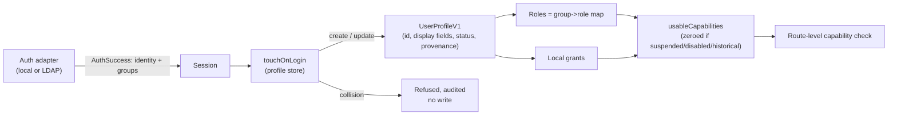

# Identity, profile, capability, and administration foundation

## 1. Problem

Before this chapter, an authenticated collab identity was a bare
`{id, username, displayName}` triple with no persisted profile, no
fine-grained permission unit finer than four ranked roles, and no
administrative surface for anything except searching a directory and
mapping a group DN to one of those four roles. Three concrete failures
followed:

- An administrator could not see *who* had ever signed in, could not
  suspend one person without editing a shared group mapping that might
  affect others, and could not grant one narrow capability (say, viewing
  the audit log) without granting the whole `admin` role.
- A person had no place to see or correct their own display name, contact
  details, or other personalization data, and no contract distinguished
  data the directory owns from data they own.
- Historical/imported actors from a portable investigation (see
  [Portable investigations](../../../collab/contracts/src/investigation-portable.ts))
  had no defined relationship to this system's live identity model, which
  left "does an imported name accidentally become a real, permission-
  bearing account" an open question instead of a closed one.

Out of scope for this chapter: changing password storage or directory-backed
password verification (the existing `local-adapter.ts`/`ldap-adapter.ts` own
those), contacting a live directory server for anything beyond what already
shipped, and OIDC as a live provider (the contracts model it as a
forward-compatible provenance value; no OIDC adapter exists yet). Local demo
password verification does use fixed-length timing-safe comparison.

## 2. Status and evidence

| Capability | Status | Evidence | Residual |
| --- | --- | --- | --- |
| Canonical profile contract (mutable display profile split from immutable attribution identity) | Shipped | [`user-profile.ts`](../../../collab/contracts/src/user-profile.ts), [`user-profile.test.ts`](../../../collab/contracts/src/user-profile.test.ts) | Real Unicode confusable-skeleton/homoglyph detection is not attempted — only C0/DEL/zero-width/bidi-control/BOM code points are blocked |
| Capability model v2 (11 fine-grained capabilities, role-default matrix, additive local grants) | **Partial**: contract and server route enforcement accepted; queue query and UI remain absent | [`capability.ts`](../../../collab/contracts/src/capability.ts), [`capabilities.ts`](../../../collab/server/src/modules/people/capabilities.ts), [`session-authorization.ts`](../../../collab/server/src/modules/authz/session-authorization.ts) | `investigation:coordinate` is enforced for privileged actions on the singular coordination route; no queue query or UI uses it yet |
| Memory + PostgreSQL profile/grant stores with CAS, login-time sync, fail-closed identity collision | Shipped | [`store.ts`](../../../collab/server/src/modules/people/store.ts), [`store.contract-tests.ts`](../../../collab/server/src/modules/people/store.contract-tests.ts) run against both backends by [`store.test.ts`](../../../collab/server/src/modules/people/store.test.ts) and [`pg-store.test.ts`](../../../collab/server/src/modules/people/pg-store.test.ts) | None known |
| Admin operations (search, effective roles/capabilities+source, activate/suspend, grant/revoke, directory-mapping preview) | Shipped | [`admin-routes.ts`](../../../collab/server/src/modules/people/admin-routes.ts), [`admin-routes.test.ts`](../../../collab/server/src/modules/people/admin-routes.test.ts) | Directory-removal auto-disable remains a named residual in §16; browser mutation CSRF is now system-wide (see §10) |
| Domain-wide session authorization and suspension fail-closed | Shipped | [`session-authorization.ts`](../../../collab/server/src/modules/authz/session-authorization.ts), [`authorization.adversarial.test.ts`](../../../collab/server/src/modules/authz/authorization.adversarial.test.ts), War Room domain/admin `routes.ts` files | None known |
| Restart recovery re-authorization for queued triage jobs | **Local integration** | [`recovery-authorization.ts`](../../../collab/server/src/modules/authz/recovery-authorization.ts) injected into [`TriageRunService.recoverPending`](../../../collab/server/src/modules/triage-runs/service.ts); adversarial proof in [`recovery.adversarial.test.ts`](../../../collab/server/src/modules/triage-runs/recovery.adversarial.test.ts) | Foreground `create()` still uses the submitting session's current flags. Expired running leases stay `worker_lease_expired` and are not re-executed. Demo/qualification hosts that never call `recoverPending` do not inject the seam; a missing seam fails closed. |
| Self-service profile API (GET/PATCH own profile, directory-owned fields read-only, DN-free responses) | Shipped | [`self-routes.ts`](../../../collab/server/src/modules/people/self-routes.ts), [`self-routes.test.ts`](../../../collab/server/src/modules/people/self-routes.test.ts), `redactProfileForSelfView` in [`user-profile.ts`](../../../collab/contracts/src/user-profile.ts) | Redaction covers this surface only; the session responses and activity feed still carry the DN as the attribution key — see §16 |
| Self-service profile UI (`/profile`, account-menu destination) | Shipped | [`SelfProfilePanel.tsx`](../../../collab/web/src/SelfProfilePanel.tsx), [`SelfProfilePanel.test.tsx`](../../../collab/web/src/SelfProfilePanel.test.tsx), [`App.test.tsx`](../../../collab/web/src/App.test.tsx), Help article `my-profile` | Directory-owned fields stay read-only in the UI; the UI still cannot write LDAP |
| Admin People console (`/admin/people` first-class shell location; `/administration` remains the roles alias) | Shipped | [`AdminPeoplePanel.tsx`](../../../collab/web/src/AdminPeoplePanel.tsx), [`AdminPeoplePanel.test.tsx`](../../../collab/web/src/AdminPeoplePanel.test.tsx), [`Administration.test.tsx`](../../../collab/web/src/Administration.test.tsx), [`app-location.ts`](../../../collab/web/src/app-location.ts) | Detail view is inline-expand, not its own URL per person |
| LDAP-ready claims-to-profile mapping (provider-neutral, pure, admin-previewable) | **Shipped**; login-time LDAP attribute sync is wired | [`directory-mapping.ts`](../../../collab/contracts/src/directory-mapping.ts), [`ldap-adapter.ts`](../../../collab/server/src/modules/auth/ldap-adapter.ts), preview route in `admin-routes.ts` | Live company-directory qualification is not claimed; directory-removal auto-disable remains residual — see §16 |
| Client-address attribution behind a TLS-terminating ingress (`COLLAB_TRUST_PROXY`) | Shipped | [`config.ts`](../../../collab/server/src/config.ts) `parseTrustProxy`, wired in [`app.ts`](../../../collab/server/src/app.ts), [`ingress-trust.test.ts`](../../../collab/server/src/modules/auth/ingress-trust.test.ts) | Opt-in: unset means the socket peer is the client. Trust-all is refused, so an operator must state the hop count or the proxy addresses |
| Directory transport trust: PEM-only CA, refused paths, proven LDAPS handshake | Shipped | [`ldap-config.ts`](../../../collab/server/src/modules/auth/ldap-config.ts) `loadTrustAnchors`, [`ldap-live.ts`](../../../collab/server/src/modules/auth/ldap-live.ts) `handshake`, [`ldap-transport.test.ts`](../../../collab/server/src/modules/auth/ldap-transport.test.ts) | `COLLAB_LDAP_CA` replaces Node's default roots rather than adding to them; adding to system trust is `NODE_EXTRA_CA_CERTS`, which this code does not validate |
| Administrative group picker across OpenLDAP and Active Directory schemas | Shipped | [`ldap-adapter.ts`](../../../collab/server/src/modules/auth/ldap-adapter.ts) `directoryGroupFilter`, [`ldap-directory-schema.test.ts`](../../../collab/server/src/modules/auth/ldap-directory-schema.test.ts) | Matches `groupOfNames`, `groupOfUniqueNames`, `group`, `posixGroup` only; a site-specific structural class is not discovered |
| Portable-investigation interoperability (never grants access, never auto-maps) | Accepted design / already shipped upstream | [`investigation-portable.ts`](../../../collab/contracts/src/investigation-portable.ts) `historicalParticipantsAreAttributionOnly`, `destinationRoleGranted: false` | This chapter does not modify that subsystem; it only keeps `provenance: "imported_historical"` structurally incapable of authenticating or holding a capability (§5) |

## 3. Reusable method

1. **One immutable attribution identity, one mutable display profile.** Every
   durable record (a comment, a timeline event, a decision) stores a small,
   frozen `{id, username, displayName}` at write time and never rejoins it
   against live profile state. A separate, richer profile row is looked up
   only when someone wants to *see or change current information about a
   person* - never to reinterpret history.
2. **Provenance decides field ownership, not a flag on each field.** A
   profile's `provenance` (`local` / `ldap` / `oidc` / `imported_historical`)
   determines, for the whole set of directory-shaped fields at once, whether
   the person or the directory owns them. One pure function
   (`isProfileFieldSelfEditable`) is the only place that decision is made, so
   self-service and admin-on-behalf-of-self code paths cannot drift apart.
3. **Capabilities are resolved, never stored as a flat list.** A capability
   is always derived from `(role defaults) ∪ (local grants)`, filtered
   through one account-status gate (`usableCapabilities`) that zeroes
   everything for a non-active or historical-stub account. No route computes
   authorization any other way.
4. **Identity sync fails closed on ambiguity, never merges.** When a
   returning directory identity's username and directory-subject lookups
   disagree about which existing profile they belong to, the sync refuses
   outright rather than guessing. Nothing is written; the caller (already
   past authentication) surfaces this as an auditable anomaly instead of a
   silent takeover.
5. **Historical import stays a dead end for authority.** An
   `imported_historical` profile can exist (for consistent display of a
   person who only ever appears in someone else's imported investigation)
   but every capability-granting code path checks for that provenance and
   refuses, structurally, not by convention.

## 4. Inputs, outputs, and data contracts

### Canonical profile (`UserProfileV1`)

| Field | Type | Required | Notes |
| --- | --- | :---: | --- |
| `id` | string | yes | Installation-scoped stable id; an LDAP DN for directory provenance, `local:<username>` for local |
| `username` | string | yes | Case-insensitively unique per installation |
| `displayName`, `roleTitle`, `team`, `contactEmail` | string \| null | mixed | Directory-owned when provenance ≠ `local`; see `DIRECTORY_SYNCED_FIELDS` |
| `contactOther`, `avatar`, `customAttributes` | mixed | no | Always self-editable regardless of provenance |
| `status` | `active` \| `suspended` \| `disabled` | yes | `disabled` is reserved for a confirmed directory-removal signal; see §16 |
| `provenance` | `local` \| `ldap` \| `oidc` \| `imported_historical` | yes | Governs field ownership (§3.2) and capability eligibility (§5) |
| `directorySubject` | string \| null | conditional | Required (non-null) whenever provenance ≠ `local` |
| `directorySyncStatus`, `directorySyncedAt` | mixed | yes / no | Honest per §6.3 - never claims `synced` without mapped fields actually being applied |
| `customAttributes` | `{key, value}[]` | yes | Bounded to 16 entries, ASCII key pattern, sorted, no duplicates |
| `revision` | integer | yes | Optimistic-concurrency token for every row-level mutation |

Full shape, bounds, and normalization: [`user-profile.ts`](../../../collab/contracts/src/user-profile.ts).
Never serialized: an LDAP bind password or any credential - this subsystem
never receives one (see §10).

### Capability (`Capability`)

Ten values: `investigation:read`, `investigation:write`,
`evidence:private:read`, `run:strategies`, `decision:accept`,
`export:create`, `portable:restore`, `admin:users`, `admin:system_config`,
`audit:view`. Full default role matrix in §5 and
[`capability.ts`](../../../collab/contracts/src/capability.ts).

### Directory attribute map (`DirectoryAttributeMapV1`)

Logical field → source attribute name (`{displayName: "cn", roleTitle:
"title", team: "departmentNumber", contactEmail: "mail"}` by default).
Provider-neutral: LDAP attributes and OIDC claims look identical to the
mapping function. See [`directory-mapping.ts`](../../../collab/contracts/src/directory-mapping.ts).

## 5. Invariants and trust boundaries

- **Invariant:** `usableCapabilities` returns `[]` whenever `status !==
  "active"` or `provenance === "imported_historical"`, regardless of role
  rank or local grant. War Room domain and admin routes derive the live
  capability set through one function, `authorizeSession`, which reloads
  groups, roles, profile status, and local grants on every request and
  never caches capabilities on the session record. Missing, suspended,
  disabled, or historical profiles fail closed as unauthenticated (`401`)
  on an existing cookie; a fresh login for those accounts is
  `403 access_denied` with no cookie. Membership bypass (`isAdmin`) stays
  the `admin` *role*, not `admin:users`. Restart recovery of a queued
  triage job uses the same derivation through `authorizeRecoveryRequester`
  (no cookie, no cached roles) and then re-checks current case access,
  `run:strategies`, and `evidence:private:read` before claiming a worker
  lease, reading evidence bytes, or calling a provider. Stale admin or
  private authority from queue time is never inherited. A snapshot that
  still contains `owner_only` evidence fails closed when private-read is
  no longer granted, rather than materializing those bytes.
- **Invariant:** An admin mutation route decides authorization *before*
  looking up the target id, so a forbidden caller receives an identical 403
  for a real id and a nonexistent one (no enumeration signal).
- **Trust boundary:** `request.ip` is the client identity used by the login
  rate limiter and written as the audit `origin`. Fastify derives it from the
  socket peer unless an ingress is declared, so behind a TLS-terminating
  reverse proxy every request is attributed to the proxy: one account's failed
  sign-ins bucket the whole workspace, and no audit row can name an origin.
  `COLLAB_TRUST_PROXY` moves that boundary explicitly - a hop count, or the
  proxy addresses/CIDRs. It is opt-in because a directly exposed deployment
  must not honour `X-Forwarded-For`, and trust-all is refused outright: it
  would let any client choose its own rate-limit bucket and audit origin.
- **Trust boundary:** directory transport trust is proven, never assumed.
  `COLLAB_LDAP_CA` carries PEM content and *replaces* Node's default roots for
  the directory connection; `node:tls` accepts any string for `ca` without
  error, so a filesystem path would leave an empty trust store and fail every
  handshake opaquely - `loadTrustAnchors` refuses it at load time. On LDAPS the
  transport stage passes only when the directory answered over the established
  socket (an LDAP result code, or a still-open connection); a connect, DNS, or
  certificate failure stays a transport failure, so the operator probe cannot
  report an unreachable directory as available.
- **Trust boundary:** the auth adapter boundary is unchanged - this chapter
  never calls `authenticate()` and never sees a password. `touchOnLogin`
  only receives what `AuthSuccess`/`AuthAdapter.provenance` already expose.
- **Untrusted input:** admin-supplied sample claims in the directory-mapping
  preview endpoint are bounded (≤32 entries, bounded key/value length,
  control-character rejection) and are never persisted or used to seed a
  real profile.
- **Authority:** `assertProfileUpdateAllowed` is the single source of truth
  for which fields a person may self-edit; it throws (never silently drops
  a field) so a rejected request can never look like a partial success.
- **Fail-closed rule:** `resolveDirectoryIdentityCollision` refuses (never
  merges) whenever a username lookup and a directory-subject lookup name
  two different existing profiles. See §6.2 for the exact resolution table.
- **Trust boundary:** the self-service profile responses (`GET`/`PATCH
  /api/profile/me`) are projected through `redactProfileForSelfView` before
  they leave the server. Under directory provenance both `directorySubject`
  and the equal-valued `id` are the raw LDAP DN (or OIDC subject), which
  discloses directory tree structure - organizational units, naming
  attribute, base DN - to the recipient. The owner's view needs only
  *whether* a linkage exists, and the UI already states that the technical
  identifier is hidden, so the wire must not contradict it. Redaction is a
  response projection only: the store keeps the real subject, and the
  admin surfaces (`/api/admin/people/*`, gated on `admin:users`) return it
  unprojected, because an administrator is the audience it exists for.
- **Scope limit (not an invariant):** the redaction above covers the
  self-service profile surface only. `IdentityV1.id` is the installation's
  durable attribution key, so under directory authentication the DN is also
  the `authorId`/`actorId` written into contributions, decisions,
  discussions, and timeline rows, and it is returned by the session
  responses and the non-admin activity feed. Making those surfaces
  DN-free is an opaque-identifier migration across already-written durable
  records, not an output-boundary change - see §16.

## 6. Algorithm or process detail

### 6.1 Login-time profile sync (`touchOnLogin`)

1. Provenance `local`: if the profile row does not exist, create it with
   the identity's display name; if it exists, only advance `lastSeenAt` -
   local display fields are never overwritten by a login.
2. Provenance `ldap`/`oidc`: look up an existing profile by
   case-insensitive username and by directory subject.
3. Resolve via the table below; on `collision`, write nothing and return
   that outcome so the caller can audit it (never blocks the login itself,
   which the adapter already approved).
4. On `create`/`update`, advance `lastSeenAt`, and set
   `directorySyncStatus`/`directorySyncedAt` to `synced`/now **only if**
   this call actually supplied mapped `directoryFields` - never claim a
   sync that did not happen (this was caught and fixed during review; see
   the "never claim synced" comments in `store.ts`).

| byUsername | byDirectorySubject | Same profile? | Resolution |
| --- | --- | --- | --- |
| absent | absent | — | `create` |
| present | present | yes | `update` (covers an upstream username rename) |
| present | present | **no** | `collision` |
| absent | present | — | `update` |
| present | absent | — | `collision` (username already claimed by a different or local profile) |

### 6.2 Effective vs. usable capabilities

`effectiveCapabilityRows(roles, grants)` answers "what would this
role/grant combination confer" for admin inspection - it does **not** take
account status as an input, so an admin can see what reactivating a
suspended account would restore. `usableCapabilities(profile, roles,
grants)` is the enforcement gate: it calls the same role-matrix resolution
and then zeroes the result for a non-active or historical profile.
`authorizeSession` is the only session path War Room routes use for that
gate: route handlers call `ctx.has("…")` on that result instead of
re-deriving `canPerform(roles, …)` booleans. Only the People admin UI's
inspection view calls the inspection function.

### 6.3 Investigation coordination capability

Capability model v2 adds `investigation:coordinate` immediately after
`investigation:write`. Its default holders are `case-lead` and `admin`; a
local grant may add it without assigning either role. The normal profile gate
still removes it from suspended, disabled, and imported-historical identities.

This is an **accepted contract with a local server integration**. The
coordination route and store use the permission for action-specific
authorization; no queue query or UI uses it yet. Every coordination request must
re-authorize the session and investigation membership for every request; a
visible button or UI strategy may never stand in for that check.
`claim_self` uses the existing `investigation:write` gate and requires
current-participant eligibility. A route-authorized current holder may use
`release_self` without a second eligibility refusal; if the holder can no
longer authorize, privileged release is the cleanup path. The
`assign_participant` and `release_participant` actions require case access plus
`investigation:coordinate`. A single shared gate for all four actions is not
permitted.

Capability model v2 and the closed capability enum carried by `session.v1`
are one coupled deployment unit. Mixed old/new contract and server deployments
fail closed and must be rolled together; no caller may infer v2 support from a
string that an older database constraint cannot store.

### 6.4 Self-service update

1. Parse and bound the request (`parseUserProfileUpdateRequest`).
2. Load the current profile; `assertProfileUpdateAllowed` rejects the whole
   request if it touches a directory-owned field while provenance ≠
   `local`.
3. `updateFields` applies a CAS-guarded `UPDATE` (memory and Postgres both
   fail closed to `not_found` / `suspended` / `stale_revision`; Postgres
   builds the `SET` clause from only the fields actually present in the
   patch, so an omitted field is never accidentally nulled).

## 7. Performance and bounds

| Dimension | Bound | Enforcement point | Overflow behavior |
| --- | ---: | --- | --- |
| Admin people search page size | 50 | `ADMIN_PEOPLE_MAX_PAGE_SIZE`, `parseAdminPeopleListRequest`/`Response` | Request rejected (>50) or response rejected as contract drift |
| Search term length | 64 normalized chars | `ADMIN_PEOPLE_SEARCH_MAX_LENGTH` | Request rejected |
| Custom attributes | 16 entries, 64-char key, 512-char value | `PROFILE_CUSTOM_ATTR_*` | Request rejected |
| Directory-mapping preview sample claims | 32 entries, 128-char key, 512-char value | `DIRECTORY_MAPPING_PREVIEW_MAX_*` | Request rejected |
| Idempotency cache | 5,000 entries, 10-minute TTL, in-process only | `IdempotencyCache` | Oldest entries pruned; a retry past the TTL just re-executes (safe, since the underlying mutation is independently safe to retry) |

## 8. Failure and recovery

| Failure | Detection | User-visible state | Recovery | Data guarantee |
| --- | --- | --- | --- | --- |
| Directory identity collision at login | `resolveDirectoryIdentityCollision` returns `collision` | Login still succeeds; no profile-visible change | Audited as `profile_sync`/`collision`; needs manual admin investigation (no automatic resolution ships) | The two conflicting profiles are left exactly as they were |
| Stale CAS on a profile mutation | `revision` mismatch on the guarded `UPDATE` | `409` + `stale_revision` | Client re-fetches current revision and retries | No partial write occurred |
| Retried admin mutation (same idempotency key) | `IdempotencyCache` hit | Identical response to the original attempt, not a fresh `stale_revision` | N/A - already succeeded | Exactly one underlying mutation and one audit entry |
| Profile store unavailable during login | `touchOnLogin` or follow-up `getById` throws, caught in `auth/routes.ts` | Login is refused (`403 access_denied`); any cookie created before the failure is revoked | Retry after the store recovers | No durable session is left for an account whose profile cannot be confirmed usable |
| Queued triage job recovered after restart | `recoverPending` re-resolves the requester through `authorizeRecoveryRequester` before `claimQueued` | Unauthorized work becomes a terminal `failed` job with an explicit `stoppedReason` (`requester_suspended`, `requester_disabled`, `requester_historical`, `requester_not_member`, `requester_run_revoked`, `requester_private_read_revoked`, `recovery_authorization_unavailable`, …) | Active authorized requesters resume with only their current capabilities | No provider call and no `owner_only` byte read on refusal; expired running leases remain `worker_lease_expired` |
| Admin grants a capability to an `imported_historical` id | Provenance check in `admin-routes.ts` | `403 forbidden`, audited `denied` | N/A - structurally refused | No grant row is ever created for that id |

## 9. Observability

Every admin mutation and the self-service update append an
`audit_events` row (`people_search`, `people_effective_read`,
`people_status_update`, `people_grant`, `people_revoke`,
`directory_mapping_preview`, `profile_self_update`, and the login-time
`profile_sync`/`collision` marker) with actor id, target, origin, and
outcome (`success`/`denied`/`failure`) - insert-only, per the existing
`audit_events` trigger (migration `002_auth_audit`). No audit record or log
line ever carries a password, an LDAP bind credential, or a raw sample
claim beyond what the admin themselves typed into a preview request.

## 10. Security and privacy

- **No bind secret anywhere near this subsystem.** `touchOnLogin` receives
  only `{id, username, displayName, provenance, directorySubject}` -
  structurally incapable of carrying a password or bind credential.
- **Enumeration:** admin routes check capability before target existence
  (§5); a non-admin never learns whether a given id exists.
- **Unicode/control-character injection:** every free-text field (display
  name, team, custom attribute values, directory attribute names) is
  NFKC-normalized and rejected if it contains C0/DEL controls, zero-width
  characters, bidi embedding/override/isolate controls, or a BOM - see the
  numeric-range table in `user-profile.ts` (deliberately written as
  `0x...` code-point ranges, never as raw invisible characters in source).
- **Duplicate principals:** enforced at both the contract layer (username
  collisions refuse) and the database layer (`user_profiles_username_lower_idx`
  is a case-insensitive unique index; `pg-store.test.ts` proves it against
  real Postgres).
- **Cross-install id substitution:** admin mutation routes only ever act on
  a profile id that already exists in this installation's own store
  (looked up, never blindly upserted from a caller-supplied id), so a
  crafted id cannot create a phantom, pre-authorized profile.
- **Suspended-user writes:** blocked at two independent layers - the
  capability gate (§5) for anything capability-checked, and the store layer
  itself (`updateFields` refuses a non-active profile even if a caller
  bypassed the route-level check).
- **CSRF:** a custom header (`x-cd-collab-csrf`, shared as a contract
  constant so client and server never drift) is required on every
  cookie-authenticated state-changing `/api` request (`POST`/`PUT`/`PATCH`/
  `DELETE`), defense-in-depth on top of the existing `SameSite=Lax` session
  cookie. The canonical predicate and header live in
  [`csrf.ts`](../../../collab/contracts/src/csrf.ts); the server enforces
  them in an `onRequest` hook before domain writes. Narrow exemptions are
  login, logout, and `/api/setup/*` (pre-auth / first-run). Safe GET/HEAD
  are unaffected. The shipped web mutation client
  (`protectedApiFetch`) sends the header.
- **Directory details for non-admins:** the admin-people surface itself is
  gated on `admin:users`; nothing in this chapter exposes another person's
  `directorySubject` (a full LDAP DN) to a non-admin. Self-service GET
  returns only the caller's own record.

## 11. UX and human factors

The People tab lives inside the existing `Administration` component
and is a **first-class shell location** at `/admin/people`. `parsePathname`,
`pathFor`, sign-in restore, and copied links round-trip to that tab.
`/administration` remains the Group role mappings alias. The Administration
chrome and both direct administration routes
are gated by `admin:users`, not by the raw `admin` role: a viewer with
that local grant sees the destination; a case-lead without it does not.
The console supports search/filter, an inline
"Manage" expand showing effective roles and a full capability table with
source (role vs. local grant), a confirm-before-destructive-action dialog
for suspend/reactivate/grant/revoke, and a synthetic-sample directory-
mapping preview. Historical/imported rows show a fixed explanatory note
instead of any action button - there is no code path that could grant one
a capability, so the UI does not offer a control that would silently fail.

**Self-service profile** is a first-class authenticated destination at
`/profile`, opened from the account menu as "My profile". It is not
admin-gated. The panel reads and patches `/api/profile/me` with the CSRF
header and `expectedRevision`, shows directory-owned fields as read-only
plain language for LDAP/OIDC accounts, keeps local-only contact/avatar/
custom fields editable, preserves a draft across stale-revision `409`
recovery, and states that historical attribution is never rewritten.

## 12. Test matrix

| Layer | Happy path | Boundary/adversarial path | Evidence |
| --- | --- | --- | --- |
| Contract/unit | round-trip parse, capability resolution, directory mapping | dangerous Unicode, duplicate custom-attribute keys, oversized pages, unknown capability, identity-collision table | `capability.test.ts`, `user-profile.test.ts`, `directory-mapping.test.ts`, `admin-people.test.ts` (58 tests) |
| Server/store | create/update/list, CAS success | stale revision, suspended-write refusal, collision refusal, not_found | `store.test.ts` + `store.contract-tests.ts` run against **both** Memory and Postgres (`pg-store.test.ts`), plus `grants.test.ts`/`pg-grants.test.ts`, `capabilities.test.ts` |
| Server/routes | search, effective, status, grant/revoke, preview; domain-wide capability gates | missing CSRF header, idempotent retry after CAS staleness, enumeration-safe 403, historical-stub grant refusal, self-suspend fail-closed (`401`), suspended/historical login refusal, local-grant write then revoke, owner_only bytes require `evidence:private:read` | `admin-routes.test.ts`, `self-routes.test.ts`, `authorization.adversarial.test.ts` (full `buildApp` + real login flow). System-wide cookie-authenticated mutation CSRF is proven in `csrf.adversarial.test.ts` |
| Server/restart recovery | active authorized queued job resumes with current admin/private flags | suspension/disable/historical after queue, membership loss, `run:strategies` revoke, `evidence:private:read` revoke on `owner_only` snapshots, profile/grant store throw, missing seam, zero provider/byte reads on refusal, restart idempotency | `recovery-authorization.test.ts`, `recovery.adversarial.test.ts`, membership-loss case in `triage-runs.test.ts` |
| Database constraints | migration up/down in order | case-insensitive duplicate username, directory-subject-required check, JSONB custom-attribute round-trip | `pg-store.test.ts`, `migrate.test.ts` (updated for the new migration), `grants.test.ts` least-privilege pin |
| Web/UI | list/search, manage/expand, suspend/grant/revoke confirm flow, preview; self-service `/profile` load/edit/LDAP-readonly/409 draft recovery | imported_historical never offered an action, tab switch preserves hidden-panel state, direct-load and browser-back on `/admin/people` and `/profile` | `AdminPeoplePanel.test.tsx`, `Administration.test.tsx`, `SelfProfilePanel.test.tsx`, `App.test.tsx`, `HelpCenter.test.tsx` |

All contracts, server, and web suites pass; PostgreSQL-backed tests were
run against a real, locally started PostgreSQL 16 instance for this
change (not merely skipped) - see the PR report for exact commands and
counts.

## 13. ContextDesk production anchors

- Contracts: [`capability.ts`](../../../collab/contracts/src/capability.ts),
  [`user-profile.ts`](../../../collab/contracts/src/user-profile.ts),
  [`directory-mapping.ts`](../../../collab/contracts/src/directory-mapping.ts),
  [`admin-people.ts`](../../../collab/contracts/src/admin-people.ts)
- Server: [`collab/server/src/modules/people/`](../../../collab/server/src/modules/people/)
- Migration: [`015_user_profiles.up.sql`](../../../collab/server/src/db/migrations/015_user_profiles.up.sql) / [`.down.sql`](../../../collab/server/src/db/migrations/015_user_profiles.down.sql). This is the profile/grants schema only. It is **not** the collab storage head. Later additive migrations include [`016_contribution_write_intents.up.sql`](../../../collab/server/src/db/migrations/016_contribution_write_intents.up.sql), [`017_investigation_record.up.sql`](../../../collab/server/src/db/migrations/017_investigation_record.up.sql), [`018_log_time.up.sql`](../../../collab/server/src/db/migrations/018_log_time.up.sql), [`019_experiment_lock_privilege.up.sql`](../../../collab/server/src/db/migrations/019_experiment_lock_privilege.up.sql), [`020_model_purpose_policy.up.sql`](../../../collab/server/src/db/migrations/020_model_purpose_policy.up.sql), and [`021_workbench.up.sql`](../../../collab/server/src/db/migrations/021_workbench.up.sql) (investigation Log workbench records and snapshot normalization-revision binding), which is the current head. Synthetic component-health fixtures must report the head, not `015_user_profiles`; the server fixture now reads it from the migration directory rather than restating it, so landing a migration cannot leave a superseded head behind.
- Web: [`AdminPeoplePanel.tsx`](../../../collab/web/src/AdminPeoplePanel.tsx), the People tab in [`Administration.tsx`](../../../collab/web/src/Administration.tsx), [`SelfProfilePanel.tsx`](../../../collab/web/src/SelfProfilePanel.tsx) at `/profile`
- Deployment/config: [`collab/deploy/README.md`](../../../collab/deploy/README.md)
- No tracked issue number exists for this chapter at authoring time; residuals below are literal, not linked.

## 14. Shipped / partial / planned matrix

| Slice | Status | What is true now | What is not claimed |
| --- | --- | --- | --- |
| Profile/capability contracts, server stores, admin+self routes | Shipped | Full CRUD/CAS/audit path, tested against Memory and real Postgres | Not deployed to any environment by this chapter; that is an operator action |
| Admin People UI | Shipped | Real, tested React panel at canonical `/admin/people` (legacy `/administration` alias for role mappings) | Not a full user-detail page with its own URL per person |
| LDAP claim mapping engine | Shipped | Pure, tested, admin-previewable against synthetic sample claims | Does not contact a live company directory |
| LDAP login-time attribute sync | **Local integration** | `LdapAuthAdapter` fetches configured display/email/title/team claims and `touchOnLogin` records honest sync status | Not a claim that any employer Active Directory has been qualified |
| Self-service profile UI | Shipped | Real, tested React page at `/profile` for any authenticated user | Does not write to LDAP/OIDC |
| Directory administration / probe | **Local integration** | Share-safe `/admin/ldap` view plus staged connectivity test, on-demand configuration reload that drops the report it no longer describes; first-run optional probe | Probe does not install the service; stored secrets are never returned; there is no post-install edit/apply/rollback path — settings are operator-owned (§16) |
| Directory-removal auto-disable | Not shipped | `disabled` status and manual admin path exist | No automatic detection of a person's removal from the directory |
| Restart recovery re-authorization | **Local integration** | Queued triage jobs re-resolve current profile/roles/grants/case access/`run:strategies`/`evidence:private:read` before lease claim | Not a claim that in-flight expired leases are replayed, or that hosts other than `cd-collab` `index.ts` inject the seam |

## 15. Reimplementation notes

- The minimum trustworthy subset is: immutable attribution identity kept
  separate from a mutable profile row; provenance-gated field ownership as
  one pure function; capability resolution as one pure function with an
  account-status gate; fail-closed identity-collision resolution as one
  pure function. Everything else (routes, UI, migration DDL) is a
  straightforward wrapper around those four decisions.
- Replaceable: the specific capability names, the specific default
  role→capability matrix, the CSRF header mechanism (custom header is one
  valid choice; a double-submit token is another). Required: that
  authorization is always derived, never stored as a flat allow-list, and
  that the derivation is the same function everywhere.
- Migration/rollback: `015_user_profiles` is additive-only (two new
  tables, no changes to existing tables) and its `.down.sql` drops both
  cleanly; rolling back loses no data outside those two tables. It does
  not remain the storage head: `016_contribution_write_intents`,
  `017_investigation_record`, `018_log_time`, `019_experiment_lock_privilege`,
  and `020_model_purpose_policy` and `021_workbench` follow it, and the last of those is the current collab
  schema version reported by `/ready` and the synthetic component-health
  fixture. Grants
  cascade-delete with their owning profile row; profiles themselves are
  never hard-deleted by any code path in this chapter (status is the
  lifecycle mechanism), which is why the migration revokes `DELETE` on
  `user_profiles` for the app role but grants it on `user_capability_grants`.
- Tempting shortcut to avoid: computing "effective capabilities" once at
  login and caching it on the session. This chapter deliberately resolves
  capabilities fresh on every capability-gated request (mirroring how
  `authz`'s group→role map already gets reloaded every request) so a
  suspend or a grant/revoke takes effect immediately, not at next login.

## 16. Open residuals

- **The directory DN is the installation's durable attribution key.** Under
  LDAP authentication `AuthSuccess.identity.id` is the user's DN, and that
  value becomes `UserProfileV1.id`, `directorySubject`, and the
  `authorId`/`actorId` on every durable record. The self-service profile
  surface is projected DN-free (§5), but the session responses
  (`/api/auth/login`, `/api/auth/me`) and the non-admin activity feed
  (`InvestigationActivityItemV1.actorId`) still carry it. Closing that
  requires minting an installation-local opaque id at first directory login
  and keeping the DN only in the admin-visible `directorySubject` - a
  migration over already-written attribution rows, not an output-boundary
  change, and out of scope for a redaction pass. Until then, "no raw LDAP DN
  reaches a non-admin" is true of the profile surface only and must not be
  stated as a whole-product property.
- **Group resolution is direct-membership only.** Membership comes from the
  `memberOf` attribute plus one `(member={dn})` search keyed on the user's own
  DN. A group whose member is another *group* is not walked, and no AD
  in-chain matching rule (`LDAP_MATCHING_RULE_IN_CHAIN`) is sent, so a role
  mapped onto a parent group is not inherited by members of a child group.
  This is pinned by fixture and test rather than left undocumented - see
  `ldap-synthetic.test.ts` "LDAP group resolution scope (documented
  non-claim)" and the `cn=engineering` nested group in
  `deploy/openldap/seed.ldif`.
- **`DirectorySearchOptions.timeoutMs` is inert for the LDAP adapter.**
  `LdapAuthAdapter.directoryClient` ignores the per-call value and reuses the
  session factory built from `COLLAB_LDAP_TIMEOUT_MS`. The admin directory
  routes bound themselves with their own `withDeadline`, so the only observable
  effect is that `/api/admin/ldap/test` can spend the configured directory
  timeout per search instead of the 3s the probe asks for. Honouring it means
  threading an override through `LdapSessionFactory`, which the synthetic test
  factories also implement.
- **No post-install LDAP editing, apply, or rollback.** Transport, bind, and
  resolution settings are operator-owned environment values (or first-run
  setup draft values). `/admin/ldap` is read-plus-probe: there is no
  save-to-directory form, so there is no apply step and nothing to roll back.
  An operator changes the environment and restarts; the admin panel's
  "Reload configuration" button re-reads what the running server holds and
  drops the previous probe report, which described the values read before it.

- **Live LDAP attribute sync is wired for login.** `directory-mapping.ts`
  remains the provider-neutral mapping engine. `LdapAuthAdapter` now fetches
  the configured display name, work email, role title, and team attributes on
  authenticated bind, threads them through `AuthSuccess.directoryFields`, and
  `touchOnLogin` records `synced` when that object is present (including an
  empty map when every configured attribute was absent). Unsafe claim values
  fail closed with HTTP 403 rather than a bad-password response. This is still
  **not** a claim that any live company directory has been qualified.
- **Self-service profile UI ships.** `/profile` is reachable from the
  authenticated account menu, survives direct load/reload/Back/Forward,
  and uses GET/PATCH `/api/profile/me` with CSRF and CAS. Directory-owned
  fields stay read-only for LDAP/OIDC; local-only contact/avatar/custom
  fields remain editable. Historical attribution is unchanged.
- **Directory-removal auto-disable is not automatic.** The `disabled`
  status is a real, valid, tested state, settable by an admin through the
  same status endpoint used for suspend/reactivate. Live LDAP refresh now
  distinguishes a directory outage or ambiguous empty refresh from a valid
  session: it returns a retryable unavailable result rather than publishing
  a misleading 200 response with no roles. The LDAP adapter still does not
  provide a durable, authoritative "directory identity removed" signal, so
  the server does not auto-transition a profile to `disabled`.

## Acceptance checklist

Mapped against the twelve foundation requirements this chapter was
commissioned to satisfy:

1. **Canonical user profile contract.** Shipped - `UserProfileV1` split
   from the pre-existing immutable `IdentityV1` attribution shape; every
   field from the requirement (role/title/team/contact, avatar, status,
   provenance, directory subject, timestamps, bounded custom attributes)
   is present and validated. §4.
2. **LDAP-ready mapping.** Shipped as a pure mapping engine, admin
   preview tool, and login-time LDAP attribute sync into
   `touchOnLogin` with honest skipped/synced status. Live
   company-directory qualification remains a named non-claim (§16).
   Bind secrets stay inside the auth module; this chapter does not
   claim employer Active Directory compatibility.
3. **Authorization.** Partial - versioned 11-capability model covering
   every named area (investigation read/write, private evidence, run
   strategies, accept decisions, exports, portable restore, user
   administration, system configuration, audit viewing), enforced on War
   Room domain and admin routes via `authorizeSession` →
   `usableCapabilities`. Local grants are honored without a role change.
   Suspend/disable/historical fail closed for fresh login and existing
   sessions. All eleven capabilities have shipped server enforcement;
   `investigation:coordinate` protects privileged actions on the singular
   coordination route. The queue query and UI remain absent. §4, §5, §6.2,
   §6.3.
4. **Admin operations.** Shipped - list/search, effective roles/
   capabilities with source, activate/suspend, assign/revoke local grants,
   directory-mapping preview; admin-capability-gated, CSRF-guarded,
   idempotent, CAS'd, bounded errors, append-only audit. §6, §8, §9.
5. **Self-service profile.** Shipped as an API (GET/PATCH own profile,
   directory-owned fields enforced read-only, principal/provenance/role
   changes structurally impossible via contract drift rejection) and as a
   `/profile` UI for any authenticated user. §6.3, §11.
6. **Attribution.** Unchanged and preserved - the pre-existing
   `(actor_id, actor_username)` capture-at-write-time pattern across
   cases/timeline/experiments is the shipped mechanism for this; this
   chapter's profile store is additive and never rewrites that history. §3.1.
7. **Portable investigations.** Unchanged and preserved - the existing
   `IdentityMapEntryV1`/`historicalParticipantsAreAttributionOnly`/
   `destinationRoleGranted: false` guarantees in `investigation-portable.ts`
   already satisfy this; this chapter keeps `imported_historical` provenance
   structurally incapable of authenticating or holding a capability so the
   two systems stay consistent. §2, §5.
8. **Persistence.** Shipped - Memory and PostgreSQL parity is a *tested*
   property (the identical `store.contract-tests.ts` suite runs against
   both), migrations are transactional DDL with a clean down-migration,
   mutations are CAS-guarded and idempotency-cached for safe retry, and
   the SQLite/PostgreSQL relationship is documented honestly (§13, §15) -
   SQLite is a single-node JSON-blob wrapper over the Memory stores, not an
   independent relational implementation.
9. **Privacy/security.** Shipped - see the itemized list in §10 (no bind
   secret, enumeration-safe ordering, dangerous-Unicode rejection,
   duplicate-principal prevention at two layers, cross-install id
   substitution prevention, suspended-user write blocking at two layers,
   CSRF).
10. **Admin UI.** Shipped as a focused `/admin/people` tab inside the
    existing Administration console, using only new modules
    (`AdminPeoplePanel.tsx`), with an additive tab-strip seam rather than a
    rewrite of `App.tsx` or `app-location.ts`'s existing behavior. §11.
11. **Tests.** Shipped - contract/server/store/route/web tests, explicit
    Memory+PostgreSQL parity, adversarial mapping/authorization tests
    (collision, historical-stub grant refusal, privilege escalation via
    self-PATCH, stale CAS, suspend race via the setStatus regression test),
    duplicate/reordered request handling (idempotency cache), and a
    direct-route/reload test for the UI. §12.
12. **Docs.** This chapter - deployment configuration is unchanged from
    [`collab/deploy/README.md`](../../../collab/deploy/README.md) (no new
    required environment variable; the directory attribute map is admin-
    configured at request time, not env-loaded, in V1), LDAP-readiness vs
    live-LDAP is stated as a non-claim (§2, §16), the role/capability
    matrix is §4/§5, the admin workflow is §6/§11, migration/rollback is
    §15, the privacy boundary is §10, and this list is the acceptance
    checklist.

## Author checklist

- [x] Problem and non-goals are explicit.
- [x] Every meaningful capability has a status and evidence.
- [x] Reusable method is separate from ContextDesk anchors.
- [x] The Mermaid diagram has a specific `%% title:` and matches adjacent prose.
- [x] Inputs, outputs, identity, version, units, and missing-value semantics are defined.
- [x] Invariants and trust boundaries are testable.
- [x] Algorithm is detailed enough for independent implementation.
- [x] Hard bounds are stated.
- [x] Failure, cancellation, recovery, and prior-state guarantees are covered.
- [x] Observability avoids private data.
- [x] Security, privacy, and egress are reviewed.
- [x] UX communicates uncertainty and user control.
- [x] Tests span contract, server/store, routes, database constraints, and web.
- [x] Shipped, partial, accepted, and planned work are not conflated.
- [x] Reimplementation notes identify replaceable technology and required semantics.
- [x] Residuals are literal; no issue exists to link, and that is stated rather than implied.
- [ ] Relative Markdown links resolve (verify at review time; file paths are relative to this chapter's own directory).
- [ ] `git diff --check` passes (checked as part of the PR verification pass).
