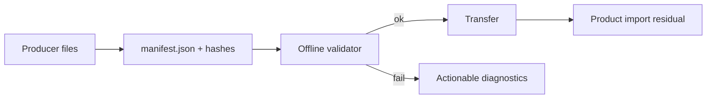
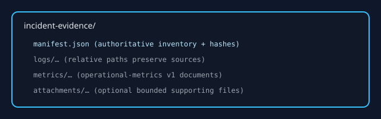

# Incident Evidence Bundle interchange

**Method status:** **Partial.** Normative v1 schema, JSON Schemas, frozen
fixtures, offline directory validator, producer templates, Help, and drift
checks ship under #764. Product import/attachment UX and deterministic archive
production remain residual on #763.

## 1. Problem

Support and platform teams need a low-friction, tool-agnostic hand-off for
authorized incident logs, operational metrics, and bounded supporting files.

Without a contract, collectors invent zip layouts, drop hashes, guess
timezones, collapse multi-source basenames, or mix evaluator truth into runtime
data. Importers cannot fail closed on traversal or hash mismatch, and metrics
appear related to logs only by folder coincidence.

Out of scope for this method: live streaming collectors, DuckDB generation by
producers, Investigation/Case collaborative documents (#532), and product
import UI (later #763 slices).

## 2. Status and evidence

| Capability | Status | Evidence | Residual |
| --- | --- | --- | --- |
| Normative schema id + RFC specification | **Shipped** | [`INCIDENT_EVIDENCE_BUNDLE_V1.md`](../../specs/INCIDENT_EVIDENCE_BUNDLE_V1.md) | — |
| JSON Schemas | **Shipped** | [`docs/specs/incident-evidence/schemas/`](../../specs/incident-evidence/schemas/) | — |
| Frozen valid/invalid fixtures | **Shipped** | [`fixtures/incident-evidence/`](../../../fixtures/incident-evidence/) | — |
| Offline directory validator + CLI | **Shipped** | [`incident_evidence.rs`](../../../crates/cd-core/src/incident_evidence.rs), `cd-validate-incident-evidence` | Archive validate/produce residual |
| Producer templates | **Shipped** | [`examples/incident-evidence-producers/`](../../../examples/incident-evidence-producers/) | — |
| Help discoverability | **Shipped** | [`incident-evidence-bundle.md`](../../help/log-analysis/incident-evidence-bundle.md) | — |
| Product import/attachment UX | **Planned** | — | #763 later slices |
| Investigation/Case portable bundles | **Planned** | Distinct collaborative format | #532 Phase D |

## 3. Reusable method

1. Collect only authorized files under relative paths.
2. Stream-hash each payload (SHA-256 lowercase) and record exact byte lengths.
3. Declare components with roles: `log`, `operational_metrics`, `attachment`, `readme`.
4. Declare privacy flags and time-basis honesty (never invent timezones).
5. Emit `manifest.json` with exact `schemaId` `contextdesk.incident_evidence.v1`.
6. Validate offline before transfer; fail closed on path/hash/limit errors.
7. Future product import re-validates and publishes new identities only after success.



## 4. Inputs, outputs, and data contracts

### Inputs

| Field/concept | Type or shape | Required | Validation |
| --- | --- | --- | --- |
| Bundle root | Directory | yes | Contains capped `manifest.json` |
| Component path | Relative POSIX path | yes | No absolute/traversal/drive prefixes |
| Component hash | 64 lowercase hex | yes | Stream-verified SHA-256 |
| Operational metrics document | Existing v1 series JSON | when role used | `schemaVersion: 1` + `series` array; no second series schema |

### Outputs

| Field/concept | Meaning | Bounded by | Provenance |
| --- | --- | --- | --- |
| ValidationReport | Deterministic diagnostics | Explicit size/count caps | File/JSON paths |
| (Future) imported identities | New corpus/metric ids | Product policy | Explicit user import |

## 5. Invariants and trust boundaries

- Reject unsafe paths before payload reads.
- Stream hashes; do not require whole large files in memory.
- No network I/O in the offline validator.
- No product publication from the offline tool.
- Evidence bundles ≠ `contextdesk.log_corpus.v1` analysis packages ≠ #532 cases.
- Reuse operational-metrics v1; do not redefine series samples.


## 6. Algorithm or process detail

1. Cap-read and parse `manifest.json`.
2. Enforce schema id, reader version, privacy, and time-basis honesty.
3. For each component: validate relative path; resolve under root; reject symlink escape; compare size; stream SHA-256.
4. For `operational_metrics` roles, lightly check JSON `schemaVersion` and `series`.
5. Emit sorted diagnostics; `ok` only when empty.



## 7. Performance and bounds

| Limit | Value |
| --- | --- |
| Manifest max | 1 MiB (`MAX_MANIFEST_BYTES`) |
| Components max | 512 (`MAX_COMPONENTS`) |
| Per-file max | 512 MiB (`MAX_PER_FILE_BYTES`) |
| Aggregate max | 2 GiB (`MAX_AGGREGATE_BYTES`) |
| Relative path max | 1024 bytes |
| Hash buffer | 64 KiB streaming |

## 8. Failure and recovery

Failures are fail-closed with stable diagnostic codes (`unsafe_path`,
`hash_mismatch`, `byte_count_mismatch`, `unsupported_schema_id`,
`timezone_dishonest`, `forbidden_sentinel`, `payload_missing`, `unknown_role`,
`archive_validation_residual`). Producers re-hash after any rewrite and re-run
validation. Partial product publication is forbidden when import exists.

## 9. Observability

CLI output is deterministic:

```text
incident-evidence-validate ok=… root=…
schemaId=…
bundleId=…
diagnostics=N
<code> | <path> | <message>
```

## 10. Security and privacy

- Shareable bundles set `containsCredentials=false` and avoid private absolute paths.
- Manifest text must not embed evaluator-truth sentinels.
- Offline validation performs no network access.
- Attachments are not ambient model context without future product governance.

## 11. UX and human factors

Help explains producer workflow, bundle vs analysis package vs Investigation,
privacy review, and troubleshooting. Product import UX is residual and must not
be claimed shipped by this chapter. Diagrams use theme-safe SVG with
`currentColor`.


## 12. Test matrix

| Case | Expectation |
| --- | --- |
| Minimal log-only fixture | `ok` |
| Logs + CPU/heap/clients metrics | `ok` |
| Multi-source duplicate basenames | `ok` with distinct relative paths |
| Unsupported schema id | fail `unsupported_schema_id` |
| Hash / byte mismatch | fail matching codes |
| Traversal / absolute / drive path | fail `unsafe_path` |
| Dishonest timezone | fail `timezone_dishonest` |
| Evaluator-truth sentinel | fail `forbidden_sentinel` |
| Unknown role | fail `unknown_role` |
| Archive path | residual diagnostic (not faked) |

## 13. ContextDesk production anchors

| Concern | Path |
| --- | --- |
| Spec | `docs/specs/INCIDENT_EVIDENCE_BUNDLE_V1.md` |
| Validator | `crates/cd-core/src/incident_evidence.rs` |
| CLI | `crates/cd-core/src/bin/cd-validate-incident-evidence.rs` |
| Fixtures | `fixtures/incident-evidence/` |
| Help | `docs/help/log-analysis/incident-evidence-bundle.md` |
| Drift | `scripts/check_incident_evidence_drift.mjs` |
| Related package discipline | `crates/cd-core/src/log_analysis/package.rs` |

## 14. Shipped / partial / planned matrix

| Surface | Status |
| --- | --- |
| Interchange contract + offline validate | **Shipped** (#764) |
| Producer templates + Help/Handbook | **Shipped** (#764) |
| Directory import UX | **Planned** (#763) |
| Deterministic archive produce/validate | **Planned** / residual |
| Investigation/Case bundles | **Planned** (#532) |

## 15. Reimplementation notes

1. Keep validation pure and offline.
2. Prefer streaming hashes and explicit caps over “best effort” loads.
3. Reuse operational-metrics v1 documents unchanged.
4. Keep analysis packages and Investigation documents on separate schema ids.
5. Treat unknown roles as fail-closed until a documented expansion ships.

## 16. Open residuals

- Product import/attachment UX for directory and archive forms (#763).
- Deterministic archive production CLI if not co-shipped with import.
- Round-trip product tests once import lands.
- #532 Investigation/Case portable bundles remain a separate contract.
