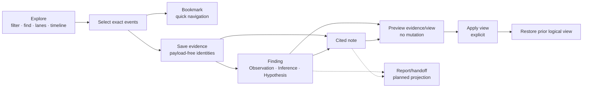
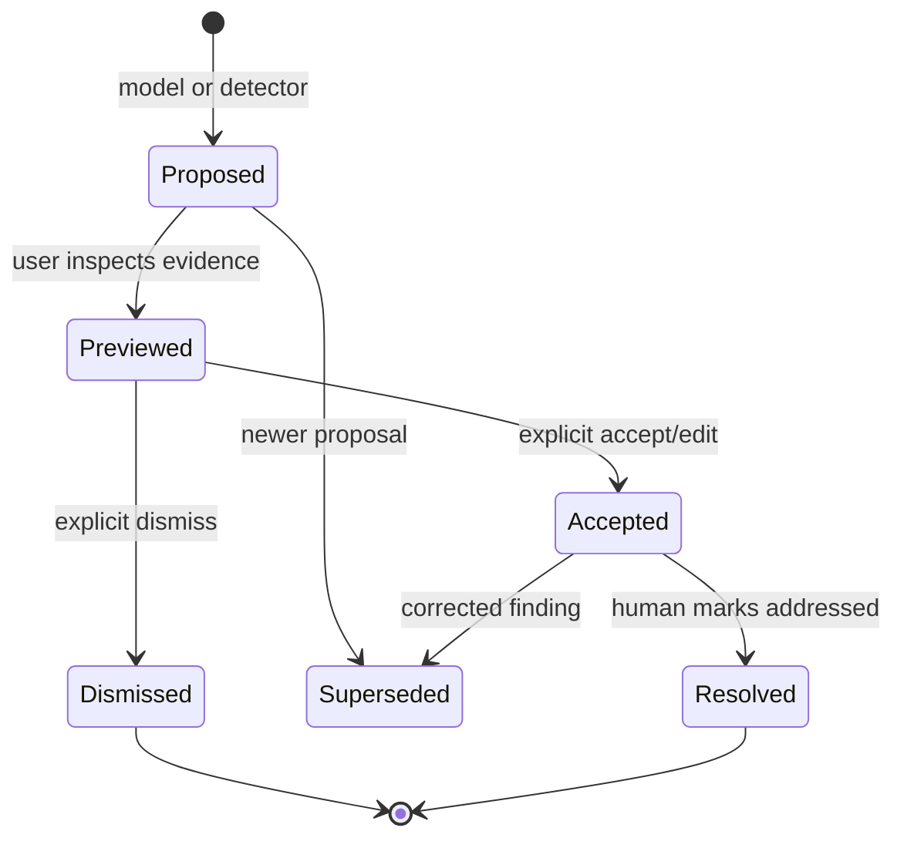

# Durable investigation loop

**Method status:** **Partial.** ContextDesk has production anchors on `main` for
exact bookmarks, durable human-authored evidence/findings/notes, append-only
investigation revisions, bounded authoritative preview, and saved view recipes
with explicit apply and prior-view restoration. Issue #656 remains open pending
its complete native acceptance matrix. Model/detector finding proposals,
accept/dismiss lifecycle history, ranking, walkthroughs, and report assembly
remain #646/#532.

## 1. Problem

Searching logs and chatting with a model can reveal something important, but a
transient selection or fluent answer is not an investigation record. Engineers
need to:

- preserve the exact evidence they saw;
- distinguish observation, inference, and hypothesis;
- annotate why a finding matters;
- return to the exact logical view later;
- inspect stale or missing references honestly;
- keep work after restart or chat deletion;
- accept or reject model suggestions without silent view changes; and
- assemble a handoff without copying untraceable payloads into prose.

The reusable method treats investigation as a durable graph of identities and
human decisions. Source payload remains authoritative in its original store;
the investigation persists references, provenance, analysis, and reversible
view state.

## 2. Status and evidence

| Capability                                           | Status      | ContextDesk evidence                                                                                                                                                                 | Residual                                                 |
| ---------------------------------------------------- | ----------- | ------------------------------------------------------------------------------------------------------------------------------------------------------------------------------------ | -------------------------------------------------------- |
| Exact single/range/noncontiguous bookmarks           | **Shipped** | [`bookmarks.rs`](../../../crates/cd-core/src/log_analysis/bookmarks.rs)                                                                                                              | Bookmarks are not exported in package v1                 |
| Duplicate-resistant exact evidence save              | **Partial** | Core/UI path exists in [`investigations.rs`](../../../crates/cd-core/src/investigations.rs) and [`LogExplorer.tsx`](../../../desktop/src/components/logExplorer/LogExplorer.tsx)     | Full packaged matrix keeps #656 open                     |
| Human Observation/Inference/Hypothesis               | **Partial** | Core/UI path exists in [`CreateInvestigationItemDialog.tsx`](../../../desktop/src/components/logExplorer/CreateInvestigationItemDialog.tsx)                                          | Model proposals are not shipped; packaged matrix remains |
| Human cited notes                                    | **Partial** | Core/UI path exists in [`investigations.rs`](../../../crates/cd-core/src/investigations.rs) and [`EvidencePanel.tsx`](../../../desktop/src/components/logExplorer/EvidencePanel.tsx) | Report composition and packaged matrix remain            |
| Append-only optimistic revisions                     | **Shipped** | [`investigations.rs`](../../../crates/cd-core/src/investigations.rs) `InvestigationStore`                                                                                            | Multi-device sync is not claimed                         |
| Preview authoritative evidence without view mutation | **Partial** | `preview_evidence` and the Investigation rail exist on `main`                                                                                                                        | Native stale-reference proof remains in #656             |
| Payload-free saved view recipe                       | **Shipped** | `FindingViewRecipe` and [`investigationView.ts`](../../../desktop/src/lib/logExplorer/investigationView.ts) are on `main` through PR #666                                            | Broader proposal history remains                         |
| Explicit Apply and Restore prior view                | **Partial** | [`LogExplorer.tsx`](../../../desktop/src/components/logExplorer/LogExplorer.tsx) contains the core/UI path                                                                           | Native responsive/restart matrix remains                 |
| Linked-chat `log_nav` proposal                       | **Shipped** | [`view_context.rs`](../../../crates/cd-core/src/log_analysis/view_context.rs), [`logNav.ts`](../../../desktop/src/lib/logExplorer/logNav.ts)                                         | It is navigation intent, not a durable finding proposal  |
| Model/detector finding proposal review queue         | **Planned** | #646                                                                                                                                                                                 | No typed proposal tool/history yet                       |
| Notes-to-report assembly/export                      | **Planned** | #532                                                                                                                                                                                 | Do not call current rail a report workflow               |

## 3. Reusable method

The loop separates five artifacts:

1. **Bookmark:** a lightweight durable navigation marker.
2. **Evidence:** an exact set of source identities saved for investigation.
3. **Finding:** a typed human conclusion citing evidence.
4. **Note:** human narrative citing evidence and optionally findings.
5. **View recipe:** payload-free logical instructions for reconstructing a
   useful investigative view.

Reports are a later projection of these artifacts, not an editable blob that
becomes the only source of truth.

### Why references, not snapshots

Persisting copied log messages inside findings creates two competing truths and
retains payload longer than necessary. Persisting exact identities lets the
system:

- re-resolve the current authoritative redacted event;
- detect missing or changed identity hints;
- keep durable documents small;
- evolve formatting independently; and
- apply source-specific access policy at read time.

The cost is that deleted/discarded corpora can make evidence unavailable.
Honest stale/missing states are preferable to silently presenting an old
snapshot as current evidence.

## 4. Inputs, outputs, and data contracts

The following portable contracts are conceptual. ContextDesk's exact structs
are linked later.

### Evidence reference

| Field                | Meaning                                   | Rule                                      |
| -------------------- | ----------------------------------------- | ----------------------------------------- |
| source collection id | Corpus/database/document collection       | Stable and scope-bound                    |
| record id            | Event sequence or source-native stable id | Never inferred from payload text          |
| source identity      | Relative file/table/object identity       | Revalidated                               |
| time/quality hint    | Helps detect change and navigate          | Hint cannot override authoritative record |

Evidence sets preserve exact membership and order semantics. A selection
`[2, 9, 15]` is not widened to `[2..15]`.

### Finding

| Field               | Meaning                                                         |
| ------------------- | --------------------------------------------------------------- |
| stable finding id   | Durable UUID-like identity                                      |
| epistemic kind      | Observation, Inference, or Hypothesis                           |
| lifecycle           | Human-controlled accepted/resolved today; proposal states later |
| title               | Concise redacted human text                                     |
| why it matters      | Bounded redacted rationale                                      |
| evidence ids        | Explicit same-investigation citations                           |
| view recipe         | Optional logical reconstruction                                 |
| provenance          | Human today; future model proposal must remain distinct         |
| revision timestamps | Audit and concurrency support                                   |

### Note

A note contains a title, bounded redacted body, evidence citations, optional
finding citations, explicit authorship provenance, and revision timestamps.
Notes do not become evidence merely because a person or model wrote them.

### View recipe

A logical view recipe can include:

- global levels/sources/services/hosts/time/sequence/template/trace/keyword
  filters;
- every configured lane and source membership, including hidden lanes;
- visible lane count;
- Independent, Follow, or Align mode;
- focused lane/event;
- exact selection and resident highlights;
- Find query, mode, case sensitivity, and semantic flag; and
- one exact logical viewport anchor per lane.

It excludes event messages and UI pixel coordinates. Logical state survives
window-size and density changes better than screenshot-like geometry.

### Revision document

| Property       | Rule                                                      |
| -------------- | --------------------------------------------------------- |
| schema version | Unknown future versions fail closed                       |
| revision       | Monotonic, expected on every mutation                     |
| publication    | New no-clobber revision; prior revision remains readable  |
| payload        | References and redacted human text only                   |
| store location | Durable application data, outside disposable corpus cache |
| lifecycle      | Active or archived                                        |

## 5. Invariants and trust boundaries

1. **Source data remains authoritative.** Investigation documents do not store
   event payload snapshots.
2. **Identity is exact and bounded.** No range widening or payload matching.
3. **Hints never rebind.** Source/time hints detect stale references; they do
   not locate a “close enough” replacement.
4. **Human and model provenance remain distinct.** A model proposal is not an
   accepted finding.
5. **Preview does not mutate.**
6. **Apply requires an explicit user action.**
7. **Restore uses the captured prior logical state, not a guessed default.**
8. **Missing/stale evidence blocks unsafe Apply and remains visible.**
9. **Every write checks the expected revision.**
10. **Publication never overwrites the prior readable revision.**
11. **Rapid identical retries are idempotent.**
12. **Chat deletion does not delete investigation material.**
13. **Bookmark sidecars are not passively rewritten by investigation migration
    or projection.**
14. **Human-authored text is redacted before persistence.**
15. **Reports, when built, cite durable artifacts rather than erasing their
    provenance.**

Trust boundaries:

- the UI owns user intent and focus state;
- the trusted host/core validates identities, revisions, redaction, bounds, and
  durable publication;
- the corpus/database remains authoritative for payload;
- model output is an untrusted proposal until a human accepts it; and
- remote writes or destructive actions stay under the normal permission model.

## 6. Algorithm detail

### 6.1 Save exact evidence

1. Capture selected stable identities from resident rows.
2. Send identities—not messages—to the trusted host.
3. Re-resolve every identity against the bound corpus.
4. Verify corpus, source, time/quality hints, and count bounds.
5. Canonicalize exact membership.
6. Reuse an identical existing evidence item or append a new one.
7. Publish a new revision only if the expected revision still matches.
8. Return the resolved document and visible conflict if another writer won.

### 6.2 Create a finding or note

1. Require a non-empty exact evidence set.
2. Collect human title, epistemic kind, and rationale/note.
3. Redact and validate UTF-8 byte bounds.
4. Verify cited evidence/findings exist in the same investigation.
5. Capture a view recipe for a finding when requested.
6. Atomically save any reused/new evidence and the new item in one revision.
7. Treat a repeated identical action as idempotent.

### 6.3 Preview evidence

1. Load the newest readable investigation revision.
2. Verify its corpus link.
3. Resolve cited identities from the authoritative source under a hard cap.
4. Return each reference as verified, stale, or missing.
5. Display bounded current payload only in the transient preview.
6. Do not modify filters, lanes, selection, or scroll state.

### 6.4 Preview, apply, and restore a view recipe

1. Capture the current logical view as the potential restore point.
2. Ask the host to revalidate every reference in the saved recipe.
3. Present a human-readable diff and stale/missing counts.
4. Keep Apply disabled when required identities are not verified.
5. On explicit Apply, set filters and lanes, then resolve logical viewport
   anchors through the normal query path.
6. Preserve the prior recipe in a one-step Restore action.
7. Restore Find, highlights, selection, focus, and lane anchors as well as
   obvious filters.

### 6.5 Linked-chat proposals

Two proposal classes must not be conflated.

**Navigation proposal (currently shipped):**

- model emits a structured `log_nav` intent scoped to the linked corpus;
- host/UI validate corpus, sources, times, highlighted identities, and bounds;
- UI renders an action chip;
- nothing changes until the user activates it; and
- the prior view can be restored.

**Finding proposal (planned):**

- model or deterministic detector proposes a typed finding;
- proposal includes provenance, model/detector identity, cited exact evidence,
  confidence/rationale, and optional view recipe;
- status begins `proposed`, never `accepted`;
- user can preview evidence and view diff;
- user can accept, edit, dismiss, or request deeper analysis;
- every transition is append-only and auditable; and
- only accepted human-controlled material enters reports.

This is a design method for #646, not a claim that ContextDesk ships the second
class today.

### 6.6 Report/handoff projection

Future report assembly should:

1. select accepted findings and cited notes;
2. resolve current evidence status;
3. mark observations, inferences, hypotheses, and unresolved questions;
4. include source identities and time-quality limitations;
5. exclude dismissed proposals by default;
6. render stale/missing evidence warnings;
7. retain links back to saved views; and
8. export a versioned projection without mutating the investigation record.

## 7. Performance and bounds

Current ContextDesk bounds illustrate a defendable durable store:

| Dimension                            |              Bound | Behavior                   |
| ------------------------------------ | -----------------: | -------------------------- |
| Investigation documents/store        |                256 | Refuse additional document |
| Revisions/investigation              |              4,096 | Refuse overflow            |
| Evidence items                       |              1,024 | Refuse overflow            |
| Findings                             |              1,024 | Refuse overflow            |
| Notes                                |              2,048 | Refuse overflow            |
| Total exact event refs               |              8,192 | Refuse overflow            |
| Exact refs/evidence or bookmark item |                512 | Refuse overflow            |
| Corpus links/document                |                 16 | Refuse invalid cardinality |
| Title                                |    256 UTF-8 bytes | Redact then validate       |
| Finding rationale                    |  4,096 UTF-8 bytes | Redact then validate       |
| Note body                            | 16,384 UTF-8 bytes | Redact then validate       |
| Citations/item                       |                256 | Refuse overflow            |
| Revision file                        |             16 MiB | Refuse read/write          |
| Lanes/view recipe                    |                1–4 | Refuse invalid recipe      |
| Filter values/view recipe            | 256 per collection | Refuse invalid recipe      |

Preview work is bounded by stored identity caps and source query limits. Listing
investigations should use summary projections and must not resolve every event
payload.

## 8. Failure and recovery

| Failure                           | Detection                     | User-visible state                                              | Recovery                                        | Guarantee                                  |
| --------------------------------- | ----------------------------- | --------------------------------------------------------------- | ----------------------------------------------- | ------------------------------------------ |
| Duplicate save/click              | Exact semantic comparison     | Existing item/result                                            | Continue                                        | No duplicate revision for identical action |
| Competing window write            | Expected revision mismatch    | Visible conflict                                                | Reload latest and retry user intent             | No silent overwrite                        |
| Crash during publication          | No-clobber revision protocol  | Latest prior revision loads                                     | Retry                                           | Prior state readable                       |
| Missing event                     | Authoritative re-resolution   | Missing badge; Apply blocked                                    | Reimport/locate replacement explicitly          | No guessed rebinding                       |
| Changed source/time hint          | Identity comparison           | Stale badge; Apply blocked                                      | Review and save corrected evidence              | Original reference retained                |
| Future schema                     | Version validation            | Unsupported-version error                                       | Upgrade software/export with compatible version | Fail closed                                |
| Corrupt newest revision           | Validation/read failure       | Controlled error or prior readable revision according to policy | Restore from prior revision                     | No partial parse as truth                  |
| Chat deleted/switched             | Separate durable store        | Investigation remains                                           | Reopen from corpus                              | Chat lifecycle does not own evidence       |
| View application partly loads     | Normal query errors           | Visible Apply failure                                           | Restore captured prior view                     | Prior logical state retained               |
| Model proposes unsupported action | Schema/eligibility validation | Proposal unavailable/invalid                                    | Rephrase or use manual workflow                 | No hidden mutation                         |
| Redaction empties human text      | Post-redaction validation     | Save error                                                      | Rewrite without secret                          | Secret not persisted                       |

## 9. Observability and auditability

Record:

- investigation, revision, item, corpus, and evidence identities;
- human/model/detector provenance;
- mutation type, expected revision, and result;
- duplicate/idempotent reuse;
- preview status counts (verified/stale/missing);
- view diff and explicit Apply/Restore action;
- cancellation/failure without payload leakage;
- proposal lifecycle transitions when implemented; and
- report projection version and source revision when implemented.

Avoid logging event payloads, secret-bearing human text before redaction,
absolute source paths, or private provider/model inventories.

## 10. Security and privacy

- Persist only source identities and redacted human text.
- Resolve payload transiently through the normal authorized source path.
- Keep durable investigation storage outside disposable corpus caches.
- Do not include evaluator truth in evidence, findings, notes, chat, or reports.
- Treat model-generated proposals as untrusted content.
- Use host-originated permission decisions for any write beyond local
  investigation metadata.
- Validate UUIDs, relative source identities, schema versions, directory entry
  counts, file sizes, and citations.
- Export/package investigation material only through a separately reviewed
  egress and compatibility contract.
- Retention and purge must account for append-only revisions; “delete latest”
  is not sufficient privacy deletion.

## 11. UX and human factors

The investigation surface should keep log evidence central:

- use one compact rail mode control for Investigation and Chat;
- reveal Ask, Save evidence, Create finding, and Create note contextually after
  selection;
- keep drafts and chat state mounted when switching rail modes;
- show epistemic kind and lifecycle without color-only meaning;
- make Preview visibly non-mutating;
- show a concise view diff before Apply;
- place Restore prior view near the changed evidence surface;
- label missing/stale evidence in plain language;
- make duplicate actions idempotent and provide feedback;
- support keyboard shortcuts without hijacking text input;
- restore focus after dialogs/drawers;
- collapse rails to maximize evidence width; and
- preserve state across responsive layout changes.

Power users need fast movement between Find, Filter, timeline, lanes,
bookmarks, evidence, findings, notes, and chat. The information architecture
should use contextual controls and saved state rather than an always-visible
wall of enterprise tabs.

## 12. Test recipe

| Layer                | Required proof                                                                                                                       |
| -------------------- | ------------------------------------------------------------------------------------------------------------------------------------ |
| Contract/unit        | Exact set canonicalization; no range widening; schema/version bounds; human provenance; view recipe validation; UTF-8 byte caps      |
| Store integration    | Append-only revisions; expected-revision conflict; failed publication preserves prior; identical retry idempotent; restart/reopen    |
| Evidence integration | Verified/stale/missing references; source/time hint mismatch; bounded payload preview; legacy bookmark projection without rewrite    |
| View logic           | Capture all lanes including hidden, Find/highlights, selection/focus/anchors; diff; explicit Apply; exact Restore                    |
| Component UI         | Contextual selection strip; dialogs; Escape/focus; rail mode preservation; duplicate prevention; stale Apply blocked; errors visible |
| Linked chat          | `log_nav` wrong-corpus/oversize/malformed rejected; valid proposal waits for click; ordinary chat cannot act on corpus               |
| Packaged/native      | 25k and 100k corpora; restart; chat deletion; rail collapse; narrow/normal/wide; themes; long labels; competing windows              |
| Future proposals     | Proposed never equals accepted; preview before accept; dismiss/supersede/resolve history; report excludes dismissed by default       |

Use deterministic source events and known stale-reference mutations. Native
proof matters because focus, multi-window state, file persistence, and
responsive rails are not fully represented by DOM tests.

## 13. ContextDesk anchors

- [`investigations.rs`](../../../crates/cd-core/src/investigations.rs):
  versioned documents, bounds, exact evidence, findings, notes, view recipes,
  revision publication, preview and revalidation.
- [`bookmarks.rs`](../../../crates/cd-core/src/log_analysis/bookmarks.rs):
  bookmark identity and sidecar compatibility.
- [`view_context.rs`](../../../crates/cd-core/src/log_analysis/view_context.rs):
  bounded Explorer context and `log_nav` intent.
- [`LogExplorer.tsx`](../../../desktop/src/components/logExplorer/LogExplorer.tsx):
  selection actions, state capture, Apply/Restore orchestration.
- [`EvidencePanel.tsx`](../../../desktop/src/components/logExplorer/EvidencePanel.tsx):
  Investigation rail, preview, edit, and view diff.
- [`CreateInvestigationItemDialog.tsx`](../../../desktop/src/components/logExplorer/CreateInvestigationItemDialog.tsx):
  human finding/note editor.
- [`SaveEvidenceDialog.tsx`](../../../desktop/src/components/logExplorer/SaveEvidenceDialog.tsx):
  exact evidence save explanation.
- [`investigationView.ts`](../../../desktop/src/lib/logExplorer/investigationView.ts):
  logical view capture/diff/application transforms.
- [`logNav.ts`](../../../desktop/src/lib/logExplorer/logNav.ts): structured
  linked-chat navigation proposal validation.
- [`desktop/src-tauri/src/lib.rs`](../../../desktop/src-tauri/src/lib.rs):
  trusted host commands and durable store root.
- Canonical contract: [Log Explorer durable evidence](../LOG_EXPLORER.md).

## 14. Shipped / partial / planned matrix

| Slice                          | Status                                             | What is true now                                                      | What is not claimed                                                |
| ------------------------------ | -------------------------------------------------- | --------------------------------------------------------------------- | ------------------------------------------------------------------ |
| Bookmarks                      | **Shipped**                                        | Exact payload-free evidence and legacy ranges                         | Package-v1 export or full investigation UI                         |
| Manual evidence/findings/notes | **Partial acceptance; production anchors on main** | Durable human workflow exists                                         | #656 complete packaged matrix                                      |
| View recipes                   | **Partial**                                        | Production path for Preview, explicit Apply, and Restore is on `main` | Complete #656 packaged acceptance; no pixel-perfect geometry claim |
| Chat navigation proposals      | **Shipped**                                        | Bounded user-activated `log_nav`                                      | Automatic navigation or accepted finding                           |
| Model finding proposals        | **Planned**                                        | Design rules only                                                     | Typed proposal tool, lifecycle, ranking                            |
| Finding walkthrough            | **Planned**                                        | Individual items can be opened                                        | Guided ranked sequence                                             |
| Report assembly/export         | **Planned**                                        | Durable ingredients exist                                             | #532 report workflow                                               |
| Multi-corpus investigation     | **Planned/non-goal for current slice**             | Document schema permits bounded links                                 | Complete multi-corpus UI/semantics                                 |

## 15. Reimplementation notes

The storage format, desktop framework, and source database can change.
Preserve:

- stable exact references;
- human/model provenance;
- append-only versioned publication;
- optimistic concurrency;
- payload-free durable state;
- non-mutating preview;
- explicit Apply;
- exact logical Restore; and
- visible stale/missing states.

Build manual investigation first. It provides value without a model and creates
the contracts a future proposal system must obey. Adding model proposals before
human evidence identity and lifecycle state are reliable produces persuasive
but unauditable notes.

Freeze whether “delete” means archive, tombstone, purge, or retention-policy
removal across append-only revisions. Freeze view recipe units and identity
before persisting them.

## 16. Open residuals

- #656: complete native proof across corpus sizes, restart, stale references,
  themes, responsive layouts, duplicate prevention, and accessibility.
- #646: typed model/detector proposals, review queue, ranking, lifecycle
  history, supporting/contradicting evidence, and walkthrough.
- #532: broader Evidence → Notes → Report assembly and export.
- Bookmark and investigation package/export compatibility needs a dedicated
  design before being added to corpus package v1.
- Append-only privacy purge and retention need explicit treatment.
- Multi-device synchronization/conflict policy is not part of the current local
  investigation store.
