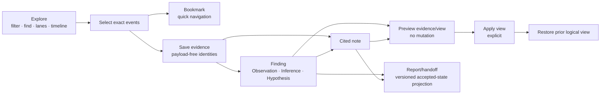
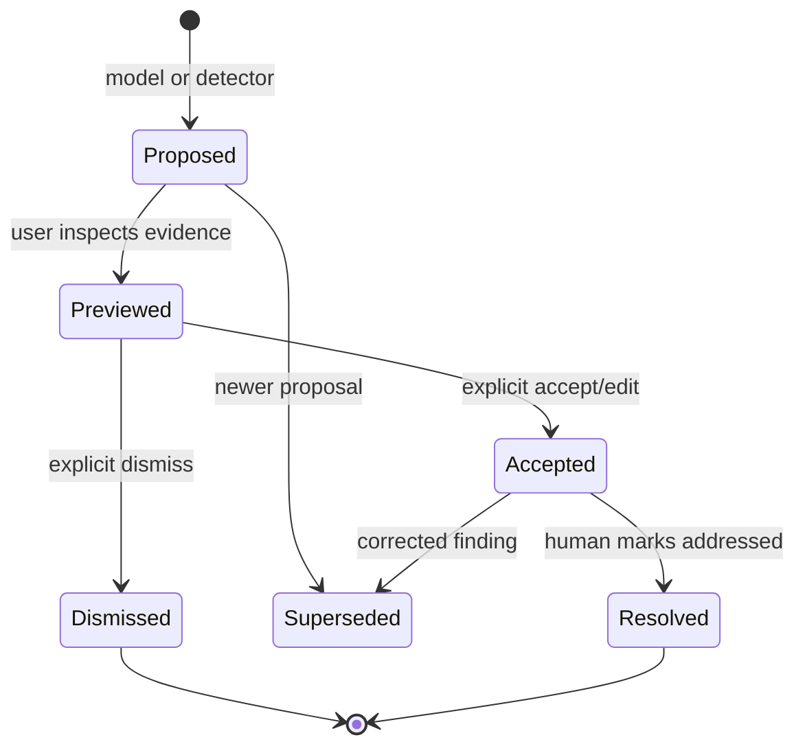

# Durable investigation loop

**Method status:** **Partial.** ContextDesk has production anchors on `main` for
exact bookmarks, durable human-authored evidence/findings/notes, append-only
investigation revisions, bounded authoritative preview, saved view recipes
with explicit apply and prior-view restoration, a durable SoftWrite proposal
review queue (findings and report sections) with explicit Accept /
Edit-and-accept / Dismiss-with-reason, and a versioned accepted-state report
projection with deterministic Markdown rendering and confirmation-gated
export. Issue #656 remains open pending its complete native acceptance matrix.
Proposal ranking, supersede/resolve history surfacing, and walkthroughs remain
#646; the fuller report vocabulary, report patches with an undo trail,
unsupported-claim detection, HTML/PDF export, and an evidence appendix remain
#532.

## 1. Problem

Searching logs and chatting with a model can reveal something important, but a
transient selection or fluent answer is not an investigation record. Engineers
need to:

- preserve the exact evidence they saw;
- distinguish observation, inference, and hypothesis;
- annotate why a finding matters;
- return to the exact logical view later;
- inspect stale or missing references honestly;
- keep work after restart or chat deletion;
- accept or reject model suggestions without silent view changes; and
- assemble a handoff without copying untraceable payloads into prose.

The reusable method treats investigation as a durable graph of identities and
human decisions. Source payload remains authoritative in its original store;
the investigation persists references, provenance, analysis, and reversible
view state.

## 2. Status and evidence

| Capability                                           | Status      | ContextDesk evidence                                                                                                                                                                 | Residual                                                 |
| ---------------------------------------------------- | ----------- | ------------------------------------------------------------------------------------------------------------------------------------------------------------------------------------ | -------------------------------------------------------- |
| Exact single/range/noncontiguous bookmarks           | **Shipped** | [`bookmarks.rs`](../../../crates/cd-core/src/log_analysis/bookmarks.rs)                                                                                                              | Bookmarks are not exported in package v1                 |
| Duplicate-resistant exact evidence save              | **Partial** | Core/UI path exists in [`investigations.rs`](../../../crates/cd-core/src/investigations/mod.rs) and [`LogExplorer.tsx`](../../../desktop/src/components/logExplorer/LogExplorer.tsx)     | Full packaged matrix keeps #656 open                     |
| Human Observation/Inference/Hypothesis               | **Partial** | Core/UI path exists in [`CreateInvestigationItemDialog.tsx`](../../../desktop/src/components/logExplorer/CreateInvestigationItemDialog.tsx)                                          | Packaged matrix remains (#656)                           |
| Human cited notes                                    | **Partial** | Core/UI path exists in [`investigations.rs`](../../../crates/cd-core/src/investigations/mod.rs) and [`EvidencePanel.tsx`](../../../desktop/src/components/logExplorer/EvidencePanel.tsx) | Packaged matrix remains (#656)                           |
| Append-only optimistic revisions                     | **Shipped** | [`investigations.rs`](../../../crates/cd-core/src/investigations/mod.rs) `InvestigationStore`                                                                                            | Multi-device sync is not claimed                         |
| Preview authoritative evidence without view mutation | **Partial** | `preview_evidence` and the Investigation rail exist on `main`                                                                                                                        | Native stale-reference proof remains in #656             |
| Payload-free saved view recipe                       | **Shipped** | `FindingViewRecipe` and [`investigationView.ts`](../../../desktop/src/lib/logExplorer/investigationView.ts) are on `main` through PR #666                                            | Broader proposal history remains                         |
| Explicit Apply and Restore prior view                | **Partial** | [`LogExplorer.tsx`](../../../desktop/src/components/logExplorer/LogExplorer.tsx) contains the core/UI path                                                                           | Native responsive/restart matrix remains                 |
| Linked-chat `log_nav` proposal                       | **Shipped** | [`view_context.rs`](../../../crates/cd-core/src/log_analysis/view_context.rs), [`logNav.ts`](../../../desktop/src/lib/logExplorer/logNav.ts)                                         | It is navigation intent, not a durable finding proposal  |
| Model/detector proposal review queue (findings + report sections) | **Partial** | [`proposed.rs`](../../../crates/cd-core/src/investigations/proposed.rs) and [`report.rs`](../../../crates/cd-core/src/investigations/report.rs)                                       | Ranking, walkthrough, and deeper-analysis requests remain #646 |
| Accepted-state report projection + Markdown export   | **Partial** | [`report.rs`](../../../crates/cd-core/src/investigations/report.rs) `assemble_investigation_report`                                                                                  | Fuller #532 vocabulary, patches/undo, claim detection, HTML/PDF, evidence appendix |
| War Room investigation-scoped file/ZIP/directory intake | **Local integration** | Collab contract `investigation-corpus-intake.ts`, module `collab/server/src/modules/corpus-intake/`, Capture UI `CorpusIntakePanel.tsx`. Concurrent distinct-key commits sharing a digest reclassify `duplicateDigest` after the per-digest lock from live artifacts. ZIP names consult language bit `0x0800`: valid UTF-8 with the bit is accepted, unmarked non-ASCII and invalid UTF-8 are rejected as `invalid_encoding`, local/central encoding-bit disagreement is malformed, and Info-ZIP Unicode Path extra `0x7075` is the canonical name when present (CRC-checked, fatal UTF-8; traversal or local/central extra disagreement fail closed). | Parallel portable-investigation restore lane is out of scope here. PostgreSQL `withAtomic` now binds store queries to the transaction via async-local storage. In-process post-promote timeline/audit failure rolls back staged blobs. A process crash after promote and before COMMIT leaves a durable pending-write journal; recovery reclaims those hashes when no artifact, snapshot, or imported-run row references them, and keeps them when a later retry or successful COMMIT does. |
| War Room addressable workstream record | **Local integration** | Collab contract `workstream.ts` (`cd-collab.workstream_view.v1`), server projection `collab/server/src/modules/triage-runs/workstreams.ts` behind `GET /api/cases/:id/workstreams`, Analyze UI `Workstreams.tsx` | Readable projection covers recorded triage-run lanes only; human, programmatic, external-import, and host-run workstreams are representable in the contract but no writer produces them yet. |
| War Room activity feed and resource locators | **Local integration** | Collab contract `investigation-activity.ts`, module `collab/server/src/modules/activity/`, Overview consumer in `Cases.tsx`, APIs `GET /api/investigation-activity` and `GET /api/investigation-resources/resolve`. Kind-strict resolve is stable across reload and portable restore with destination identity remapping, including remapped `decision_revision` ids from live `experiment_decision_*` writes that address the decision id rather than the experiment id, remapped `gold` ids from `experiment_gold_promoted` (`targetNamespace=gold`, Decide `decision-heading`), remapped `helpfulness` ids from `experiment_helpfulness_recorded` (`targetNamespace=helpfulness`, Compare `cross-exam-heading`), remapped `${experimentId}:${traceId}` `interaction_trace` locators from `experiment_trace_imported` (`targetNamespace=experiment`, Compare `candidate-comparison-heading`), remapped `experiment` locators from `experiment_imported` (`targetNamespace=experiment`, Compare `candidate-comparison-heading`), remapped `${jobId}:${candidateId}` `workstream_attempt` locators, and remapped `intake_batch` ids from `corpus_intake_committed` (`targetNamespace=intake_batch`, Capture `corpus-intake` / `kind=intake-batch`), and remapped `evidence_context` snapshot ids from `snapshot_frozen` (`targetNamespace=snapshot`, Analyze `triage-evidence-board` / `kind=snapshot`), and remapped `imported_ai_run` imported-run ids from `external_run_imported` (`targetNamespace=imported_ai_run`), and remapped observation/discussion contribution ids from `contribution_*` (`targetNamespace=contribution`), and remapped `evidence_item` ids from `evidence_*` (`targetNamespace=evidence`; upload summary contributions are omitted from activity so copy-link cannot address a contribution id as evidence), and remapped job-level `workstream` ids from `triage_job_*` (`targetNamespace=triage_job`), and remapped revised/tombstoned/status contribution locators from live `contribution_revised` / `contribution_tombstoned` / `hypothesis_status` payloads that include `kind` and revision (message, hypothesis, note, action; kind-strict resolve), and remapped corroboration `imported_ai_run` ids from live `run_corroboration` (`targetNamespace=imported_ai_run`; portable export/dry-run/apply refuse corroboration as not exact-applyable so restore cannot project reviewed activity over unverified dest runs). | Locators round-trip to shipped stage/section/item identities (Discussion, workstream/run records, Capture intake batches, Capture imported analysis, Analyze frozen snapshots, Decide gold snapshots, Compare helpfulness observations, Compare imported comparison traces, Compare strategy comparisons) and reauthorize by resource kind at resolve time. UI filtering/pagination remains residual; locators are not tokens. |
| War Room server/contracts integrity | **Local integration** | Snapshot-bound accepted-decision board projection, insert-only contribution write intents, contribution revision CAS, **memory experiment decisions unique on `(experimentId, revision)` matching PostgreSQL**, **human trace annotations persist unique `(experimentId, candidateId, sequence)` inside `withExperimentAtomic` after locking the experiment (memory uniqueness; PostgreSQL `SELECT ... FOR UPDATE` on `experiment_packages`; merge keeps stored sequences so `parseInteractionTrace` does not depend on read-time renumbering)**, **concurrent first gold promotions lock the experiment before listing versions so identical fingerprints stay idempotent and a forked first gold is `stale_gold` (409) rather than PostgreSQL `23505` on `gold_references_experiment_version_idx` (unique-constraint failures still map to `stale_gold`)**, **concurrent first interaction traces lock the experiment before `findTrace` so identical fingerprints stay idempotent and a forked first trace is `trace_conflict` (409) rather than PostgreSQL `23505` on `experiment_traces_candidate_idx` (unique-constraint / insert-only failures still map to `trace_conflict`); `traceFingerprint` is key-order canonical so PostgreSQL jsonb round-trips match memory**, **experiment import/decision/trace/gold writes join `cases.withAtomic` (memory capture/restore awaited through `Promise.resolve` so SQLite-wrapped stores roll back; PostgreSQL via `activeCaseQueryable`)**, **`createCase` / status / membership / legal-hold and import run/corroboration join the same atomic boundary (SQLite-wrapped run `capture`/`restore` awaited)**, **first-use human catalog sources minted during `addContribution`, `addEvidence`, and corpus intake join `cases.withAtomic` (memory rolls back only those minted source ids and this-transaction audit rows so a concurrent standalone `catalog.create` survives; PostgreSQL `PgCatalogStore` uses `activeCaseQueryable`; SQLite persists catalog `remove` after case ROLLBACK)**, **triage job create/cancel, claim+started, candidate persist/start, finish, unauthorized-recovery refusal, and stale-lease recovery join `cases.withAtomic` (memory capture/restore; PostgreSQL via `activeCaseQueryable`; `queueMicrotask(execute)` stays outside so execution cannot start before COMMIT; a started-timeline failure rolls the claim back to queued instead of inventing `runner_error`; owned running runner errors and stale-lease recovery persist `triage_job_finished` with `humanFinding: false`)**, staged ordinary `addEvidence`/`importRun` transactions, held-evidence `expectedHash` fail-closed before metadata/blob commit, **`file_server_ref` abandons the unpaired reference file when metadata rolls back and restores the prior reference when recheck timeline/audit fails**, atomic snapshot/hypothesis/tombstone writes, SQLite `withAtomic` persistence of every successful mutator (not only `status=updated`), honest `sameSnapshot`, and lease-guarded triage job updates that refuse expired workers and recovered requesters who lost case membership, **concurrent `setStatus` / `setLegalHold` write only the intended column inside `withAtomic` so a racing status write cannot restore a stale legal-hold (memory and PostgreSQL)**, **and running progress `update` preserves the later of store vs payload `leaseExpiresAt` so a concurrent heartbeat cannot be shortened by a stale candidate persist (memory and PostgreSQL)** in `collab/server` + `collab/contracts`. Recovered queued jobs re-resolve current profile/status/provenance, roles/local grants, case access, `run:strategies`, and `evidence:private:read` through an injected authz seam before claiming a lease, reading evidence bytes, or calling a provider; stale admin/private authority is never inherited. Concurrent notes/comments persist without lost writes; a forked contribution revision is refused. Human trace annotations keep unique stored sequences under concurrent annotate (memory and PostgreSQL). Frozen snapshots keep their evidence identities after later intake. **Portable export addresses `experiment_decision_*` timeline at the decision id (`targetNamespace=decision`; live propose/accept writes use that same decision `targetId`, and persist refuses resealed archives that drop it), addresses `experiment_gold_promoted` at the gold snapshot id (`targetNamespace=gold`) rather than the experiment id, addresses `experiment_helpfulness_recorded` at the observation id (`targetNamespace=helpfulness`) rather than the experiment id, addresses `experiment_trace_imported` at `${experimentId}:${traceId}` (`targetNamespace=experiment`) rather than the experiment id, keeps `triage_candidate_*` `${jobId}:${candidateId}` targets, remapping the job prefix at apply, and persist refuses resealed archives that drop that composite or collapse it to a bare job id, and addresses `corpus_intake_committed` at the intake-batch id (`targetNamespace=intake_batch`), remapping that id at apply instead of hashing it as `evidence`/`intake-batch:`, and persist refuses resealed archives that drop `snapshot_frozen` `targetNamespace=snapshot` and `external_run_imported` `targetNamespace=imported_ai_run`, and `contribution_*` / `hypothesis_status` `targetNamespace=contribution`, and `evidence_*` `targetNamespace=evidence`, and `triage_job_*` bare job ids (`targetNamespace=triage_job`; persist refuses dropped or attempt-composite targets), and reconstructs contribution (including `hypothesis_status` and remapped `links`) and decision timeline payloads onto the matching portable revision (not the first `id` match), remaps portable `hypothesisLinks` onto destination evidence/contribution ids, and binds each restored imported run to its own remapped `external_run` contribution rather than `contributions[0]`, and refuses portable export, dry-run, and apply of `run_corroboration` because imported-run corroboration is not exact-applyable (portable runs have no corroboration rows, and persist never invents links).** **Pending-write journals record newly created CAS hashes before promotion; boot and the next exclusive write batch reclaim unreferenced journaled hashes while keeping hashes referenced by artifacts, snapshots, or imported runs.** | Portable exact restore of imported-run corroboration (state plus remapped artifact/contribution links) remains unsupported. directory fsync of the pending-write journal, SQLite shared-connection concurrent catalog writes during an open case `BEGIN`, and web discussion key reuse remain residual. If `triage_job_finished` projection also fails after a runner error, the job stays running so stale-lease recovery can record the terminal state. Unauthorized recovery (suspended/disabled/historical, membership loss, revoked run or private-read, unavailable profile/grant store) fails closed into an honest terminal job without a provider call or `owner_only` byte read.

## 3. Reusable method

The loop separates five artifacts:

1. **Bookmark:** a lightweight durable navigation marker.
2. **Evidence:** an exact set of source identities saved for investigation.
3. **Finding:** a typed human conclusion citing evidence.
4. **Note:** human narrative citing evidence and optionally findings.
5. **View recipe:** payload-free logical instructions for reconstructing a
   useful investigative view.

Reports are a later projection of these artifacts, not an editable blob that
becomes the only source of truth.

### Why references, not snapshots

Persisting copied log messages inside findings creates two competing truths and
retains payload longer than necessary. Persisting exact identities lets the
system:

- re-resolve the current authoritative redacted event;
- detect missing or changed identity hints;
- keep durable documents small;
- evolve formatting independently; and
- apply source-specific access policy at read time.

The cost is that deleted/discarded corpora can make evidence unavailable.
Honest stale/missing states are preferable to silently presenting an old
snapshot as current evidence.

## 4. Inputs, outputs, and data contracts

The following portable contracts are conceptual. ContextDesk's exact structs
are linked later.

### Evidence reference

| Field                | Meaning                                   | Rule                                      |
| -------------------- | ----------------------------------------- | ----------------------------------------- |
| source collection id | Corpus/database/document collection       | Stable and scope-bound                    |
| record id            | Event sequence or source-native stable id | Never inferred from payload text          |
| source identity      | Relative file/table/object identity       | Revalidated                               |
| time/quality hint    | Helps detect change and navigate          | Hint cannot override authoritative record |

Evidence sets preserve exact membership and order semantics. A selection
`[2, 9, 15]` is not widened to `[2..15]`.

### Finding

| Field               | Meaning                                                         |
| ------------------- | --------------------------------------------------------------- |
| stable finding id   | Durable UUID-like identity                                      |
| epistemic kind      | Observation, Inference, or Hypothesis                           |
| lifecycle           | Human-controlled accepted/resolved today; proposal states later |
| title               | Concise redacted human text                                     |
| why it matters      | Bounded redacted rationale                                      |
| evidence ids        | Explicit same-investigation citations                           |
| view recipe         | Optional logical reconstruction                                 |
| provenance          | Human today; future model proposal must remain distinct         |
| revision timestamps | Audit and concurrency support                                   |

### Note

A note contains a title, bounded redacted body, evidence citations, optional
finding citations, explicit authorship provenance, and revision timestamps.
Notes do not become evidence merely because a person or model wrote them.

### View recipe

A logical view recipe can include:

- global levels/sources/services/hosts/time/sequence/template/trace/keyword
  filters;
- every configured lane and source membership, including hidden lanes;
- visible lane count;
- Independent, Follow, or Align mode;
- focused lane/event;
- exact selection and resident highlights;
- Find query, mode, case sensitivity, and semantic flag; and
- one exact logical viewport anchor per lane.

It excludes event messages and UI pixel coordinates. Logical state survives
window-size and density changes better than screenshot-like geometry.

### Revision document

| Property       | Rule                                                      |
| -------------- | --------------------------------------------------------- |
| schema version | Unknown future versions fail closed                       |
| revision       | Monotonic, expected on every mutation                     |
| publication    | New no-clobber revision; prior revision remains readable  |
| payload        | References and redacted human text only                   |
| store location | Durable application data, outside disposable corpus cache |
| lifecycle      | Active or archived                                        |

## 5. Invariants and trust boundaries

1. **Source data remains authoritative.** Investigation documents do not store
   event payload snapshots.
2. **Identity is exact and bounded.** No range widening or payload matching.
3. **Hints never rebind.** Source/time hints detect stale references; they do
   not locate a “close enough” replacement.
4. **Human and model provenance remain distinct.** A model proposal is not an
   accepted finding.
5. **Preview does not mutate.**
6. **Apply requires an explicit user action.**
7. **Restore uses the captured prior logical state, not a guessed default.**
8. **Missing/stale evidence blocks unsafe Apply and remains visible.**
9. **Every write checks the expected revision.**
10. **Publication never overwrites the prior readable revision.**
11. **Rapid identical retries are idempotent.**
12. **Chat deletion does not delete investigation material.**
13. **Bookmark sidecars are not passively rewritten by investigation migration
    or projection.**
14. **Human-authored text is redacted before persistence.**
15. **Reports, when built, cite durable artifacts rather than erasing their
    provenance.**

Trust boundaries:

- the UI owns user intent and focus state;
- the trusted host/core validates identities, revisions, redaction, bounds, and
  durable publication;
- the corpus/database remains authoritative for payload;
- model output is an untrusted proposal until a human accepts it; and
- remote writes or destructive actions stay under the normal permission model.

## 6. Algorithm detail

### 6.1 Save exact evidence

1. Capture selected stable identities from resident rows.
2. Send identities—not messages—to the trusted host.
3. Re-resolve every identity against the bound corpus.
4. Verify corpus, source, time/quality hints, and count bounds.
5. Canonicalize exact membership.
6. Reuse an identical existing evidence item or append a new one.
7. Publish a new revision only if the expected revision still matches.
8. Return the resolved document and visible conflict if another writer won.

### 6.2 Create a finding or note

1. Require a non-empty exact evidence set.
2. Collect human title, epistemic kind, and rationale/note.
3. Redact and validate UTF-8 byte bounds.
4. Verify cited evidence/findings exist in the same investigation.
5. Capture a view recipe for a finding when requested.
6. Atomically save any reused/new evidence and the new item in one revision.
7. Treat a repeated identical action as idempotent.

### 6.3 Preview evidence

1. Load the newest readable investigation revision.
2. Verify its corpus link.
3. Resolve cited identities from the authoritative source under a hard cap.
4. Return each reference as verified, stale, or missing.
5. Display bounded current payload only in the transient preview.
6. Do not modify filters, lanes, selection, or scroll state.

### 6.4 Preview, apply, and restore a view recipe

1. Capture the current logical view as the potential restore point.
2. Ask the host to revalidate every reference in the saved recipe.
3. Present a human-readable diff and stale/missing counts.
4. Keep Apply disabled when required identities are not verified.
5. On explicit Apply, set filters and lanes, then resolve logical viewport
   anchors through the normal query path.
6. Preserve the prior recipe in a one-step Restore action.
7. Restore Find, highlights, selection, focus, and lane anchors as well as
   obvious filters.

### 6.5 Linked-chat proposals

Two proposal classes must not be conflated.

**Navigation proposal (currently shipped):**

- model emits a structured `log_nav` intent scoped to the linked corpus;
- host/UI validate corpus, sources, times, highlighted identities, and bounds;
- UI renders an action chip;
- nothing changes until the user activates it; and
- the prior view can be restored.

**Typed finding/report-section proposal (queue shipped; richer review remains
#646 design):**

- model or deterministic detector proposes a typed finding;
- proposal includes provenance, model/detector identity, cited exact evidence,
  confidence/rationale, and optional view recipe;
- status begins `proposed`, never `accepted`;
- user can preview evidence and view diff;
- user can accept, edit, dismiss, or request deeper analysis;
- every transition is append-only and auditable; and
- only accepted human-controlled material enters reports.

The confidence/rationale semantics, ranking, and deeper-analysis requests in
that list remain the #646 design method, not shipped behavior. The durable
queue and review verbs themselves ship, and the same contract now covers
**report-section proposals** ([`report.rs`](../../../crates/cd-core/src/investigations/report.rs)):
`propose_report_section` is SoftWrite-only, status begins `proposed`, identical
retries are idempotent, every mutation is pinned to the expected investigation
revision, provenance is host-authored and preserved through Accept, and only an
explicit human Accept, Edit-and-accept, or Dismiss-with-reason changes state.
Wrong-corpus, unknown-citation, over-bound, and stale-revision proposals fail
closed with machine-readable repair codes.

In the diagram below, the Proposed → Accepted and Proposed → Dismissed
transitions (with Previewed as the transient inspection step) are the shipped
queue behavior; Superseded and Resolved transitions remain design vocabulary
for #646.

### 6.6 Report/handoff projection

Report assembly ships as a pure, versioned projection over the resolved
document ([`report.rs`](../../../crates/cd-core/src/investigations/report.rs)
`assemble_investigation_report`, report schema v1) with deterministic Markdown
rendering. Assembly:

1. selects accepted findings and cited notes;
2. resolves current evidence status;
3. marks observations, inferences, hypotheses, and unresolved questions;
4. includes source identities and time-quality limitations;
5. excludes dismissed proposals by default (shipped behavior also excludes
   open proposals — only accepted state renders);
6. renders stale/missing evidence warnings;
7. retains links back to saved views (rendered as an explicit saved-view
   attached flag plus the durable recipe on the finding); and
8. carries the exact suppression snapshot and noise lens used to resolve
   finding policy status;
9. retains privacy-safe accepted-proposal provenance and human acceptance/edit
   truth for authored sections; and
10. exports a versioned projection without mutating the investigation record.

The rendered order is fixed: Incident scope & window, Executive summary,
Accepted findings, Evidence-backed timeline, Hypotheses & alternatives,
Unresolved questions, Next actions. Authorable kinds are `executive_summary`,
`unresolved_questions`, and `next_actions`, at most one durable section per
kind; an un-authored section renders an explicit *Not authored.* marker. The
timeline is identity-only, deterministically ordered, and bounded with an
explicit omitted count. Export is host-owned and confirmation-gated: Markdown
only, through the native save panel, with atomic no-clobber publication, a
bounded export size, and a secret-scrub fixed-point re-check that fails
closed. Ignored, replaced, closed, and unmount-time previews release their
opaque retained export artifacts instead of consuming the bounded host store.
The fuller section vocabulary, report patches, unsupported-claim
detection, HTML/PDF, and an evidence appendix remain #532.

## 7. Performance and bounds

Current ContextDesk bounds illustrate a defendable durable store:

| Dimension                            |              Bound | Behavior                   |
| ------------------------------------ | -----------------: | -------------------------- |
| Investigation documents/store        |                256 | Refuse additional document |
| Revisions/investigation              |              4,096 | Refuse overflow            |
| Evidence items                       |              1,024 | Refuse overflow            |
| Findings                             |              1,024 | Refuse overflow            |
| Notes                                |              2,048 | Refuse overflow            |
| Total exact event refs               |              8,192 | Refuse overflow            |
| Exact refs/evidence or bookmark item |                512 | Refuse overflow            |
| Corpus links/document                |                 16 | Refuse invalid cardinality |
| Title                                |    256 UTF-8 bytes | Redact then validate       |
| Finding rationale                    |  4,096 UTF-8 bytes | Redact then validate       |
| Note body                            | 16,384 UTF-8 bytes | Redact then validate       |
| Citations/item                       |                256 | Refuse overflow            |
| Report section body                  | 16,384 UTF-8 bytes | Redact then validate       |
| Report section citations (evidence + findings + notes) | 256 | Refuse overflow          |
| Proposed report sections/document    |                 64 | Refuse overflow            |
| Rendered report timeline entries     |                512 | Explicit omitted count     |
| Rendered report export               |            512 KiB | Refuse export              |
| Revision file                        |             16 MiB | Refuse read/write          |
| Lanes/view recipe                    |                1–4 | Refuse invalid recipe      |
| Filter values/view recipe            | 256 per collection | Refuse invalid recipe      |

Preview work is bounded by stored identity caps and source query limits. Listing
investigations should use summary projections and must not resolve every event
payload.

## 8. Failure and recovery

| Failure                           | Detection                     | User-visible state                                              | Recovery                                        | Guarantee                                  |
| --------------------------------- | ----------------------------- | --------------------------------------------------------------- | ----------------------------------------------- | ------------------------------------------ |
| Duplicate save/click              | Exact semantic comparison     | Existing item/result                                            | Continue                                        | No duplicate revision for identical action |
| Competing window write            | Expected revision mismatch    | Visible conflict                                                | Reload latest and retry user intent             | No silent overwrite                        |
| Crash during publication          | No-clobber revision protocol  | Latest prior revision loads                                     | Retry                                           | Prior state readable                       |
| Missing event                     | Authoritative re-resolution   | Missing badge; Apply blocked                                    | Reimport/locate replacement explicitly          | No guessed rebinding                       |
| Changed source/time hint          | Identity comparison           | Stale badge; Apply blocked                                      | Review and save corrected evidence              | Original reference retained                |
| Future schema                     | Version validation            | Unsupported-version error                                       | Upgrade software/export with compatible version | Fail closed                                |
| Corrupt newest revision           | Validation/read failure       | Controlled error or prior readable revision according to policy | Restore from prior revision                     | No partial parse as truth                  |
| Chat deleted/switched             | Separate durable store        | Investigation remains                                           | Reopen from corpus                              | Chat lifecycle does not own evidence       |
| View application partly loads     | Normal query errors           | Visible Apply failure                                           | Restore captured prior view                     | Prior logical state retained               |
| Model proposes unsupported action | Schema/eligibility validation | Proposal unavailable/invalid                                    | Rephrase or use manual workflow                 | No hidden mutation                         |
| Redaction empties human text      | Post-redaction validation     | Save error                                                      | Rewrite without secret                          | Secret not persisted                       |
| Stale/missing citation at report assembly | Authoritative re-resolution during assembly | Explicit stale/missing markers stay in the rendered report | Review evidence; save corrected identities explicitly | Report never presents an unverified reference as current |
| Dismissed or open proposal at report assembly | Accepted-state selection | Absent from report; queue history remains inspectable | Accept explicitly to include | Only accepted human-controlled material renders |
| Report export boundary failure    | Host re-checks bounds and scrub at save | Visible export error; no partial file | Reduce content or retry | Atomic no-clobber publication; renderer never picks the destination |

## 9. Observability and auditability

Record:

- investigation, revision, item, corpus, and evidence identities;
- human/model/detector provenance;
- mutation type, expected revision, and result;
- duplicate/idempotent reuse;
- preview status counts (verified/stale/missing);
- view diff and explicit Apply/Restore action;
- cancellation/failure without payload leakage;
- proposal lifecycle transitions (propose, accept, edit-and-accept, dismiss);
  and
- report projection schema version and source revision at assembly and export.

Avoid logging event payloads, secret-bearing human text before redaction,
absolute source paths, or private provider/model inventories.

## 10. Security and privacy

- Persist only source identities and redacted human text.
- Resolve payload transiently through the normal authorized source path.
- Keep durable investigation storage outside disposable corpus caches.
- Do not include evaluator truth in evidence, findings, notes, chat, or reports.
- Treat model-generated proposals as untrusted content.
- Use host-originated permission decisions for any write beyond local
  investigation metadata.
- Validate UUIDs, relative source identities, schema versions, directory entry
  counts, file sizes, and citations.
- Export/package investigation material only through a separately reviewed
  egress and compatibility contract.
- Retention and purge must account for append-only revisions; “delete latest”
  is not sufficient privacy deletion.

## 11. UX and human factors

The investigation surface should keep log evidence central:

- use one compact rail mode control for Investigation and Chat;
- reveal Ask, Save evidence, Create finding, and Create note contextually after
  selection;
- keep drafts and chat state mounted when switching rail modes;
- show epistemic kind and lifecycle without color-only meaning;
- make Preview visibly non-mutating;
- show a concise view diff before Apply;
- place Restore prior view near the changed evidence surface;
- label missing/stale evidence in plain language;
- make duplicate actions idempotent and provide feedback;
- support keyboard shortcuts without hijacking text input;
- restore focus after dialogs/drawers;
- collapse rails to maximize evidence width; and
- preserve state across responsive layout changes.

Power users need fast movement between Find, Filter, timeline, lanes,
bookmarks, evidence, findings, notes, and chat. The information architecture
should use contextual controls and saved state rather than an always-visible
wall of enterprise tabs.

## 12. Test recipe

| Layer                | Required proof                                                                                                                       |
| -------------------- | ------------------------------------------------------------------------------------------------------------------------------------ |
| Contract/unit        | Exact set canonicalization; no range widening; schema/version bounds; human provenance; view recipe validation; UTF-8 byte caps      |
| Store integration    | Append-only revisions; expected-revision conflict; failed publication preserves prior; identical retry idempotent; restart/reopen    |
| Evidence integration | Verified/stale/missing references; source/time hint mismatch; bounded payload preview; legacy bookmark projection without rewrite    |
| View logic           | Capture all lanes including hidden, Find/highlights, selection/focus/anchors; diff; explicit Apply; exact Restore                    |
| Component UI         | Contextual selection strip; dialogs; Escape/focus; rail mode preservation; duplicate prevention; stale Apply blocked; errors visible |
| Linked chat          | `log_nav` wrong-corpus/oversize/malformed rejected; valid proposal waits for click; ordinary chat cannot act on corpus               |
| Packaged/native      | 25k and 100k corpora; restart; chat deletion; rail collapse; narrow/normal/wide; themes; long labels; competing windows              |
| Proposals/report     | Proved in [`report.rs`](../../../crates/cd-core/src/investigations/report.rs) tests: `report_mutations_fail_closed_on_stale_revision`, `propose_report_section_idempotent_retry_returns_existing_and_conflicts_on_change`, `report_citations_must_exist_fail_closed`, `propose_report_section_wrong_corpus_fails_closed`, `dismissed_report_proposal_cannot_be_accepted_and_never_assembles`, `assemble_and_render_never_mutate_store`, `report_render_deterministic_and_marks_verified_missing_stale`, `legacy_v5_document_loads_and_assembles_with_not_authored_markers`, `future_schema_document_fails_closed`, `report_current_policy_always_matches_the_resolution_snapshot`, `accepting_a_replacement_proposal_supersedes_the_prior_accepted_origin`, `manual_set_supersedes_the_prior_accepted_origin`, `accept_edited_marker_is_derived_from_actual_body_difference`, `stored_accepted_proposal_must_link_back_to_its_section`, `mixed_quality_time_is_never_rendered_as_calendar_time`; host authority pinned in [`lib.rs`](../../../desktop/src-tauri/src/lib.rs) `investigation_report_authority_source_contract` (no renderer propose command, no second policy capture, no second-assembly export) |

Use deterministic source events and known stale-reference mutations. Native
proof matters because focus, multi-window state, file persistence, and
responsive rails are not fully represented by DOM tests.

## 13. ContextDesk anchors

- [`investigations.rs`](../../../crates/cd-core/src/investigations/mod.rs):
  versioned documents, bounds, exact evidence, findings, notes, view recipes,
  revision publication, preview and revalidation.
- [`report.rs`](../../../crates/cd-core/src/investigations/report.rs):
  authored/proposed report sections, the versioned accepted-state report
  projection, deterministic Markdown rendering, and the SoftWrite
  `propose_report_section` tool surface.
- [`proposed.rs`](../../../crates/cd-core/src/investigations/proposed.rs):
  durable proposed findings and the shared proposal lifecycle, provenance,
  and idempotency primitives.
- [`bookmarks.rs`](../../../crates/cd-core/src/log_analysis/bookmarks.rs):
  bookmark identity and sidecar compatibility.
- [`view_context.rs`](../../../crates/cd-core/src/log_analysis/view_context.rs):
  bounded Explorer context and `log_nav` intent.
- [`LogExplorer.tsx`](../../../desktop/src/components/logExplorer/LogExplorer.tsx):
  selection actions, state capture, Apply/Restore orchestration.
- [`EvidencePanel.tsx`](../../../desktop/src/components/logExplorer/EvidencePanel.tsx):
  Investigation rail, preview, edit, and view diff.
- [`CreateInvestigationItemDialog.tsx`](../../../desktop/src/components/logExplorer/CreateInvestigationItemDialog.tsx):
  human finding/note editor.
- [`SaveEvidenceDialog.tsx`](../../../desktop/src/components/logExplorer/SaveEvidenceDialog.tsx):
  exact evidence save explanation.
- [`investigationView.ts`](../../../desktop/src/lib/logExplorer/investigationView.ts):
  logical view capture/diff/application transforms.
- [`logNav.ts`](../../../desktop/src/lib/logExplorer/logNav.ts): structured
  linked-chat navigation proposal validation.
- [`desktop/src-tauri/src/lib.rs`](../../../desktop/src-tauri/src/lib.rs):
  trusted host commands and durable store root.
- Canonical contract: [Log Explorer durable evidence](../LOG_EXPLORER.md).

## 14. Shipped / partial / planned matrix

| Slice                          | Status                                             | What is true now                                                      | What is not claimed                                                |
| ------------------------------ | -------------------------------------------------- | --------------------------------------------------------------------- | ------------------------------------------------------------------ |
| Bookmarks                      | **Shipped**                                        | Exact payload-free evidence and legacy ranges                         | Package-v1 export or full investigation UI                         |
| Manual evidence/findings/notes | **Partial acceptance; production anchors on main** | Durable human workflow exists                                         | #656 complete packaged matrix                                      |
| View recipes                   | **Partial**                                        | Production path for Preview, explicit Apply, and Restore is on `main` | Complete #656 packaged acceptance; no pixel-perfect geometry claim |
| Chat navigation proposals      | **Shipped**                                        | Bounded user-activated `log_nav`                                      | Automatic navigation or accepted finding                           |
| Model/detector proposals       | **Partial**                                        | Durable SoftWrite queue with host-authored provenance and explicit Accept / Edit-and-accept / Dismiss-with-reason for findings and report sections | Ranking, confidence semantics, supersede/resolve surfacing, deeper-analysis requests (#646) |
| Finding walkthrough            | **Planned**                                        | Individual items can be opened                                        | Guided ranked sequence                                             |
| Report assembly/export         | **Partial**                                        | Versioned accepted-state projection, deterministic Markdown, confirmation-gated bounded export | Fuller #532 vocabulary, report patches/undo, unsupported-claim detection, HTML/PDF, evidence appendix |
| Multi-corpus investigation     | **Planned/non-goal for current slice**             | Document schema permits bounded links                                 | Complete multi-corpus UI/semantics                                 |

## 15. Reimplementation notes

The storage format, desktop framework, and source database can change.
Preserve:

- stable exact references;
- human/model provenance;
- append-only versioned publication;
- optimistic concurrency;
- payload-free durable state;
- non-mutating preview;
- explicit Apply;
- exact logical Restore; and
- visible stale/missing states.

Build manual investigation first. It provides value without a model and creates
the contracts a future proposal system must obey. Adding model proposals before
human evidence identity and lifecycle state are reliable produces persuasive
but unauditable notes.

Freeze whether “delete” means archive, tombstone, purge, or retention-policy
removal across append-only revisions. Freeze view recipe units and identity
before persisting them.

## 16. Open residuals

- #656: complete native proof across corpus sizes, restart, stale references,
  themes, responsive layouts, duplicate prevention, and accessibility. Native
  packaged acceptance of the report surface (themes, narrow/normal/wide,
  restart) belongs to the same discipline and remains open.
- #646: proposal ranking, confidence semantics, supporting/contradicting
  evidence links, supersede/resolve lifecycle surfacing, deeper-analysis
  requests, and walkthrough. The durable propose/accept/dismiss queue itself
  ships for findings and report sections.
- #532: the fuller report section vocabulary (impact, causal timeline, primary
  cause, contributing factors, remediation, and related kinds), reviewable
  report patches with an undo trail, unsupported-claim detection, HTML/PDF
  export, an evidence appendix with bounded payload excerpts, and multi-corpus
  report UI.
- #826 batch B4: `EngineClient` adapters for the investigation/report wire
  contracts. The versioned wire types and the host-delegation seam ship; the
  client adapters do not.
- Bookmark and investigation package/export compatibility needs a dedicated
  design before being added to corpus package v1.
- Append-only privacy purge and retention need explicit treatment.
- Multi-device synchronization/conflict policy is not part of the current local
  investigation store.
