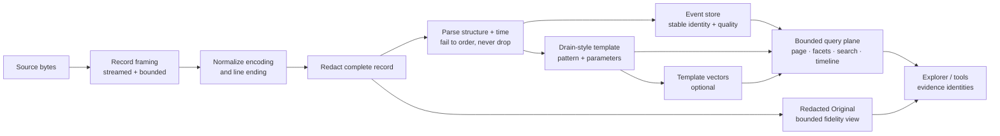
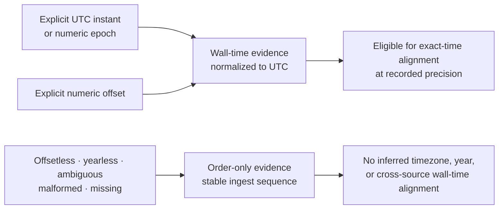

# Log evidence pipeline

**Method status:** **Partial.** ContextDesk ships the embedded post-mortem batch
pipeline: bounded ingest, redaction, parsing, Drain-style templates, DuckDB
events, template-scale vectors, structured/keyword/semantic search, facets,
analysis tools, packages, and Log Explorer query APIs. Bounded redacted
Original records, explicit-offset logfmt/RFC5424 normalization, and the shared
timeline/metric presentation are present on `main`. Built-in record grammars
use deterministic versioned fingerprints with content-only tie handling and
record-level dispatch. Full timestamp provenance, subsecond precision,
timezone rules, and clock-skew review remain #670; user-authored profiles and
multiline framing remain #751; durable noise policy remains #671.

## 1. Problem

Post-mortem logs combine four difficult properties:

- very high volume;
- extreme repetition;
- inconsistent structure and timestamp quality; and
- sensitive, occasionally malformed source data.

A trustworthy system must make millions of events searchable without embedding
every line, must preserve enough source fidelity to audit formatting, and must
not align records across machines merely because their timestamp strings look
similar. It must also keep UI and model operations bounded regardless of corpus
size.

The reusable method is a layered evidence plane:

1. stream and normalize records safely;
2. redact before persistence or model-visible transformation;
3. parse only defensible structure and time;
4. persist event identity and quality in an analytical store;
5. collapse repetition into templates;
6. embed templates, not events;
7. expose bounded queries and summaries; and
8. let visualization and AI consume typed evidence rather than raw dumps.

## 2. Status and evidence

| Capability                                                  | Status                                    | ContextDesk evidence                                                                                                                           | Literal residual                                            |
| ----------------------------------------------------------- | ----------------------------------------- | ---------------------------------------------------------------------------------------------------------------------------------------------- | ----------------------------------------------------------- |
| Streaming batch ingest and omission accounting              | **Shipped**                               | [`ingest.rs`](../../../crates/cd-core/src/log_analysis/ingest.rs)                                                                              | Live tailing remains later work                             |
| Bounded nested support-bundle ZIP intake                    | **Shipped**                               | [`ingest.rs`](../../../crates/cd-core/src/log_analysis/ingest.rs) nested-archive preflight, private staging, virtual identities, and adversarial tests | Three-container depth and fixed safety caps are deliberate  |
| Redaction before ordinary event persistence/embedding       | **Shipped**                               | [`redact_log.rs`](../../../crates/cd-core/src/log_analysis/redact_log.rs)                                                                      | Redaction cannot prove all domain-specific PII is removed   |
| Bounded redacted Original representation                    | **Shipped**                               | `prepare_original_record` and additive store fields in [`ingest.rs`](../../../crates/cd-core/src/log_analysis/ingest.rs) and [`store.rs`](../../../crates/cd-core/src/log_analysis/store.rs) | Bounded redacted fidelity, not unbounded raw retention      |
| JSON numeric/RFC3339 timestamp parsing                      | **Shipped**                               | [`parse.rs`](../../../crates/cd-core/src/log_analysis/parse.rs)                                                                                | Whole-second storage and incomplete provenance              |
| Explicit-offset logfmt/RFC5424 normalization                | **Shipped**                               | [`parse.rs`](../../../crates/cd-core/src/log_analysis/parse.rs) and current-main proof on #681                                                  | Whole-second storage and full #670 provenance policy        |
| Offsetless/yearless timestamps remain unresolved/order-only | **Shipped**                               | [`parse.rs`](../../../crates/cd-core/src/log_analysis/parse.rs)                                                                                | Per-source timezone/year policy remains #670                |
| Versioned built-in grammar fingerprints                     | **Shipped**                               | [`format_profile.rs`](../../../crates/cd-core/src/log_analysis/format_profile.rs), [`parse.rs`](../../../crates/cd-core/src/log_analysis/parse.rs), and record-level ingest dispatch in [`ingest.rs`](../../../crates/cd-core/src/log_analysis/ingest.rs) | User-authored profiles, durable provenance, and multiline framing remain #751 |
| Full timestamp provenance, precision, DST, skew policy      | **Planned**                               | #670                                                                                                                                           | No current claim of seamless arbitrary timestamp alignment  |
| DuckDB event store                                          | **Shipped**                               | [`store.rs`](../../../crates/cd-core/src/log_analysis/store.rs)                                                                                | None for current batch architecture                         |
| Drain templates and template-only embedding                 | **Shipped**                               | [`drain.rs`](../../../crates/cd-core/src/log_analysis/drain.rs), [`embed_policy.rs`](../../../crates/cd-core/src/log_analysis/embed_policy.rs) | Cloud embedding remains opt-in/follow-up                    |
| Bounded event query, facets, Find, timeline summaries       | **Shipped**                               | [`query.rs`](../../../crates/cd-core/src/log_analysis/query.rs)                                                                                | Durable metric attachment and full #670 time policy         |
| Search/correlation/anomaly/trace tool surface               | **Shipped**                               | [`search.rs`](../../../crates/cd-core/src/log_analysis/search.rs), [`why.rs`](../../../crates/cd-core/src/log_analysis/why.rs)                 | Provider quality requires tools-enabled acceptance          |
| Privacy-reviewed diagnostic handoff                         | **Shipped**                               | `diagnostics.rs`, typed ingest evidence callbacks in `ingest.rs`, `logDiagnosticReport.ts`, `LogDiagnosticDialog.tsx`, `log_diagnostic_report.rs`, and `log_diagnostics.rs` | Reports are memory-only metadata; users still review before sharing |
| Durable noise/squelch policy                                | **Planned**                               | #671                                                                                                                                           | Filters exist; governed reusable noise policy does not      |

## 3. Reusable method



The ordering is a trust contract. Redaction occurs on the complete normalized
record before a bounded Original is derived and before parsing or templating.
Parsing failure does not drop the record; it preserves a redacted message and
ingest-order identity. Templates reduce repeated structure but never replace
the event store as the source of event truth.

### Why “N× reduction” is not compression

The template reduction ratio is:

```text
event count / distinct template count
```

A `100×` value means that, on average, one distinct template represents 100
events for clustering and embedding. It does **not** mean source bytes or corpus
storage are 100 times smaller. Events and their changing parameters still
exist in the analytical store.

For a triage engineer, present three separate concepts:

- **template repetition:** events per template (`N×`);
- **template uniqueness:** distinct templates as a percentage of events; and
- **storage footprint:** source bytes versus corpus bytes.

This avoids calling an indexing optimization “compression.” A percentage
reduction can be derived as `1 - templates/events`, but it describes only the
number of strings embedded/analyzed at template scale.

## 4. Inputs, outputs, and data contracts

### Source record contract

| Concept          | Meaning                                                                  | Rule                                                                            |
| ---------------- | ------------------------------------------------------------------------ | ------------------------------------------------------------------------------- |
| source identity  | Relative file/object identity                                            | Never a private absolute path in UI/model DTOs                                  |
| ingest sequence  | Stable order assigned during import                                      | Always available; corpus-scoped                                                 |
| source bytes     | Complete framed record before text decoding                              | Counted for accounting; not necessarily retained                                |
| normalized text  | UTF-8 text after deterministic replacement and line-ending normalization | Encoding change is recorded                                                     |
| redacted text    | Complete normalized text after secret scrub                              | Parser and template input                                                       |
| bounded Original | Prefix of redacted text at a UTF-8 boundary                              | Must state truncation, source byte count, encoding normalization, and redaction |

The current local-integration Original contract caps one stored redacted record
at 64 KiB. It is “Original (redacted),” not raw bytes and not necessarily the
entire record. Ordinary event/query/model DTOs do not carry it; it is fetched
explicitly for an inspector.

### Event contract

| Field                         | Meaning                                                 | Important semantics                                          |
| ----------------------------- | ------------------------------------------------------- | ------------------------------------------------------------ |
| `corpus_id` + `seq`           | Authoritative event identity                            | `seq` is meaningful only inside its corpus                   |
| `source`                      | Relative provenance                                     | Revalidated for saved evidence                               |
| `ts`                          | Wall-clock whole seconds or ingest-order fallback today | Must be paired with quality                                  |
| `time_quality`                | `wall`, `mixed`, or `order_only` projections            | A reliable source cannot upgrade an unreliable one           |
| `level`                       | Normalized severity token                               | Original spelling may only be available in redacted Original |
| `service`, `host`, `trace_id` | Optional parsed facets                                  | Missing is not empty evidence                                |
| `template_id`                 | Repeated-message pattern identity                       | Supplemental to event citation, not a replacement            |
| `message`, `params`           | Redacted parsed content                                 | Bounded in result DTOs                                       |

### Time truth model

The portable model should separate at least:

| Basis           | Meaning                                                              |            Alignable by default?            |
| --------------- | -------------------------------------------------------------------- | :-----------------------------------------: |
| Wall            | UTC instant supported by explicit zone/offset or trusted source rule |       yes, at its recorded precision        |
| Relative        | Duration from a source-local origin                                  | no, unless an explicit mapping is validated |
| Order           | Ingest/source order only                                             |                     no                      |
| Legacy inferred | Old record classified by a heuristic                                 |        only with visible limitation         |



The diagram separates two outcomes rather than suggesting that every timestamp
can be normalized. Explicit instants can participate in exact-time alignment at
their stored precision. Ambiguous or unsupported forms remain navigable by
stable ingest order and must not be promoted to shared wall time without a
separately configured and disclosed source rule.

Current ContextDesk production storage has one whole-second `i64` and uses a
wall/order quality heuristic. It does not yet persist full `time_basis`,
original timestamp text/hash, offset/zone provenance, precision, DST
ambiguity, or skew adjustment. Those are #670 requirements, not shipped facts.

### Template contract

Each template has a stable corpus-local identity, pattern, count, first/last
seen, severity, and optional vector. An event retains its own identity and
changing parameters. Template vectors may rank candidate templates; a second
bounded event query resolves them back to evidence.

### Query contract

Every public query defines:

- exact corpus identity;
- filter intersection semantics;
- ordering and keyset cursor;
- inclusive/exclusive time bounds;
- maximum page, pattern, excerpt, and bucket sizes;
- time-quality requirements;
- cancellation behavior when supported; and
- whether a result is keyword, regex, semantic, or structured.

## 5. Invariants and trust boundaries

1. **Never parse or embed unredacted record text.**
2. **Never call the bounded redacted Original “raw” or “complete” when
   normalization, redaction, or truncation occurred.**
3. **Never drop a record solely because structured parsing failed.**
4. **Never invent a timezone, reference year, or DST choice.**
5. **Never let one wall-clock source upgrade another source's time quality.**
6. **Never use event payload fields as authoritative citation identity.**
7. **Never widen a noncontiguous evidence set to a sequence envelope.**
8. **Never embed every event merely to support semantic search.**
9. **Never let a malformed package or sidecar publish partial state.**
10. **Never describe template reduction as on-disk compression.**
11. **Never make blank timeline buckets disappear if gaps are semantically
    important.**
12. **Never apply a noise rule invisibly to evidence or model retrieval.**
13. **Never treat a support diagnostic as a corpus package.** Diagnostics use an
    explicit metadata allowlist, exclude event/template payloads and private
    configuration, reapply redaction at the native write boundary, and remain
    bounded and user-reviewed.

Trust boundaries:

- source bytes and paths are untrusted;
- the core/host owns decoding, redaction, parsing, caps, and storage;
- DuckDB and sidecars are authoritative only after validated publication;
- the webview receives typed redacted DTOs;
- the model receives bounded tool evidence, never corpus file access; and
- user-applied time/noise rules must be explicit durable policy with provenance.

## 6. Algorithm detail

### 6.1 Discover and frame

1. Traverse only the selected import scope.
2. Reject symlinks/path escapes and count excluded, ignored, and failed files.
3. Treat a directly selected ZIP, a ZIP discovered in a directory, or a ZIP
   member inside another ZIP as a container only after bounded central-directory
   preflight.
4. Validate every archive identity before payload reads. Reject absolute,
   traversing, backslash-ambiguous, NUL-containing, duplicate-normalized, or
   archive-delimiter-conflicting names.
5. Preserve nested provenance with a virtual identity such as
   `support.zip!/host-a.zip!/logs/app.log`; identical basenames in distinct
   paths remain distinct sources.
6. Stream ordinary members in place. Copy only a nested archive container into
   private per-ingest staging, using a fixed buffer, and remove it when
   recursion returns or the ingest guard unwinds.
7. Apply cumulative entry and expanded-byte budgets across every nested level,
   plus per-member, depth, and compression-ratio limits.
8. Read records with bounded buffers.
9. Frame records deterministically; today the common path is line-oriented.
10. Preserve source and ingest-order identity.
11. Report partial import honestly if discovered content was not fully imported.

The ContextDesk reference policy permits three ZIP containers in one identity
chain, 50,000 cumulative entries, 512 MiB expanded bytes per member, 4 GiB
aggregate expanded bytes, and a 2,048:1 expanded-to-compressed ratio. These are
replaceable product bounds, not portable magic numbers. A reimplementation
must retain explicit caps, cumulative accounting, preflight-before-payload,
private staging, stable virtual identity, cancellation, and atomic
non-publication.

### 6.2 Normalize and redact

1. Remove one record delimiter without claiming exact original line endings.
2. Decode UTF-8; use deterministic replacement for invalid sequences and record
   that normalization occurred.
3. Redact the complete normalized record.
4. Feed the complete redacted text to parsing and templating.
5. Derive any durable Original representation only after redaction, with a
   UTF-8-safe byte cap and explicit truncation metadata.

### 6.3 Parse structure and timestamp

Use format detection as a hint, not a reason to discard.

Current production:

- JSON accepts numeric Unix seconds/milliseconds and RFC3339 strings with an
  explicit offset;
- logfmt accepts numeric time and explicit-offset RFC3339 timestamps;
- RFC5424 accepts explicit-offset timestamps;
- classic syslog and plain text fall back to ingest order; and
- storage is whole-second.

Equivalent positive/negative offsets and epoch forms map to one UTC second.
Fractional input is deterministically truncated to whole seconds. Offsetless,
yearless, malformed, and missing timestamps remain order-only.

Before parser dispatch, every non-empty bounded physical record receives a
transient `FormatFingerprint`. The immutable built-in registry is:

| Grammar ID | Version | Decisive content clue | Optional producer hint |
| ---------- | ------: | --------------------- | ---------------------- |
| `json-object-line` | 1 | complete valid JSON object | none |
| `logfmt-record` | 1 | at least two valid pairs including a recognized semantic field | none |
| `rfc5424-record` | 1 | valid numeric PRI plus RFC5424 header/structured-data framing | none |
| `classic-syslog-record` | 1 | exact month, day, time, host, and message framing | none |
| `date-level-logger-thread-record` | 1 | date/level/bracketed logger/parenthesized thread grammar | possibly WildFly/JBoss family |
| `bracketed-timestamp-level-component-node-record` | 1 | four strict timestamp/level/component/node bracket groups | possibly Elasticsearch classic family |
| `local-minute-zone-level-record` | 1 | strict local minute/fraction, uppercase zone, level, and payload grammar | none |
| `plain-line` | 1 | no defensible structured match | none |

The fingerprint reports outcome (`matched`, `unknown`, or `ambiguous`), grammar
ID/version, optional producer hint, decisive clue codes, top score, runner-up
margin, and equal-scoring candidate IDs/versions when ambiguous. Registry
declaration order has no semantic effect. Equal top scores have a zero margin
and no selected grammar; candidates below the fixed eligibility threshold and
insufficient content evidence are `unknown`. Both outcomes preserve the
complete redacted line through `plain-line` and ingest-order time.

Path and extension can be supplied to the API for future bounded shortlisting,
but cannot score or select a grammar. This makes `.jsonl` ordinary text remain
plain. Conversely, a startup banner cannot lock later JSON or logfmt records
to plain: the current bounded strategy classifies each physical record
independently. Mixed-format files therefore remain honest without buffering a
whole source or sampling unbounded content.

Grammar identity is not producer identity. A record matching the
date/level/logger/thread grammar can carry a `wildfly-or-jboss-family` hint,
but the parser does not assert that WildFly emitted it. The fingerprint is
transient in this slice; durable per-source/per-event profile provenance,
custom profiles, preview/approval UI, and profile drift belong to #751.

The #747 parser slice also recognizes the common JBoss/WildFly
`server.log` prefix
`YYYY-MM-DD HH:mm:ss,SSS LEVEL [logger] (thread) message` (including a dot
millisecond separator). Logger and thread text remain in the parsed message and
the redacted Original retains the complete normalized line. An attached or
separate `Z`/numeric offset is normalized to a whole Unix second. An offsetless
local calendar timestamp is validated but the event deliberately retains
ingest-order time. The transient parser result exposes that validated source
text as `unresolved_local_timestamp` so a bounded import-preview sampler can
ask for timezone policy without guessing. Current ingest does not persist this
field because the event schema has no honest place for the local datetime,
timezone provenance, or DST ambiguity. A future #670 per-source timezone rule
must preserve that source text, preview the chosen interpretation, and record
the rule before the event becomes wall-time alignable.

The #749 parser slice recognizes the classic Elasticsearch bracketed shape
`[YYYY-MM-DD HH:mm:ss,SSS][LEVEL][component][node] message` by content, even
when a file-level sample was classified as plain text. It trims padded
severity, component, and node fields; maps component and node into the existing
service and host fields; and keeps the complete original line. As with
WildFly, an explicit `Z` or numeric offset becomes a whole-second instant while
an offsetless local timestamp remains order-only and is exposed transiently as
unresolved source-local evidence for the future #670 policy.

The #752 parser slice also recognizes the strict content shape
`YYYY-MM-DDTHH:mm,SSS ZONE. LEVEL: message`. It extracts severity and payload
but deliberately leaves the complete timestamp token unresolved and
order-only. The producer grammar has not established whether the comma field
means seconds, milliseconds, or another unit, and abbreviations such as `CET`
are not resolved through the workstation locale. A future declarative source
profile (#751) may define those semantics; #670 must then retain the selected
rule/version and original evidence.

The preceding parser slices are limitations, not a complete timestamp system. A
reimplementation should design the richer #670 contract before writing data:
original timestamp evidence, precision, explicit time basis, timezone rule
identity, ambiguity state, and non-destructive skew overlays.

### 6.4 Template and embed

1. Tokenize the redacted parsed message.
2. Generalize changing tokens into placeholders with an incremental Drain-style
   parse tree.
3. Update template count and temporal/severity summary.
4. Embed unique template patterns under a bounded policy.
5. Mark semantic state `keyword_only`, `deferred`, `partial`, or `complete`.
6. Preserve keyword/structured availability when embeddings are absent.

### 6.5 Persist and publish

- Events live in an embedded columnar analytical store.
- Templates and vectors remain a separate layer.
- Corpus metadata records files, omissions, events, templates, bytes, levels,
  time range, formats, and embedding state.
- Import/package publication uses staging, bounded expansion, hashes, and a
  final atomic visibility step.
- Legacy metadata remains readable; missing derived stats are recomputed rather
  than passively rewriting the corpus.

### 6.6 Query

1. Validate the corpus and filter contract.
2. Build parameterized predicates.
3. Use composite keyset ordering for forward/backward paging.
4. Cap page size, pattern length, regex scan, excerpt length, timeline buckets,
   and time range.
5. For semantic search, rank templates then resolve bounded event identities.
6. Return stable identities, source, time quality, and explicit mode.
7. Fetch complete formatted or redacted Original content only through a
   deliberate inspector path.

### 6.7 Lanes, gaps, and timeline

- A lane is a source-set query intersected with global filters.
- Independent mode has no alignment claim.
- Follow seeks peers near a selected time and is approximate.
- Align uses shared exact timestamp slots only when each participating lane has
  defensible wall time.
- Missing events are visible gaps, not synthetic rows.
- The range timeline is a bounded aggregate, not an event-body transfer.
- Dense fixed buckets should represent zero counts explicitly and use one
  shared axis for severity and lane tracks.
- A long blank duration must remain a gap; future compressed-gap views need
  explicit nonlinear-axis disclosure.

### 6.8 Portable diagnostic handoff

A support diagnostic and a shareable `.cdlog.zip` corpus package solve different
problems. The package intentionally carries analyzed corpus data. The diagnostic
is a small metadata report for reproducing product behavior across an isolated
workstation and a support machine.

Diagnostics are built from explicit allowlists rather than serialized product
state. A persisted-corpus report contains application identity, OS, corpus
identity/name, safe scalar counts, parse/level summaries, bounded
basename-only omission examples, embedding state, and an optional bounded
reproduction note or current UI status.

An active Explorer adds only payload-free reproduction state: layout and row
modes, time quality/linking, lane and selected-source counts, filter-presence
and numeric range information, bounded sequence identities, and logical
viewport anchors. Filter text, trace values, source/service/host labels, event
content, chat state, and model/provider state are deliberately not represented.

A failed ingest has no corpus identity. The trusted core recorder discards
free-form progress messages and original errors after mapping them to one
stable final reason code. Raw intake sends a separate typed callback for only
six evidence classes: `binary`, `empty`, `hidden`, `oversized`, `read_failed`,
and `parse_failed`. That callback constructs a secret-scrubbed, bounded final
basename in core; it never carries a parent path, archive ancestry, event
payload, or parser/filesystem error string.

The recorder keeps complete saturating counters for those six classes and at
most 20 basename/reason observations in deterministic ingest order. An
`omitted_entries` counter discloses additional observations beyond the
transcript cap. `parse_failed` means a bounded source/archive representation
could not be decoded under the intake contract (for example malformed ZIP
metadata or an over-limit logical line); an unknown log syntax still uses the
honest plain-log fallback and is not mislabeled as a parse failure.

The desktop owns one in-memory slot. Raw ingest begins a new generation before
fallible cache/provider setup; a setup failure is recorded into that new
generation. Starting any later raw or package import clears the prior slot
before its own fallible setup, a stale overlapping attempt cannot replace the
newer generation, explicit Clear removes it, and restart removes it. A
successful later attempt leaves the slot empty. Failure and cancellation
therefore cannot publish a partial corpus merely to support diagnostics. The
same typed observer is used for directory, directly selected ZIP, and
recursively nested ZIP intake.

These structural choices keep top-template patterns, event payloads, source
labels and absolute paths, chats, provider/model inventories, evaluator truth,
private network identities, and secrets outside the report.

The user previews the exact Markdown or JSON before saving. The renderer sends
a recursively `deny_unknown_fields` metadata DTO, not report text. The host
validates identifier and Git-SHA shapes, applies secret/location scrubbing to
every untrusted string, enforces all collection and byte bounds, renders both
formats, and returns those exact previews under a bounded opaque in-memory
report ID. Unknown payload/model fields fail closed. Saving sends only that ID
and the selected format; the renderer cannot author export text, select a
destination, assert overwrite confirmation, or authorize itself through a
separate IPC call.

Reproduction-note edits are debounced and host preparations are serialized.
Queued stale generations are discarded before host work, stale completions are
released, an accepted replacement releases its prior report ID, and closing
the dialog releases the selected ID. This keeps the visible preview saveable
even when many edits occur within the host store's bounded report window.

Host privacy handling covers secret tokens, ordinary private-suffix hosts such
as `server.internal`, arbitrary absolute Unix/Windows paths, private/loopback
IPv4, and loopback/unique-local/link-local IPv6. The invoking native window
owns the Save panel. Cancellation is typed and writes nothing. A completed save
returns `saved`; a cleanup or directory-durability failure after publication
returns `saved_with_warning` so the UI never claims a committed report was not
saved.

For an accepted exact preview, the host writes and syncs a restricted,
create-new sibling temporary file. A new destination is published without
replacement using `renamex_np(RENAME_EXCL)` on macOS,
`renameat2(RENAME_NOREPLACE)` on Linux, or write-through `MoveFileExW` without
replacement on Windows. Unsupported Unix compatibility paths fail closed. A
native-panel-confirmed existing destination is atomically replaced with
same-filesystem rename on Unix or write-through `MoveFileExW` on Windows.
Publication is the commit point. The parent directory is then synced on Unix;
post-commit cleanup or sync failures become typed warnings. Temporary files are
cleaned after pre-publication errors, and symlink or Windows reparse-point
destinations are refused. Diagnostics remain distinct from a `.cdlog.zip`
package, which intentionally contains analyzed corpus data.

The renderer report builder still narrows product state into the allowlisted
DTO for display responsiveness, but only the host-rendered and host-retained
result can be copied or saved. The native write boundary revalidates the stored
content before publication. The UI therefore never reconstructs evidence by
parsing free-form progress or error strings.

## 7. Performance and bounds

| Dimension                              |                            ContextDesk bound/policy | Behavior                                               |
| -------------------------------------- | --------------------------------------------------: | ------------------------------------------------------ |
| Source ingest memory                   |                        Streamed record/file buffers | Does not load whole corpus                             |
| Archive-container depth                |                                          3 ZIP layers | Reject deeper chains atomically                        |
| Raw bundle entries                     |                                   50,000 cumulative | Reject before unbounded traversal                      |
| Archive member expanded bytes          |                                            512 MiB | Exclude or reject under the typed policy               |
| Raw ingest aggregate expanded bytes    |                                              4 GiB | Reject atomically                                      |
| Archive compression ratio              |                                            2,048:1 | Reject suspicious metadata before payload reads        |
| Original (redacted)                    |                     64 KiB redacted UTF-8 per event | Truncate with metadata after full-record redaction     |
| Ordinary event page                    |             200 default; core hard cap in query API | Keyset page                                            |
| Timeline buckets                       |                                         256 maximum | Clamp; no event bodies                                 |
| Find/regex pattern                     |                                      256 characters | Reject                                                 |
| Search excerpt                         |                                      160 characters | UTF-8-safe truncate                                    |
| Bounded regex scan                     | 50,000 resident/candidate events in the proven path | Refuse/limit broader work                              |
| Tool reported-time window              |                                              7 days | Both bounds required; lower inclusive, upper exclusive |
| View selected identities               |                                                  64 | Sort/deduplicate/truncate for model hint               |
| Bookmark exact refs/item               |                                                 512 | Reject larger save                                     |
| Bookmark total refs/sidecar            |                                               8,192 | Reject malformed/oversized sidecar                     |
| Template embeddings at ordinary ingest |                                   Top 256 templates | Persist honest partial state                           |
| Embedding defer threshold              |              More than 64 MiB streamed source bytes | Publish keyword/structured corpus                      |
| Trusted reanalysis                     |                               Up to 2,048 templates | Atomic sidecar publication                             |

Reference-machine measurements for the existing deterministic 100k-event proof
are useful regression evidence, not universal targets: 100,000 events across 10
files, roughly 16.4 MB source, 4.449 s import, 31 ms first page, 15 ms timeline,
73 ms deep Find, and 3.776 s bounded 50k-row regex on one machine.

For 10–100M-line aspirations, measure peak memory, staging disk, event scan
latency, template count, and cancellation—not only ingest throughput.

## 8. Failure and recovery

| Failure                       | Detection                        | User-visible state            | Recovery                                   | Guarantee                                 |
| ----------------------------- | -------------------------------- | ----------------------------- | ------------------------------------------ | ----------------------------------------- |
| Invalid UTF-8                 | Decoder reports replacement      | Encoding normalized label     | Inspect redacted Original                  | Event retained                            |
| Secret pattern                | Redactor changes/blocks content  | Redaction indicator           | None without privileged source outside app | Secret not persisted in ordinary fields   |
| Unknown format                | Parser cannot defend structure   | Plain/order-only quality      | Configure future source rule or use search | Record not dropped                        |
| Offsetless local timestamp    | No explicit zone/rule            | Order-only/unresolved         | Future previewed per-source rule (#670)    | Workstation zone not guessed              |
| Yearless syslog               | No reference-year policy         | Order-only/unresolved         | Future explicit rollover policy            | Current year not guessed                  |
| Fractional timestamp today    | Whole-second store               | Precision limitation          | #670 schema evolution                      | No false subsecond claim                  |
| Mixed time quality            | Per-source/corpus classification | Align disabled or limited     | Inspect/fix source policy                  | Reliable peer does not upgrade it         |
| Embedding unavailable/timeout | Embed status                     | Keyword-only/deferred/partial | Trusted reanalysis                         | Corpus remains usable                     |
| Import omission/read error    | Per-file counters/reasons        | Partial corpus status         | Correct input and reimport                 | Missing data not hidden                   |
| Unsafe/malformed nested ZIP   | Shared archive preflight/budgets | Stable import error           | Correct or split the bundle                | No partial corpus; private staging removed |
| Cancelled ingest/reanalysis   | Cancel flag/progress             | Cancelled                     | Retry                                      | Previous published corpus/index preserved |
| Malformed package             | Preflight/hash/schema checks     | Import error                  | Obtain valid package                       | No partial corpus publication             |
| Stale evidence identity       | Source/time hint revalidation    | Stale/missing                 | Locate replacement explicitly              | No silent rebinding                       |
| Noise overwhelms results      | User observation/filter counts   | Temporary filter only today   | #671 durable policy later                  | No hidden permanent squelch               |

## 9. Observability

Persist or expose:

- discovered/imported/excluded/failed/ignored file counts;
- stable omission reasons with bounded basename-only examples;
- source bytes and corpus bytes;
- event and template counts;
- template repetition and embedding state;
- format and normalized severity counts;
- timestamp quality counts—not only min/max;
- redaction, encoding normalization, and Original truncation flags;
- query mode, filter, result/page count, bucket count, and cancellation;
- per-phase progress and duration; and
- package version/hash verification.

Future #670 observability should add parsed/ambiguous/rejected/relative/order
counts and the exact source rule or skew overlay responsible for each
normalization.

## 10. Security and privacy

- Redact before persist and before embed.
- Keep cloud embeddings off by default and require explicit per-corpus egress
  confirmation.
- Store corpora in application cache as disposable incident data; keep durable
  investigations elsewhere.
- Do not expose home paths through IPC or public diagnostics.
- Treat filenames and log messages as untrusted content.
- Validate package paths, sizes, entry counts, hashes, and versions before
  publication.
- Never offer an unredacted Original view as a convenience feature.
- A future noise rule must be transparent to UI queries, analysis tools, and
  model context; it cannot secretly delete evidence.
- A future clock correction must be a reversible overlay with provenance and
  uncertainty, not a rewrite of source truth.

## 11. UX and human factors

A triage engineer needs:

- useful normalized UTC when defensible;
- clear `mixed` or `order-only` labels when not;
- source provenance in every aggregate row;
- compact severity/source tokens with accessible full labels;
- formatted and Original (redacted) inspector tabs;
- explicit notices for truncation, redaction, and encoding normalization;
- independent Find highlights and Filter row reduction;
- forward/backward paging or seamless bidirectional scroll;
- lanes that preserve source membership and show gaps honestly;
- timeline volume/severity/lane tracks on a shared axis;
- explicit Follow versus Align semantics; and
- temporary filters separate from durable, visible noise policy.

Uncertainty and required operating information must be visible in focusable
details, not only a hover tooltip.

## 12. Test recipe

| Layer                | Required proof                                                                                                                               |
| -------------------- | -------------------------------------------------------------------------------------------------------------------------------------------- |
| Parser unit          | Registry identity/version uniqueness; JSON/logfmt/RFC5424/classic/special/plain fingerprints; equal-score ambiguity independent of order; banner/mixed records; incidental pairs; extension disagreement; pseudo-PRI; non-syslog `Jan…`; positive/negative offsets; malformed, offsetless, yearless, overflow; fractional precision contract; Unicode |
| Redaction unit       | Complete-record redaction precedes truncation; secret absent from parser/store; invalid UTF-8 and CRLF accounting                            |
| Store integration    | Stable corpus+seq+source identity; exact/noncontiguous references; legacy schema read; additive Original unavailable/available behavior      |
| Query integration    | Filter intersection; keyset forward/backward; time bounds; regex cap; semantic template-to-event resolution; dense gap buckets               |
| Package              | Frozen version fixture; path traversal, duplicate, cap, hash, too-new reader, staging cleanup                                                |
| Deterministic corpus | Known cross-zone shared instant, ambiguous controls, noise families, long line, secret sentinel, stale identity                              |
| Desktop component    | Inspector tabs/copy; time-quality labels; Find versus Filter; lane membership; gaps; timeline seek; focus restoration                        |
| Packaged/native      | Narrow/normal/wide/ultrawide; 25k/100k corpora; Original fresh/legacy; useful time; resizable columns; long rows; two-way paging             |
| Scale                | 100k deterministic regression every acceptance pass; larger generated corpora periodically with machine metadata                             |

The cross-zone fixture's expected answer must stay outside imported roots. Tests
should assert all supported explicit-offset forms resolve to the known UTC
instant while ambiguous controls remain order-only.

## 13. ContextDesk anchors

- [`ingest.rs`](../../../crates/cd-core/src/log_analysis/ingest.rs): streaming
  import, progress, cancellation, accounting.
- [`redact_log.rs`](../../../crates/cd-core/src/log_analysis/redact_log.rs):
  redaction and local-integration Original contract.
- [`format_profile.rs`](../../../crates/cd-core/src/log_analysis/format_profile.rs):
  immutable built-in registry and explainable transient fingerprint contract.
- [`parse.rs`](../../../crates/cd-core/src/log_analysis/parse.rs): record-level
  parser dispatch and timestamp parsing.
- [`store.rs`](../../../crates/cd-core/src/log_analysis/store.rs): DuckDB event
  store, corpus metadata, embedding state.
- [`drain.rs`](../../../crates/cd-core/src/log_analysis/drain.rs): incremental
  templates.
- [`embed_policy.rs`](../../../crates/cd-core/src/log_analysis/embed_policy.rs):
  deterministic embedding/defer policy.
- [`query.rs`](../../../crates/cd-core/src/log_analysis/query.rs): pages, facets,
  advanced Find, timeline summaries.
- [`search.rs`](../../../crates/cd-core/src/log_analysis/search.rs) and
  [`why.rs`](../../../crates/cd-core/src/log_analysis/why.rs): evidence
  retrieval and analysis.
- [`package.rs`](../../../crates/cd-core/src/log_analysis/package.rs): portable
  versioned package.
- [`bookmarks.rs`](../../../crates/cd-core/src/log_analysis/bookmarks.rs):
  payload-free exact evidence identity.
- Canonical designs: [Log analysis](../LOG_ANALYSIS.md) and
  [Log Explorer](../LOG_EXPLORER.md).

## 14. Shipped / partial / planned matrix

| Slice                          | Status                        | What is true now                                              | What is not claimed                     |
| ------------------------------ | ----------------------------- | ------------------------------------------------------------- | --------------------------------------- |
| Batch ingest/store/templates   | **Shipped**                   | Embedded local pipeline and deterministic states              | Live sources/tailing                    |
| Redacted Original              | **Shipped**                   | Bounded, redacted, tested source representation                | Unbounded raw retention or perfect domain-specific PII removal |
| Explicit-offset JSON           | **Shipped**                   | Defensible RFC3339/epoch to whole seconds                     | Full provenance/subseconds              |
| Explicit-offset logfmt/RFC5424 | **Shipped**                   | Explicit `Z`/offset forms normalize to whole seconds           | Full #670 provenance/subsecond/timezone policy          |
| Built-in grammar fingerprints | **Shipped**                    | Immutable versioned registry, record-level dispatch, explicit unknown/ambiguous outcomes, and grammar/producer separation | Durable provenance, custom profiles, profile drift, and multiline framing (#751) |
| JBoss/WildFly `server.log`      | **Partial**                   | Structure and explicit offsets parse; offsetless lines remain intact and order-only | Persisted local-calendar provenance and per-source timezone rule (#670) |
| Classic Elasticsearch logs     | **Partial**                   | Bracketed structure and explicit offsets parse; padded metadata is normalized | Persisted local-calendar provenance and per-source timezone rule (#670) |
| Incomplete time + zone abbreviation | **Partial**              | Strict shape, level, payload, and unresolved source token are preserved | Comma-field semantics and abbreviation mapping require a versioned source profile (#751/#670) |
| Arbitrary timestamp diversity  | **Planned/partial**           | Ambiguous inputs fail to order rather than guess              | #670 timezone/year/DST/skew contract    |
| Query/facets/search            | **Shipped**                   | Bounded event and template-aware retrieval                    | Unbounded regex or raw dumps            |
| Timeline                       | **Partial**                   | Shared-axis log summary, metric tracks, scrubber, severity signal, resident range, lane coverage, and viewport-follow cursor | Durable metric attachment, metric chat context, and full #670 time policy |
| Noise suppression              | **Planned**                   | Temporary filters exist                                       | Durable auditable squelch policy (#671) |
| Template “reduction”           | **Shipped**                   | Events/templates ratio                                        | Storage compression claim               |

## 15. Reimplementation notes

The analytical SQL engine, template algorithm, vector backend, and UI framework
are replaceable. Preserve:

- record streaming;
- redaction-before-parse;
- stable event identity;
- explicit time basis/quality;
- template/event separation;
- optional semantic availability;
- bounded queries;
- explicit gaps; and
- non-destructive source fidelity.

Freeze timestamp representation and provenance before production ingest. Moving
from whole seconds to subsecond instants after data exists affects ordering,
pagination cursors, evidence identity, package compatibility, and timeline
buckets.

Do not use event count divided by template count as evidence of storage savings.
Measure source bytes and corpus bytes separately. Do not use workstation locale
to “helpfully” interpret an offsetless production timestamp.

## 16. Open residuals

- #670: first-class time basis, original timestamp provenance, subsecond
  precision, per-source timezone and year rules, DST ambiguity, skew proposals,
  UI disclosure, package compatibility, and import preview.
- #671: durable transparent noise/squelch rules for viewer, analysis, and model.
- #751: durable profile provenance, user-authored profile lifecycle,
  preview/approval UI, profile drift, and bounded multiline framing.
- #667: optional metric/time-series tracks on the shared axis.
- #639: final persistent timeline acceptance and future richer interactions.
- The current Original representation is redacted text after normalization, not
  byte-for-byte source. Exact byte preservation would require a separate
  security and retention design.
- Large 10–100M-line behavior needs periodic scale proof beyond the deterministic
  100k acceptance fixture.
