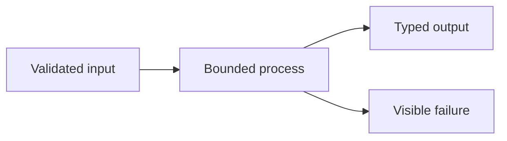

# Proven method chapter template

Use this template for an overall workflow or a low-level process that another
team may want to understand, adapt, or reimplement. Delete instructional text
that does not apply, but do not omit a section merely because the current
implementation has a gap. Record the gap explicitly.

Markdown is the source of truth. Use Mermaid for relationships or sequences
that are materially clearer as a diagram. Do not maintain a separate HTML copy;
a future static site should be generated from this file family.

## 1. Problem

State the engineering and user problem in observable terms.

- What failure or cost exists without this method?
- Who experiences it?
- Why is a deterministic or governed method needed?
- What is explicitly out of scope?

## 2. Status and evidence

Use the handbook legend: **Shipped**, **Partial**, **Local integration**,
**Accepted design**, or **Planned**.

| Capability | Status  | Evidence                                | Residual                                  |
| ---------- | ------- | --------------------------------------- | ----------------------------------------- |
| Example    | Partial | Relative production path and named test | Issue number and literal missing behavior |

Rules:

- scope status to one capability, not the entire chapter;
- never use tests as proof of a production path that is not merged;
- distinguish one-machine measurements from guarantees; and
- cite an open issue when a meaningful residual exists.

## 3. Reusable method

Explain the method without ContextDesk names first.

1. Describe the algorithm or operating sequence.
2. Identify deterministic steps and model-dependent steps.
3. Identify human decisions and reversible actions.
4. Explain why this ordering is safer or more reliable than plausible
   alternatives.

## 4. Inputs, outputs, and data contracts

Describe conceptual portable contracts before product-specific DTOs.

### Inputs

| Field/concept   | Type or shape          | Required | Validation                                 |
| --------------- | ---------------------- | :------: | ------------------------------------------ |
| Stable identity | String or compound key |   yes    | Scope-bound; no path traversal or guessing |

### Outputs

| Field/concept | Meaning            | Bounded by                   | Provenance              |
| ------------- | ------------------ | ---------------------------- | ----------------------- |
| Result        | Inspectable output | Explicit count/byte/time cap | Named source and method |

State:

- identity and versioning rules;
- units, inclusivity/exclusivity, ordering, and precision;
- null/missing/unknown semantics;
- additive versus breaking evolution; and
- what must never be serialized.

## 5. Invariants and trust boundaries

List properties that must hold even during failure.

- **Invariant:** …
- **Trust boundary:** …
- **Untrusted input:** …
- **Authority:** …
- **Fail-closed rule:** …

Include evaluator-only truth, secrets, credentials, permissions, and
model-generated content when relevant.

## 6. Algorithm or process detail

Provide enough detail to implement the method independently:

1. validation;
2. normalization;
3. selection/ranking;
4. processing;
5. publication/presentation; and
6. cleanup or recovery.

Use pseudocode only when it clarifies the contract. Do not invent a public API
for documentation convenience.

## 7. Performance and bounds

Document hard caps and expected complexity.

| Dimension | Bound | Enforcement point | Overflow behavior                               |
| --------- | ----: | ----------------- | ----------------------------------------------- |
| Items     |     N | Trusted core/host | Reject, clamp, or truncate with explicit status |

Separate:

- hard safety bounds;
- configurable product defaults;
- measured reference-machine results; and
- unmeasured expectations.

Never convert a benchmark into a universal latency claim.

## 8. Failure and recovery

| Failure | Detection             | User-visible state | Recovery      | Data guarantee           |
| ------- | --------------------- | ------------------ | ------------- | ------------------------ |
| Example | Explicit error/status | Honest message     | Retry/restore | Prior good state remains |

Cover cancellation, partial completion, stale data, schema mismatch,
concurrency, unsupported capabilities, timeout, and restart where applicable.

## 9. Observability

State which signals let an operator or test determine:

- what was attempted;
- which source and policy were used;
- which bounds were applied;
- whether the result was complete, partial, degraded, or unavailable;
- where time was spent; and
- why a fallback or refusal occurred.

Avoid logs that expose secrets, private paths, customer content, or provider
inventory.

## 10. Security and privacy

Document:

- redaction points;
- data-egress decisions;
- secret and credential ownership;
- path/network allowlists;
- prompt-injection treatment;
- write side-effect classification and approval;
- retention/deletion behavior; and
- risks that remain after controls.

## 11. UX and human factors

Explain what the user sees and controls:

- default state and progressive disclosure;
- labels for uncertainty and degraded modes;
- explicit preview/apply/restore or accept/reject actions;
- keyboard, focus, screen-reader, and reduced-motion behavior;
- narrow/normal/wide behavior when applicable; and
- how power-user density avoids hiding required information.

Required operating information must not be hover-only.

## 12. Test matrix

| Layer            | Happy path | Boundary/adversarial path | Evidence           |
| ---------------- | ---------- | ------------------------- | ------------------ |
| Contract/unit    |            |                           | Named test/fixture |
| Core integration |            |                           |                    |
| Host/IPC         |            |                           |                    |
| Component/UI     |            |                           |                    |
| Packaged/native  |            |                           |                    |
| Scale/benchmark  |            |                           |                    |

Use deterministic fixtures with known truth. Include malformed, missing,
mixed-quality, Unicode, redaction, cancellation, and restart cases as relevant.

## 13. ContextDesk production anchors

Keep product-specific material here rather than mixing it into the reusable
algorithm.

- [Core anchor](../../../crates/cd-core/src/)
- [Desktop anchor](../../../desktop/src/)
- Canonical design or ADR
- Issue numbers and literal residuals

Name symbols in prose when useful, but link to stable repository files rather
than fragile line numbers.

## 14. Shipped / partial / planned matrix

| Slice | Status | What is true now | What is not claimed |
| ----- | ------ | ---------------- | ------------------- |
|       |        |                  |                     |

## 15. Reimplementation notes

Describe:

- the minimum viable trustworthy subset;
- replaceable technologies versus required semantics;
- migration and compatibility risks;
- tempting shortcuts that violate the method; and
- decisions that should be frozen before writing data.

## 16. Open residuals

List exact missing contracts, tests, production paths, or decisions. Link the
tracking issue where one exists. If there is no issue, say so instead of
implying committed scope.

## Author checklist

- [ ] Problem and non-goals are explicit.
- [ ] Every meaningful capability has a status and evidence.
- [ ] Reusable method is separate from ContextDesk anchors.
- [ ] Every Mermaid diagram has a specific `%% title:`, uses the bundled safe
      subset, and is accurately explained by adjacent prose.
- [ ] Inputs, outputs, identity, version, units, and missing-value semantics are defined.
- [ ] Invariants and trust boundaries are testable.
- [ ] Algorithm is detailed enough for independent implementation.
- [ ] Hard bounds and complexity are stated.
- [ ] Failure, cancellation, recovery, and prior-state guarantees are covered.
- [ ] Observability avoids private data.
- [ ] Security, privacy, and egress are reviewed.
- [ ] UX communicates uncertainty and user control.
- [ ] Tests span contract, core, host, UI, native, and scale as applicable.
- [ ] Shipped, local, partial, accepted, and planned work are not conflated.
- [ ] Reimplementation notes identify replaceable technology and required semantics.
- [ ] Residuals are literal and linked to issues when tracked.
- [ ] Relative Markdown links resolve.
- [ ] `git diff --check` passes.
