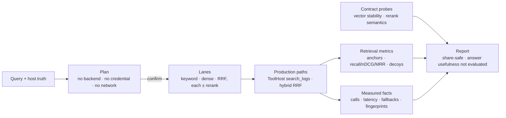

# Retrieval-quality diagnostic

## 1. Problem

When an investigator says "it didn't find the thing," the retrieval stack
offers no way to tell *which* part fell short. Was the embedder unhelpful? Did
the reranker reorder well but drop the decisive row? Did the corpus's vectors
come from a model nobody is using any more? Each of those has a different fix,
and without a measurement they are indistinguishable — so the usual response is
to change a weight, observe that the anecdote improved, and move on.

Two failure modes make this worse than merely unmeasured:

- **A silently incomparable vector space.** Vectors are only comparable when
  every input that shaped them matches — endpoint, exact model, wire dialect,
  representation, instruction, preprocessing, chunking. A mismatch does not
  error; cosine over the wrong space simply returns plausible-looking numbers.
- **A benchmark that measures something adjacent.** A harness that
  reimplements retrieval to make measurement convenient produces numbers about
  the harness. The lane most worth measuring is the one the product runs.

Out of scope: whether an answer built from retrieved rows was useful, and
whether a provider is ready for production. Both are separate measurements
with separate failure modes; the report labels them `not_evaluated` rather
than implying them.

## 2. Status and evidence

| Capability                                   | Status             | Evidence                                                                                                   | Residual                                                                       |
| -------------------------------------------- | ------------------ | ---------------------------------------------------------------------------------------------------------- | ------------------------------------------------------------------------------ |
| Typed embedding-space identity, fail-closed   | Local integration  | `crates/cd-core/src/embedding_space.rs`; `every_identity_field_drifts_independently`, `legacy_binding_fails_closed` | Corpora written before this land as `legacy_unbound` until re-analysed          |
| Space enforced on both query paths            | Local integration  | `hybrid_retrieval.rs` `embedding_binding_mismatch`; `search.rs` embed filter; `a_legacy_corpus_without_a_typed_space_fails_closed_until_reanalysis_rebinds_it` | —                                                                              |
| Rerank pool wider than K, with pinned anchors | Local integration  | `apply_rerank_stage`; `a_rerank_pool_wider_than_k_can_promote_a_row_that_fused_outside_k`, `pinned_anchors_survive_a_rerank_that_would_have_evicted_them` | Anchor kinds are fixed; no per-query anchor declaration yet                     |
| Byte-identical order on rerank refusal        | Local integration  | `a_refused_rerank_keeps_the_pre_rerank_order_byte_for_byte` (all five refusal shapes)                       | —                                                                              |
| Explicit rerank dialects                      | Local integration  | `build_rerank_backend`; `a_reranker_without_an_explicit_dialect_fails_closed`                               | Embedding dialect still has a legacy URL-shaped default outside the diagnostic  |
| Reanalysis plan with locality + consent       | Local integration  | `reanalysis_plan.rs`; `a_remote_plan_fails_closed_without_explicit_consent`                                 | —                                                                              |
| CLI parity for existing corpora               | Local integration  | `contextdesk retrieval-reanalyze`                                                                            | No progress rendering yet; the desktop flow has one                            |
| Lanes execute through production paths        | Local integration  | `retrieval_diagnostic/mod.rs`; `every_lane_runs_through_production_factories_and_reports_measured_facts`     | Keyword/dense lanes use `search_logs`, which is template-level, not RRF         |
| Share-safe artifacts                          | Local integration  | `the_report_is_share_safe_and_carries_no_endpoint_credential_or_corpus_text`                                 | —                                                                              |
| Cancel/egress stop before any provider work   | Local integration  | `a_pre_cancelled_run_touches_no_credential_and_no_provider`, `unacknowledged_egress_blocks_before_any_credential_or_provider_work`, `cancellation_between_two_probe_calls_stops_the_second_request` | —                                                                              |
| Only required roles built; failures block     | Local integration  | `a_role_no_selected_lane_needs_is_never_built`, `a_factory_refusal_blocks_the_lane_instead_of_faking_healthy_telemetry` | —                                                                              |
| Revisions pinned for the whole run            | Local integration  | `read_corpus_pin`/`note_drift`; `a_corpus_that_changes_mid_run_makes_the_report_inconclusive`, `the_pinned_identity_names_every_revision_that_decides_visibility` | Drift invalidates the run; it does not retry or re-pin                         |
| Private-network policy explicit               | Local integration  | `classify_endpoint`; `a_private_network_gateway_is_refused_explicitly_not_silently`                          | Only IP literals classify; a DNS name that resolves private is refused deeper, by the factory |
| Fingerprints agree with the endpoint that ran | Local integration  | `embedding_endpoint_for_dialect`; `a_configured_endpoint_fingerprints_the_same_as_the_backend_that_serves_it`, `published_fingerprints_describe_the_endpoint_that_actually_ran` | —                                                                              |
| Measured live retrieval quality               | **Not claimed**    | —                                                                                                            | Requires a real corpus, real truth, and a real provider; none is asserted here  |

## 3. Reusable method

1. **Make the vector space a typed identity, not a label.** Record every input
   that shaped it. Compare stored against query and fail closed on any
   difference, naming the fields that differ. Treat "no recorded identity" as a
   refusal, not as permission: an unprovable binding is not a passing one.
2. **Separate the candidate pool from the answer budget.** Retrieve a pool
   wider than K, rerank the pool, then truncate. Reranking only the rows that
   already fit can reorder them but can never recover a relevant row that
   ranked just outside.
3. **Pin what a relevance score cannot see.** A reranker scores topical
   similarity to the query. It is blind to an exact literal match, an
   explicitly requested structured constraint, and the chronological boundaries
   of the window. Pin those rows so reordering cannot evict them, and report
   every promotion.
4. **Make refusal a pure function.** The guarantee "a failed, timed-out,
   cancelled, or malformed rerank leaves the order untouched" is only checkable
   if the ordering decision does not also own the transport. Separate them and
   assert on serialized bytes.
5. **Probe the contract, not just the ranking.** Two calls with duplicated and
   reversed inputs catch what metrics cannot: cross-call dimension drift, and a
   "reranker" whose scores follow input position rather than document content.
   Both make every downstream number meaningless without changing it visibly.
6. **Execute lanes through the production path.** If measuring requires
   reimplementing retrieval, the measurement is about the reimplementation.
7. **Report retrieval separately from answer usefulness**, and let a run be
   inconclusive. Fewer than two usable lanes is not a winner.
8. **Gate consent and cancellation before construction, not before use.** A
   check placed after the backends are built has already read the credential
   and issued the probe requests it was meant to prevent. Cancellation also has
   to reach *between* the calls a single probe makes: a probe that issues two
   requests will issue the second one after the stop unless the check sits
   inside the call seam.
9. **Build only what the selected work needs.** A role no runnable lane
   requires should never be constructed, because constructing it reads a
   credential for a capability this run is not measuring.
10. **Never swallow a factory error.** A refused build that degrades to `None`
    is indistinguishable from "not configured", and the dependent lane then
    runs without the capability while still publishing a configured-looking
    model, dialect, and mode. Keep the failure and block the lane with it.
11. **Pin every revision that decides visibility, and re-read it.** Events are
    the obvious one; template analysis and suppression change what a query can
    see without changing a single event. Re-read before and after each unit of
    work, treat an unreadable pin as drift, and make the whole run inconclusive
    — a comparison that cannot prove its inputs were identical is not one.
12. **Derive every published fingerprint from one normalization.** Adapters
    normalize a configured base URL into a concrete route before they
    fingerprint it, so a fingerprint taken from the bare base URL disagrees
    with the stored one for byte-identical configuration, and nothing in either
    artifact reveals it.

## 4. Inputs, outputs, and data contracts

### Inputs

| Field/concept        | Type or shape                      | Required | Validation                                                        |
| -------------------- | ---------------------------------- | :------: | ----------------------------------------------------------------- |
| Corpus identity      | Corpus id                          |   yes    | Must exist; both revision clocks pinned for the run                |
| Query truth          | Durable event `seq` sets           |   yes    | Host-owned; never sent to a provider; ids must be unique per query |
| Budgets              | K, pool depth, context chars, ms   |   yes    | Pool clamped to at least K; identical across every lane            |
| Embedding role       | Endpoint, exact model, dialect     | for dense | Dialect mandatory; remote endpoint requires explicit consent      |
| Rerank role          | Endpoint, exact model, dialect     | for rerank | Dialect mandatory; never inferred from URL or model name         |

### Outputs

| Field/concept              | Meaning                                             | Bounded by                | Provenance                          |
| -------------------------- | --------------------------------------------------- | ------------------------- | ----------------------------------- |
| Mandatory-anchor retention | Fraction of must-have rows in top-K, missing named   | K                         | Host truth vs returned identities   |
| Recall / nDCG / MRR        | Standard IR metrics, graded                          | K                         | Host truth vs returned identities   |
| Decoy contamination        | Fraction of top-K belonging to another incident      | K                         | Host truth                          |
| Embedding-space fingerprint | Which vector space actually ran                     | —                         | The adapter that executed           |
| Rerank dialect             | Which parser actually ran                            | —                         | The adapter, never the endpoint     |
| Vector stability probe     | Dimensions, norms, duplicate and cross-call agreement | 2 bounded calls          | Synthetic strings only              |
| Rerank semantics probe     | Permutation completeness, position-vs-content        | 2 bounded calls           | Synthetic strings only              |
| Verdict                    | `executed` / `degraded` / `inconclusive`             | —                         | Lane statuses plus probe findings   |

A report never carries an endpoint, credential, header, raw body, corpus text,
username, or absolute path. Row identities are `seq` numbers, meaningless
outside the corpus that produced them.

## 5. Trust boundaries

- **Host truth never crosses the model boundary.** Relevance, anchors, and
  decoys stay in the query file and the scoring code.
- **Egress is consented per operation, not per session.** A remote role blocks
  every lane that would use it until acknowledged; a remote re-analysis is
  refused until acknowledged. Both refusals happen on configuration alone,
  before a backend exists or a credential is read.
- **Credentials stay in Rust.** The roles are built once per run; the report
  and every error string are redacted.
- **Measurement never writes.** No configuration, default, readiness store,
  corpus metadata, or template index is modified. A failure is degraded or
  inconclusive — never a reason to change what the product does.
- **A private address is still another machine.** Locality is decided by the
  retrieval factory's own classifier, shared by every surface that describes
  egress, so a plan cannot promise a locality the factory would refuse.

## 6. Failure modes and honest degradation

| Failure                              | Behaviour                                                        | Surfaced as                          |
| ------------------------------------- | ---------------------------------------------------------------- | ------------------------------------ |
| Corpus vectors have no typed space     | Semantic lane refused; keyword baseline unaffected                | `embedding_space_legacy_unbound`     |
| Stored and query spaces differ         | Semantic lane refused, differing fields named                     | `embedding_space_drift`              |
| Rerank fails, times out, is cancelled  | Pre-rerank order kept byte for byte; no score set on any row      | `rerank_failed_or_timed_out`         |
| Rerank response unalignable            | Same as above                                                     | `rerank_invalid_response`            |
| Role missing or dialect implicit       | Only the lanes needing it are blocked, and named                  | `*_role_unconfigured`, `*_dialect_not_explicit` |
| Remote role without consent            | Every lane using it blocked before any provider work              | `retrieval_egress_not_acknowledged`  |
| Fewer than two usable lanes            | Verdict `inconclusive`; nonzero exit                              | Verdict, not a winner                |

## 7. Residuals

- The keyword and dense lanes run through `search_logs`, which ranks at the
  *template* level with its own weights; the RRF lanes rank at the *event*
  level. Both are production paths, and the report names which engine each lane
  used — but the two are not directly comparable as ranking functions, and the
  report does not currently say so in its own text.
- Anchor kinds are fixed (exact phrase, structured, chronology). A per-query
  declaration would let an investigator pin a row the heuristics miss.
- The embedding factory still falls back to an Ollama dialect for the
  conventional port when no dialect is configured. The diagnostic refuses that
  fallback, but the product path retains it.
- `Url::host_str` keeps IPv6 brackets, so `http://[::1]` is classified remote
  by every surface. That errs toward asking for consent, and is consistent, but
  it is stricter than reality.
- The diagnostic does not emit per-lane events to the Activity Inspector. Its
  execution facts (call counts, latency, fallback codes, the mode that actually
  ran, the dialect that actually parsed) are carried in the report instead, so
  the information exists — but a reader watching Activity during a run sees the
  underlying `search_logs` calls without the lane framing around them.
- Corpus drift invalidates a run rather than recovering from it: the report
  goes inconclusive and names the revision that moved. It does not re-pin and
  retry, so a corpus under active ingest may need a quiet window to measure.
- Private-network classification covers IP literals only. A DNS name that
  resolves into a private range is still refused, but deeper — by the pinned
  client during construction — so it surfaces as a blocked lane with a factory
  reason rather than the named private-network code.
- Remote re-analysis is still one corpus at a time; there is no batching, and
  the diagnostic plans the re-analysis without performing it.
- No measurement of live retrieval quality is claimed anywhere. The hermetic
  tests prove the plumbing, the gates, and the arithmetic; they do not prove
  that any particular embedder or reranker helps on a real corpus.

## 8. ContextDesk implementation

| Concern                    | Path                                                        |
| -------------------------- | ----------------------------------------------------------- |
| Typed embedding space      | `crates/cd-core/src/embedding_space.rs`                     |
| Space persistence          | `crates/cd-core/src/log_analysis/store.rs` (`CorpusEmbeddingStatus::space`) |
| Query-time enforcement     | `crates/cd-core/src/log_analysis/hybrid_retrieval.rs`, `search.rs` |
| Pool depth and anchors     | `crates/cd-core/src/log_analysis/hybrid_retrieval.rs` (`apply_rerank_stage`) |
| Reanalysis plan            | `crates/cd-core/src/log_analysis/reanalysis_plan.rs`        |
| Role factories             | `crates/cd-workflow/src/retrieval.rs`                       |
| Diagnostic engine          | `crates/cd-workflow/src/retrieval_diagnostic/`              |
| CLI                        | `crates/cd-cli/src/commands/retrieval_diagnose.rs`, `retrieval_reanalyze.rs` |
| Shared UI copy             | `desktop/src/lib/reanalysisCopy.ts`                         |
