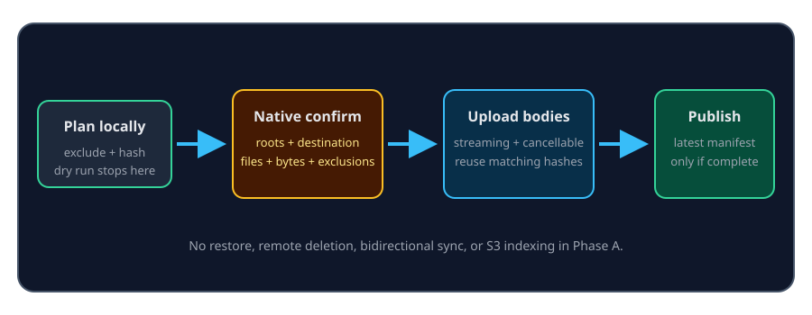

# S3-compatible backup and export

**Settings → Backup** provides an optional, user-triggered Phase A export to an
S3-compatible destination. Local workspace roots remain authoritative.
Enabling a destination does not start a transfer.

## Safe operating sequence

1. Configure endpoint, region, bucket, prefix, and path-style behavior.
2. Store the access key, secret key, and optional session token in the OS
   keychain accounts shown in Settings.
3. Run **Dry run** to traverse, exclude, hash, and estimate without remote
   writes.
4. Review exact roots, destination host, bucket, region, prefix, file and byte
   totals, and exclusions in the native confirmation.
5. Approve the real export and watch aggregate progress. Cancel waits for the
   active request to stop before completion is reported.

| Property | Phase A behavior |
| --- | --- |
| Selection | Never follows symlinks; excludes `.git`, app internals, secret-shaped files, databases/logs, and common build/dependency output |
| Transfer | Sequential and streaming with bounded memory |
| Identity | File bodies are content-addressed below a stable workspace namespace |
| Repeat run | Unchanged file bodies upload zero times; changed and new bodies upload once |
| Failure | The previous completed `manifests/latest.json` remains intact |
| Deletion | A locally removed file does not delete its remote object |
| Audit | Records destination identity and aggregate counts, not raw credentials or file contents |

## Endpoint policy

HTTPS is normal. Private or loopback MinIO-style endpoints require explicit
private-network opt-in; cloud metadata and link-local targets remain blocked.
The host revalidates and DNS-pins the endpoint before requests, rejects URL
userinfo, disables redirects and ambient proxies, and supplies only explicit
runtime credentials.

## What this is not

Phase A has **no restore**, remote deletion, bidirectional synchronization,
lifecycle management, or S3-backed search/index source. It makes no encryption
claim beyond the configured transport and server-side properties. Filename
and exclusion rules cannot prove that arbitrary allowed file contents contain
no sensitive information; dry run and confirmation are the review boundary.

