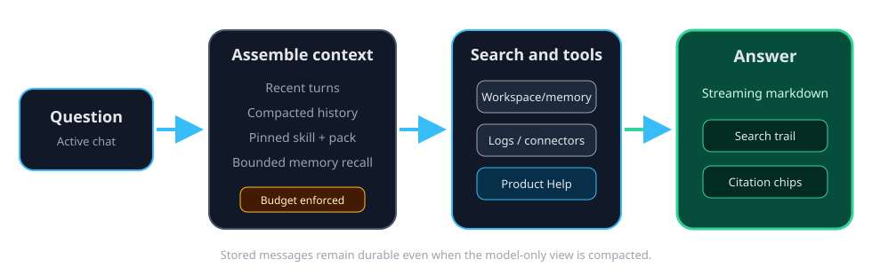

# Chat, citations, and context budgets

A chat turn combines recent conversation, a compacted summary when needed,
selected skill or session context, and bounded results from tools. ContextDesk
fits that material to the active model's context budget before calling the
provider. For the complete ordinary-versus-linked source and model-boundary
flow, read help://context-selection-model-boundary.

## Search trail and citations

| UI element | What it proves | What it does not prove |
| --- | --- | --- |
| Search trail | Which retrieval sources or Help tools were consulted | That every sentence came from a source |
| Citation chip | A stable source locator returned for supporting evidence | That the cited source is correct or safe |
| Tool row | Which tool ran and whether it reported success | That untrusted tool content is an instruction |
| Source preview | The cited local content at the selected path | Permission to read outside the workspace |

Workspace files and connector results are untrusted content. The agent may use
them as evidence, but their embedded instructions do not override the tool and
permission policy.

## Context fitting and compaction

Long conversations cannot be sent to a model without a bound. ContextDesk
keeps the newest turns and tool-call structure, folds older visible history in
the UI without deleting stored messages, and prepares a model-only compacted
view. The hard budget is model-specific when a declared or learned context
window is available.

If the prepared turn still cannot fit safely, the host returns a bounded error
instead of sending an oversized request. Context compaction is not the same as
deleting the saved chat: durable session history remains available in the
archive and conversation UI.

## When memory participates

Ambient durable-memory recall is a separate, tightly bounded source that can
be disabled in Settings. It does not insert the whole memory store. Recalled
records use memory citations; unapproved review candidates are not durable
memory and are not eligible for ambient recall. Read
help://memory-overview for the review path.

## Help grounding

For questions about ContextDesk itself, the agent can call `search_help` and
`read_help`. Those tools return bounded snippets or one bounded page and cite
`help://` locations. ContextDesk does not inject the full Help corpus into
every conversation.

> Note:
> Citations make provenance inspectable. They do not replace judgment: open
> the source, compare the claim, and treat uncertainty as uncertainty.
