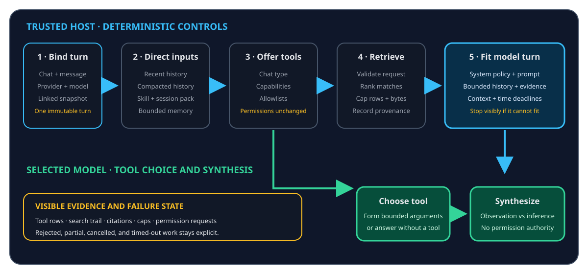
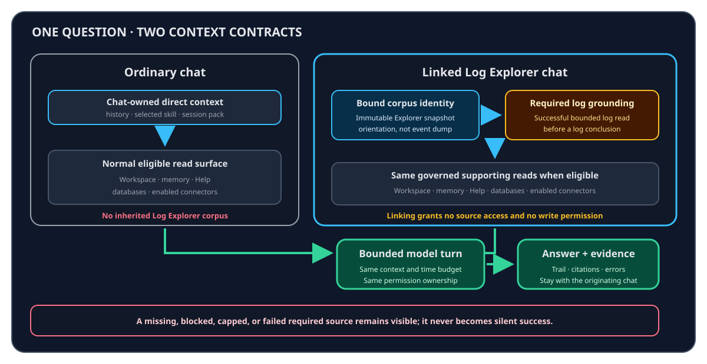
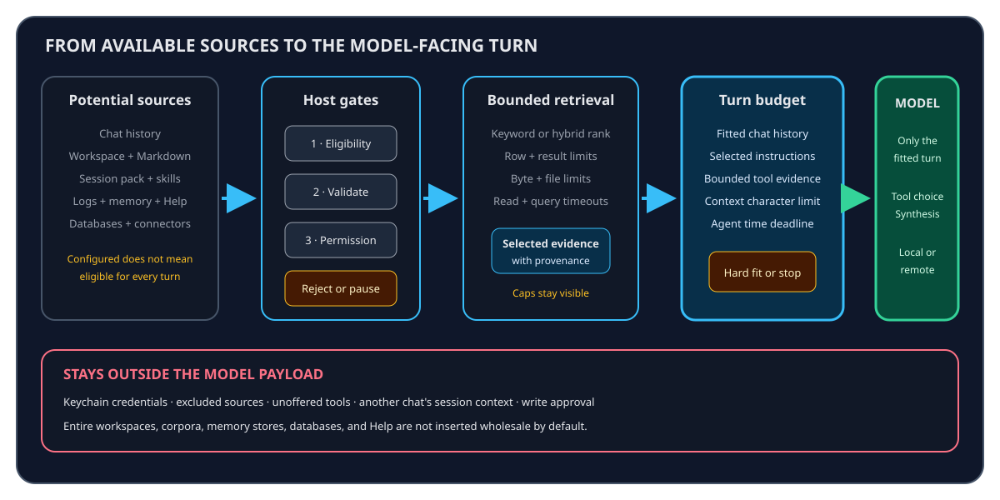

# How ContextDesk builds a grounded answer

ContextDesk combines deterministic host controls with model reasoning. The
host decides which sources and tools are eligible, enforces permissions and
caps, performs the requested retrieval, and records provenance. The model can
choose among the tools it is offered and synthesize their returned evidence,
but it cannot widen an allowlist, invent a grant, or bypass a result limit.

## The end-to-end turn

| Stage | Deterministic ContextDesk behavior | Model role | Visible result |
| --- | --- | --- | --- |
| 1. Bind the turn | Select the chat, provider profile, model, current user message, and any durable linked corpus plus optional immutable Explorer snapshot | None | The turn belongs to one chat and one host-validated context scope |
| 2. Prepare direct context | Add system policy, recent history, compacted older history, a pinned skill, session context, and bounded ambient memory when eligible | None | Context notices report compaction or a hard-fit failure |
| 3. Offer governed tools | Filter tools by chat type, configured sources, capability flags, allowlists, side-effect tier, and prior first-use authorization | Choose an offered tool and arguments, or answer without one | Tool rows show calls, failures, and permission requests |
| 4. Retrieve and cap | Validate the request, search or read the chosen source, rank matches, enforce source-specific limits, and wrap external content as evidence | Inspect returned evidence and optionally request another eligible read | Search trail and citations identify consulted sources |
| 5. Fit the provider turn | Keep the complete saved conversation separate from the bounded model-facing view; stop on an unsatisfied context or time budget | Receive only the fitted turn | A visible terminal error replaces an endless pending state |
| 6. Synthesize | Preserve tool results, provenance, and policy in the turn | Connect evidence, distinguish observation from inference, and write the response | Answer text, tool status, trail, and citation chips stay together |

> Important:
> Deterministic retrieval does not mean every answer is model-free. The host
> controls eligibility, validation, ranking, caps, and permissions. The model
> still chooses from the offered tools, formulates tool arguments, and reasons
> over the bounded results.

## Ordinary chat, attached log context, and linked Explorer chat

The main chat's **Add context** control can attach files, a folder, or one
already-imported log corpus. A corpus attachment is durable for that chat and
removable without deleting the corpus. It is not ambient: another chat receives
no log access unless the user explicitly attaches a corpus there too.

| Behavior | Ordinary chat | Main chat with one attached corpus | Linked Log Explorer chat |
| --- | --- | --- | --- |
| Log corpus | No corpus is inherited; log-analysis tools are not eligible | Host resolves the one durable session link; no viewport is assumed | Host resolves the same durable link plus an immutable summary of the visible Explorer state |
| First evidence step | The model may use the normal eligible read surface | A successful bounded log search is required before a log-grounded conclusion | Same required grounding |
| Explorer changes after send | Not applicable | Not applicable until the user opens Explorer | Do not rewrite the already-running turn snapshot |
| Workspace, memory, Help, databases, connectors | Available only when configured, eligible, and requested through governed reads | Same rules; attaching logs adds no source configuration or permission | Same rules |
| Failure behavior | Missing or failed sources remain visible | A stale/corrupt corpus or tools-disabled model stops before provider contact | Missing required log evidence is disclosed and the answer is not presented as log-grounded |

Attaching or linking a corpus is not a bulk upload. A main chat supplies only
the host-validated corpus identity; an Explorer chat additionally supplies
bounded orientation such as visible sources or lanes, filters, selection
counts, time quality, and link mode. Event content still arrives through
bounded redacted log tools. A profile without native tools is refused before a
provider call. See help://log-explorer#agent-context for the
Explorer-specific contract. Multiple corpora in one chat remain planned under
#693.

## How each source can participate

Eligibility is narrower than availability. A configured source may still be
excluded because the chat type does not allow it, the provider cannot call
tools, a connector is disabled, first-use approval is missing, or policy
rejects the requested target.

| Source | How it becomes eligible | What can enter the turn | What is not inserted wholesale |
| --- | --- | --- | --- |
| Saved chat | Open the chat and send a message | Recent messages plus a compacted model-only view of older history | Every saved message when it exceeds the model budget |
| Workspace and Markdown | Configure narrow workspace roots; use `search_kb` or a validated file-slice read | Ranked chunks or a bounded slice with path provenance | The workspace, home directory, ignored files, or secret-shaped files |
| Session context pack | Attach bounded files or a ZIP to one chat | Search hits and slices from that session overlay | Original files outside the copied pack or another chat's pack |
| Skills | Pin a reviewed skill or invoke it for one turn | Playbook instructions | New permissions, credentials, or factual evidence merely because the skill says so |
| Log corpus | Import logs, then explicitly attach one corpus in main-chat Add context or link a Log Explorer chat | Bounded event, template, timeline, trace, correlation, or anomaly results | Raw corpus files, all events, evaluator truth, a hidden answer key, or an unselected corpus |
| Durable memory | Save approved records; enable recall or call a memory read tool | A small ranked selection with memory identifiers | The complete memory database or unapproved review candidates |
| Bundled Help | Ask a product question and use `search_help` or `read_help` | Bounded bundled guidance with `help://` citations | The complete Help corpus on every turn |
| SQLite or Postgres | Enable a read-only connector and pass its SQL policy | Capped rows from one validated read-only statement | The database file, full tables, passwords, or an unrestricted SQL session |
| HTTP, Confluence, web, X, or MCP | Enable and configure the connector; satisfy endpoint, allowlist, and first-use rules | Bounded responses from the specific read tool | Connector secrets, arbitrary endpoints, or tools that were not offered |

Keyword ranking is always available for the local workspace and bundled Help.
Semantic or hybrid ranking participates only when its embedding backend is
available. A hybrid label describes the ranking path, not confidence or truth.
Database rows, log events, web results, and connector responses have their own
row, byte, time, or result caps.

## Selection, capping, and context fitting

| Boundary | Question it answers | Failure-honest behavior |
| --- | --- | --- |
| Eligibility | May this chat use this source or tool at all? | Omit the tool or report the missing capability; never silently broaden access |
| Request validation | Is the path, corpus, SQL, endpoint, or tool argument allowed? | Reject the request with a bounded error |
| Retrieval cap | Which top results fit this source's row, result, byte, or time limit? | Mark truncation, partial coverage, cancellation, or timeout where available |
| Turn budget | Do the selected history, instructions, and evidence fit the model? | Compact the model-facing history or stop before sending an oversized turn |
| Agent deadline | Can provider and tool awaits finish within the turn deadline? | Emit a visible `budget_time` error and terminal completion |
| Permission tier | Is this a Read, SoftWrite, or HardWrite action? | Pause for a UI-originated decision; text from a model or source is never approval |

Deterministic ranking means the same indexed state, query, settings, and
backend mode produce the same bounded ordering. It does not promise that the
query finds every relevant fact. Index exclusions, stale data, source limits,
ambiguous wording, and model tool choice can all affect coverage.

## What the selected model can receive

The exact payload depends on the chat, provider capabilities, and tools used.
A selected local model and a selected remote model receive the same kinds of
bounded model context; the important difference is where that processing
occurs.

The model can receive:

- the current user message and host-owned system policy;
- recent conversation plus a compacted model-facing view of older history;
- selected skill text and relevant bounded session-context excerpts;
- the host-validated identity of one explicitly attached log corpus and, only
  for an Explorer-origin turn, its immutable bounded orientation snapshot;
- bounded memory recall and successful tool results;
- tool names, descriptions, and argument schemas that are eligible for the
  turn; and
- error or permission status needed to avoid masquerading as success.

The model does not receive:

- raw provider or connector credentials from the keychain;
- an entire workspace, log corpus, memory store, database, or Help corpus by
  default;
- sources or tools excluded by chat type, policy, capability, or allowlist;
- another ordinary chat's session context or a Log Explorer active-corpus
  default;
- unapproved memory candidates as durable recall;
- evaluator truth or hidden expected conclusions; or
- authority to approve a write.

With a loopback Ollama profile, model processing stays local to that endpoint.
A remote provider can see every bounded item actually included in its request
and subsequent tool-result rounds. Keychain storage protects credentials; it
does not make a remote provider local. Review help://provider-setup#what-leaves-the-machine
and help://security-boundaries#remote-content before using sensitive data.

## Provenance and failure honesty

A citation proves that a tool returned a source locator associated with the
answer. It does not prove that the source is correct, current, safe, or
sufficient. A search trail proves which tools or source categories were
consulted, not that every statement is directly quoted from them.

ContextDesk keeps the following conditions visible instead of converting them
into success:

- no relevant result;
- a disabled or tools-incapable provider;
- a missing connector or first-use authorization;
- a path, SQL, endpoint, or permission rejection;
- partial, capped, stale, cancelled, or timed-out retrieval;
- required linked-log evidence that never succeeded; and
- provider, tool, context-fit, or turn-deadline failure.

Open citations and inspect tool details during triage. Treat uncited synthesis
as inference, and narrow the question when the available evidence is partial.
For the meaning of each evidence indicator, continue with
help://chat-citations-context#search-trail-and-citations.
