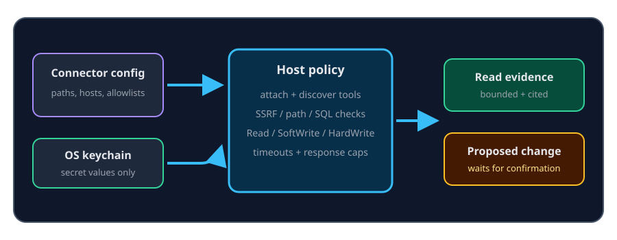

# Connectors, Confluence, and modules

Connectors register optional evidence sources and tools with the host. Their
configuration contains endpoints, paths, commands, allowlists, and keychain
reference ids—not raw passwords or tokens.

## Shipped connector paths

| Kind | Shipped behavior | Important boundary |
| --- | --- | --- |
| Files and memory | Search configured local sources | Workspace and memory scope still apply |
| SQLite | One read-only `SELECT` or `WITH … SELECT` with row and time caps | Write keywords and multiple statements are blocked |
| Postgres | Read-only session with statement timeout | Password is resolved from the keychain |
| HTTP preset | `GET` against configured allowlisted routes | Endpoint is SSRF-gated; a bucket or route cannot override the base |
| MCP stdio | Spawn an absolute local command and discover tools | Child environment is cleared; tools need first-use approval and unknown tools default HardWrite |
| Confluence | Search/read, harvest/sync, browser, and optional publish | Token is keychain-only; remote writes are off by default |

External modules use the same MCP subprocess substrate. ContextDesk limits
their working directory, environment, response size, and wall time, but does
not claim an operating-system syscall sandbox.

## Confluence workflow

1. In **Settings → Connectors**, enable Confluence, enter the base URL, save a
   token to secure storage, and preferably add space keys.
2. Search or read pages as evidence. An empty read allowlist can expose every
   space visible to the token, so narrow it.
3. Harvest a page into durable memory or a workspace file. Harvest requires a
   non-empty space allowlist and is SoftWrite.
4. Use check/apply sync to compare the tracked source before updating a local
   harvest destination.
5. Enable Confluence writes only when needed. Create, update, and Publish are
   HardWrite and require a fresh typed `WRITE` confirmation.

The Harvest pane exposes provenance and status. A successful read or harvest
does not authorize a later publish.

## When tools are missing

A disabled connector, failed MCP child, missing keychain item, invalid endpoint,
or provider without tool calling can remove its tools from the active turn.
Prelaunch reports these work-context categories separately so an optional
connector failure does not masquerade as a core workspace failure.

