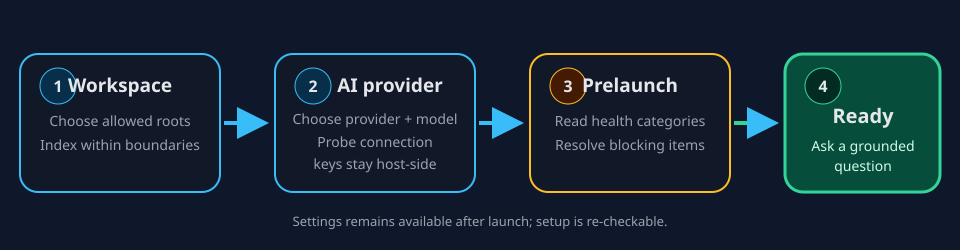

# First run and prelaunch

The launch flow separates three decisions: which local folders ContextDesk may
read, which AI provider should answer, and whether the required checks are
ready. Normal setup happens in the app; editing configuration files is not the
happy path.

## 1. Choose a workspace

Open the workspace step and select one or more roots. Those roots are the
filesystem allowlist for search and file-reading tools. Choosing a parent
directory grants access below that root; it does not grant access to the rest
of your home directory.

ContextDesk's index excludes known secret filenames and limits large or binary
files. An index status can report a file or resident-memory cap rather than
silently claiming that every file is searchable.

## 2. Configure AI

Choose the provider that matches your environment:

| Provider path | Egress | Credential behavior |
| --- | --- | --- |
| Ollama | Loopback/local by default | No product account or API key required |
| Grok Build session | xAI service after explicit opt-in | Existing local session is read by Rust; tokens never enter the webview |
| OpenAI-compatible | Configured endpoint | API key is stored in the OS keychain |
| Anthropic | Anthropic Messages endpoint | API key is stored in the OS keychain |

Select a chat model and save. The provider form validates and probes the
configuration without returning secrets to React.

## 3. Read prelaunch health

Prelaunch reports work-context categories such as files, memory, databases,
Confluence, and MCP. Blocking items prevent the ready state; warnings explain
partial capability without pretending it is healthy.

| State | Meaning | Next action |
| --- | --- | --- |
| Ready | Required local setup is available | Enter the main workspace |
| Warning | A non-blocking capability is unavailable or partial | Open the named Settings section if you need it |
| Blocking | Workspace or provider setup cannot support a chat | Correct the failing item and rerun the check |

News and X are optional research sources, not work-context requirements for
the Ready state.

## 4. Optionally install the demo logs

The **Ready** step offers **Install demo log corpus**. It is unchecked by
default and doing nothing leaves the Logs library empty. The option installs
25,000 entirely synthetic events (about 4 MB of bundled source logs) designed
for a seven-day performance-triage investigation.

Select the option, then choose **Install demo**. ContextDesk shows the same
bounded scan, parse, template, redact, store, and embedding progress used by an
ordinary Logs import. While an installation you explicitly started is active,
finish or cancel it before entering the app. A failure stays visible and can be
retried. Repeating a successful install selects the existing managed demo
instead of creating another corpus; user-created corpora are never replaced.

After success, **Enter app · Open Logs** opens the Logs library with the demo
selected. Choose **Open Explorer** to begin the investigation. The installed
resource contains only the synthetic log input; evaluator answer manifests and
optional operational metrics are not part of this first-run install.

## 5. Ask a grounded question

The empty chat home distinguishes two action types:

- **Fills composer** starters place editable text in the composer and never
  surprise-send. Workspace-dependent starters appear only when at least one
  workspace root is authorized; otherwise the starters remain chat-context
  safe.
- **Guided workflow** cards explicitly launch an optional, cancellable
  multi-step flow.

The context disclosure stays compact when no file or skill is attached, but
always states its session-only boundary. Material attached-file and pinned-skill
state expands and remains visible before send. If preflight is blocking, the
home shows one setup recovery action rather than a misleading action gallery.

With a workspace selected, try a question that names a subsystem in that
folder. When retrieval finds relevant material, the answer can include a search
trail and citations. An answer without a citation does not prove it came from
your workspace; see help://chat-citations-context.

> Tip:
> Use a small, known folder for the first question. It makes the allowlist and
> citations easy to verify before adding broader roots.
