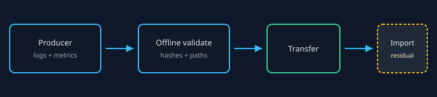

# Incident Evidence Bundles

An **Incident Evidence Bundle** is a producer-facing directory or deterministic
ZIP that carries authorized raw logs, optional operational metrics, and bounded
supporting files with a versioned `manifest.json`. ContextDesk can validate
either transport offline today; **product import and attachment UX** remain a
later delivery slice of the broader evidence-bundle program.



## Bundle vs analysis package vs Investigation

| Format | What it is | When to use |
| --- | --- | --- |
| Incident Evidence Bundle v1 (`contextdesk.incident_evidence.v1`) | Source interchange from a collector or support tool | Hand-off raw evidence with hashes and privacy declarations |
| Portable log package (`contextdesk.log_corpus.v1`) | Already-ingested analysis snapshot (events store + templates) | Share a finished ContextDesk corpus with a peer |
| Investigation / Case workspace (#532) | Collaborative bookmarks, notes, and reports | Human investigation records — not this interchange format |

See help://log-portable-package for analysis packages.

## Shortest producer workflow

1. Create a directory with relative paths under `logs/` (and optional `metrics/`).
2. Hash each file (SHA-256, lowercase hex) and record exact byte counts.
3. Write `manifest.json` with schema id `contextdesk.incident_evidence.v1`.
4. Validate offline before transfer (directory or ZIP):

```text
cargo run -p cd-core --bin cd-validate-incident-evidence -- validate ./my-bundle
cargo run -p cd-core --bin cd-validate-incident-evidence -- pack ./my-bundle --output ./my-bundle.zip
cargo run -p cd-core --bin cd-validate-incident-evidence -- validate ./my-bundle.zip
```

Pack is deterministic (Stored compression, fixed timestamps, sorted paths). Use
`--force` only when intentionally replacing an existing zip.

Copy/paste templates live in `examples/incident-evidence-producers/`.

## What the manifest declares

| Area | Meaning |
| --- | --- |
| Identity | `bundleId`, producer name/version, creation time with explicit offset |
| Components | Each file’s relative path, role (`log`, `operational_metrics`, `attachment`, `readme`), bytes, SHA-256 |
| Privacy | Redaction declaration; credentials/PII flags must stay honest |
| Time basis | Timezone only when explicitly known; never invent one |

Duplicate basenames are fine when relative paths differ
(`logs/api/app.log` vs `logs/worker/app.log`).

## Operational metrics

Reuse the existing **operational-metrics v1** document shape (series, units,
points, wall-clock quality, and **required series `provenance.source`** — the
same rules as the production TypeScript validator). Do not invent a second
series schema. Metrics sit beside logs only because the manifest lists both
roles; a sibling folder alone does not create a product attachment.

## Privacy review before sharing

- Prefer redacted logs; set privacy flags honestly.
- Never include API keys, session tokens, private absolute paths, or model
  inventories.
- Never include evaluator truth or expected-diagnosis catalogs.
- Optional README notes are for humans, not for hidden scoring data.

## Troubleshooting validation

| Symptom | Likely cause |
| --- | --- |
| `unsupported_schema_id` | Wrong or future schema id |
| `unsafe_path` | Absolute path, `..`, drive letter, or backslash separators |
| `hash_mismatch` / `byte_count_mismatch` | File changed after hashing, or wrong digest case |
| `timezone_dishonest` | `timezoneResolved=true` without a timezone value |
| `payload_missing` | Manifest path does not match an on-disk relative file |
| `undeclared_payload` | ZIP contains a file not listed in the manifest |
| `output_exists` | Pack refused to overwrite without `--force` |
| `symlink_refused` | Pack refused a symlink path component |

## Importing later

Product import/attachment UX is **not** claimed shipped by this Help page. When
import lands, validation will still run before any corpus or metric identity is
published. Until then, treat the offline validator as the conformance gate.

## Normative reference

Full rules, limits, and residuals:
repository path `docs/specs/INCIDENT_EVIDENCE_BUNDLE_V1.md` (engineering
handbook and specs; not ambient chat context).
