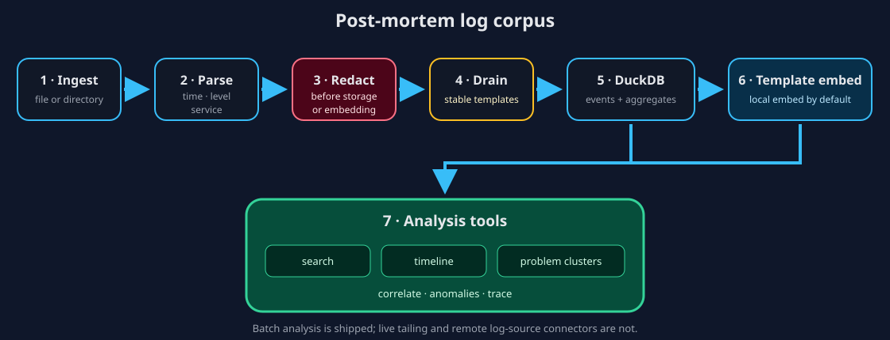

# How log analysis works

ContextDesk's shipped log path analyzes a bounded, post-mortem corpus. It turns
repetitive events into stable templates, keeps structured events in DuckDB,
embeds templates rather than every line, and exposes search, timeline,
clustering, and “why” tools.



## Pipeline

| Stage | What happens | Evidence or boundary |
| --- | --- | --- |
| Ingest | A file, directory, or bounded ZIP bundle is read into a named disposable corpus | `ingest_logs` is SoftWrite because it materializes local analysis data |
| Parse | Physical newlines are framed into **logical records** before parse (PostgreSQL DETAIL/HINT/STATEMENT and csvlog quoted newlines, JVM/Python/.NET/Go/Rust stacks, CRI `P`/`F` partials, pretty-printed JSON). Structured formats (JSON, logfmt, syslog, PostgreSQL stderr/csvlog/jsonlog) are parsed defensibly; `trace_id` is never filled from `span_id` or request ids; severity vocabulary keeps `trace`/`critical`/`log` distinct; date-shaped integers like `20250615` are rejected as Unix epochs. PostgreSQL `%m`/`%t` and jsonlog stamps of the form `YYYY-MM-DD HH:MM:SS[.mmm] ZONE` are read: `UTC`/`GMT` name one instant and become wall clocks, while ambiguous abbreviations such as `CST` or `IST` keep the calendar text as unresolved local evidence and stay order-only. `Sun Jun 15 12:00:00 2025` calendar strings are retained the same way. A transport envelope's payload contributes severity only when the envelope declared none — Docker `json-file` `log` payloads and RFC5424-borne CEF headers — and never overwrites container time, host, stream, or other transport metadata. Malformed structure falls back to retained redacted plain/order-only evidence rather than being dropped | No claim of perfect parsing or exhaustive per-line parse-error reporting. A timezone abbreviation we do not recognise licenses nothing, and no ambiguous abbreviation is ever resolved to an instant without an explicit source-timezone decision (#751); payload interpretation reads severity only, one layer deep (#791) |
| Redact | Secret-like values and sensitive parameters are scrubbed | Redaction happens before persistence and embedding |
| Template | Drain groups variable messages into stable templates | Parameters remain separate from the template pattern |
| Store | Events and templates are persisted under the app cache | DuckDB serves time/filter/aggregate scans; logs are not durable memory |
| Embed | Unique templates receive vectors | Local fastembed is the desktop default; tests use a deterministic offline backend |
| Analyze | Search, clusters, timelines, and why tools query the corpus | Results cite template/corpus evidence and should be checked against exemplars |

The event store and vector index have different jobs. DuckDB is optimized for
time windows, counts, filters, and co-occurrence across many event rows.
`VectorIndex` searches the much smaller set of template vectors. ContextDesk
does not embed every raw line.

## Events per template

The Logs overview describes pattern grouping as **average events per template**:

```text
100,000 events ÷ 10 learned templates = 10,000 avg. events/template
```

This is a triage-work ratio, not disk compression. Drain templates replace
changing tokens with placeholders, so structurally similar events can share a
pattern even when their request ids, hosts, durations, or other parameters
differ. Every original redacted event remains in DuckDB for search, filters,
provenance, and inspection.

A higher ratio usually means fewer recurring patterns to review and fewer
template records to embed. It does not mean events were deleted or that source
bytes shrank. Use the separate **Source** and **Corpus** sizes for storage, the
embedding state for actual vector coverage, and top-template counts to see
whether a few patterns dominate or a long tail remains.

## Tool guide

| Tool | Tier | Use it for |
| --- | --- | --- |
| `ingest_logs` | SoftWrite | Create a disposable analysis corpus from an allowed local path |
| `search_logs` | Read | Combine text/semantic query with time, level, service, or trace filters |
| `cluster_problems` | Read | Rank groups of related templates by severity, frequency, and anomaly |
| `timeline` | Read | Count events over time for a filter |
| `correlate_logs` | Read | Find templates that spike or co-occur around an incident |
| `anomalies_logs` | Read | Compare an incident window with an explicitly supplied baseline window inside the same current corpus. This is not a learned or cross-corpus application baseline |
| `trace_logs` | Read | Follow a trace or request identifier across services and time |

## A practical triage loop

1. In the Logs pane, ingest a copied incident dump into a named corpus.
2. Inspect detected services, levels, time range, and parse/redaction counts.
3. Open problem clusters and a timeline to identify the incident window.
4. Search a symptom or template—for example, a `connection refused`
   incident—then run correlation or anomaly analysis.
5. Follow a trace id when one exists.
6. Cite the concrete templates and exemplars in the explanation.
7. If a conclusion should become durable knowledge, propose a memory through
   the normal confirmation path.

The `log-triage` skill can provide this method to a chat; see
help://skills-context-packs. A skill does not bypass corpus ingest confirmation
or any later write.

## Review files before import

Use **Logs → Import with review…** when a folder or ZIP contains material you
may not want treated as log events. ContextDesk first performs a read-only,
bounded preview; nothing is staged or published yet. A straightforward input
goes directly to **Ready to import**. Open **Review selection…** when you want
the complete decision surface or when a source needs attention.

The selector keeps directory and nested `archive.zip!/member` identities
distinct, explains every ready/review/raw/supporting/ignored/unsupported/blocked
classification, and sends an exact allowlist to trusted core. Supporting,
ignored, unsupported, and blocked items remain visible with reasons but cannot
become log events. If the reviewed inventory is added to, removed from,
resized, or reclassified before Import, the run stops and asks for a fresh
review. A truncated preview never imports its unseen tail.

Cancel or Escape during a run requests cancellation and keeps the flow visible
until the engine acknowledges a cancelled, failed, or published terminal state.
Publication itself remains atomic. After publication, **Place local
timestamps** offers corpus-wide or selected-source IANA application as a
non-blocking review card; **Decide later** preserves order-only evidence without
guessing a timezone.

## Investigation workspace

After SoftWrite ingest, open **Log Explorer** from the Logs library for
filters, multi-lane evidence, bookmarks, and corpus-linked chat. See
help://log-explorer. SoftWrite bulk import streams zip/lines and can be
cancelled; the progress panel shows a monotonic phase
(discover → streaming read/parse/template/persist → optional embed → validate →
publish), elapsed wall time, and cancel state. The corpus is published
atomically—cancel or failure before publication leaves nothing in the library.
Template embedding is deferred/capped so large dumps finish SoftWrite without a
mandatory full embed pass; when deferred, completion text states that
keyword/structured first use is ready. Ordinary imports use the local ONNX model
when it is installed. Inputs over **60 MiB** of actual streamed log bytes are
marked **deferred** (measured so the explicit generated triage-stress 250k
acceptance corpus at **63,883,809** streamed source bytes defers past first use,
while the bundled seven-day 25k demo and smaller product paths still embed);
smaller imports embed at most the 256 most frequent templates.
The corpus Overview always shows its actual semantic state and model.

For a keyword-only or deferred corpus, choose **Re-analyze locally…** in Logs.
After confirmation, ContextDesk embeds up to 2,048 templates without reparsing
or duplicating events. Cancellation or failure keeps the previous keyword
corpus and index. Semantic search is labeled available only after vectors exist.

## Import phases

SoftWrite **progress chrome** stays one monotonic stream while read, parse,
template analysis, and persist interleave. After a successful import, the
completion/diagnostic report lists separate operation timings when the host
provides them:

- discover / read
- parse / frame
- template analysis
- persist / index
- optional embedding (or **deferred**)
- validation
- publication

These numbers are one-machine observations for triage engineers—not a product
SLA. Optional embedding is deferred when streamed source bytes cross the local
threshold (more than **60 MiB**). Cancel or failure before atomic publication
leaves nothing in the Logs library; retry can succeed without a stuck partial
corpus.

## Review source-local timestamps

ContextDesk keeps three timestamp facts separate:

- what the parser proved from the record;
- the currently active wall-time or ingest-order interpretation; and
- a source timezone that you explicitly declared.

If a supported grammar contains a complete local calendar timestamp but no
offset, the event stays searchable in ingest order. ContextDesk persists the
recognized local timestamp text and does not substitute the workstation
timezone.

To review it:

1. Select the corpus in **Logs**.
2. In **Time interpretation · Source timezones**, choose the **Review … source**
   or **Review … sources** control.
3. Choose **Resolve time…** for one source.
4. Keep **Leave unresolved — order-only**, or choose **Use an IANA timezone**
   and enter a regional identifier such as `Europe/Berlin`.
5. Choose **Preview**. Check the affected, already-explicit, and unchanged
   record counts; resolved UTC range; DST gaps; DST fold ambiguity; unsupported
   timestamps; and out-of-range values.
6. Choose **Apply declaration** only when the preview matches the source.

The preview is tied to the exact corpus revision. Apply recomputes it and fails
if the corpus, source, timezone, or preview token changed. Parser-proven
explicit offsets always win and remain unchanged. Apply publishes the event
timestamps, active time basis, declaration, range, and quality counts
atomically. The declaration remains visible after reopening the corpus.

To reverse the source rule, reopen **Review timezone**, choose **Remove
declaration**, and confirm. A new revision returns the affected records to
ingest order while preserving the parser's timestamp evidence. The core also
retains one validated prior event revision for one-step undo; stale or tampered
revision state is refused rather than partially applied.

Source and corpus time quality are recomputed as `wall`, `mixed`, or
`order-only` from the active event interpretations. A reliable source does not
silently upgrade another source. Exact alignment and metric correlation
continue to fail closed when participating time remains unresolved.

## Support bundles and nested ZIPs

You can select a ZIP directly or select a directory that contains ZIP files.
ContextDesk also follows ZIP members nested inside other ZIPs, which is useful
for support bundles assembled from several hosts or services.

Nested source identities remain unambiguous. For example:

```text
support.zip!/host-a.zip!/logs/app.log
support.zip!/host-b.zip!/logs/app.log
```

The same basename in different folders or archives remains a different source.
Archive paths are never extracted into the selected folder. Nested containers
are streamed into private per-import staging and removed after success,
failure, or cancellation.

The shipped safety policy allows at most three ZIP containers in one identity
chain, 50,000 cumulative entries, 512 MiB expanded bytes for one member, 4 GiB
aggregate expanded bytes, and a 2,048:1 expanded-to-compressed ratio. It rejects
ambiguous or traversing paths, backslashes, NULs, duplicate normalized
identities, symlink-like members, encryption, malformed ZIP metadata, and
multi-disk archives. Valid bounded Zip64 metadata is supported.

A rejected or cancelled bundle publishes no partial corpus. If a failure
occurs, return to **Logs** and use the memory-only failed-import diagnostic for
a redacted support report. It shows separate counts for binary, empty, hidden,
oversized, read-failed, and parse-failed sources plus at most 20
reason/basename examples. Additional examples are counted rather than retained.
Archive ancestry, private source paths, raw parser/filesystem errors, and
archive payloads are not included. The same evidence contract applies to a
directory, a selected ZIP, and ZIPs nested inside that ZIP. Saving this report
uses a strict host-rendered preview and a host-owned native panel. The renderer
cannot author the exported report, choose the destination, or assert overwrite
approval, and cancellation writes nothing.

## Current limits

This is batch, post-mortem analysis. Live tailing, continuous alerts, and
remote S3/Loki/Elastic/Kubernetes log-source connectors are not shipped in this
pipeline. A cloud embedding option, when used, requires an explicit
content-leaves-this-machine decision and remains separate from local re-analysis.
Bookmarks are not included in portable package v1. Durable noise/squelch rules
are not shipped (#671). The bounded per-source IANA workflow handles only
parser-recognized complete local calendar timestamps. Storage remains
whole-second; yearless timestamps, subsecond persistence, clock-skew
correction, arbitrary custom profiles, and seamless arbitrary log formats remain
incomplete (#670/#751). Timezone abbreviations are recognised but only
`UTC`-equivalent ones are resolved; every other abbreviation is retained as
unresolved local evidence for the per-source IANA workflow to decide. Corpora are analyzed
independently; versioned learned application baselines are not shipped (#690).

> Important:
> Redaction reduces risk but cannot prove that arbitrary logs contain no
> sensitive information. Review the corpus and any egress choice before using
> a remote model or embedding provider.

## Share a corpus package

See [Share a log analysis package](help://log-portable-package) for versioned export/import.
