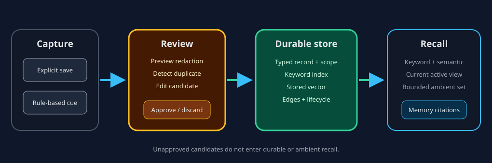

# Durable memory and the review inbox

Durable memory stores typed facts, decisions, preferences, tasks, bookmarks,
and project notes separately from chat history. Saved records can be found by
keyword and semantic similarity and cited back into a later conversation.

## Capture is reviewable

There are two visible capture paths:

1. an explicit `save_memory` proposal from the user or agent; and
2. rule-based cues after a chat turn that propose candidates for the Review
   inbox.

Candidates are not durable memory. You can edit, approve, or discard them.
Approval passes through the write policy, redaction, and deduplication path.
Large batch approvals require typed confirmation. A candidate that contains a
credential-dominant value is blocked; mixed prose is redacted before storage
and embedding.

| State | Stored durably? | Eligible for recall? | User action |
| --- | :---: | :---: | --- |
| Review candidate | No | No | Edit, approve, or discard |
| Active memory | Yes | Yes | Inspect, supersede, retract, or purge |
| Superseded/retracted memory | Metadata retained | Hidden from normal current recall | Review history where available |
| GDPR-purged memory | Content removed; bounded tombstone retained | No | Requires typing `PURGE` |

## Recall

Recall combines keyword and stored-vector signals, recency, confidence, kind
behavior, and links between related memories. Current active records are the
normal view. When two valid memories conflict, ContextDesk should surface
evidence rather than silently rewriting one belief.

Ambient recall can add a small selection to a chat without an explicit tool
call. It is capped to a few records and a small character budget, suppresses
echoes already present in the conversation, and can be disabled in Settings.
This does not load the whole memory database into the model context.

## Storage and privacy

Personal and workspace memory are distinct scopes. Provider secrets remain in
the keychain, and memory content is redacted before persistence and embedding.
Unapproved candidates are process-local and are not written to a legacy
candidate database or injected through ambient recall.

Permanent purge removes record content and vectors while leaving a minimal
tombstone needed to prevent accidental resurrection. It is different from a
reversible retract.

> Caution:
> Memory is intended for durable knowledge, not credentials. Redaction is a
> safety layer, not a password manager.
