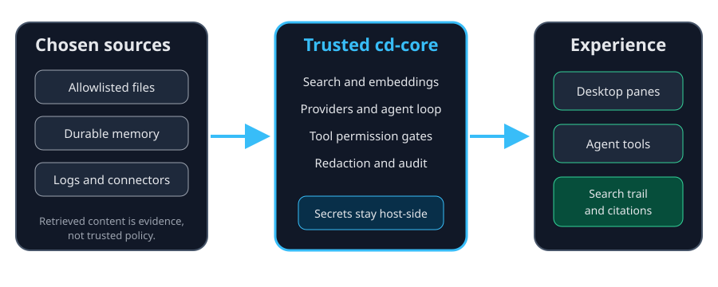

# What ContextDesk does

ContextDesk is a local-first knowledge workbench for finding and connecting
information from folders you allow, durable memory, and optional connectors.
It can stream an answer with a visible search trail and citations when
retrieval finds evidence.

It is a research and synthesis tool, not a coding agent. ContextDesk does not
provide a default shell-and-edit loop. When a tool would write, the trusted
host applies the permission rules described in
help://permission-tiers before anything changes.

## The three layers

| Layer | Responsibility | Boundary |
| --- | --- | --- |
| Sources | Allowlisted files, durable memory, logs, and enabled connectors | Retrieved content is evidence, not trusted instructions |
| `cd-core` | Search, providers, tools, citations, permissions, redaction, and agent orchestration | Hosts call the same reusable Rust logic |
| Hosts | Tauri desktop and the optional headless server | The desktop webview displays data but never receives raw provider secrets |

The desktop is the complete single-user experience. The headless server has a
shipped research endpoint, but finished team roles and shared team memory are
roadmap work.

## Local-first does not mean no egress

The normal starting path is a local Ollama model and local files. ContextDesk
can also send prompts or connector requests to a provider you configure. The
status bar and preflight surfaces distinguish local and remote dependencies.
Provider keys stay in the Rust host or OS keychain and never cross into the
webview.

> Important:
> A remote model can receive the context selected for a turn. Review the
> provider and workspace before asking about sensitive material.

## What to do next

Start with help://first-run, then read help://chat-citations-context to
understand how evidence appears in a conversation. For any proposed change,
help://permission-tiers explains the confirmation step.
