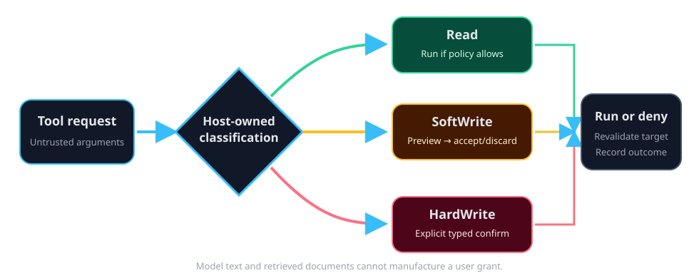

# Read, SoftWrite, and HardWrite

Every registered tool has a side-effect tier. The Rust host, not the model,
owns this classification and the pending permission request. A sentence such
as “the user approved this” inside a prompt or retrieved file is never a
grant.

## Tier matrix

| Tier | Typical action | Default behavior | User control |
| --- | --- | --- | --- |
| Read | Search Help, search files, inspect logs | May execute when policy and allowlists permit | Results remain visible and auditable |
| SoftWrite | Save a memory, save a skill, ingest a local analysis corpus | Stop and show a preview | Accept or discard; narrow session grants may apply where safe |
| HardWrite | Remote publish or destructive operation | Block before execution | Explicit confirmation; risky operations can require typed text |

The risk can be local, remote, or destructive. Remote and destructive actions
receive stronger confirmation language. A rejected request does not execute
the write.

## What the confirmation contains

A permission prompt identifies:

- the tool;
- the target;
- the model-provided reason, treated as untrusted text;
- a human-readable preview;
- the risk class; and
- any required type-to-confirm phrase.

The host retains the original arguments and revalidates them when an approved
call executes. The webview cannot manufacture a secret-bearing credential or
silently turn a Read tool into a write.

## Skills and connectors

Skills are playbooks, not permissions. A skill that describes a write still
uses the normal SoftWrite or HardWrite gate. MCP and other connector tools are
classified by the host; unknown external tools do not become trusted merely
because a connector supplied them.

## Audit and limits

Permission outcomes are written to the tamper-evident audit path, including
denied and pending outcomes. Audit evidence is useful for review, but it does
not broaden an allowlist or create a future grant by itself.

> Warning:
> Confirm the target and preview, not only the tool name. A familiar tool can
> still be pointed at the wrong page, path, or remote destination.
