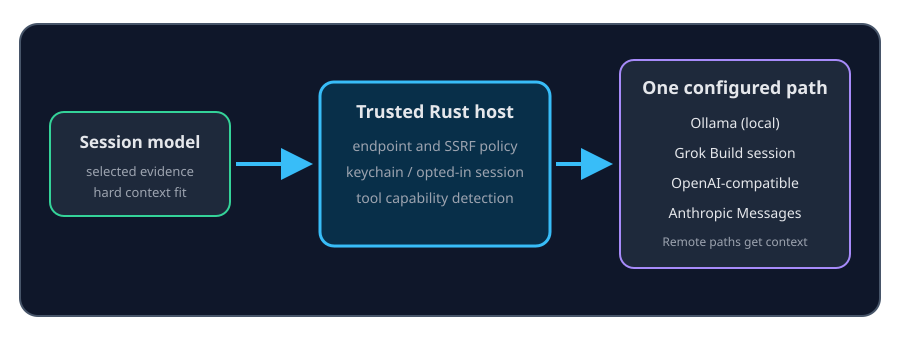

# Qualify model capabilities

ContextDesk can **measure** a few host-observable contracts for the exact
provider profile, endpoint, and model you selected. Measurement is always
**explicit**: nothing runs merely because Settings or preflight opened.

## When to use it

Use **Settings → AI / Models → Qualify selected model…** after you choose a
chat or specialty model id. Qualification answers “does this deployment accept
the synthetic contracts ContextDesk cares about?” — not “is this model good?”

## Probe lifecycle

| Stage | What happens | Privacy |
| --- | --- | --- |
| Offer | Role **name hints** (#723) only select which probes to offer | No network |
| Start | You click **Qualify selected model…** | Contacts configured provider only |
| Run | Synthetic prompts and inert tool `cd_qualify_echo` only | No logs, memory, workspace paths, or secrets in probe text |
| Cache | Result keyed by profile + endpoint fingerprint + model + schema | Local process cache; siblings never overwrite each other |
| Cancel | Stops further probes; remaining checks stay `untested` | Truthful status |
| Clear / Retry | Drop one exact model result, then re-run | Same isolation rules |

## Status values

Each check is `pass`, `degraded`, `fail`, or `untested`, with elapsed time and a
secret-free reason. Profile-level disabled tools or streaming remain
**authoritative** over any probe.

## What never happens

- Name hints alone never mark a capability `pass`.
- Qualification does not enumerate full model inventories into shareable
  diagnostics.
- One probe does not claim quality, context length, or permanent reliability.
- Probe tools cannot read files, corpora, memory, connectors, or arbitrary URLs.

## Residuals

Packaged proof against a real tools-enabled and tools-disabled profile depends
on your environment and credentials. ContextDesk ships the path; live packaged
evidence is owner-side.
