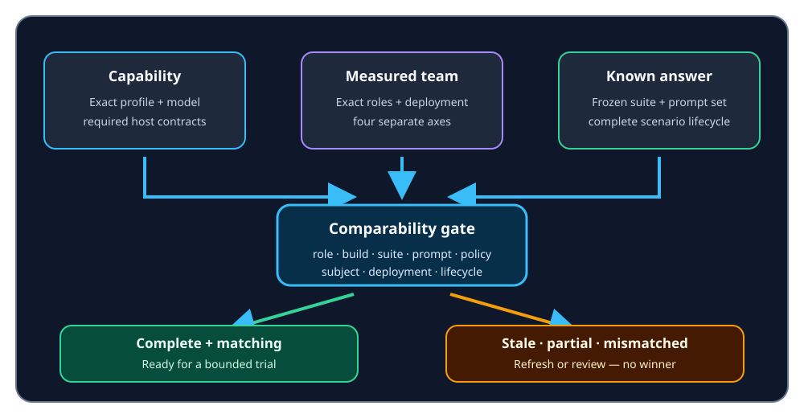

# Compare Investigation Team models fairly

ContextDesk can help you decide whether an exact configured model is suitable
for an Investigation Team role in **your** environment. It does not infer
quality from a model name, vendor, size, or benchmark reputation.

## Three different checks

These checks answer different questions. Passing one never silently satisfies
another.

| Check | What it establishes | What it does not establish |
| --- | --- | --- |
| Capability qualification | The exact deployment accepts the required generation, tool, and response-format contracts | Answer quality |
| Measured provider check | Every recorded role can execute a bounded opaque request through the trusted host | Full triage effectiveness or composed team quality |
| Known-answer assessment | Deterministically scored performance on the frozen scenario suite | Universal superiority, future reliability, or production authorization |

The current measured provider check dispatches one request per role. It does
not yet claim that an Investigator-to-Reviewer handoff was exercised as a
composed pipeline.

## Reproduce a configured-provider run

For each candidate model:

1. Preserve the exact configured model id. Do not replace it with a friendly
   family alias.
2. Keep the role fixed, such as **Investigator**, for every candidate.
3. Run capability qualification for that exact profile and model.
4. Run the measured provider check.
5. Assess the frozen known-answer suite.
6. Save the redacted report identities: build, role, profile, model, endpoint
   fingerprint, suite digest, prompt-set hash, and orchestration-policy
   fingerprint.
7. Repeat at least three times without changing those conditions.
8. Rotate run order—for example A → B → C, then C → B → A—to reduce warm-cache
   and transient gateway bias.
9. If the build, suite, prompt set, policy, role, profile, model, or deployment
   changes, rerun every candidate.

The model ids `qwen-3.6-27b`, `gpt-oss-120b`, and
`ministral-3-14b-instruct-2512` are examples that may be exposed by a configured
gateway. Their names alone provide no ContextDesk capability or quality
evidence.

## Compare models fairly

Runs are comparable only when all of the following are true:

- role, build, suite digest, prompt-set hash, and orchestration policy match;
- every required scenario was attempted and passed;
- no run is stale, partial, failed, blocked, cancelled, or unscheduled;
- the provider-reported model never conflicts with the configured model; and
- the evidence belongs to the exact measured subject and deployment.

Different endpoint fingerprints may still be compared, but the conclusion then
applies only to those exact deployments—not to the abstract model families.

The Settings preflight joins only cached evidence. Opening the page does not
contact a provider. “Ready for a bounded Investigation Team trial” is an
operator aid, not permission for the renderer to route production work. The
trusted host must re-check identities, policy, credentials, and budgets at
execution time.

## Interpret quality, speed, and resource

Evaluate quality first. Inspect scenario passes and failed dimensions rather
than relying on a single aggregate count.

- **Quality** means the frozen evaluator accepted the evidence use and bounded
  claims for that scenario.
- **Speed** is host-observed latency for a complete comparable run. A timeout
  is not positive speed evidence.
- **Message-content bytes** and **provider-content bytes** are resource proxies,
  not token counts.
- **Tokens** remain `unknown` unless the transport reports them for the run.
- **Cost** remains `unknown` unless every attempted scenario reports it. Even
  then, it is provider-reported telemetry—not audited billing.

Useful bounded statements include “strongest observed quality for Investigator
under this suite” and “fastest complete qualifying run under these conditions.”
Those statements should identify the exact deployment and evidence window.

## Avoid false winner and cost claims

Do not say “best model,” “winner,” “cheapest,” or “recommended model” when:

- any candidate has incomplete or stale evidence;
- candidates were evaluated in different roles or under different identities;
- latency comes from failed, blocked, cancelled, or partial runs;
- token or cost telemetry is missing; or
- only one observation exists and run-to-run variability is unknown.

ContextDesk intentionally keeps capability, quality, speed, and resource
tradeoffs separate. It does not silently change the configured default.

## Review and share evidence

Each report exposes redacted JSON and Markdown for review. Those exports retain
non-secret fingerprints and lifecycle state while omitting credentials,
private endpoints, evaluator truth, canonical private responses, and unrelated
model inventory.

When sharing a comparison, include the number of repeats, run order, exact role,
and every identity needed to reproduce it. Keep the private canonical response
store owner-only.

## Incomplete, stale, and mismatched runs

- **Measurement required** means a required cached capability, measured-team,
  or known-answer result is absent.
- **Refresh required** means evidence is stale, cancelled, incomplete, or no
  longer matches the current binding.
- **Attention required** means an evidence contract did not pass or the scenario
  lifecycle is incomplete.
- **Identity review** means a provider reported a model id different from the
  configured model.

These states remain visible. ContextDesk does not convert them to zeroes, omit
them from history, or count them as successful evidence.
