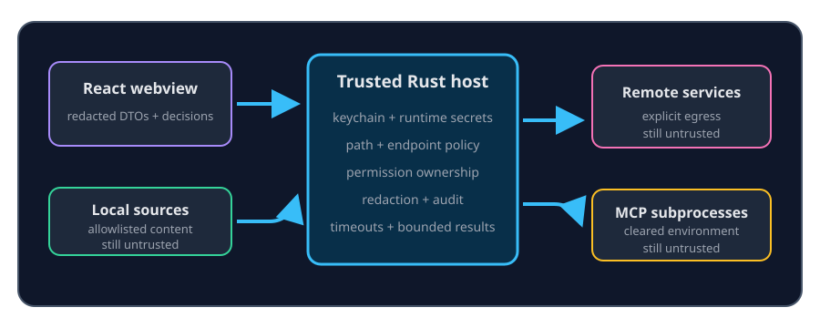

# Security and privacy boundaries

ContextDesk separates the React webview from the trusted Rust host. The webview
displays non-secret configuration, status, evidence, and permission prompts;
the host owns credentials, path and endpoint validation, tool classification,
and write execution.

## Control matrix

| Risk | Shipped control | Residual |
| --- | --- | --- |
| Credential exposure | API keys and connector secrets stay in OS keychain or a narrowly opted-in provider session | A compromised host OS can still read process memory or credentials |
| Path escape | Canonical workspace roots, traversal checks, symlink recheck, secret filename policy | An allowed ordinary file can still contain sensitive prose |
| SSRF and rebinding | Scheme/host policy, DNS resolve-and-vet, socket pinning, redirect revalidation where supported | The operating-system resolver is trusted for its answer |
| Prompt injection | Retrieved workspace, web, connector, and MCP content is wrapped as untrusted evidence | A model can still be influenced; inspect actions and citations |
| Unapproved writes | Host-owned Read/SoftWrite/HardWrite tiers and UI-originated grants | A user can approve the wrong target |
| Secret persistence | Redact before memory storage/embedding; block credential-dominant candidates | Heuristics are not a password manager or formal data classifier |
| Audit tampering | Permission and tool outcomes enter a hash-chained audit log | Audit review does not itself prevent a bad approval |

Bundled Help is first-party product guidance, but even Help content cannot grant
a write, expand an allowlist, or supply credentials. Skills are also guidance,
not authority.

## Remote content

Remote providers may receive the bounded context selected for a turn.
Confluence, HTTP presets, web research, X search, S3 backup, and remote model
providers are explicit egress paths with their own enablement and endpoint
policy. Keychain storage protects the credential but does not prevent the
configured service from seeing the request content.

## Report safely

Use expandable diagnostics and the redacted GitHub-report path when sharing an
error. Do not paste raw keys, tokens, credential files, private workspace
content, or unredacted logs into a report.

