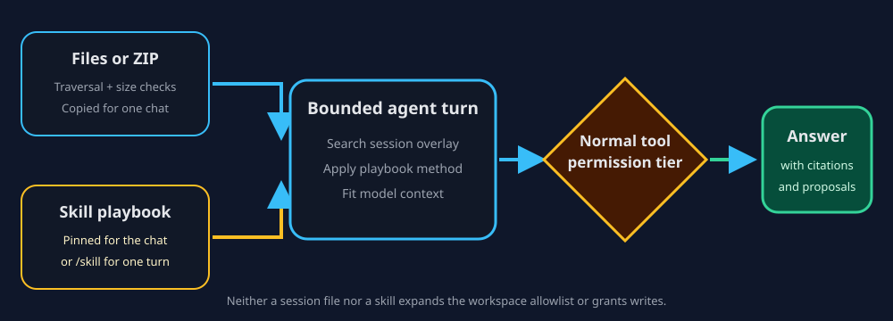

# Skills and session context packs

A session context pack supplies temporary files to one chat. A skill supplies
a reusable method or playbook. They can be used together—for example, attach
an incident bundle and pin the `log-triage` skill—but they have different
lifetimes and neither expands tool permissions.

## Session context packs

Drop or import files from the session context bar. ZIP archives may be expanded
with traversal and nesting checks. ContextDesk stores entries under that
session's app-data context directory, not as permanent workspace roots.

Default safety caps are 200 files, 50 MiB total, and 10 MiB for one file.
Large log dumps (Airbus-style trees, multi-hundred file zips) should use
**Logs → Import logs** or the wizard **Log corpus** mode — not session context
alone. **Both** in the wizard still builds the corpus first; if the chat pack
hits the file cap, the corpus remains and the pack attach is skipped with a note.

A
limit failure is reported instead of silently importing a partial file as
complete. Removing or purging the pack affects the session copy, not the
original source file.

## Skills

Skills are Markdown playbooks discovered from app or workspace skill
directories. You can:

- pin one skill to a chat so each turn receives the playbook;
- invoke `/skill id` for one turn; or
- enable a reviewed write-claiming skill in Settings.

| Input | Lifetime | Search/read behavior | Write authority |
| --- | --- | --- | --- |
| Workspace root | Until the workspace changes | Main knowledge index | Filesystem allowlist only |
| Session context pack | One chat until removed/purged | Overlay for `search_kb` and file-slice reads | Does not add a workspace root |
| Pinned skill | Every turn in one chat until unpinned | Injects the playbook text | Cannot raise Read, SoftWrite, or HardWrite |
| `/skill id` | One turn | Injects the selected playbook | Cannot raise permission tier |

## Incident example

1. Create or open a chat.
2. Import a copied incident ZIP into the session context bar.
3. Confirm the displayed file count and sizes.
4. Pin `log-triage`.
5. Ask for an inventory before conclusions.
6. If you need the analytical event store, ingest the logs through the Logs
   pane or `ingest_logs`; see help://log-analysis-pipeline.
7. Review citations and any write proposal normally.

> Important:
> Files and skill text are context, not trusted policy. A playbook can suggest
> a write, but the host still requires the same confirmation described in
> help://permission-tiers.
