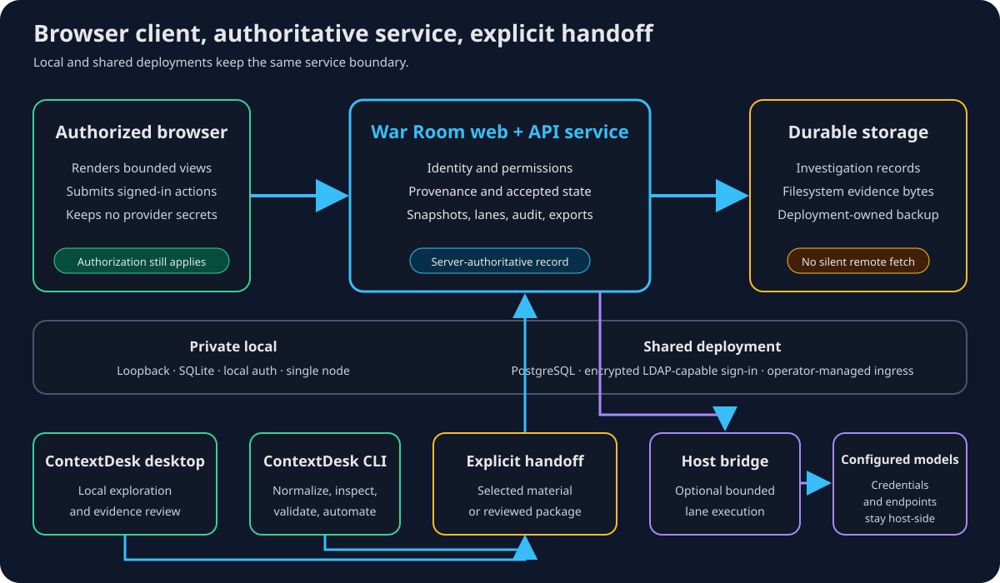

# Run War Room locally or as a shared service

War Room is a browser application served by the separate ContextDesk
collaboration service. The service remains authoritative for identity,
permissions, provenance, audit, and accepted investigation state whether it
runs on one workstation or behind shared infrastructure.

## Deployment shapes

| Shape | Shipped configuration | Important boundary |
| --- | --- | --- |
| Private local | Loopback service, SQLite, local authentication, and filesystem evidence storage | Single node; no PostgreSQL role separation or multi-worker high availability |
| Shared | Operator-deployed service with PostgreSQL, filesystem evidence storage, and encrypted LDAP-capable sign-in | The operator must configure and qualify storage, TLS, directory access, ingress, and backups |
| Synthetic demo | Loopback-only fixture with temporary evidence and no PostgreSQL, LDAP, or provider call | Demonstration behavior is not production qualification |

The browser is a client in every shape. Local deployment does not remove the
browser/service trust boundary, and shared deployment does not make every link
public; authorization still applies.

## Optional model bridge

A deployment can configure a host-owned bridge for gateway-backed analysis
lanes. The bridge owns provider endpoints and credentials and accepts bounded
snapshot work from the War Room service. Without it, gateway execution is
unavailable and the interface should say so; synthetic offline demonstration
lanes remain a separate path.

The bridge is not a general desktop remote-control channel. It does not expose
provider secrets to browser code.

## Desktop and CLI handoff

| Surface | Use it for | Handoff boundary |
| --- | --- | --- |
| ContextDesk desktop | Local Log Explorer work, governed chat, durable findings, and report assembly | Export or select authorized evidence explicitly; no automatic War Room synchronization |
| ContextDesk CLI | Offline import, normalization, exploration, validation, and reproducible automation output | Produce a reviewable artifact or selected material; the CLI is not a live browser participant |
| War Room | Shared intake, provenance, frozen snapshots, lane comparison, discussion, decisions, and case exports | Imported material keeps its source and verification state |

Automatic transfer of desktop corpora, chats, memory, or CLI state is not a
shipped claim. Review privacy and provenance before moving evidence between
surfaces.

## Current limits

- SQLite mode is single-node and has no PostgreSQL-to-SQLite migration tool.
- Directory-backed identity is deployment-specific and requires encrypted,
  qualified LDAP configuration.
- Discussion uses bounded polling, not WebSocket presence or typing signals.
- Complete investigation archive export and dry-run preflight ship, but
  restore/apply does not.
- Automatic desktop embedding and automatic desktop/CLI synchronization are
  not shipped.

For the operating sequence, open help://war-room-workflow. For provenance,
lane, and human-decision checks, open help://war-room-evidence-review. Security
boundaries for the desktop product are described in help://security-boundaries.
