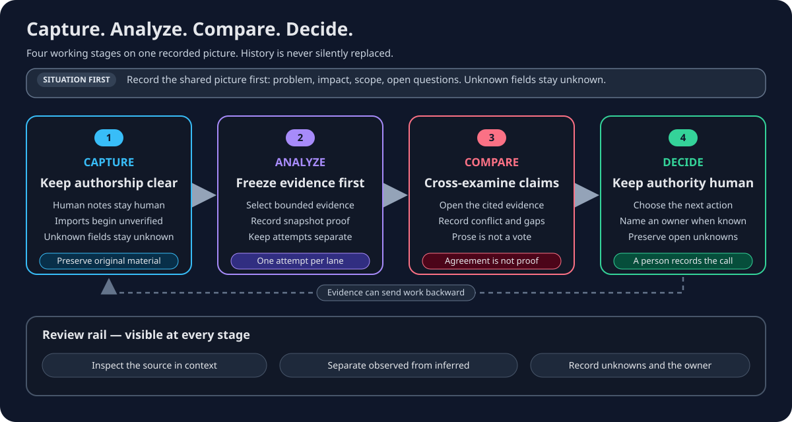

# Review War Room evidence and model lanes

A polished explanation is not evidence. Review the source material, its
provenance, the snapshot used by each lane, and the limits of the recorded run
before accepting a claim.

## Structured labels and shared evidence review

Goal 10 is a draft integration awaiting independent review. Investigation First
and Keystone share the existing evidence annotation workspace. In Investigation
First, select evidence rows; in Keystone, select the evidence working set. A
single label operation supports 1–64 files. Bulk notes were already shipped.

Review **Current labels** separately from **Durable history**. Enter one exact
label (1–120 trimmed, safe single-line characters), choose its privacy, and
explicitly select **Add label** or **Remove label**. Labels are case-sensitive:
`Reviewed` and `reviewed` are different. Exact duplicates collapse in the current
set. Removing a label appends history; it does not erase the earlier add. Add
and remove affect the selected privacy class, preserving the other class.

Labels can reveal investigation meaning. Owner-only history requires the
existing private-evidence read capability. Files, bytes, identity, provenance,
case membership, ownership and evidence privacy do not change. Selection alone
writes nothing. Stale or unavailable history blocks label writes.

An uncertain response freezes the original files, label, operation, privacy and
retry identity. Selection changes do not alter that intent. Refresh history
started after the uncertain response. If the desired state is confirmed, no
second write is sent; otherwise explicitly retry the same frozen operation.
Another uncertain result requires another later successful read.

This portable archive version cannot carry label history. Exact portable export
refuses a case containing durable labels; an incoming archive claiming label
history cannot obtain exact apply authorization. The refusal preserves metadata
instead of silently dropping it. Ordinary trusted export handoff, human
assessments and owner-only benchmark handoff remain separate. Label search and
facets, aliases, taxonomy, AI labeling, and portable label round-trip are future
scope. Beacon has no compatible selected-evidence surface, and War Room uses
its direct technical-tools transport; neither gets a parallel inventory here.

## Manual intake checklist

| Check | Acceptable record | Stop and review when |
| --- | --- | --- |
| Authorship | Human contribution and imported output use separate labels | Pasted model or tool output is presented as a person's finding |
| Source | A reusable source label identifies the producer as far as known | Registration is treated as a live connection or proof of correctness |
| Original material | Imported output remains separate from summaries | A paraphrase is the only retained record |
| Missing metadata | Unknown model, version, prompt, visibility, or operator stays unknown | The record invents a value because it seems likely |
| Corroboration | A person links relevant investigation material before marking corroborated or contradicted | The state changes automatically or has no supporting link |

Manual intake begins unverified. The importer and the described operator are
different provenance fields. A package snapshot identity is useful only when
it is actually recorded; its absence does not license an inferred binding.

## Snapshot and lane checks

Each selected lane should identify the frozen evidence snapshot it received.
Matching labels or fingerprints alone are insufficient when the run record
does not contain complete same-snapshot proof. War Room reports incomplete,
mismatched, or unknown comparison state instead of silently calling it fair.

For every lane, check:

1. What job or strategy was the lane given?
2. Which snapshot and evidence identities are recorded?
3. Did the lane complete, fail, cancel, or return partial material?
4. Which claims cite which evidence?
5. What unknowns and trace gaps remain?

Configured model lanes use an optional host-owned bridge. The browser receives
bounded catalog and run information, not provider credentials or endpoints.
Model availability and quality depend on the deployment.

## Compare evidence, not votes

| Signal | Review action |
| --- | --- |
| Several lanes cite one item | Inspect whether they make the same claim and whether the item supports it |
| Lanes interpret one item differently | Record the conflict and inspect surrounding context |
| Only one lane cites an item | Corroborate it or keep it as a single-lane lead |
| Claim has no citation | Keep it unsupported; do not promote it to a finding |
| Trace is partial or missing | Do not claim to know what happened in unrecorded steps |
| Evidence is missing | Return to Capture or Analyze |

Agreement does not prove correctness. Lane count is not a ranking. A focused
lane remains only one part of the full comparison.

## Human decision boundary

Models may propose explanations or actions. Only an authorized person records
the accepted next action, rationale, and remaining uncertainty in Decide, plus
an owner when one is assigned. Discussion is context, not the decision record.

War Room does not claim automatic winner selection, model approval authority,
or certainty from consensus. If the evidence is insufficient, gather more
evidence.

For the complete stage sequence, open help://war-room-workflow. For deployment
and ContextDesk handoff boundaries, open help://war-room-deployment.

## Review an unconfirmed upload

Investigation First and Beacon freeze the original upload after an unconfirmed
result. Wait for a successful authorized inventory refresh, inspect what was
recorded, then choose **Retry original upload** or **Finish without another
write**. A failed refresh retains visibly stale rows and keeps retry blocked.
Refreshing never sends another upload; finish never deletes server evidence.

A matching filename is not a commit receipt. Review the recorded evidence and
its privacy before retrying: identical bytes may still produce another artifact
and summary. Scope or private-access changes discard the old draft rather than
broaden disclosure. The in-memory intent does not survive reloads. See
help://war-room-s3-evidence-store
for uncertainty and authoritative recovery boundaries. This interaction is a
Goal 05 draft change; its evidence is in the
repository receipt `docs/goals/S3_EVIDENCE_RECONCILIATION_RECEIPT.md`.
