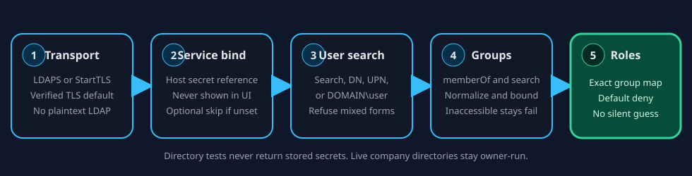

# Configure LDAP or Active Directory sign-in

War Room authenticates against the collaboration service. When that service
uses LDAP, the host holds encrypted transport settings, secret references, and
an exact group-to-role map. The browser never receives a bind password.

This page is a configuration translation and operator checklist. It does not
qualify any live company directory. An owner must run acceptance against their
own directory before treating a deployment as compatible.

## What you configure

| Job | ContextDesk setting | Notes |
| --- | --- | --- |
| Encrypted URL | `COLLAB_LDAP_URL` | `ldaps://` or `ldap://` with StartTLS. Plaintext is refused. |
| User search base | `COLLAB_LDAP_USER_SEARCH_BASE` | Required for service-bind search, UPN, and `DOMAIN\user`. |
| User filter | `COLLAB_LDAP_USER_SEARCH_FILTER` | `{username}` or `{0}` is escaped as a filter value. |
| User DN template | `COLLAB_LDAP_USER_DN_TEMPLATE` | Optional. `{username}` is escaped as a DN value. |
| Resolution order | `COLLAB_LDAP_USER_RESOLUTION` | Explicit list. Never derived from a DN. |
| UPN suffix | `COLLAB_LDAP_UPN_SUFFIX` | Required for UPN mode. Must match the typed suffix exactly. |
| NetBIOS domain | `COLLAB_LDAP_NETBIOS_DOMAIN` | Required for `DOMAIN\user`. Never guessed from `DC=` parts. |
| Group search | `COLLAB_LDAP_GROUP_SEARCH_BASE` and filter | Optional when `memberOf` (or `COLLAB_LDAP_MEMBER_ATTR`) is set. |
| Display, email, title, team | `COLLAB_LDAP_ATTR_*` | Mapped through the provider-neutral profile contract at login. |
| Bind secret | environment, bind-password file, or `file:` reference | Exactly one source. Never stored in the browser or logs. |
| Directory CA | `COLLAB_LDAP_CA`, or `NODE_EXTRA_CA_CERTS` | PEM content, not a path. `COLLAB_LDAP_CA` replaces system trust; `NODE_EXTRA_CA_CERTS` adds to it. |
| Directory timeout | `COLLAB_LDAP_TIMEOUT_MS` | 100-30000 ms, default 8000. There is no automatic retry. |
| Workspace access | `COLLAB_GROUP_ROLE_MAP` | Exact DN-to-role entries. Unmapped groups are denied. |

## RepoSync field translation

Use this table when copying a known-working LDAP form into ContextDesk. Values
shown here are generic examples, not an employer directory.

| Typical LDAP admin field | ContextDesk configuration | Keep / change |
| --- | --- | --- |
| Server URL | `COLLAB_LDAP_URL` | Keep encrypted URL. Do not switch to plaintext `ldap://` without StartTLS. |
| Base DN | `COLLAB_LDAP_USER_SEARCH_BASE` | Search base only. Do not treat it as a UPN suffix. |
| Search filter with `{0}` | `COLLAB_LDAP_USER_SEARCH_FILTER` | `{0}` and `{username}` are aliases after filter escaping. |
| Display name attribute | `COLLAB_LDAP_ATTR_DISPLAY_NAME` (default `cn`) | Passed through login profile mapping. |
| Email attribute | `COLLAB_LDAP_ATTR_EMAIL` (default `mail`) | Work email is directory-owned on LDAP profiles. |
| Group / member attribute | `COLLAB_LDAP_MEMBER_ATTR` (often `memberOf`) | Combined with optional group search. |
| Service bind DN | `COLLAB_LDAP_BIND_DN` | Shown in the Directory admin view; password is not. |
| Service bind password | secret reference or bind-password file | Never paste into git, Help, or browser storage. |
| Verify TLS | verified TLS default | Disabling verification requires an explicit fixture/dev flag. |
| CA bundle path | `COLLAB_LDAP_CA` takes PEM **content** | A path is refused at startup. Use `COLLAB_LDAP_CA="$(cat ca.pem)"`, or `NODE_EXTRA_CA_CERTS=/path/to/ca.pem` to keep system trust. |
| Silent domain from `DC=` | not supported | Set `COLLAB_LDAP_UPN_SUFFIX` and `COLLAB_LDAP_NETBIOS_DOMAIN` explicitly. |

## How to prove the directory

1. Prepare host configuration or a first-run team draft. Bounded verification
   still does not contact the directory.
2. Open Directory at `/admin/ldap`, or use the first-run **Test directory**
   action after a draft is prepared.
3. Read the five stages: encrypted transport, service bind, user search, group
   lookup, and role-map readiness.
4. Optionally supply a probe username. A probe password confirms a user bind
   once and is cleared; it is never stored.
5. Confirm at least one group maps to a workspace role before expecting
   sign-in to succeed.

Read the stages literally. Encrypted transport passes only when the directory
answered over the connection this server opened, so a wrong host, a closed
port, or an untrusted certificate is reported as a transport failure rather
than as an available directory. The configuration view names the group-refresh
mode and whether an operator-supplied CA is in use, so a failing stage can be
matched to the setting behind it.

## Current limits

- Login-time attribute sync is wired for display name, work email, role title,
  and team when those attributes are present and safe. Missing attributes are
  skipped; unsafe attributes fail closed.
- Identity collisions refuse sign-in rather than merging local and directory
  people.
- Automatic disable after directory removal is not shipped.
- Group membership is direct-only. Nested groups expand only if you supply a
  filter that asks the directory to do the work, such as Active Directory's
  `(member:1.2.840.113556.1.4.1941:={dn})`.
- Search continuation references (referrals) are not followed. A search that
  spans naming contexts reports only what the contacted server returns.
- Directory operations use one bounded timeout and are not retried; a failed
  operation fails that request.
- Live company Active Directory, LDAPS to an untrusted internal CA, nested
  group expansion, Global Catalog port 3269/3268, and Kerberos/GSSAPI are not
  qualified by this page.
