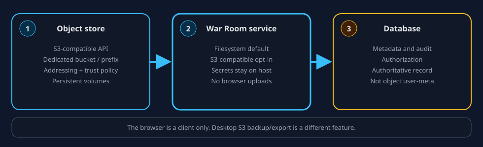

# Use a self-hosted S3-compatible War Room evidence store

War Room keeps investigation metadata, authorization, and audit in the
collaboration database. Evidence **bytes** are a separate backend. Filesystem
storage under `COLLAB_EVIDENCE_ROOT` remains the default; deployments may
instead select an S3-compatible bucket or assigned prefix.

This page is the operator guide for that S3 byte store. It describes the
ContextDesk configuration contract and a local evaluation, but it does not
certify any object-store vendor.



> Important:
> Filesystem storage remains the default War Room evidence provider. An
> object-store CLI success alone is not War Room integration; complete the
> application-level checks below before enabling S3 for a real instance.

## Choose the right S3 feature

| Job | Use | Do not treat as the same thing |
| --- | --- | --- |
| Default War Room evidence bytes | Filesystem volume at `COLLAB_EVIDENCE_ROOT` | Desktop Settings → Backup or a public CDN bucket |
| S3-backed War Room evidence bytes | A dedicated S3-compatible bucket or prefix that satisfies the contract below | Desktop Settings → Backup, or an object-store CLI smoke test by itself |
| Local API qualification | A loopback evaluation service with persistent volumes (Garage is the example here) | A one-node Compose file copied into production |
| Desktop workspace export | help://s3-backup Phase A backup/export | War Room evidence storage, restore, or an S3 index source |

## Compatibility contract

Start vendor-neutral. Any S3-compatible service may be evaluated if it
satisfies this contract. Passing the contract is not a ContextDesk
certification.

| Requirement | What to prove |
| --- | --- |
| Dedicated location | Prefer a private bucket used only for War Room. A dedicated prefix is acceptable only when the provider can enforce that prefix boundary for the service identity |
| Endpoint and region | A stable API endpoint and a region string the client and server both use for signing |
| Path-style addressing | Local and many self-hosted endpoints need path-style requests (`/bucket/key`). Virtual-hosted `bucket.hostname` names often fail on loopback |
| TLS and trust | Production traffic uses TLS. If the certificate is issued by an internal CA, mount a PEM bundle for the **War Room process** and set `COLLAB_EVIDENCE_S3_CA_FILE`. The S3 request handler's Node TLS `ca` option replaces the default trust store for that connection; include required public roots plus the internal CA in one combined PEM when both are needed. Certificate verification remains enabled. This setting does not change LDAP or ingress TLS |
| Stable DNS | The name the War Room service uses must keep resolving to the intended hosts. Do not put credentials in the URL |
| Least-privilege identity | A dedicated service identity with only bucket readiness/list plus object read, write, and delete below the assigned location. The shipped provider does not use multipart APIs. No console root, browser user, or unused bucket-admin APIs |
| Non-browser credentials | Access keys stay in a secret manager or owner-only files on the host. They never enter the webview, Help, git, or screenshots |
| Persistence | Metadata and object bytes survive process and container restarts on durable volumes |
| Capacity and monitoring | Disk, inode, and object-count headroom with alerts before the store is full |
| Backup and recovery | A tested restore of object bytes and store metadata together with the collaboration database. Replication and versioning are not backups |
| Credential rotation | A dedicated War Room identity; overlapping keys or a short write freeze; never rotate by putting a key in a URL |
| Upgrades | Pinned image or package tags and that product's version-specific upgrade notes. Do not run unversioned `latest` |
| Verified S3 operations | Independent proof of put, head, get, range get, list, and disposable-object delete, plus a hash match |

The object store contains evidence bytes. The database remains authoritative
for investigation identity, permissions, provenance, and whether a case
believes an artifact exists. Object user-metadata is not a substitute for
database rows.

The S3 provider keeps canonical blobs, staging objects, pending-write journals,
and file-server reference records below the assigned prefix. The collaboration
database remains authoritative for case membership, permissions, provenance,
and artifact metadata. `COLLAB_EVIDENCE_ROOT` remains a protected local control
root even in S3 mode; do not expose either location to the browser.

### Least-privilege policy shape

Policy syntax is provider-specific. For services that accept AWS-style IAM
policies, this is a starting shape rather than a provider-neutral copy/paste
policy. Replace the bucket and prefix and verify it against the selected S3
service. The shipped client calls `HeadBucket`, `HeadObject`, `GetObject`,
`PutObject`, `CopyObject`, `DeleteObject`, and `ListObjectsV2`. In AWS IAM,
`HeadBucket` and `ListObjectsV2` map to `s3:ListBucket`, while same-prefix
`CopyObject` uses `s3:GetObject` on the source and `s3:PutObject` on the
destination. ContextDesk requires `s3:DeleteObject` for staging, journal
recovery, and rollback cleanup. It does not call multipart or
bucket-administration APIs.

The bucket-level statement below is intentionally not prefix-conditioned:
startup uses `HeadBucket`, which carries no object prefix. That makes a
dedicated bucket the clearest v1 security boundary. In a shared bucket, the
object resource still restricts read/write/delete to `assigned-prefix/`, but
this AWS-style shape does not make object listing outside that prefix a hard
security boundary. Use a provider-native grant that passes both readiness and
negative isolation tests, or use a dedicated bucket.

```json
{
  "Version": "2012-10-17",
  "Statement": [
    {
      "Sid": "ReadinessAndList",
      "Effect": "Allow",
      "Action": ["s3:ListBucket"],
      "Resource": ["arn:aws:s3:::war-room-evidence"]
    },
    {
      "Sid": "ReadWriteAssignedObjects",
      "Effect": "Allow",
      "Action": [
        "s3:GetObject",
        "s3:PutObject",
        "s3:DeleteObject"
      ],
      "Resource": ["arn:aws:s3:::war-room-evidence/assigned-prefix/*"]
    }
  ]
}
```

Some self-hosted services expose coarser bucket grants instead of IAM JSON.
Use the smallest native grant that passes the release's readiness, negative
isolation, and application smoke tests. The application identity must be able
to delete objects below its assigned prefix; this is internal transaction
cleanup, not a user-facing permanent-delete feature. Keep bucket administration
and unrelated object prefixes out of the application grant wherever the
selected service can enforce that boundary.

## Operator settings translation

These names are the S3 Evidence Storage v1 deployment contract. The commented
examples in `collab/deploy/.env.example` remain the copy-ready source of truth.
Filesystem is the default, and `COLLAB_EVIDENCE_ROOT` remains the local
control-state root in both modes.

| Operator job | Setting | Notes |
| --- | --- | --- |
| Select byte backend | `COLLAB_EVIDENCE_PROVIDER` | `filesystem` (default) or `s3`. |
| Filesystem/control root | `COLLAB_EVIDENCE_ROOT` | Used in both modes for server-owned local control state; defaults to `.data/evidence` when unset. |
| S3 API endpoint | `COLLAB_EVIDENCE_S3_ENDPOINT` | Scheme, host, and port only. No userinfo, no key in the query string. |
| Region | `COLLAB_EVIDENCE_S3_REGION` | Must match the signer. Garage's default region is `garage`. |
| Bucket | `COLLAB_EVIDENCE_S3_BUCKET` | Private bucket dedicated to War Room when possible. |
| Key prefix | `COLLAB_EVIDENCE_S3_PREFIX` | Optional application key prefix. A configured value is normalized with one trailing `/`; an empty configured value is rejected. Prefer a dedicated bucket because `HeadBucket` needs bucket-level permission. |
| Path-style | `COLLAB_EVIDENCE_S3_FORCE_PATH_STYLE` | Exact `0` or `1`. When unset, custom endpoints (including Garage) default to path-style and AWS-managed endpoints default to virtual-host style. |
| HTTP opt-in | `COLLAB_EVIDENCE_S3_ALLOW_HTTP` | Exact `0` or `1`; defaults to `0`. Set to `1` only for a trusted local evaluation network. |
| Request timeout | `COLLAB_EVIDENCE_S3_TIMEOUT_MS` | Connection and request timeout in milliseconds; defaults to `30000`, valid range `1000..120000`. |
| Streamed intake size bound | `COLLAB_EVIDENCE_MAX_UPLOAD_BYTES` | Provider-neutral. Governs streamed evidence intake for the default filesystem provider and the opt-in S3 provider. Default 512 MiB (`536870912`), valid range `1..5368709120` (5 GiB). Legacy JSON/base64 evidence upload and the legacy JSON bytes download remain separately capped at exactly 1,000,000 decoded bytes. This setting does not raise those JSON caps. |
| Credential mode | `COLLAB_EVIDENCE_S3_CREDENTIALS_MODE` | Required in S3 mode; there is no default. `static` requires the explicit pair below; `default_chain` uses the server process's AWS-compatible provider chain and rejects leftover static `COLLAB_EVIDENCE_S3_*` credential names. |
| Access key id | `COLLAB_EVIDENCE_S3_ACCESS_KEY_ID`, `_FILE`, or `_REF` | Dedicated service identity, not a human console login. Configure exactly one source. |
| Secret access key | `COLLAB_EVIDENCE_S3_SECRET_ACCESS_KEY`, `_FILE`, or `_REF` | Configure exactly one source; files must be owner-protected and `_REF` must be an absolute `file:/...` reference, not `file://...`. |
| Session token | `COLLAB_EVIDENCE_S3_SESSION_TOKEN`, `_FILE`, or `_REF` | Optional; use only when the selected static credentials require it. |
| Custom CA | `COLLAB_EVIDENCE_S3_CA_FILE` | Optional absolute path to a regular PEM CA bundle (maximum 1 MiB). The S3 request handler passes it as Node's TLS `ca` option, which replaces the default trust store for that S3 connection. Operators who need public roots and an internal CA must combine them in one PEM, mount it into the server process, and keep verification enabled. Unlike credential files, the CA file need not be owner-only. This setting does not change LDAP or ingress TLS. |

In `static` mode, access key id and secret access key must both resolve. A
session token is optional but is invalid without that pair. For each value,
configure exactly one of the direct name, `_FILE`, or `_REF`; relative paths,
symlinks, empty files, group/world-readable secret files on Unix, and
`file://` references are refused. Direct environment values exist for
orchestrator secret injection, but do not put them in a committed env file.

Filesystem mode rejects leftover `COLLAB_EVIDENCE_S3_*` names, including names
that are present with empty values. `COLLAB_EVIDENCE_MAX_UPLOAD_BYTES` is
accepted in filesystem mode. Remove leftover S3 names rather than blanking
them when returning to the filesystem provider.

With PostgreSQL, the process uses a database advisory lease to coordinate
evidence write batches across application replicas. SQLite has no external
lease: SQLite plus S3 is a single-process evaluation shape, and doctor reports
that warning. Do not run multiple SQLite-backed War Room processes against one
S3 location.

### Abandoned streamed scratch objects with external coordination

PostgreSQL/external coordination intentionally does not auto-sweep unjournaled
objects under the configured provider prefix's `.stream-staging/` namespace.
Another replica may still be writing one of those objects outside the advisory
lease. A process crash after the scratch `PutObject` and before promotion or
settlement can therefore leave residue.

Treat cleanup as a conservative maintenance operation:

1. Quiesce or drain **all** War Room writers that use the bucket and provider
   prefix. Do not clean this namespace while a writer, rollout, or retry is
   active.
2. List objects only beneath `<configured-prefix>/.stream-staging/` (or
   `.stream-staging/` when no prefix is configured). Confirm that no active or
   restarting replica can own each candidate.
3. Use age and deployment observability as supporting evidence, not as proof by
   themselves. Review candidates individually and retain anything whose owner
   or state is uncertain.
4. With least-privilege operator tooling, delete only objects individually
   confirmed to be abandoned. Never delete the whole provider prefix.
5. Resume writers, then verify service and object-store readiness plus an
   application-level write/read check.

S3 Evidence Storage v1 does not promise a retention period, migration,
lifecycle policy, TTL, automatic garbage collection, or a reaper for this
residue. Configure no unattended deletion policy from this procedure.

## Local evaluation with Garage

Use a local evaluation to prove the S3 API, persistence, and path-style
behavior. It is not a production topology and it is not a War Room integration
test.

This guide uses [Garage](https://garagehq.deuxfleurs.fr/documentation/quick-start/)
v2.3.0 (`dxflrs/garage:v2.3.0`) as the worked example because it is an
actively documented S3-compatible server with a single-node evaluation mode.
That is not a vendor certification. Other compatible services may be used if
they meet the contract.

Garage v2.3.0 supports `garage server --single-node --default-bucket` with
`GARAGE_DEFAULT_ACCESS_KEY`, `GARAGE_DEFAULT_SECRET_KEY`, and
`GARAGE_DEFAULT_BUCKET`. The official Quick Start warns that single-node
mode has **no redundancy**, and its minimal container example does not mount
persistent volumes. Evaluation here therefore binds the S3 API to loopback,
pins the image tag, mounts metadata and data directories, and keeps secrets
out of git.

Read the upstream pages before copying anything:

- [Garage Quick Start](https://garagehq.deuxfleurs.fr/documentation/quick-start/)
- [Garage real-world cookbook](https://garagehq.deuxfleurs.fr/documentation/cookbook/real-world/)

The worked commands require macOS or Linux, OpenSSL, AWS CLI v2, and Docker
Compose v2 with `docker compose up --wait` support.

> Caution:
> Single-node Garage is for qualification on one machine. It has no
> redundancy. Do not reuse this Compose file as a shared War Room store.

### Persistent loopback example

Create three owner-only files/directories in a disposable working directory:
`garage.toml`, `.garage-eval.env`, and persistent metadata/data directories.
None belongs in git. Garage needs its configuration file as well as the two
durable mounts; mounting only `/var/lib/garage/data` is not sufficient.

Use this evaluation configuration. Replace `replace-with-64-hex-characters`
with the output of `openssl rand -hex 32`; keep the file owner-readable only.

```toml
metadata_dir = "/var/lib/garage/meta"
data_dir = "/var/lib/garage/data"
db_engine = "sqlite"

replication_factor = 1

rpc_bind_addr = "[::]:3901"
rpc_public_addr = "127.0.0.1:3901"
rpc_secret = "replace-with-64-hex-characters"

[s3_api]
s3_region = "garage"
api_bind_addr = "[::]:3900"
root_domain = ".s3.garage.localhost"
```

Then save this as `compose.yaml` in the same directory:

```yaml
services:
  garage:
    image: dxflrs/garage:v2.3.0
    command: ["/garage", "server", "--single-node", "--default-bucket"]
    restart: unless-stopped
    env_file:
      - ./.garage-eval.env
    ports:
      - "127.0.0.1:3900:3900"
    volumes:
      - ./garage.toml:/etc/garage.toml:ro
      - ./garage-meta:/var/lib/garage/meta
      - ./garage-data:/var/lib/garage/data
    healthcheck:
      # Process/layout health only. The live suite's HeadBucket assertion is
      # the authoritative S3 readiness proof.
      test: ["CMD", "/garage", "status"]
      interval: 3s
      timeout: 5s
      retries: 20
      start_period: 15s
```

Create the directories, then generate the RPC secret. `chmod 700` / `chmod 600` even when you reuse an existing evaluation directory:

```sh
umask 077
mkdir -p garage-meta garage-data
chmod 700 garage-meta garage-data
chmod 600 garage.toml
openssl rand -hex 32
```

Put that value into `rpc_secret` in `garage.toml`. Stop if the placeholder
`replace-with-64-hex-characters` is still present — do not start Compose
until it is gone. Then write evaluation-only bootstrap keys (Garage
access-key ids must start with `GK`) and start:

```sh
(
  umask 077
  set -eu
  if grep -q 'replace-with-64-hex-characters' garage.toml; then
    printf 'replace rpc_secret before starting\n' >&2
    exit 1
  fi
  printf 'GARAGE_DEFAULT_ACCESS_KEY=GK%s\n' "$(openssl rand -hex 16)" > .garage-eval.env
  printf 'GARAGE_DEFAULT_SECRET_KEY=%s\n' "$(openssl rand -hex 32)" >> .garage-eval.env
  printf 'GARAGE_DEFAULT_BUCKET=war-room-evidence\n' >> .garage-eval.env
  chmod 700 garage-meta garage-data
  chmod 600 garage.toml .garage-eval.env
  case "$(uname -s)" in
    Darwin) _mode() { stat -f '%Lp' "$1"; } ;;
    Linux) _mode() { stat -c '%a' "$1"; } ;;
    *) printf 'this evaluation documents macOS/Linux only\n' >&2; exit 1 ;;
  esac
  test "$(_mode garage-meta)" = 700
  test "$(_mode garage-data)" = 700
  test "$(_mode garage.toml)" = 600
  test "$(_mode .garage-eval.env)" = 600
  docker compose up -d --wait --wait-timeout 90
  docker compose exec -T garage /garage status
)
```

The env file is acceptable only for this owner-operated evaluation; Docker can
show container environment values to local Docker administrators. Use the
deployment platform's secret manager for production and remove the bootstrap
values after replacing the default key with an operator-managed application
identity according to Garage's current documentation.

The conventional Garage paths `/var/lib/garage/meta` and
`/var/lib/garage/data` come from the real-world cookbook layout. After the
first put, confirm the mounted `garage-data` directory changes and that the
object survives `docker compose restart garage`. If the selected image version
documents different paths, follow that version's documentation instead.

The S3 API listens on port **3900**. Garage's default region string is
`garage`. Leave RPC, admin, and website ports unpublished on the host.

Loopback publishing is correct when the War Room process runs on the same
**host**. Use endpoint `http://127.0.0.1:3900` with
`COLLAB_EVIDENCE_S3_ALLOW_HTTP=1` only for that trusted local evaluation.

A War Room **container** does not reach the host or another container through
`127.0.0.1:3900`; that address is the War Room container itself. If War Room
and Garage are services in the same Compose project and network, use
`http://garage:3900` and `COLLAB_EVIDENCE_S3_ALLOW_HTTP=1`. If they are in
different Compose projects, attach both services to an explicitly named shared
network and give Garage a stable network alias before using that alias in the
endpoint. A service name is not automatically visible across separate Compose
project networks. Keep port 3900 unpublished when only peer containers need it;
the loopback `ports` entry above exists for host-run smoke tools.

### Object-store smoke test

This proves the S3 service, not War Room. Use a disposable prefix such as
`operator-smoke/` so later application keys cannot collide. Prefer a
least-privilege smoke identity. The application identity also requires delete
within its assigned prefix for transactional cleanup, but it must not receive
bucket-administration access.

1. Configure an S3 client for path-style requests, endpoint
   `http://127.0.0.1:3900`, and region `garage`. Disable instance-metadata
   credential fallback so the client cannot pick up unrelated keys.
2. Put a small unique object under `operator-smoke/`.
3. Head the object and confirm size.
4. Get the full object and a range of the same object.
5. List the prefix and confirm the returned object key equals the
   generated key.
6. Hash the downloaded bytes and compare them with the original.
7. Restart the Garage container, wait until `/garage status` succeeds
   within a bounded loop, then get the same object again.
8. Delete the smoke object and confirm a later head fails.
9. Confirm the data landed on the mounted data directory.

A typical AWS CLI shape for this evaluation (any SigV4 S3 client is
acceptable). Run it as a fail-closed subshell. Load the keys generated above
into the environment only; do not print them, do not pass them on argv, and
do not enable `set -x` or `aws --debug`. The scoped config file forces
path-style addressing so the client does not call `bucket.127.0.0.1`. This
HTTP loopback check does not exercise TLS or `COLLAB_EVIDENCE_S3_CA_FILE`.

The `mktemp -d` template with `XXXXXX` is the portable macOS/Linux form.
`sleep` in the restart loop is only a poll interval; the proof is the bounded
`/garage status` success plus the later get/hash assertions.

```sh
(
  set -eu
  TASK_DIR="$(mktemp -d "${TMPDIR:-/tmp}/war-room-s3-eval.XXXXXX")"
  KEY=""
  cleanup() {
    status=$?
    trap - EXIT HUP INT TERM
    set +e
    case "${KEY:-}" in
      operator-smoke/*)
        aws --endpoint-url "${ENDPOINT:-}" --region garage s3api delete-object \
          --bucket "${BUCKET:-}" --key "$KEY" >/dev/null 2>&1
        ;;
    esac
    if [ -n "${TASK_DIR:-}" ] && [ -d "$TASK_DIR" ]; then
      case "$TASK_DIR" in
        *war-room-s3-eval.*) rm -rf -- "$TASK_DIR" ;;
      esac
    fi
    unset AWS_ACCESS_KEY_ID AWS_SECRET_ACCESS_KEY AWS_DEFAULT_REGION \
      AWS_EC2_METADATA_DISABLED AWS_CONFIG_FILE AWS_PROFILE AWS_DEFAULT_PROFILE \
      AWS_SESSION_TOKEN
    exit "$status"
  }
  trap cleanup EXIT
  trap 'exit 129' HUP
  trap 'exit 130' INT
  trap 'exit 143' TERM

  umask 077
  AWS_ACCESS_KEY_ID="$(sed -n 's/^GARAGE_DEFAULT_ACCESS_KEY=//p' .garage-eval.env)"
  AWS_SECRET_ACCESS_KEY="$(sed -n 's/^GARAGE_DEFAULT_SECRET_KEY=//p' .garage-eval.env)"
  test -n "$AWS_ACCESS_KEY_ID"
  test -n "$AWS_SECRET_ACCESS_KEY"
  export AWS_ACCESS_KEY_ID AWS_SECRET_ACCESS_KEY
  unset AWS_SESSION_TOKEN AWS_PROFILE AWS_DEFAULT_PROFILE
  export AWS_DEFAULT_REGION=garage
  export AWS_EC2_METADATA_DISABLED=true
  export AWS_CONFIG_FILE="$TASK_DIR/aws.config"
  cat > "$AWS_CONFIG_FILE" <<'EOF'
[default]
region = garage
s3 =
    addressing_style = path
EOF
  chmod 600 "$AWS_CONFIG_FILE"

  ENDPOINT=http://127.0.0.1:3900
  BUCKET=war-room-evidence
  KEY="operator-smoke/eval-$(date -u +%Y%m%dT%H%M%SZ)-$(openssl rand -hex 4).txt"
  SOURCE="$TASK_DIR/source.txt"
  DOWNLOADED="$TASK_DIR/downloaded.txt"
  RANGE_FILE="$TASK_DIR/range.txt"
  RESTART_FILE="$TASK_DIR/restart.txt"
  printf 'war-room-s3-eval\n' > "$SOURCE"
  SOURCE_BYTES="$(wc -c < "$SOURCE" | tr -d ' ')"
  test "$SOURCE_BYTES" = "17"

  aws --endpoint-url "$ENDPOINT" --region garage s3api put-object \
    --bucket "$BUCKET" --key "$KEY" --body "$SOURCE"
  HEAD_LEN="$(aws --endpoint-url "$ENDPOINT" --region garage s3api head-object \
    --bucket "$BUCKET" --key "$KEY" --query ContentLength --output text)"
  test "$HEAD_LEN" = "$SOURCE_BYTES"
  aws --endpoint-url "$ENDPOINT" --region garage s3api get-object \
    --bucket "$BUCKET" --key "$KEY" "$DOWNLOADED"
  aws --endpoint-url "$ENDPOINT" --region garage s3api get-object \
    --bucket "$BUCKET" --key "$KEY" --range bytes=0-6 "$RANGE_FILE"
  test "$(wc -c < "$RANGE_FILE" | tr -d ' ')" = "7"
  test "$(cat "$RANGE_FILE")" = "war-roo"
  LISTED_KEY="$(aws --endpoint-url "$ENDPOINT" --region garage s3api list-objects-v2 \
    --bucket "$BUCKET" --prefix operator-smoke/ \
    --query "Contents[?Key=='${KEY}'].Key" --output text)"
  test "$LISTED_KEY" = "$KEY"
  SOURCE_DGST="$(openssl dgst -sha256 -r "$SOURCE")"
  DOWNLOADED_DGST="$(openssl dgst -sha256 -r "$DOWNLOADED")"
  SOURCE_SHA256="${SOURCE_DGST%% *}"
  DOWNLOADED_SHA256="${DOWNLOADED_DGST%% *}"
  test "${#SOURCE_SHA256}" -eq 64
  test "${#DOWNLOADED_SHA256}" -eq 64
  test "$SOURCE_SHA256" = "$DOWNLOADED_SHA256"

  docker compose restart garage
  n=0
  while ! docker compose exec -T garage /garage status >/dev/null 2>&1; do
    n=$((n + 1))
    test "$n" -lt 30
    sleep 3
  done
  docker compose exec -T garage /garage status
  aws --endpoint-url "$ENDPOINT" --region garage s3api get-object \
    --bucket "$BUCKET" --key "$KEY" "$RESTART_FILE"
  RESTART_DGST="$(openssl dgst -sha256 -r "$RESTART_FILE")"
  RESTART_SHA256="${RESTART_DGST%% *}"
  test "${#RESTART_SHA256}" -eq 64
  test "$SOURCE_SHA256" = "$RESTART_SHA256"

  aws --endpoint-url "$ENDPOINT" --region garage s3api delete-object \
    --bucket "$BUCKET" --key "$KEY"
  if aws --endpoint-url "$ENDPOINT" --region garage s3api head-object \
    --bucket "$BUCKET" --key "$KEY"; then
    printf 'expected head-object to fail after delete\n' >&2
    exit 1
  fi
)
```

Do not print secret values, and do not capture CLI debug logs that replay
authorization headers. A later production-shaped check should read keys from
the platform secret manager or owner-only files, not from `.garage-eval.env`.
Cleanup is scoped to this `mktemp` directory and the `operator-smoke/`
object. `HUP`/`INT`/`TERM` traps exit 129/130/143 so an interrupt is not
converted into success. The `EXIT` handler then disables those traps
before cleanup (reentrancy-safe), uses `set +e`, and `exit "$status"` so
a failed assertion or interrupt is not replaced by a later successful
`rm`. The list step compares the JMESPath-selected key to `$KEY` exactly;
it is not a substring match.

### Disposable evaluation teardown

> Warning:
> Destructive teardown for this disposable evaluation directory only. Confirm
> you are in that working directory before continuing. Exact local paths this
> evaluation writes: `garage.toml`, `.garage-eval.env`, `garage-meta/`,
> `garage-data/`, and `compose.yaml`. The next command stops this Compose
> project. It does **not** delete those files, the Garage image, repository
> sources, or War Room evidence. Do not run it against a shared or production
> store. Remove the evaluation files only by an explicit operator decision
> after you have confirmed the paths.

```sh
docker compose down
```

## Production planning

A one-node evaluation Compose file is not production. Do not scale it by
publishing port 3900 or sharing its keys.

If you run Garage in production, treat the [real-world cookbook](https://garagehq.deuxfleurs.fr/documentation/cookbook/real-world/)
as the current Garage example: at least three nodes, three-way replication,
fixed image tags, directly reachable node networking, and the version-specific
upgrade documentation. That is Garage's guidance, not a universal requirement
for every compatible product. Other services have their own clustering and
upgrade rules.

Every production-shaped work-server deployment, Garage or otherwise, still
needs:

| Control | Production expectation |
| --- | --- |
| TLS | Terminate TLS at an ingress, reverse proxy, or equivalent. Do not offer plaintext S3 on a reachable network |
| Network | Private network or firewall so only the War Room service (and operators) can reach the API |
| Persistence | Durable data and metadata volumes, independently snapshottable |
| Backup | A tested backup and recovery design for **both** object bytes and store metadata. Replication is not a backup. Bucket versioning is not a backup |
| DNS | Stable names that match certificates and the configured endpoint |
| Monitoring | Reachability, TLS expiry, disk/object capacity, error rates, and replication health where the product provides it |
| Alerts | Capacity alerts before writes start failing |
| Recovery | A restore rehearsal with hash comparison of sample objects |
| Change | Staged upgrade and rollback using the vendor's version-specific notes and pinned tags |

War Room itself does not terminate TLS for the collaboration HTTP socket; see
help://war-room-deployment. The object-store TLS session is a separate
connection owned by the War Room process.

## Secrets, credentials, and rotation

Use a deployment secret manager or owner-only mounted secret files. Never
commit credentials, put them in a URL, type them into the browser, paste them
into logs, or leave them in screenshots or ordinary env examples.

Give War Room a dedicated service identity. Do not reuse a human key, a
node-admin key, or the identity used for desktop Settings → Backup.

Where the object store supports two live keys:

1. Create a new key for the same identity or an equivalent least-privilege
   identity. Leave the old key active.
2. Prove the new key with the object-store smoke test.
3. Update the War Room secret source from `collab/deploy/.env.example` (file,
   absolute `file:` reference, or secret manager).
4. Restart the War Room process; this release has no live credential reload.
5. Confirm an application-level read of a known object.
6. Revoke the old key.
7. Verify the old key is rejected and the new key still works.

If the store cannot overlap two keys, schedule a short write freeze, switch,
and re-verify. Do not rotate by appending a key to a URL or by sharing the
new secret through chat.

## Health verification and smoke tests

Keep these two proofs separate.

| Proof | What it shows | What it does not show |
| --- | --- | --- |
| Doctor preflight | S3 names, credential sources, local control root, CA file, and bounds parse successfully | Bucket reachability or permissions; doctor says `bucket not contacted` |
| Process startup and `/ready` | Startup selected the configured provider, `HeadBucket` succeeded, crash recovery completed before listen, and the current database plus byte backend answer readiness probes | An application write/read, historical migration, or backup restore |
| Object-store CLI smoke test | The service accepts signed requests, persists bytes, and honors get/head/range/list/delete on a disposable key | That War Room can configure, authorize, or hash evidence |
| Bucket and prefix permissions | Positive and negative tests show the dedicated identity reaches only the intended object location to the extent the provider can enforce it | A hard listing boundary when the required bucket-level readiness grant is broader |
| Application upload/download | An authorized War Room action stored bytes, returned metadata, and read them back with a matching hash | Retention, lifecycle, legal hold, or multi-provider failover |

After the CLI proof plus persistence across restart, run the application-level
proof from the **repository root**. `npm --prefix collab` executes the
`collab/package.json` scripts with cwd `collab/`.

1. Preflight the intended server environment. The `doctor` script is
   `npm run build && node server/dist/doctor-cli.js`. Require an accepted S3
   configuration. Doctor does not contact the bucket.

   ```sh
   npm --prefix collab run doctor -- --env-file deploy/.env
   ```

   `--env-file deploy/.env` is `collab/deploy/.env` relative to that cwd.

2. Start War Room with the same intended `COLLAB_*` names already exported in
   the process environment. The `start` script is
   `npm run start -w @cd-collab/server`, which runs `node dist/index.js` in
   `@cd-collab/server`. It does not accept `--env-file` and does not rebuild;
   doctor already built. In S3 mode the process must complete `HeadBucket` and
   pending-write recovery before it listens. Default bind is `127.0.0.1:8787`
   (`COLLAB_HOST` default `127.0.0.1`, `COLLAB_PORT` default `8787`).

   Do not export a relative `COLLAB_STATIC_DIR` for this workspace command:
   doctor and the server start from different working directories. For this
   repository-root proof, point it at the absolute web build that doctor just
   produced. The `test` fails before startup if that artifact is absent.

   ```sh
   export COLLAB_STATIC_DIR="$PWD/collab/web/dist"
   test -f "$COLLAB_STATIC_DIR/index.html"
   npm --prefix collab start
   ```

   Alternatively, leave `COLLAB_STATIC_DIR` unset and the compiled server uses
   its built-in `collab/web/dist` fallback. Use a different static directory
   only as an absolute path.

3. Check process liveness, then database plus the selected evidence backend.
   Do not treat `/health` as evidence readiness. `/ready` is HTTP 200 when
   both are up and HTTP 503 `not_ready` otherwise. Export one operator-reachable
   base URL and reuse it for every browser and readiness step. It defaults to
   loopback plus `COLLAB_PORT` (or `8787`); set `WAR_ROOM_URL` explicitly when
   the browser reaches another host or ingress. The second assignment removes
   one trailing slash. `curl -f` fails closed on HTTP errors.

   ```sh
   WAR_ROOM_URL="${WAR_ROOM_URL:-http://127.0.0.1:${COLLAB_PORT:-8787}}"
   WAR_ROOM_URL="${WAR_ROOM_URL%/}"
   export WAR_ROOM_URL
   curl -sS -f --max-time 5 "$WAR_ROOM_URL/health"
   curl -sS -f --max-time 5 "$WAR_ROOM_URL/ready"
   ```

4. Run positive and negative permission checks for the dedicated bucket or
   prefix. For AWS-style permissions, account for the bucket-level
   `s3:ListBucket` required by `HeadBucket`.
5. Through the normal authenticated War Room UI, not an unauthenticated
   API or cookie shortcut:

   - Open the exported `WAR_ROOM_URL` in a browser and sign in with an identity
     that may write evidence on the investigation.
   - Open that case's evidence board. Under **Upload evidence**, choose a
     small unique **File**, fill **Summary**, set **Artifact kind** and
     **Privacy class**, and submit.
   - Confirm the artifact appears with a **Content hash** (64 lowercase hex
     digits; War Room evidence hashes are not `sha256:`-prefixed).
   - Use **Preview** / **Inspect log** only as a bounded text inspect (first
     64 KiB). It is not a full-object hash proof.
   - Use **Download** and the artifact filename to retrieve the stored
     bytes. Compute SHA-256 of the original file and of the download
     (`openssl dgst -sha256 -r`) and compare both with the displayed
     Content hash.
6. In the Garage evaluation directory, restart Garage
   (`docker compose restart garage`). Wait with a bounded `/garage status`
   loop (same 30×3s bound as the CLI proof; `sleep` is only the poll
   interval). Then, from any host that can reach the War Room bind, wait
   until application `/ready` succeeds. If you also restart War Room, start
   it again with `npm --prefix collab start` from the repository root and
   wait for `/health` and `/ready` before downloading.

   ```sh
   # Run from the Garage evaluation directory (compose.yaml).
   (
     set -eu
     n=0
     while ! docker compose exec -T garage /garage status >/dev/null 2>&1; do
       n=$((n + 1))
       test "$n" -lt 30
       sleep 3
     done
     n=0
     : "${WAR_ROOM_URL:?export WAR_ROOM_URL as shown in step 3}"
     while ! curl -sS -f --max-time 5 "$WAR_ROOM_URL/ready" >/dev/null; do
       n=$((n + 1))
       test "$n" -lt 30
       sleep 3
     done
   )
   ```

   Download the same artifact again and repeat the SHA-256 comparison.
7. Cleanup only disposable operator-smoke objects. The current evidence
   interface does not offer general deletion; do not invent a production
   delete path.

This authenticated workflow proves an authorized War Room upload stored
bytes, returned metadata including Content hash, and that Download bytes
matched that hash before and after a Garage restart with Garage process
health plus application `/ready`. It does not prove retention, lifecycle,
legal hold, backup restore, migration, multi-provider failover,
multi-replica locking, source deletion, or presigned browser access. An
object-store CLI put is not a substitute.

## Troubleshooting

| Symptom | Likely cause | What to check |
| --- | --- | --- |
| TLS handshake failure or unknown CA | Custom CA bundle is missing/unreadable, incomplete (for example public roots omitted from a combined PEM), or does not match the endpoint; hostname mismatch | Certificate names, the absolute `COLLAB_EVIDENCE_S3_CA_FILE` mounted in the War Room process, that the bundle contains every required root because `ca` replaces the default trust store for that connection, and that the endpoint is HTTPS |
| SignatureDoesNotMatch or similar | Wrong secret, clock skew, or region mismatch | Region string (`garage` for the example), key material, and host NTP |
| Permanent redirect or NoSuchBucket on a URL that includes the bucket hostname | Client used virtual-hosted addressing | Force path-style; local services rarely serve `bucket.127.0.0.1` |
| AccessDenied / 403 | Identity lacks the operation, or the prefix/bucket is wrong | Scope of the service identity; smoke prefix versus application prefix |
| Clock skew rejected | Host time off by more than the store's SigV4 window | NTP on War Room hosts and object-store nodes |
| Connection refused from War Room, works on the host | Endpoint is loopback in a different network namespace | From the War Room container, `127.0.0.1` is that container. Use a compose network name, host gateway, or publish on an address that namespace can reach |
| Missing object, database row exists | Prefix, bucket, or key layout mismatch; bytes never persisted | Head the exact key; do not treat object-store 404 as authorization |
| Writes fail after a period of success | Full disk, inode exhaustion, or quota | Data volume **and** metadata volume; capacity alerts |

## Backups and versioning

Plan backup and recovery for object-store metadata and object bytes together
with the collaboration database. Restoring only one side can leave rows without
bytes, or bytes without authorized records.

Bucket versioning is optional and provider-specific. Enable it only if you
understand that product's restore and cost behavior. Versioning is not a
substitute for backup. Replication, erasure coding, and three-way copies are
availability controls; they do not prove you can restore from operator error,
bad encryption keys, or a destroyed cluster.

ContextDesk does not manage provider lifecycle policies, retention, legal hold
at the bucket, source migration, or automatic source cleanup in this milestone.

## What this is not

- Selecting S3 changes the byte backend for new server operations. It does not
  copy evidence already stored under `COLLAB_EVIDENCE_ROOT`.
- There is no local-filesystem-to-S3 or S3-to-filesystem migration tool.
- There is no retention, legal-hold, or lifecycle automation in the object
  store.
- There are no browser credentials and no direct or presigned browser uploads
  to the bucket.
- There is no multi-provider mirroring or failover.
- A successful smoke test is not automatic recovery proof.
- Garage (or any other product named here) is not a certified vendor.
- help://s3-backup remains the desktop Phase A workspace export. It does not
  store War Room evidence and still has no restore, remote deletion,
  bidirectional sync, or S3-backed index.

For local and shared War Room shapes, open help://war-room-deployment. For
how evidence is reviewed after it is stored, open
help://war-room-evidence-review.
