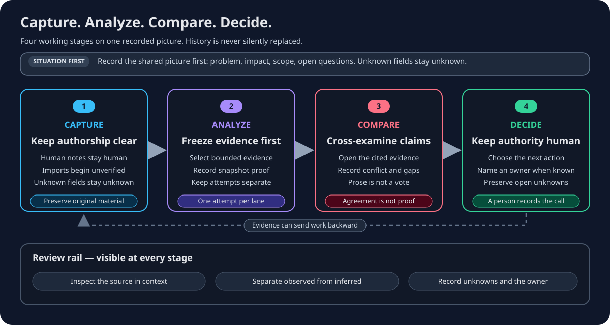

# War Room investigation workflow

War Room organizes a technical investigation around evidence and a human-owned
next action. Record the situation first, then move through **Capture → Analyze
→ Compare → Decide**. Return to an earlier stage whenever the evidence is not
good enough.

## Stage guide

| Stage | Do this | Leave with |
| --- | --- | --- |
| Capture | Separate a person's observations from imported output and record known provenance | Reviewable contributions and imports; unknown fields remain unknown |
| Analyze | Select investigation evidence, inspect it, and freeze a snapshot before starting lanes | A fingerprinted evidence basis and independent attempt history |
| Compare | Open cited material and review shared, conflicting, single-lane, unsupported, and unknown claims | An evidence-level account of agreement and disagreement |
| Decide | Choose the next action, record why, assign an owner when known, and preserve remaining uncertainty | A human-authored decision record, optionally assigned to a responsible person, or an explicit request for more evidence |

## Before Capture

Use the Situation stage to state the observed problem, affected area, time
window, bounded scope, and open questions. Do not fill an unknown field with a
plausible guess.

## Capture

Use a human contribution for your own note, hypothesis, action, message, or
upload record. Use manual external-output intake for text produced elsewhere.
Imported output starts unverified and stays separate from findings.

Record only provenance you know. The server records the authenticated importer.
External-run source and described-operator identities are required records;
visibility and prompt completeness are required fields whose values may
explicitly be `unknown`. Provider, model, version, and snapshot binding can be
absent. A source label provides attribution; it does not connect to the source
or prove the content.

## Analyze

Choose the evidence each lane is allowed to use, inspect it, and freeze a
snapshot. Start a job with one bounded strategy and question; each selected
model or profile becomes a separate lane attempt. Timeline reconstruction,
failure-boundary testing, and challenge review require separate jobs when they
use distinct strategies or questions. A rerun creates history instead of
replacing the earlier attempt.

Each recorded attempt appears as a **workstream** with its own address: the
question it was asked, who requested it, the frozen evidence set it saw, what
it reported, what it cited, what it left unknown, and a timestamped history.
Opening one focuses Analyze on that record. To read or share a single
workstream, open help://war-room-workstreams.

Synthetic offline lanes are available in the demonstration path. Configured
gateway lanes require the optional host-owned bridge. Provider credentials do
not belong in the browser.

## Compare

Read the evidence before judging the explanation. Agreement can narrow the
review, but it is not proof. A single-lane citation is a lead, not an automatic
error or conclusion. Failed or incomplete lanes do not count as complete
attempts, and missing same-snapshot proof keeps comparability unknown.

Focusing one lane changes the inspection view, not the aggregate decision
basis. Follow a deep link only if you are authorized for that investigation.

## Decide

An authorized person records the action and rationale, plus an owner when one
is known; otherwise the decision remains explicitly unassigned. A model may
propose a next step but cannot approve the decision, resolve a disagreement by
majority, or replace missing evidence with certainty.

“Capture the missing time interval” is a valid decision. Put the formal action
in Decide even when discussion contains the surrounding conversation.

For provenance and comparison checks, open
help://war-room-evidence-review. For local and shared deployment shapes, open
help://war-room-deployment.
