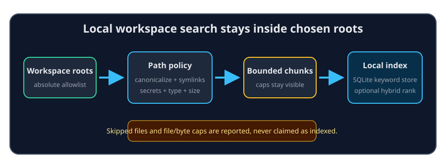

# Workspace roots and local indexing

A workspace is a named set of absolute folder roots. Those roots are both the
search scope and the filesystem security boundary. ContextDesk does not treat
your whole computer as searchable, and it refuses the bare home directory as
the default root.

## From a root to a result

| Stage | Behavior | Honest boundary |
| --- | --- | --- |
| Allowlist | Canonical paths must remain below a configured root | `..` and symlink resolution cannot escape a root |
| Walk | Supported files are discovered incrementally | Ignore, binary, oversized, and secret-shaped files can be skipped |
| Chunk | Text is split into bounded searchable chunks | A citation points to the source, not every byte of the file |
| Store | The keyword index persists in SQLite | Reopening can search the loaded store while refresh continues |
| Rank | Keyword search is always available | Hybrid semantic scoring is opt-in and needs an attached embed backend |
| Watch | File changes update the index after a debounce | A reported cap or read error means coverage is partial |

The default file soft cap is **100,000**, not 5,000. The default in-memory
keyword working-set budget is **256 MiB**; the persistent store can contain
more chunks while the resident searchable set favors recently modified files.
Both file and byte caps are reported rather than hidden.

## Files that need special care

Known credential filenames such as `.env` are refused by normal reads and
indexing. Binary and very large files are not useful as ordinary text evidence.
An allowlisted folder can still contain sensitive prose that no filename rule
recognizes, so choose roots narrowly and inspect citations before sharing
results with a remote provider.

Adding a session context pack does not add another permanent workspace root.
It creates a bounded, session-scoped overlay described in
help://skills-context-packs.

## When a file is missing from search

Check the workspace root, the index status and cap indicators, the file type
and size, and whether the filename looks like a secret. A direct file citation
still passes the same canonical allowlist check; search results cannot grant a
path outside the workspace.
