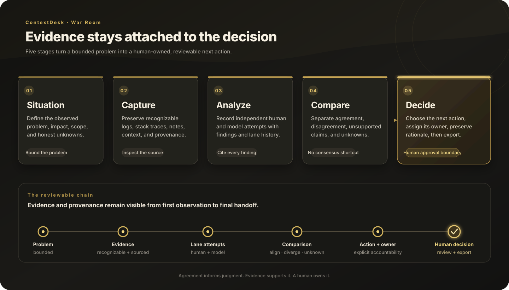
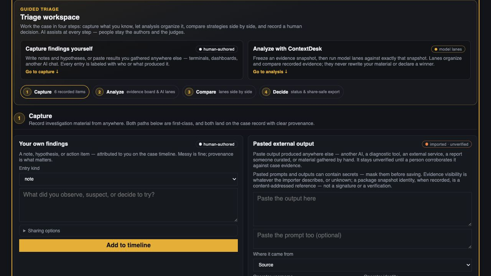
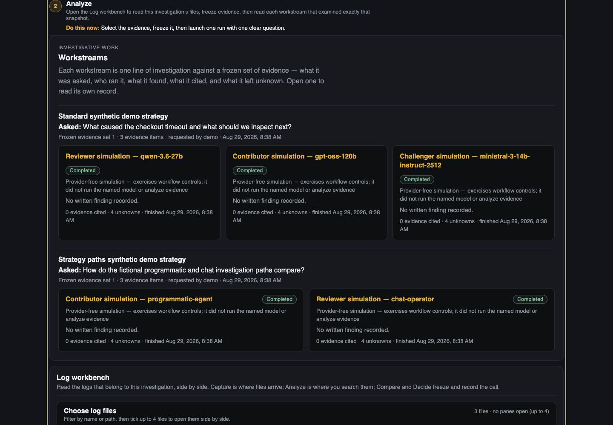
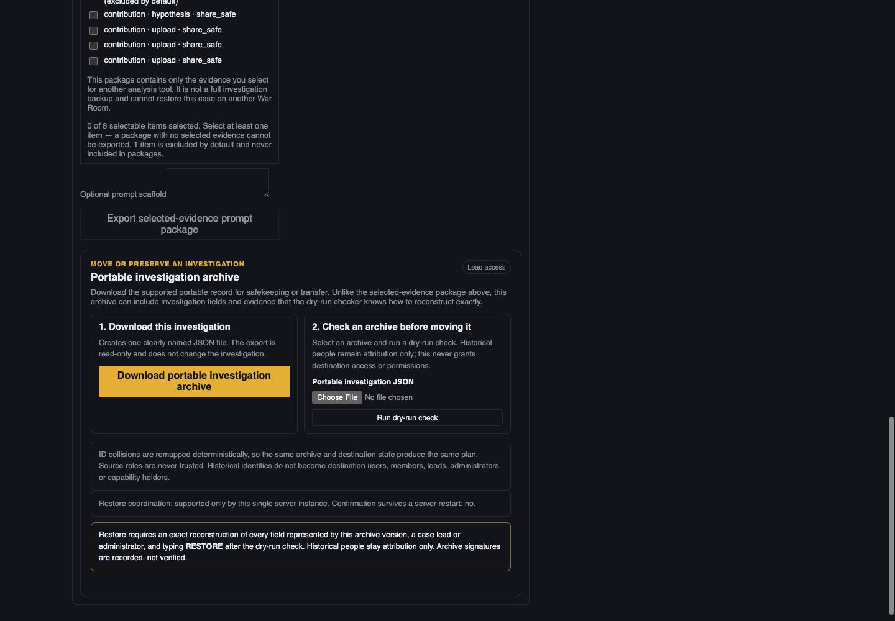

# Doing a triage with ContextDesk

This is the operator guide for one complete triage through either the
ContextDesk CLI or the War Room GUI. It is intentionally about **doing one
investigation**, not only comparing model answers.

> All examples and screenshots in this guide are synthetic. Replace example
> provider values with the exact values approved by your deployment. Never
> paste credentials, private logs, or company data into documentation, issue
> trackers, or chat.

## The short version

A triage is a bounded question over a known evidence set:

1. State the problem without assuming its cause.
2. Capture the relevant logs, files, observations, and prior analysis.
3. Inspect the evidence and resolve ambiguous timestamps explicitly.
4. Freeze the exact evidence basis when the host supports snapshots.
5. Ask one answerable question through one selected lane or model.
6. Read the answer against its citations, unknowns, and failure state.
7. Record the human decision or the next evidence-gathering action.

Running two or more lanes is an optional comparison technique. It is not a
requirement for a triage, and agreement is not proof of correctness.

## Choose the right path

| Need | Use | What it does | Provider call? |
| --- | --- | --- | --- |
| Find matching records | CLI `explore` / `search` | Deterministic search over an imported corpus | No |
| Assemble evidence before asking | CLI `context` | Deterministic bounded evidence and citation assembly | No |
| Ask one grounded question | CLI `chat` / `ask` | Runs the normal one-model grounded chat workflow | Yes, unless `--dry-run` |
| Automate an explicit SDK request | CLI `triage run` | Runs one versioned `contextdesk.triage.request.v2` request through the trusted host | Usually |
| Keep a case, provenance, snapshot, runs, and human decision together | War Room GUI | Durable investigation workflow | Synthetic mode: no; gateway mode: yes |
| Run the War Room host bridge | CLI `collab-triage-run` | A narrow host integration boundary used by Collab/War Room | Depends on the request |

`collab-triage-run` is an integration boundary, not the normal way an
operator types a question. For a human CLI workflow, use `chat`; for a
programmatic, schema-bound workflow, use `triage run`.

The CLI and War Room share the evidence-first principles and the reviewed
triage runtime, but they are different hosts. A CLI corpus or chat session
does not automatically become a War Room investigation. A War Room run is
attached to its case, frozen snapshot, timeline, and server-side run history.

## Path A — one triage through the CLI

The CLI is useful for a repeatable headless workflow, a Linux server, a script,
or a quick deterministic check before spending provider time.

### 1. Build or select the exact CLI

From the ContextDesk repository root on macOS or Linux:

```bash
cargo build -p cd-cli --locked
BIN="$PWD/target/debug/contextdesk"
DATA="$(mktemp -d)"
"$BIN" --data-dir "$DATA" --json capabilities
```

On Windows PowerShell, use an isolated directory for the rehearsal:

```powershell
cargo build -p cd-cli --locked
$BIN = (Resolve-Path .\target\debug\contextdesk.exe).Path
$DATA = Join-Path $env:TEMP ("contextdesk-triage-" + [Guid]::NewGuid().ToString("N"))
New-Item -ItemType Directory -Path $DATA | Out-Null
& $BIN --data-dir $DATA --json capabilities
```

Confirm that the capability output belongs to the binary you intend to use.
For release acceptance, also verify the checkout or artifact identity against
the release instructions for that build.

### 2. Import the corpus and read its verdict

Import an archive or directory. Import is deterministic and does not need a
model. The following is a Bash snippet; run it in Bash after setting `BIN` and
`DATA` as above (PowerShell variables do not carry into Bash):

```bash
set -euo pipefail
IMPORT="$("$BIN" --data-dir "$DATA" --json import ./fixtures/cli-release-demo)"
printf '%s\n' "$IMPORT"
"$BIN" --data-dir "$DATA" --json corpus list
```

The import response contains a corpus id and a typed outcome. Treat the
outcome as authoritative:

| Outcome | Meaning | Next step |
| --- | --- | --- |
| `complete` | Everything intended for import was published | Continue |
| `partial` | A corpus was published, but the defect ledger identifies missing or rejected material | Review the ledger before asking a question |
| `rejected` | The import command fails with a non-zero result; nothing was published | Correct the source or archive and retry |

Use the corpus id printed by `corpus list` in the commands below. Do not rely
on a path name as the corpus identity. A successful import selects the new
corpus; `corpus use` makes that choice explicit and repeatable:

```bash
CORPUS="<corpus-id-from-corpus-list>"
"$BIN" --data-dir "$DATA" corpus use "$CORPUS"
"$BIN" --data-dir "$DATA" --json corpus show "$CORPUS"
```

For a large or mixed archive, add `--explain-selection` to that import. It
shows which sources the host selected, ignored, or rejected without requiring a
provider. This is still a real import: it publishes and selects a new corpus;
it is not a preview-only command. Use it on the import you intend to keep, or
run `corpus use "$CORPUS"` again afterward:

```bash
"$BIN" --data-dir "$DATA" --json import \
  --explain-selection ./path/to/logs-or-archive
```

An import can be `partial` without being useless. It is only safe to proceed
after you understand what was omitted and whether the missing material could
change the question.

### 3. Resolve time before relying on chronology

The CLI never guesses a timezone for a local timestamp with no offset. Inspect
the state first:

```bash
"$BIN" --data-dir "$DATA" --json timezone status --corpus "$CORPUS"
```

If the logs are known to use one zone, declare that zone explicitly. Use the
actual IANA zone supplied by the operator or system owner; do not infer it
from the server location, filename, or a model answer:

```bash
"$BIN" --data-dir "$DATA" --json timezone apply-all \
  America/Chicago --corpus "$CORPUS" --yes
"$BIN" --data-dir "$DATA" --json timezone status --corpus "$CORPUS"
```

Use `timezone apply <source> <iana-zone>` instead when different sources use
different zones. A declaration changes the corpus revision and is recorded;
it does not rewrite the original log bytes. `timezone clear` removes a prior
declaration and returns that source to unresolved ingest/order-only behavior.

For an offline normalized artifact rather than a durable corpus, use
`normalize` with a single default zone or an explicit source-to-zone map:

```bash
"$BIN" --data-dir "$DATA" normalize ./path/to/logs-or-archive \
  --output ./normalized-output \
  --timezone-map '{"service/app.log":"America/Chicago"}' \
  --strict-time
"$BIN" --data-dir "$DATA" normalized validate ./normalized-output
"$BIN" --data-dir "$DATA" normalized summarize ./normalized-output
```

`normalize` writes JSONL, a manifest, and a report; it does not publish a
durable CLI corpus. `--strict-time` is useful when unresolved local timestamps
must stop the export rather than remain explicitly unknown.

### 4. Check evidence without using a model

Start with deterministic retrieval. This separates “the host can find the
evidence” from “a model produced a plausible explanation”:

```bash
"$BIN" --data-dir "$DATA" --json explore "timeout" \
  --corpus "$CORPUS" --k 20
"$BIN" --data-dir "$DATA" --json context "timeout" \
  --corpus "$CORPUS" --k 20
```

`explore` returns matching records. `context` assembles bounded evidence and
citations for a question. Neither command proves the cause, and neither
contacts a provider.

### 5. Ask one grounded question

For a normal one-model triage, use `chat` or its `ask` alias. Make the
question specific enough that a person can check the answer:

```bash
"$BIN" --data-dir "$DATA" --jsonl chat \
  --new \
  --corpus "$CORPUS" \
  --trace summary \
  --activity summary \
  "What is the first supported timeout in the corpus, what happened immediately before it, and which evidence supports that description?"
```

The answer is model-generated, but grounding is host-owned. In a non-interactive
shell, permissioned tool calls are denied unless you add `--auto-approve`; use
that only when the host tools are intentionally approved for automation. Read
the evidence
ids and citations, then open the corresponding records yourself. A grounded
status means that citation identity resolved; it does **not** certify that the
model's causal interpretation is complete or correct.

For a provider-free rehearsal, build the same bounded request without sending
it:

```bash
"$BIN" --data-dir "$DATA" --jsonl chat \
  --dry-run \
  --corpus "$CORPUS" \
  --trace context \
  "What is the first supported timeout?"
```

Dry-run does not create a session, refresh credentials, probe a gateway, or
send corpus content anywhere. Use it to check corpus binding, context shape,
and trace behavior before a live turn.

### 6. Use the explicit SDK triage when you need a contract

Use `contextdesk triage run` when an integration needs a versioned request and
replay rather than the simpler conversational `chat` command. Create one
owner-only request whose model identity is exact:

```json
{
  "schema_id": "contextdesk.triage.request.v2",
  "run_id": "run:example-001",
  "privacy": "owner_only",
  "task": "What is the first supported timeout, and what evidence bounds its likely trigger?",
  "scope": {
    "corpus_id": "<corpus-id-from-corpus-list>"
  },
  "policy": {
    "kind": "standard",
    "model": {
      "profile_id": "profile:example-gateway",
      "model_id": "<exact-model-id-from-discovery>"
    }
  },
  "overrides": {
    "deadline_ms": 600000,
    "max_provider_calls": 8
  },
  "cancellation_id": "cancel:example-001"
}
```

Run it only after the exact profile and model are configured on the host:

```bash
"$BIN" --data-dir "$DATA" --jsonl triage run \
  --request ./request.json
```

The CLI validates the request before resolving application state. It rejects
caller-supplied preflight as authority; runtime qualification is host-owned.
The output is owner-only and contains the authoritative replay plus a typed
terminal result when execution reaches one. Exit status is meaningful:

| Exit | Result |
| ---: | --- |
| `0` | Completed |
| `10` | Completed with an honest partial result |
| `8` | Failed or timed out |
| `130` | Cancelled |

This table covers terminal triage results. Validation and operational errors
such as an invalid request, missing corpus, permission denial, provider error,
or internal error have their own non-zero envelopes; use the command's error
type rather than treating every non-zero result as a failed triage.

Do not turn a failed, timed-out, cancelled, or ungrounded result into a
successful conclusion in a wrapper script. Preserve the typed status and
reason codes.

### 7. Configure a gateway without putting its key in the request

For a company or self-hosted OpenAI-compatible gateway, configure the host
with the exact base URL and model catalog id. The key must arrive through an
environment variable, protected file, stdin, or the host keychain—not as a
literal command-line value:

```bash
export CONTEXTDESK_ACCEPTANCE_GATEWAY_KEY='set-this-only-in-your-protected-shell'
"$BIN" --data-dir "$DATA" config init --non-interactive \
  --provider-kind openai-compatible \
  --base-url https://gateway.example.test/v1 \
  --chat-model '<exact-model-id>' \
  --api-key-env CONTEXTDESK_ACCEPTANCE_GATEWAY_KEY \
  --default-timezone America/Chicago
"$BIN" --data-dir "$DATA" models discover
"$BIN" --data-dir "$DATA" models verify '<exact-model-id>' --yes
```

The placeholder above is deliberately not a real secret. Do not commit the
export, request file, raw trace, or gateway response. `models discover` and
`models verify` have different purposes: discovery reports the catalog;
verification tests the exact selected model and retains host-owned evidence.
Use a larger bounded deadline for a slow gateway, not an unbounded retry.

### 8. Close out the CLI triage

Read the answer against the records returned by `explore`/`context`. Then
record the outcome in the surrounding incident or ticket:

- the question and corpus id/revision;
- what the host found and what the model claimed;
- citations that a person checked;
- unknowns, missing intervals, or partial import defects;
- the next action and its owner; and
- the exact CLI binary/config identity used.

CLI chat sessions and corpus state are durable in the CLI data directory, but
the process Activity Inspector is a turn capture and is not a durable
transcript after the process exits. Share only a reviewed, share-safe report.

## Path B — one triage through the War Room GUI

The War Room is the better path when a team needs one durable investigation,
visible provenance, a frozen evidence basis, and a human decision in one
place. One lane is enough for a focused triage.



### 1. Start the service and sign in

From the repository's `collab/` directory, optionally verify the local package
and tests, then start the provider-free demo:

```bash
npm ci
npm run demo:check
npm run demo
```

`npm run demo:check` verifies the workspace; it does not start the service. The
last command is the one that starts it. The default demo intentionally prints
that local log chronology is hidden until both `COLLAB_BRIDGE_BIN` (or the
fallback `COLLAB_TRIAGE_RUNNER`) and `COLLAB_LOG_CORPUS_ROOT` point to a trusted
ContextDesk timestamp host and its corpus cache. Without those host settings,
the normal synthetic triage flow still works. **Timezone review** says it
"needs the trusted ContextDesk timestamp host on this installation," and
**Normalized log chronology** stays hidden. A UTC-range search still runs, but
only timestamps that already carry an offset can be compared reliably; treat
that result as incomplete rather than guessing around the missing host.

Open the local address printed by the service and sign in as:

```text
demo / demo
```

This is a synthetic fixture account. For a real deployment, use the
configured local account or LDAP path; the browser must never receive the
gateway key or a directory bind password.

### 2. Create the investigation in Investigations

Choose **Investigations → Start an investigation**. Enter:

- a short title;
- the problem statement as observed, without naming an unproven cause;
- affected people, customers, systems, or services;
- impact and scope;
- one unresolved question per line;
- the software/product, version, build, component, environment, and
  organization/entity context you know; and
- an earlier occurrence date when entering historical work.

The structured context fields are searchable and reusable labels. **Entities**
describe what the investigation concerns. **Attribution** describes who or what
supplied an item. Neither is a global log store. The evidence remains owned by
this investigation.

The investigation opens on **Situation**. Re-read the problem boundary and
leave unknown fields blank rather than allowing the UI or a model to fill them
in.


### 3. Capture the material that can answer the question

Move to **Capture** and add the material that belongs to this investigation:

- human observations, notes, hypotheses, and next actions;
- an external email or chat transcript as imported, unverified output;
- a log file, ZIP, nested ZIP, or directory; and
- other supported investigation evidence.

For a ZIP or directory, inspect the intake preview before committing. Nested
members retain their archive path. Accepted members become investigation-owned
evidence; rejected members remain visible in the typed intake outcome rather
than silently disappearing. A partial intake should cause you to ask whether
the missing member matters before launching a triage.



### 4. Read the logs before asking the model

Open **Analyze → Log workbench**. This is the focused reading surface for
logs already captured in the investigation:

1. Filter the file list when there are many files.
2. Select up to four files for side-by-side reading.
3. Search with **Find**, match mode, include/exclude terms, severity, and an
   explicit UTC range when useful.
4. Use **Previous match**, **Next match**, F3, or Ctrl/Cmd+G to move through
   matches.
5. Check whether the result is complete. A bounded page or continuation
   cursor is not a corpus-wide “no more matches” claim.
6. Save the view or bookmark a line when you expect to return to it.
7. If local timestamps have no offset and the trusted timestamp host is
   configured, open **Timezone review**, choose the correct IANA timezone
   explicitly, and then open **Normalized log chronology**. The workbench also
   has its own **Review chronology** control; use **Show merged chronology** to
   combine the selected panes when that view is available.

The workbench never guesses a timezone, year, daylight-saving choice, or clock
correction. It keeps the raw evidence and the time declaration separate. Search
continuation is bound to the selected files, scope, and timezone revision; a
stale continuation is refused rather than silently reused. A later evidence or
timezone revision does not silently change an already frozen snapshot.



### 5. Freeze the question's evidence basis

In the evidence board, select the items the triage is allowed to read and
choose **Freeze selected evidence**. This creates an immutable snapshot with
an evidence fingerprint. A case lead is required for this write.

Before continuing, check:

- the snapshot contains every file or record needed for the question;
- the evidence count is plausible;
- timezone declarations were made before freezing when chronology matters;
- the snapshot fingerprint is recorded; and
- any later intake or timezone change will require a new snapshot or an
  explicit rerun rather than changing this basis in place.

### 6. Launch one focused triage

Still on **Analyze**, open **Run history and launcher**:

1. Choose the frozen **Snapshot**.
2. Choose **Synthetic / offline** for a provider-free rehearsal, or
   **Configured gateway** for a real host-approved model.
3. Write one answerable **Question**. Ask for observations, boundaries,
   citations, and unknowns instead of asking the model to “fix everything.”
4. Give the work a short **Task fingerprint** so an intentional rerun of the
   same question can be recognized.
5. Enter a meaningful **Strategy**. This is free text; `timeline`,
   `failure-boundary`, and `skeptic` are useful examples, not a fixed enum.
6. Select exactly one lane for a focused triage. In gateway mode, choose the
   host-approved gateway model for that lane.
7. Choose **Run synthetic triage** or **Run gateway triage**.

The button and status text are deliberate: a gateway selection is a request,
not proof that a provider was reached. Credentials and endpoints stay on the
War Room host. The browser receives only the bounded model/profile choices
needed to make the selection.

One lane is a complete triage. Selecting two or more lanes is an optional
comparison and changes the button to **Run gateway comparison** where
applicable. Do not add lanes merely to create a majority.

### 7. Wait for the recorded result and inspect it

Run history keeps the question, strategy, snapshot binding, lane state, and
terminal outcome together. Lanes can be queued, running, completed, partial,
failed, timed out, or cancelled. A slow gateway should remain visibly queued
or running; do not interpret waiting as success and do not launch duplicates
just because the first request has not finished.

When the lane settles, read:

- the lane's final status and any typed reason;
- the answer and its evidence references;
- what remains unknown;
- the recorded trace and phase history;
- same-snapshot/fingerprint evidence; and
- whether usage or cost is genuinely known, rather than a blank being turned
  into zero.

Open each evidence reference and read the underlying log or artifact. A
grounded or cited result means the host can resolve the evidence identity; it
does not turn a model interpretation into a fact.

### 8. Compare only when comparison helps

If you selected multiple lanes, or want to compare separate completed runs,
open **Compare**. Review agreement, disagreement, unsupported claims, and
unknowns against the evidence—not against writing style or lane count.

For a single-lane triage, Compare is optional. You can focus the one lane's
record without pretending that it has a peer or a consensus. If the result is
not good enough, return to Capture or Analyze and record what changed before
rerunning.


### 9. Make the human decision

Open **Decide** and record the human-owned outcome:

- the action to take, or “gather more evidence”;
- the owner, or explicitly unassigned;
- the evidence-backed rationale;
- remaining disagreements and unknowns; and
- the condition that will cause review or closure.

A model lane may propose an action, but it cannot approve the human decision.
The decision and its revisions remain part of the investigation history.



Use the appropriate export after review: a triage brief for a readable
handoff, a selected-evidence package for another analysis tool, or a portable
investigation archive for preservation/transfer. An export is not automatically
a full backup, and share-safe output should be inspected before it leaves the
workspace.

## How the two paths correspond

| Investigation idea | CLI | War Room GUI |
| --- | --- | --- |
| Define the question | `chat` text or `triage run.task` | Situation + launcher question |
| Establish evidence | `import`, `corpus show`, `explore`, `context` | Capture + evidence board + Log workbench |
| Resolve time ambiguity | `timezone status/apply/apply-all` or `normalize` map | Timezone review + Normalized log chronology |
| Pin exact material | Corpus id/revision in the grounded turn or SDK scope | Freeze selected evidence and snapshot fingerprint |
| Execute one triage | `chat` or one `triage run` request | One selected lane in Run history and launcher |
| Inspect truth boundary | Trace, evidence ids, typed status, exit code | Lane result, evidence links, unknowns, and run history |
| Compare alternatives | `chat --mode review` or a separate explicit workflow | Two or more lanes/runs in Compare |
| Record a human outcome | Surrounding ticket or operator record | Decide stage and durable investigation timeline |

The CLI's `chat --mode review` is an opt-in CLI review pipeline; it is not a
promise that a War Room comparison or a human decision exists. Likewise,
several War Room lanes are independent attempts, not a correctness vote.

## Troubleshooting without losing the truth

### The import says `partial`

Open the typed defect ledger. Check the archive-member chain and stable defect
code, then decide whether the missing source could affect the question. Do not
quietly proceed as if the corpus were complete.

### The timestamps look out of order

Run the CLI timezone status command or open War Room Timezone review. Obtain
the actual source timezone, apply an IANA zone explicitly, and rebuild/read
normalized chronology. Do not “fix” the ordering by changing the raw log or
asking a model to guess the zone.

### The answer says it found nothing

First run deterministic `explore`/`context`, or use the Workbench search and
check continuation/completeness. A bounded page, an unresolved timezone, an
unselected file, and a genuine zero-match result are different states.

### The gateway is slow

Use the saved deadline or a bounded per-turn deadline. Wait for the recorded
queued/running state, watch the lane progress, and cancel when appropriate.
Do not add retries that hide a timeout or treat a still-running request as a
completed one.

### A gateway lane cannot start

Confirm the host has the exact configured profile, exact catalog model id,
current workspace policy approval, and any required role qualification. A
browser-side model string is not proof of availability. Ask an administrator
to approve the model rather than pasting a key or endpoint into the form.

### A rerun produces a different answer

Record what changed: snapshot/evidence, timezone revision, question, strategy,
model, or provider configuration. If nothing changed, preserve both attempts
as evidence of nondeterminism or model instability; do not overwrite the first
record.

## Completion checklist

Before calling a triage complete, a reviewer should be able to answer yes to
these questions:

- Is the problem stated without an assumed cause?
- Can I identify exactly which corpus, evidence items, and snapshot were used?
- Were ambiguous timestamps resolved by an explicit operator declaration?
- Did the host actually find the cited evidence?
- Is the result complete, partial, failed, timed out, or cancelled—and is that
  state preserved honestly?
- Are unknowns and unsupported claims still visible?
- Did a person make and record the decision?
- Is the exported material appropriate for its audience and privacy class?

For a compact War Room walkthrough, see [the five-minute end-to-end
walkthrough](END_TO_END.md). For the full CLI command reference, see the
[ContextDesk CLI guide](../CLI.md). For acceptance of a built source checkout,
see [the demo runbook](../DEMO_RUNBOOK.md).
