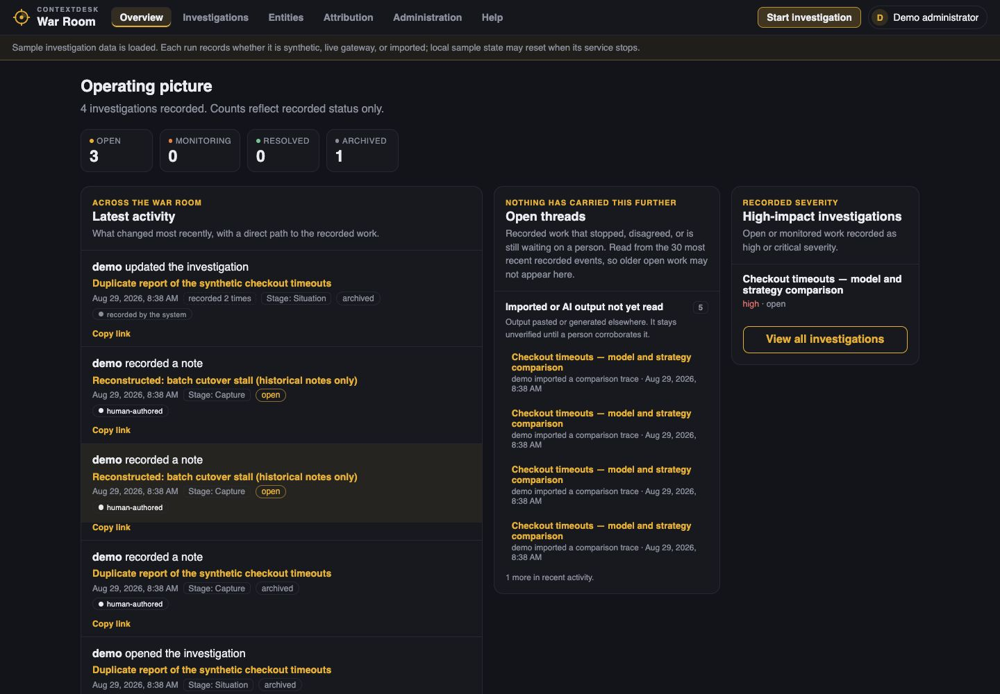
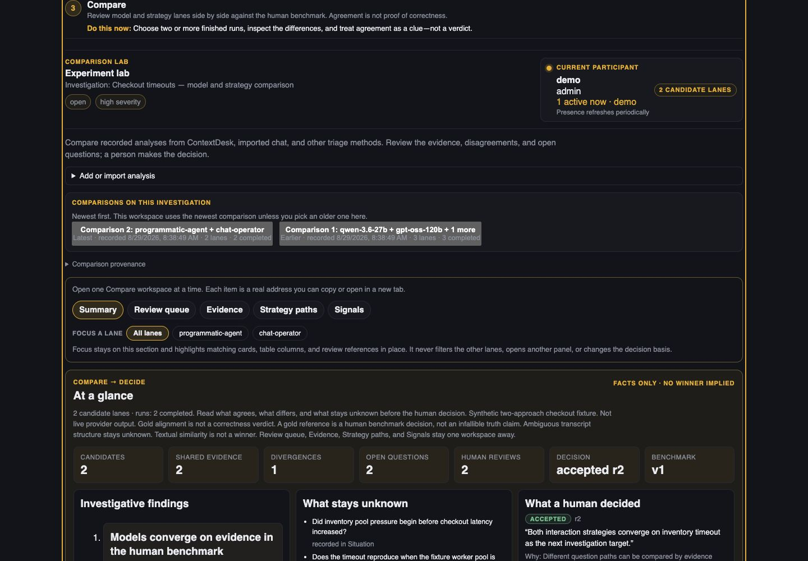
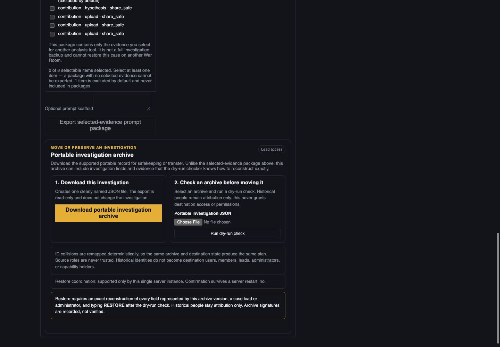
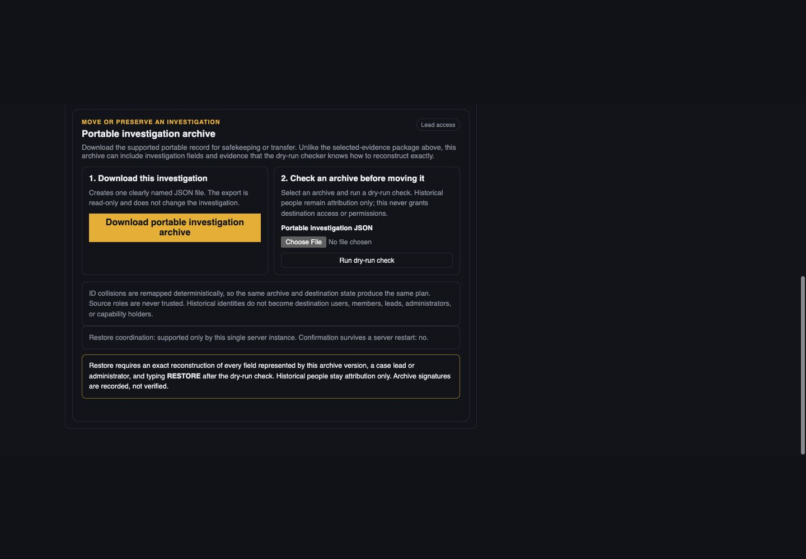
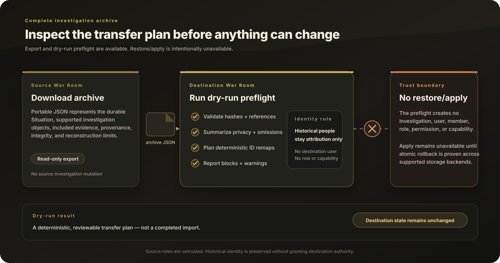
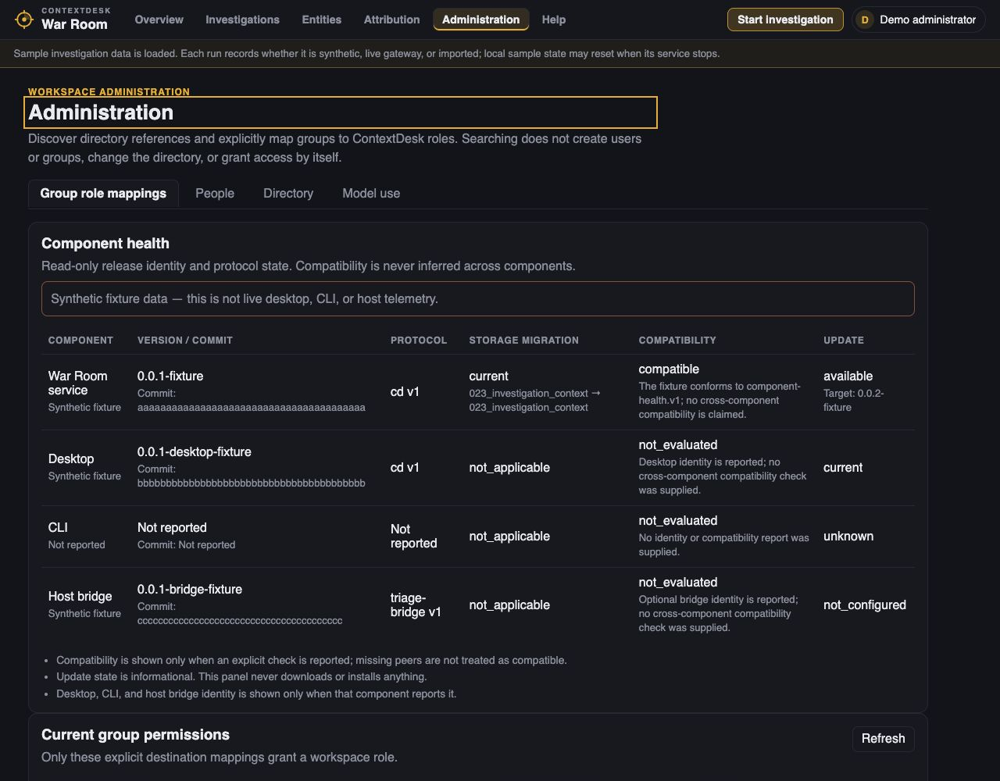
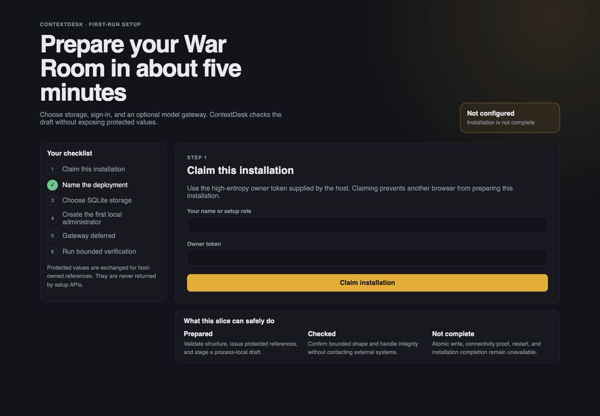

# War Room end-to-end walkthrough

This five-minute walkthrough uses only the shipped synthetic demo. It does not
require a live provider, external service, directory, or imported material.
The goal is to understand the War Room workflow—not to benchmark a model or
prove production deployment readiness.

## 0:00 — Start and sign in

From the repository root:

```bash
cd collab
npm run demo
```

Leave the process running. Open the local address it prints, then sign in:

```text
Username: demo
Password: demo
```

This is a fixture identity, not an LDAP claim. After sign-in, the account menu
shows the synthetic display name, username, and access role.

The default demo does not install the separate trusted timezone host. Offset-
bearing timestamps remain comparable; local timestamps without an offset stay
unresolved. Timezone review says it "needs the trusted ContextDesk timestamp
host on this installation," and normalized chronology stays hidden because it
has no host result to display. Use a separately configured host-backed rehearsal
for those actions.

If the local address does not load, stop and record the environment failure.
Do not substitute external data for this walkthrough.

## 0:30 — Orient in the workspace

Use the main navigation to distinguish the workspace destinations:

- **Overview** shows recent recorded activity and active investigations.
- **Investigations** is the searchable inventory.
- **Attribution** contains reusable source labels, not global evidence.
- **Administration** is the admin-only destination for bounded directory
  visibility and workspace group-to-role mappings.
- **Help** contains searchable operating guidance.

On Overview, follow one activity link to its recorded investigation stage,
then return to Investigations and open the prepared synthetic item.




Expected result: Overview and Investigations answer different questions, and
the investigation opens at a routed stage rather than on one undifferentiated
page.

## 1:00 — Read Situation before choosing a cause

In **Situation**, identify:

1. the observable synthetic problem;
2. who or what is recorded as affected;
3. the impact and bounded scope; and
4. open questions that remain unknown.

If you have write access, choose **Edit situation** to update those durable
fields. Leave a field blank when it is not known; the UI shows **Not recorded**
instead of manufacturing context.


Expected result: you can repeat the problem without naming an unproven cause.

## 1:35 — Capture provenance and inspect evidence

Move to **Capture**. Confirm that human notes remain human-authored and outside
model or tool output remains imported and unverified. Move to **Analyze** and
inspect the investigation-scoped synthetic logs or stack traces.


The **Attribution** catalog records who or what produced an item. The actual log,
note, upload, or imported response belongs to this investigation.

Open **Compare**, choose a finding, and follow its evidence link. The synthetic
image below records the resulting Analyze workstreams context; it does not put
the cited evidence target itself in frame. During acceptance, confirm the live
destination shows a readable label and relevant log, stack frame, or
observation context rather than only an opaque identifier. Expand longer
technical material when needed.


Open **Technical details** to inspect exact identifiers, hashes, timestamps,
source metadata, or lane configuration. Those fields support audit but do not
replace the readable evidence.

Expected result: you can explain what was observed, where it came from, and
what remains inferred or unknown.

## 2:00 — Work the logs before asking a question

If the investigation contains several or very large logs, stay on **Analyze**
and use **Log workbench** before launching a lane:

1. Filter the evidence list and select up to four files for side-by-side
   reading.
2. Search with **Find**, then use Previous/Next, F3, or Ctrl/Cmd+G to move
   through matches.
3. Read whether the result is complete. If the search stopped after a bounded
   page, continue from its position instead of treating the current count as a
   corpus-wide total.
4. Save a view or bookmark a useful line when you will return to it.
5. In a host-backed rehearsal, if a line has no timezone, use **Timezone
   review** to choose its IANA zone, then open **Normalized log chronology**.
   In the default demo, confirm that Timezone review says it "needs the trusted
   ContextDesk timestamp host on this installation" and normalized chronology
   remains hidden. The workbench never guesses a timezone, year, daylight-saving
   choice, or clock correction.

Nested ZIP members retain their archive paths and are subject to the same
bounded safety and privacy checks as ordinary files. Rejected members are not
silently dropped.

Expected result: you can point to the relevant lines and know whether the
search is complete; chronology is either explicitly normalized by a configured
trusted host or hidden because no host result exists.

## 2:35 — Inspect frozen evidence and lane attempts

In **Analyze**, confirm that the comparison lanes are bound to a frozen
evidence snapshot. Synthetic mode is offline. A configured deployment can
instead expose a **Gateway model** selector for each lane; the integrated
catalog can include Qwen 3.6 27B, GPT-OSS 120B, and Ministral 3 14B when the
host is configured for them.

Return to **Compare** and focus one lane. The compact lane digest shows its
question, evidence, latest conclusion, unknowns, and recorded trace while the
aggregate comparison continues to show every lane. The URL retains the
investigation, comparison, lane, and section for authorized sharing.


Use **Historical artifacts** to open prior runs and comparisons. They remain
separate records and are not silently overwritten by a rerun.

Expected result: you can identify what strategy the lane used, which evidence
it cited, and how it differs from other attempts.

## 3:05 — Compare evidence, not writing style

Review the Compare categories:

- **Agreement** — compatible claims with inspectable support.
- **Disagreement** — competing interpretations or boundaries.
- **Unknowns** — questions the captured material cannot answer.
- **Unsupported** — claims whose evidence is absent, irrelevant, or broken.




Open at least one underlying finding. Confirm whether two lanes cite the same
evidence, different evidence, or no evidence. Agreement is not presented as
proof, and a lane count is not a winner ranking.

Expected result: at least one open question can remain unknown without being
silently completed by a model.

## 3:45 — Discuss and decide

Read or add a short synthetic discussion note that connects the evidence to a
next action. Discussion is durable and refreshes through polling. It is not a
WebSocket chat channel, so do not expect instant delivery, typing indicators,
or a live viewer roster.

In **Decide**, confirm the human-selected next action, owner, rationale,
remaining disagreement, and unknowns. A lane may propose an action but cannot
approve the human decision.

Expected result: discussion preserves review context while Decide remains the
authoritative location for the action and owner.

## 4:20 — Choose the right export

The Decide stage provides three different export jobs:

1. **Triage brief** — a readable owner-only or share-safe handoff.
2. **Selected-evidence prompt package** — only the evidence explicitly chosen
   for another analysis tool, plus an optional prompt scaffold.
3. **Portable investigation archive** — the supported represented investigation record
   and included evidence for preservation or transfer.

Exporting a selected-evidence package does not back up the investigation. Its
manifest should contain only the selected eligible items.

For the portable archive, choose **Download portable investigation archive**.
Then select that synthetic JSON archive and choose **Run dry-run check**. Read
the archive readiness summary: objects, collisions, deterministic ID remaps,
privacy, omitted content, warnings, and broken references. Historical people
remain attribution only and receive no destination access.







Expected result: the dry run states that it changed no investigation, user,
membership, role, permission, or capability. If it reports an exact
reconstruction, type **RESTORE** and restore the investigation, then open the
returned link. Historical people remain attribution only. Archive signatures
are not verified.

## Optional — Inspect administration without changing access

As the synthetic administrator, open **Administration**. Review the existing
group-to-role mappings and the role descriptions. Directory search is bounded
and the demo uses fixture identities. Do not change a mapping during this short
walkthrough.

Expected result: it is clear that a directory search result does not grant
access. Only an explicit destination group mapping does, and source roles from
portable archives are never trusted.



## What this walkthrough demonstrates

- multi-page workspace navigation and five routed investigation stages;
- durable Situation fields;
- investigation-scoped evidence and separate source attribution labels;
- readable logs, stack traces, observations, deep links, and Technical details;
- snapshot-bound lane attempts, focused lane inspection, and history;
- side-by-side Log workbench reading, bounded search continuation, saved views,
  explicit timezone review, and normalized chronology;
- evidence-based comparison and a human-owned decision;
- durable discussion and activity using polling;
- selected-evidence prompt packaging;
- portable archive export, fail-closed dry-run preflight, and supported-field exact restore; and
- bounded administration and display identity in the synthetic fixture.

## What this walkthrough does not demonstrate

The synthetic demo does not claim:

- production LDAP readiness without deployment-specific encrypted
  configuration and qualification;
- WebSocket chat, instant delivery, typing indicators, or authoritative
  presence;
- Ed25519 archive authenticity verification;
- a completed installation from the first-run preparation wizard (the wizard
  can claim, stage, and run bounded checks, but cannot atomically install or
  restart the deployment);
- live-provider quality, production performance, or correctness on external
  material; or
- availability of any gateway model on an unconfigured host.

Continue with the [operator guide](OPERATOR_GUIDE.md), or return to the
[War Room overview](README.md).

The separate setup rehearsal begins with this bounded checklist:


