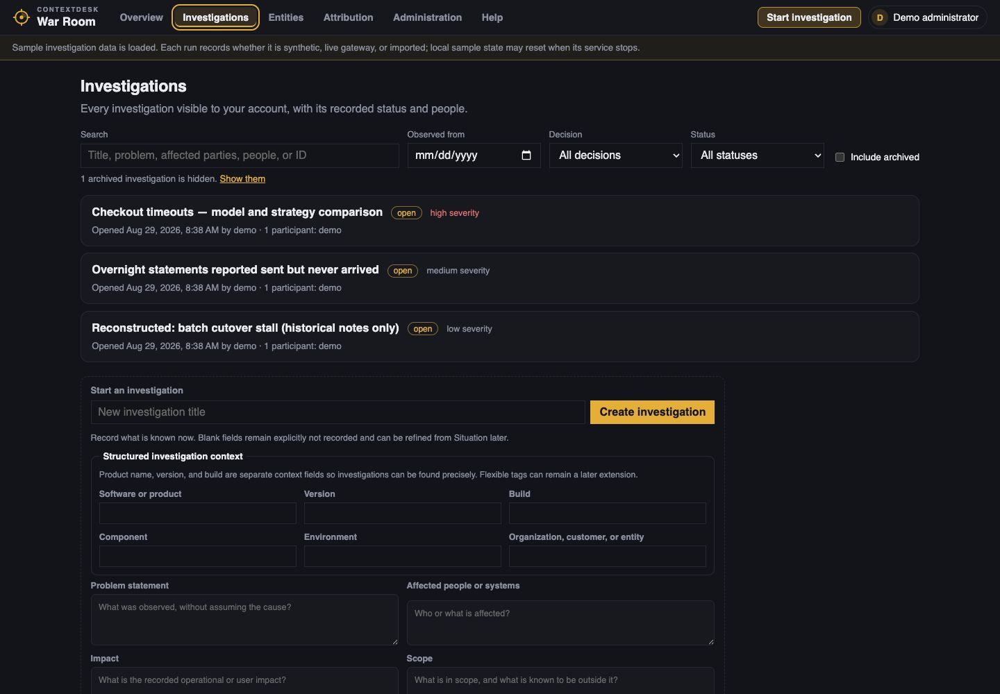
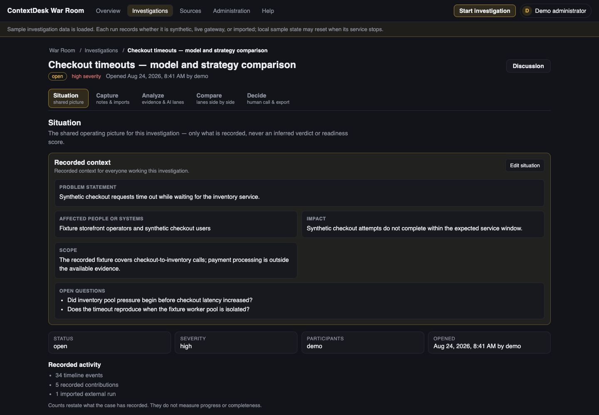
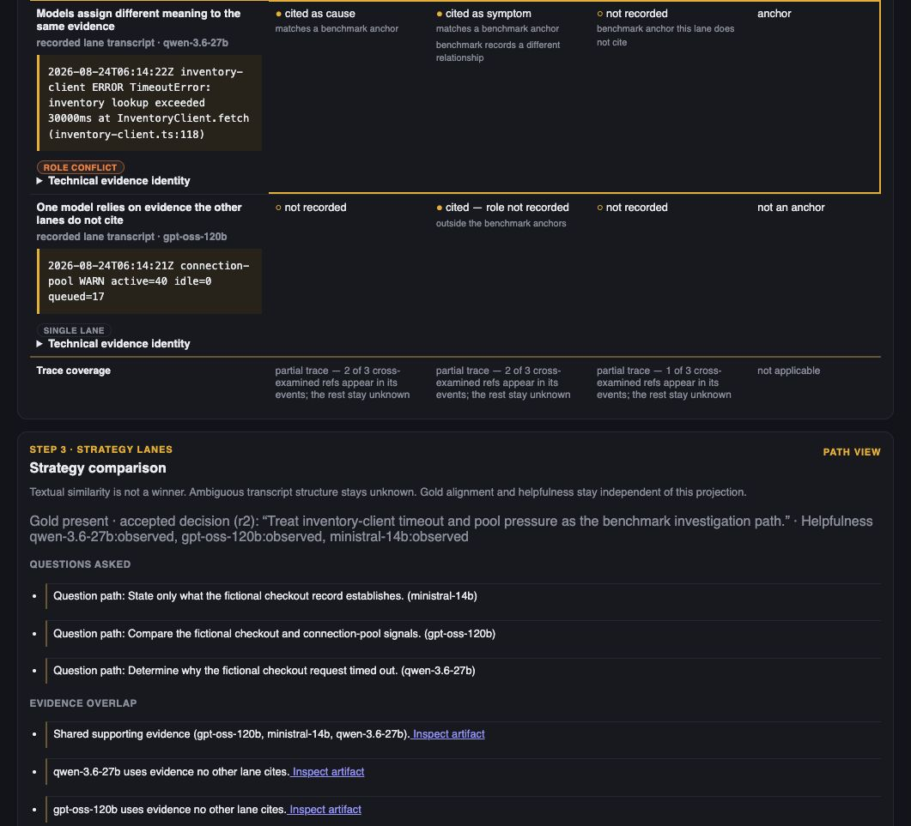
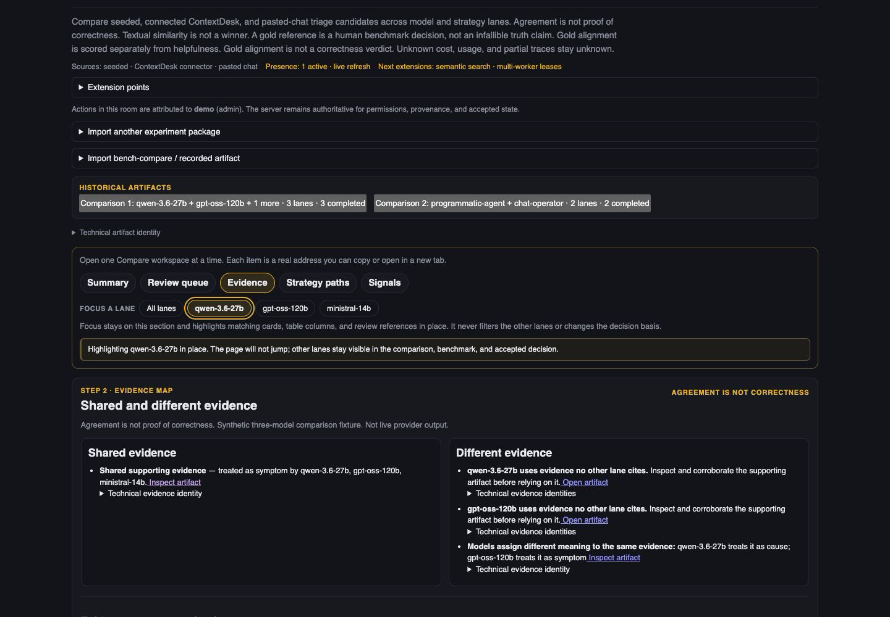
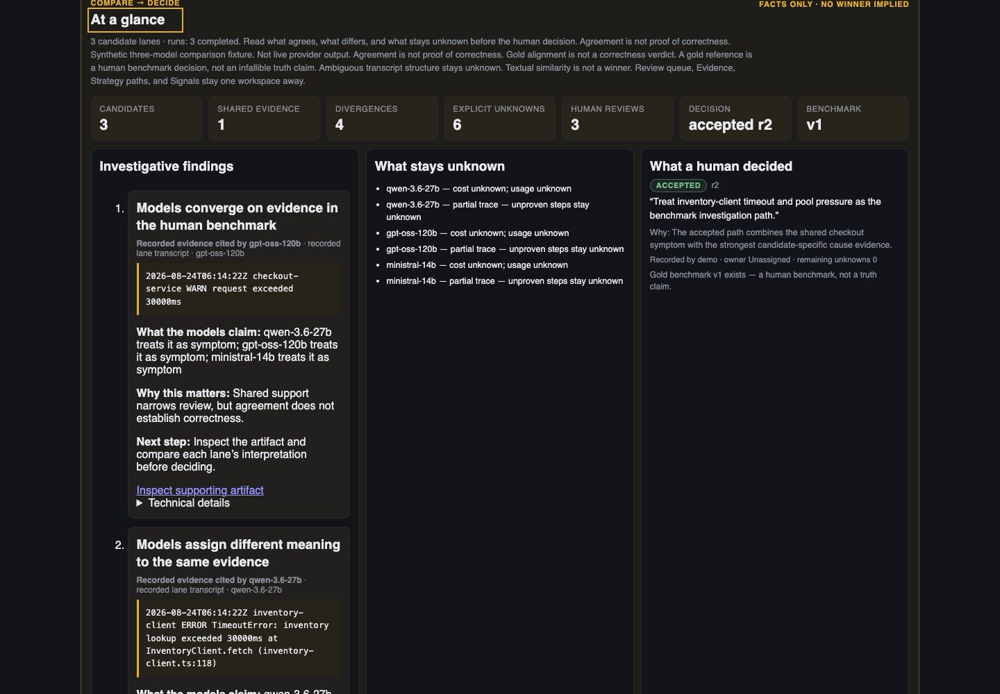

# War Room operator guide

This guide explains how to operate War Room as an evidence review system,
not as a model-answer generator. The operator's job is to keep the problem
bounded, make source material recognizable, compare attempts fairly, and
record the human action that follows.

> Every screen and example referenced here is fully synthetic.

## Before you begin

Start with a question that can be improved by evidence. “Something failed” is
too broad. A useful Situation states what was observed, the relevant time or
scope, the operational consequence, and what is not yet known. Avoid putting a
favored explanation into the problem statement as though it were fact.

Overview is the entry point for resuming work: use its latest-activity links to
return to the exact recorded change, or open **Investigations** for the complete
searchable inventory. Use names that describe the synthetic problem, not a
presumed cause.

## 1. Situation: define the problem boundary

Situation gives every lane the same orientation. Record:

- the observed symptom;
- when and where it appears in the synthetic scenario;
- the current impact and urgency;
- constraints that affect the investigation; and
- open questions that must remain unknown for now.

Separate observations from hypotheses. “The synthetic request returned an
error” is an observation if captured evidence shows it. “A dependency caused
the error” is a hypothesis until a finding can point to supporting evidence.

Good Situation text makes it possible to tell when the investigation has
drifted. If a lane answers a different question, keep the output in its lane
history but do not promote it into a finding for the current decision.

## 2. Capture: make the evidence recognizable

Capture the material a reviewer would actually recognize: log excerpts,
stack traces, error messages, timestamps, and human observations. Preserve
enough surrounding context to evaluate the claim. A copied phrase without
its source, time, or neighboring lines is weak evidence.

For every item, confirm:

- **Origin:** synthetic, live, or imported.
- **Source identity:** where the item came from, as represented by the
  product.
- **Time:** observed time and event time when both are available.
- **Integrity:** whether the item is original, transformed, excerpted, or
  summarized.
- **Scope:** which lane or investigation can use it.

Human notes are useful evidence about what a person observed or decided. They
are not a safe container for pasted model output. If model output is brought
in from another run, preserve it as **imported** so its origin remains visible.

### Evidence deep links

A finding's evidence link should open the cited item in context. Use the deep
link to verify the exact line or frame, inspect nearby events, and return to
the finding without rebuilding the search manually.

If a deep link resolves to the wrong item, lacks enough context, or no longer
resolves, treat the citation as unverified. Do not rely on the finding's prose
alone.

### Technical details

Open **Technical details** when the visible summary is insufficient. Depending
on the item, the panel provides audit-oriented metadata such as identifiers,
timestamps, source/provenance fields, lane configuration, attempt status, and
diagnostic payload details. It is the place to answer “exactly which item or
attempt is this?” without crowding the primary narrative.

Technical details support review; they do not turn an unsupported conclusion
into a supported one. A finding still needs a meaningful evidence connection.

## 3. Analyze: treat each lane as an attempt

Analyze runs or records bounded attempts against the Situation and available
evidence. A lane may be human-led or model-assisted. Give each lane a distinct
purpose, then judge it by the evidence it returns.

A practical small-model comparison uses strategies rather than cosmetic
prompt variations:

| Lane strategy | Question | Useful output | Common failure to watch for |
| --- | --- | --- | --- |
| Timeline | What happened in what order? | Ordered events with direct citations | Invented ordering where timestamps are missing |
| Boundary | Where does observed success become failure? | The last supported success and first supported failure | Naming a cause that the boundary does not prove |
| Skeptic | Which leading claim is weakest? | Contradicting evidence and missing tests | Disagreement for its own sake without citations |

Small models can be effective when the evidence window and role are narrow.
Comparison should focus on citation quality, useful distinctions, and honest
unknowns—not on which lane writes the smoothest explanation.

### Lane inspection and lane history

After lanes are recorded, use **Inspect a lane** in Compare when you need one
attempt's question, recognizable evidence, latest conclusion, and unknowns in
one compact digest. Selecting a lane updates the shareable URL without moving
the page or changing the aggregate decision basis. Open the full chronological
history only when you need every recorded step.

Lane history is the audit trail of attempts. Preserve completed, failed,
superseded, and partial attempts. Before rerunning a lane, note what changed:
new evidence, a revised Situation, a different strategy, or a different model
configuration. If nothing changed, a different answer is itself relevant
comparison evidence, not something to hide by replacing the old output.

## 4. Compare: inspect findings, not votes

Compare organizes lane output into four useful categories:

- **Agreement:** independently supported claims that point to compatible
  evidence.
- **Disagreement:** incompatible interpretations, boundaries, or proposed
  causes.
- **Unknowns:** questions the captured evidence cannot currently answer.
- **Unsupported claims:** assertions with missing, broken, or irrelevant
  evidence links.

Open the underlying finding before accepting a comparison summary. Two lanes
can use similar words while citing different events. They can also cite the
same event and draw incompatible conclusions. Neither case should be flattened
into a consensus score.

### Evidence-first finding checklist

Promote a lane observation into a finding only when a reviewer can answer:

1. What exactly is being claimed?
2. Which evidence supports or contradicts it?
3. Does the deep link resolve to recognizable context?
4. What is observed, and what is inferred?
5. Which lane attempt produced it?
6. What remains unknown?

If a claim is promising but unsupported, keep it as a hypothesis or next
action. That is more useful than presenting it as established.

## 5. Decide: assign action and ownership

Decide converts reviewed findings into a human-owned next step. A complete
decision records:

- the selected action;
- a named owner or explicitly unassigned status;
- the evidence-backed rationale;
- the disagreements and unknowns that remain;
- any completion or review condition; and
- the human actor who made or approved the decision.

“Gather one missing synthetic log interval” is a valid decision when that
evidence would distinguish the leading explanations. “Accept the majority
answer” is not a sufficient rationale.

### Discussion

Use discussion to record questions, review notes, and decision context around
the investigation. Discussion is durable across refreshes and updates through
polling. It is not WebSocket chat or a presence system: do not assume typing
indicators, live cursors, instantaneous delivery, or an authoritative list of
who is currently viewing the room.

For important changes, write self-contained comments and verify that the
durable update appears. Put the final action and owner in Decide rather than
leaving them only in discussion.

### Human decision and export

The operator—not a lane—owns the decision. Export is the reviewable handoff of
that human decision and its supporting record. Before exporting:

- check that evidence links resolve;
- preserve provenance labels;
- include material disagreement and unknowns;
- verify the next action and owner;
- remove nothing merely because it weakens the preferred explanation; and
- confirm that the export scope is appropriate for its destination.

An export records what was decided from the available evidence. It is not a
claim that the investigation found an ultimate or permanent truth.

## Provenance and honest unknowns

Use provenance labels literally:

| Label | Meaning | Does not mean |
| --- | --- | --- |
| **Synthetic** | Generated material created for demonstration or testing | Proven on production data |
| **Live** | Produced through a connected run in the current workflow | Correct, complete, or human-verified |
| **Imported** | Added from outside the current run | Native, current, or human-authored |

Never infer missing provenance from wording. Never convert an absent time,
model identity, source, or result into a likely value. Mark it unknown and,
when it matters, assign an action to resolve it.

Useful unknowns are specific. “Cause unknown” is less actionable than “the
captured interval does not include the synthetic dependency response, so the
two current explanations cannot be distinguished.”

## Current behavior and deployment boundaries

- The LDAP adapter is production-ready only after it is configured and tested
  for the specific deployment.
- Discussion is durable and refresh/polling based; WebSocket chat and presence
  are not shipped behavior.
- Portable full import apply and persistence remain draft work and are not
  shipped.
- Web ZIP upload and web directory upload are not claimed.
- A complete administration UI and complete capability-management UI are not
  claimed.

Do not work around these boundaries in a demonstration. State the current
behavior plainly and use only the shipped path being shown.

## Operator closeout checklist

Before closing or exporting an investigation, confirm:

- [ ] Situation describes the observed problem without embedding an
      unproven cause.
- [ ] Important logs, stack traces, and observations have recognizable
      context and provenance.
- [ ] Each retained finding has a working evidence deep link.
- [ ] Lane history shows the attempts that informed the comparison.
- [ ] Agreement, disagreement, unsupported claims, and unknowns remain
      distinguishable.
- [ ] The next action has an owner or is explicitly unassigned.
- [ ] The decision is attributed to a human.
- [ ] The export retains provenance and material uncertainty.

Next: run the [fully synthetic end-to-end walkthrough](END_TO_END.md).
