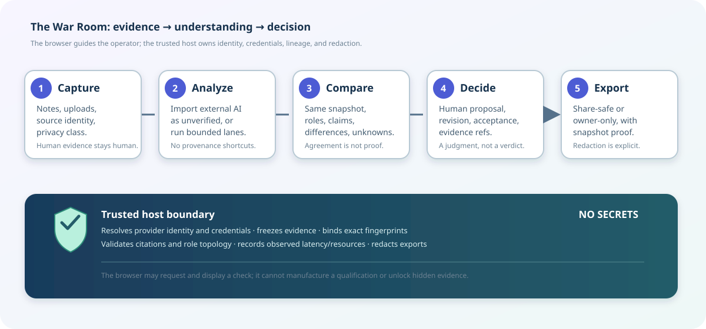

# War Room operator guide

The War Room is ContextDesk’s evidence-first workspace for moving from a
messy human report to a bounded, reviewable decision. It is designed for two
audiences at once:

- a first-time operator who needs a calm path through **Capture → Analyze →
  Compare → Decide**; and
- a power user who needs exact source identity, snapshot lineage, role/model
  identity, disagreement details, privacy boundaries, and export proof.

The interface should make the safe path the easy path. Every AI contribution
is visibly separate from human evidence, every comparison is tied to a frozen
evidence snapshot, and agreement is never presented as proof of correctness.



## The mental model

| Stage | What the operator does | What ContextDesk proves | What it must never imply |
| --- | --- | --- | --- |
| **Capture** | Add a note, upload files, or register a source | Who supplied the item, when, and under which privacy class | That a pasted answer is human-authored |
| **Analyze** | Import external AI output or run bounded lanes | Exact source/provenance and the snapshot each lane saw | That a model’s prose is verified evidence |
| **Compare** | Inspect agreement, differences, unknowns, and causal links | Candidate-local citations, lineage, and same-snapshot status | That consensus means truth |
| **Decide** | Propose and accept a human inspection decision | Decision revision, actor, and evidence references | That acceptance is a model correctness verdict |
| **Export** | Choose owner-only or share-safe review | Privacy class, omissions, snapshot proof, and redacted content | That hidden owner-only bytes were shared |

## Five-minute synthetic walkthrough

This is the safest first demonstration. It uses the shipped fixture and
deterministic lanes; it does not contact a provider or read credentials.

```bash
cd collab
npm ci
npm run build -w @cd-collab/contracts
npm run build -w @cd-collab/web
npm run test -w @cd-collab/e2e -- specs/11-operator-journey.spec.ts
```

The authoritative journey is [War Room operator journey v1](../benchmarks/WAR_ROOM_OPERATOR_JOURNEY_V1.md).
It proves, in order:

1. a human note and two uploads with different privacy classes;
2. an imported external chat that remains **unverified**;
3. a share-safe-only frozen snapshot with root lineage;
4. three comparison lanes bound to the same snapshot fingerprint;
5. agreement, differences, unknowns, and the agreement-is-not-proof warning;
6. a proposed then accepted human decision;
7. a share-safe export with host-owned snapshot proof and redaction; and
8. reload/reopen persistence of the operator’s evidence and decision trail.

For the bridge-shaped gateway seam, run:

```bash
COLLAB_E2E_BRIDGE=1 npm run test -w @cd-collab/e2e -- specs/10-bridge-comparison.spec.ts
```

This is still a deterministic bridge qualification, not a live provider
quality result. In a restricted environment the fixture may be unable to bind
its local port; record that as an environment blocker rather than converting
it into a pass.

## How real operators should enter information

### Human-gathered information

Use a timeline note for observations, decisions, and context that came from a
person or an approved internal source. Give the note a useful time anchor and
privacy class. Attach the original file when possible instead of copying only
its most interesting line. The original artifact lets later reviewers inspect
what was actually available at decision time.

### External AI output

Use **Import external run** for pasted or uploaded output from another AI
system. Select the recorded catalog source if it exists; otherwise create a
source with an honest name and kind. Keep the imported run unverified until a
human or a bounded host workflow explicitly corroborates it. Do not paste a
model answer into a human note to make the UI look complete.

### Sources and retired sources

Active sources are appropriate for new intake. Retired sources remain visible
for historical attribution so old runs do not lose their identity. A retired
source should be absent from the new-intake chooser but still resolve by name
and kind on an existing imported card.

## Comparing models without fooling yourself

Before starting a comparison, confirm:

- the selected snapshot id and fingerprint;
- the snapshot’s privacy class and lineage;
- every lane’s role, profile id, model id, and host gateway reference;
- whether the UI says `same_snapshot`, `unknown`, partial, or failed; and
- which usage, cost, route, and latency values are observed versus unknown.

The host, not the browser, owns credentials and provider endpoints. The
browser submits identifiers and receives redacted status. A live result that
cannot cite the allowed opaque evidence should appear as failed or incomplete,
not as a persuasive free-form answer.

## Optional Vercel gateway acceptance

Run this only on a normal unlocked host where the gateway is intentionally
configured. The presence of a credential file alone is not sufficient: the
server needs a non-secret profile catalog and an explicit bridge/runner.

Required preconditions:

1. Configure a private profile catalog outside git. It may contain profile id,
   label, provider, and exact model identity, but never an API key.
2. Keep credentials in the OS keychain or an owner-only credential reference.
3. Configure the approved host bridge with `COLLAB_TRIAGE_RUNNER` (or
   `COLLAB_BRIDGE_BIN`) and its bounded timeout/data directory.
4. Set `COLLAB_LIVE_PROFILE_CATALOG` or the legacy bounded catalog variable.
5. Set `COLLAB_LIVE_VERCEL=1` only when Vercel is actually the selected
   provider route. Do not infer it from a model name.
6. Confirm the exact Vercel model id through discovery before selecting a
   lane. Never silently substitute a model or gateway.

Then run the same browser journey against the explicitly configured service:

```bash
cd collab
COLLAB_E2E_START_FIXTURE=0 \
COLLAB_E2E_BASE_URL="https://<approved-war-room-host>" \
npm run test -w @cd-collab/e2e -- specs/10-bridge-comparison.spec.ts
```

The live acceptance report must include the exact host/profile/model identity,
snapshot fingerprint, lane outcomes, observed latency/resource fields, and
any provider failures. It must not include API keys, endpoint secrets, raw
owner-only evidence, or an invented quality score. If Vercel is not configured,
leave this case marked **not run** and use the synthetic walkthrough instead.

## Screenshot and visual-QA checklist

Capture screenshots on the same host and commit only sanitized images. Do not
include browser storage, cookies, raw prompts, owner-only evidence, API keys,
or private endpoint paths. Recommended sequence:

| Capture | Required visible proof |
| --- | --- |
| `01-capture.png` | Human note, two privacy classes, and source identity |
| `02-import-unverified.png` | Imported card marked external/unverified |
| `03-snapshot-frozen.png` | Snapshot id, fingerprint, lineage, and privacy class |
| `04-compare.png` | Role/model lanes, same-snapshot status, agreement/differences/unknowns |
| `05-decide.png` | Human proposal, accepted revision, and actor—not a model verdict |
| `06-export-share-safe.png` | Share-safe label, omission proof, and redacted preview |
| `07-narrow.png` | The same critical state at a narrow viewport with no horizontal overflow |

For each image, record viewport, theme, fixture/live mode, exact commit, and
whether the capture is synthetic or provider-backed. If a live gateway is
unavailable, do not replace a missing live screenshot with a synthetic image
without labeling it.

## Troubleshooting

- **`/ready` is 503 in the fixture:** expected; wait on `/health`. The fixture
  has no Postgres pool.
- **Gateway option is disabled:** the host bridge or profile catalog is not
  configured. Fix the host configuration; do not type a secret into the web
  page.
- **A lane is partial, stale, or failed:** open its role-level reason and
  preserve it in the report. Do not relabel it as qualified.
- **A pasted answer appears human-authored:** stop and report a provenance
  defect. Imported output must remain distinguishable from human evidence.
- **The browser cannot bind localhost:** this is an environment restriction;
  run the qualification on an unlocked developer host or CI runner and retain
  the exact error in the acceptance record.

## Evidence records

- [War Room operator journey v1](../benchmarks/WAR_ROOM_OPERATOR_JOURNEY_V1.md)
- [Collab browser qualification](../testing/COLLAB_WAR_ROOM_BROWSER_QUALIFICATION_V1.md)
- [Connected triage runs](../benchmarks/CONNECTED_TRIAGE_RUNS_V1.md)
- Investigation Team readiness: use the host qualification report and its
  release notes when that separate desktop child is available.

The guide is intentionally explicit about what is synthetic, what is live,
and what remains unrun. That distinction is part of the product’s trust model.
