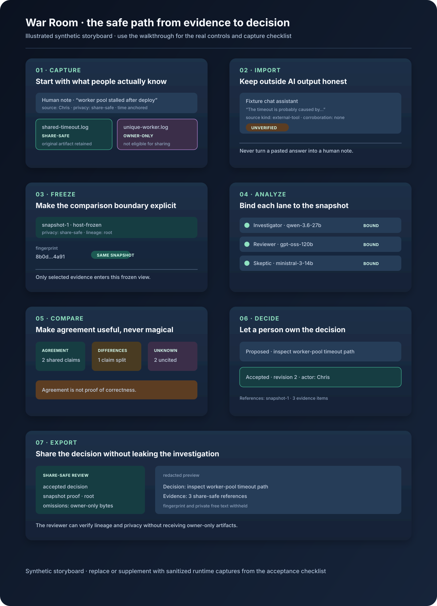

# War Room end-to-end walkthrough

This is the quickest way to understand the War Room as a real operator would
use it: start with messy human input, make provenance explicit, compare
bounded model lanes, record a human decision, and export only what is safe to
share.

The storyboard below is an **illustrated synthetic walkthrough**, not a claim
that a live provider run has already been captured. It mirrors the shipped
operator-journey controls and acceptance states. The final section explains
how to replace the storyboard with sanitized browser captures on a configured
host.



## The journey in one sentence

**Capture** what people actually know → **Analyze** without confusing AI
output for human evidence → **Compare** only runs that saw the same bounded
snapshot → **Decide** as a human → **Export** with privacy and lineage proof.

## What each screen means

| Screen | Operator action | Visible proof to look for | Trust boundary |
| --- | --- | --- | --- |
| 1. Capture | Add a note and upload the original artifacts | Human note, source identity, privacy class, time anchor | A note is human context; an uploaded file is not silently rewritten |
| 2. Import | Paste or upload an external AI response | `External`, `Unverified`, recorded source name/kind | AI prose is never promoted to human-authored evidence |
| 3. Freeze | Select the share-safe evidence and freeze it | Snapshot id, fingerprint, root lineage, privacy class | The comparison boundary is immutable and inspectable |
| 4. Analyze | Bind bounded lanes to the frozen snapshot | Role, profile, model, snapshot fingerprint, observed status | The host owns credentials and provider routing; the browser does not |
| 5. Compare | Inspect agreement, differences, unknowns, and causal links | Same-snapshot status, citations, role-local claims, unknowns | Agreement is not proof of correctness |
| 6. Decide | Propose and accept a human inspection decision | Actor, revision, references, accepted state | Acceptance is a human decision, not a model verdict |
| 7. Export | Choose owner-only or share-safe output | Privacy class, omissions, snapshot proof, redacted preview | Owner-only evidence never leaks into share-safe output |

## Recommended demonstration

### Synthetic, deterministic, no credentials

Use this first when showing the product to a new operator or reviewing a
change. It exercises the shipped UI/API fixture and does not contact a model
provider:

```bash
cd collab
npm ci
npm run build -w @cd-collab/contracts
npm run build -w @cd-collab/web
npm run test -w @cd-collab/e2e -- specs/11-operator-journey.spec.ts
```

The expected journey is the eight-state sequence documented in
[War Room operator journey v1](../benchmarks/WAR_ROOM_OPERATOR_JOURNEY_V1.md):
capture, import, freeze, three same-snapshot lanes, compare, decide, export,
and reload/reopen.

For the bridge-shaped comparison seam:

```bash
COLLAB_E2E_BRIDGE=1 npm run test -w @cd-collab/e2e -- specs/10-bridge-comparison.spec.ts
```

### Provider-backed, configured host

Only run this on a normal unlocked host with an approved profile catalog and
host bridge. The browser must receive identifiers and redacted status—not
credentials, endpoint secrets, or owner-only evidence.

Before starting, record:

- the exact application commit;
- the host/profile/model identity for every role;
- the selected snapshot id and fingerprint;
- the privacy class and lineage;
- the bridge command and timeout policy, without secrets; and
- whether the run is synthetic, provider-backed, partial, stale, failed, or
  cancelled.

Then run the comparison against the explicitly approved host:

```bash
cd collab
COLLAB_E2E_START_FIXTURE=0 \
COLLAB_E2E_BASE_URL="https://<approved-war-room-host>" \
npm run test -w @cd-collab/e2e -- specs/10-bridge-comparison.spec.ts
```

If the profile catalog, bridge, or provider route is absent, mark the run
**not run**. Do not substitute a synthetic pass for a live result.

## Screenshot capture plan

When the host is ready, capture the following seven sanitized browser images
at the same commit. The filenames make it easy to assemble a review or an
acceptance report:

| File | Capture state | Must be visible | Must be hidden |
| --- | --- | --- | --- |
| `01-capture.png` | Capture | note, source, privacy labels, original artifacts | credentials, private paths |
| `02-import-unverified.png` | Import | external/unverified badge, source name/kind | raw secret-bearing prompt text |
| `03-snapshot-frozen.png` | Freeze | id, fingerprint, lineage, privacy class | owner-only evidence bytes |
| `04-compare.png` | Compare | role/model, same-snapshot status, differences, unknowns | API keys, hidden endpoint details |
| `05-decide.png` | Decide | human actor, proposal, accepted revision | model framed as decision-maker |
| `06-export-share-safe.png` | Export | share-safe label, omissions, redacted preview | owner-only text and artifacts |
| `07-narrow.png` | Narrow view | the same safety signals at phone width | horizontal overflow or clipped warnings |

For every capture, put the viewport, theme, fixture/live mode, commit, and
result classification in the accompanying acceptance note. Never commit
browser storage, cookies, private endpoint paths, API keys, or unredacted
owner-only evidence.

## How to read a good run

The run is healthy when the operator can answer these questions without
opening developer tools:

1. **Where did this item come from?** The source identity and provenance are
   visible.
2. **What did the models see?** The snapshot id/fingerprint and lineage are
   visible for every lane.
3. **What is known versus unknown?** Missing citations, cost, latency, or
   provider results are labeled—not guessed.
4. **Who decided?** A human actor and decision revision are explicit.
5. **What can I share?** The export states its privacy class and omissions,
   and the preview is redacted.

If any answer is unclear, stop the acceptance run and record the exact UI
state. A polished screen that hides uncertainty is a failed trust test.

## Related material

- [War Room operator guide](README.md)
- [War Room operator journey v1](../benchmarks/WAR_ROOM_OPERATOR_JOURNEY_V1.md)
- [Connected triage runs](../benchmarks/CONNECTED_TRIAGE_RUNS_V1.md)
- [Share-safe decision export](../benchmarks/SHARE_SAFE_DECISION_EXPORT_V1.md)

